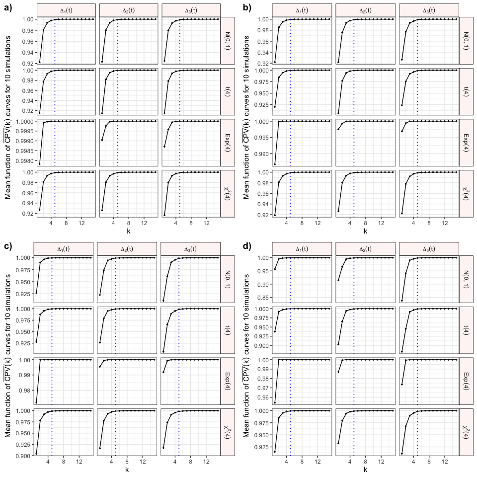
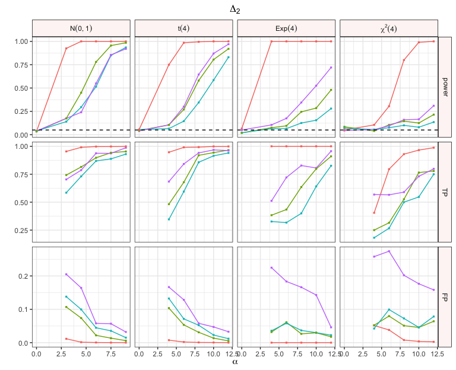
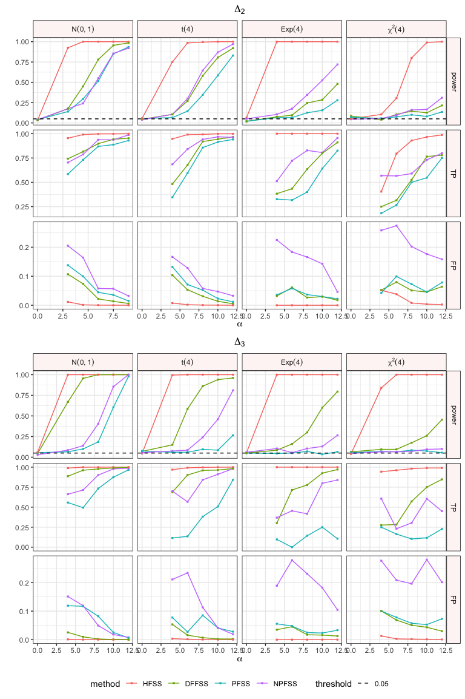
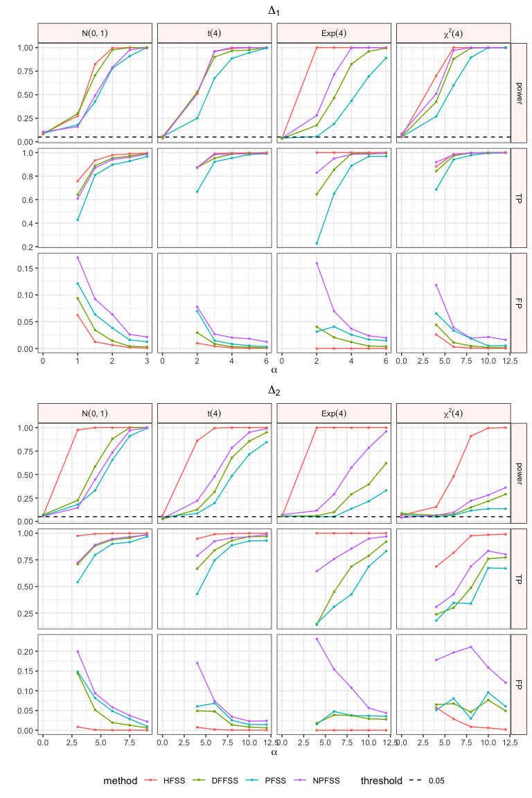
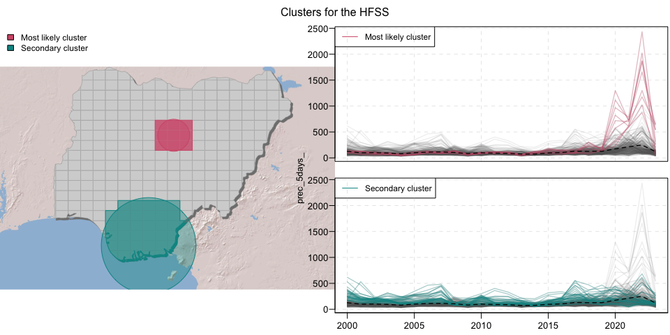
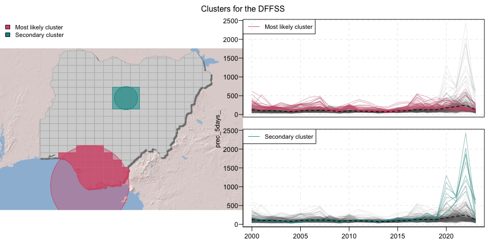
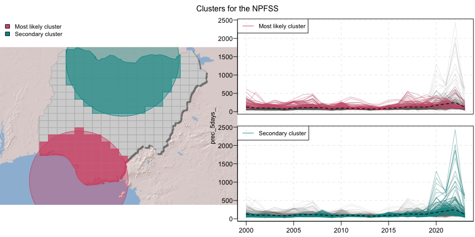
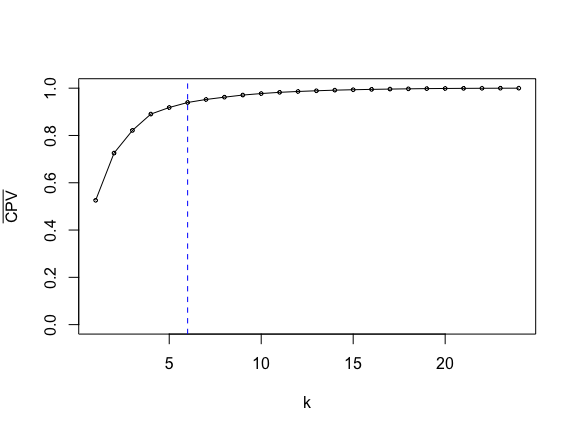

Supplementary material: Codes and Data for the paper \`\`A new
parametric spatial scan statistic for functional data: application to
climate change data’’
================
Zaineb Smida, Thibault Laurent, Lionel Cucala
(Last update: 2025-01-18)


- [1 Developed Functions](#1-developed-functions)
  - [1.1 Functional Data Simulation](#11-functional-data-simulation)
  - [1.2 Identify All Potential
    Clusters](#12-identify-all-potential-clusters)
  - [1.3 Representation of a circle in a
    map](#13-representation-of-a-circle-in-a-map)
  - [1.4 Package HDSpatialScan](#14-package-hdspatialscan)
  - [1.5 Functions for Scan Statistic](#15-functions-for-scan-statistic)
- [2 Simulation part](#2-simulation-part)
  - [2.1 The spatial data](#21-the-spatial-data)
  - [2.2 The different shifts/probabilistic
    models](#22-the-different-shiftsprobabilistic-models)
  - [2.3 Results](#23-results)
  - [2.4 Checking Robustess](#24-checking-robustess)
- [3 Empirical part](#3-empirical-part)
  - [3.1 Spanish region](#31-spanish-region)
  - [3.2 Climate Data](#32-climate-data)

This document provides the R code and data used to generate the
computational results featured in the paper “A New Parametric Spatial
Scan Statistic for Functional Data: Application to Climate Change Data.”
To reference this work, please use the following citation:

Zaineb Smida, Thibault Laurent and Lionel Cucala (2024). [A Hotelling
spatial scan statistic for functional data: application to economic and
climate data](), *Submitted in Spatial Statistics*.

Packages needed:

``` r
library(mapsf) # cartography
library(maptiles) # import spatial contours
library(sf) # spatial data analysis
library(tidyverse) # tidyverse
library(latex2exp) # add LaTeX
library(ggh4x) # customize ggplot graphic
library(progress) # progress bar
library(rARPACK) # compute only the d first eigen values/eigen vectors
library(parallel) # parallel computing
```

The document is organized into three parts:

- Part 1: Details the functions developed specifically for this work.
- Part 2: Provides the code necessary to reproduce the results presented
  in the Simulation Study section.
- Part 3: Contains the code to replicate the results from the
  Application to Real Data section.

# 1 Developed Functions

## 1.1 Functional Data Simulation

The function `simulvec()` is used to simulate functional data as
described in the Simulation Study section of the article. It accepts the
following arguments:

- `npoints`: The number of measurements.
- `shape`: The distribution of the random variable $Z$, which can be one
  of the following: `"gauss"`, `"student"`, `"chisq"`, or `"exp"`.

``` r
simulvec <- function(npoints, shape = "gauss") {
  # initi
  vect <- (0:npoints)/npoints
  k <- 1
  sigma <- 1/((k - 0.5) * pi)
  
  vecyphi <- sqrt(2) * sin(vect/sigma)
  
  if(shape == "gauss") {
    y <- rnorm(1, mean = 0, sd = sigma)
  } else {
    if(shape == "student") { 
      y <- sigma * rt(1, 4)
    } else  {
      if(shape == "chisq") { 
        y <- sigma * rchisq(1, 4)
      } else {
        y <- sigma * rexp(1, 0.5)
      }
    }
  }
  vecY <- y * vecyphi
  exvecY <- vecY
  
  flag <- TRUE
  k <- 2
  while (flag) {
    
    sigma <- 1/((k - 0.5) * pi)
    if(shape == "gauss") {
      y <- rnorm(1, mean = 0, sd = sigma)
    } else {
      if(shape == "student") { 
        y <- sigma * rt(1, 4)
      } else  {
        if(shape == "chisq") { 
        y <- sigma * rchisq(1, 4)
        } else {
          y <- sigma * rexp(1, 4)  
        }
      }
    }
    
    vecyphi <- sqrt(2) * sin(vect/sigma)
    
    exvecY <- vecY
    vecY <- vecY + y * vecyphi
    flag <- (sum((vecY - exvecY) ^ 2) / sum((vecY) ^ 2) > 0.001)
    k <- k + 1
  }
  vecY
}
```

**Example**: Simulating a sample of 50 functions, each measured at 100
equidistant points.

``` r
nobs <- 50
npoints <- 75
X <- matrix(0, npoints + 25, nobs)
set.seed(777)
for (k in 1:nobs) {
  X[, k] <- simulvec(npoints + 24, shape = "gauss") 
}
```

**Note:** It is common to discard the initial simulated data. In this
example, we plot the full set of functional data (figure on the left)
and retain only the last 75 values (figure on the right).

``` r
par(oma = c(0, 0, 0, 0), mar = c(3, 3, 1, 1), las = 1, mfrow = c(1, 2))
matplot(X, type = "l", lty = 1, col ="grey")
abline(v = 25, lty = 2)
X <- X[26:100, ]
matplot(X, type = "l", lty = 1, col ="grey")
```


## 1.2 Identify All Potential Clusters

The `find_all_cluster()` function accepts a matrix of Cartesian
coordinates as input and returns all potential clusters. The output
consists of two elements: the first element contains a list of all
potential clusters, and the second element contains a list of their
corresponding complements.

If the geographical coordinates are provided in Longitude/Latitude
format, it is recommended to convert them to an appropriate Coordinate
Reference System (CRS). For assistance, you can refer to
<https://epsg.io> and use the **sf** package for the transformation.

``` r
find_all_cluster <- function (Matcoord) {
  n <- nrow(Matcoord)
  Matdist <- as.matrix(dist(Matcoord, upper = TRUE))
  vecord_list <- vector("list", n)
  for (k in 1:n) {
    vecord_list[[k]] <- order(Matdist[, k])
  }
  res_cluster_g1 <- vector("list", 0)
  res_cluster_g2 <- vector("list", 0)
  
  matrix_g1 <- vector("list", n)

  for(k in 1:n) {
    matrix_g1[[k]] <- rep(0, n)
  }
  
  nb_combi <- 0
  for (k in 1:(n-1)) {
    for (j in 1:n) {
      temp_1 <- vecord_list[[j]][1:k]
      temp_2 <- vecord_list[[j]][(k+1):n]

      my_vec <- my_vec_2 <-numeric(n)
      my_vec[temp_1] <- 1
      my_vec_2[temp_2] <- 1
      # my_length <- k
      cond_1 <-  any(matrix_g1[[k]] %*% my_vec == k)
      cond_2 <-  any(matrix_g1[[n-k]] %*% my_vec_2 == n-k)
        
      if (!(any(cond_1) | any(cond_2))) {
        nb_combi <- nb_combi + 1
        res_cluster_g1[[nb_combi]] <- temp_1
        res_cluster_g2[[nb_combi]] <- temp_2
        matrix_g1[[k]] <- rbind(matrix_g1[[k]], my_vec)
    #    matrix_g2[[n-k]] <- rbind(matrix_g2[[n-k]], rep(1, n) - my_vec)
      }
    }
  }
  cat("Number of unique combination: ", nb_combi, "\n")
  return(list(vec_g1 = res_cluster_g1,
              vec_g2 = res_cluster_g2))
}
```

**Example:** We consider a random spatial point process with 50
observations.

``` r
set.seed(1)
matCoord <- cbind(runif(nobs), runif(nobs))
par(las = 1, mar = c(4, 4, 0.5, 0.5), mgp = c(2.2, 0.7, 0))
plot(matCoord, xlab = "Longitude", ylab = "Latitude", asp = 1)
```


We identify all potential spatial clusters.

``` r
my_pairs_ex <- find_all_cluster(matCoord)
```

    ## Number of unique combination:  1644

**Note**: Once the potential clusters are identified, this reduces the
number of combinations to test from 2450 ($50 \times 49$) to 1644.

## 1.3 Representation of a circle in a map

The `draw.circle()` function returns the coordinates of a circle of
radius `radius` and centered at the coordinates `x` and `y`:

``` r
draw.circle <- function (x, y, radius, nv = 100) {
  ymult <- 1
  angle.inc <- 2 * pi/nv
  angles <- seq(0, 2 * pi - angle.inc, by = angle.inc)
  for (circle in 1:length(radius)) {
    xv <- cos(angles) * radius[circle] + x
    yv <- sin(angles) * radius[circle] * ymult + y
  }
  invisible(list(x = xv, y = yv))
}
```

**Example**: We consider a hypothetical cluster, $C$, consisting of
eight observations from the previously generated data. The cluster is
centered around observation 50 and includes the eight closest
observations to it. The radius of the cluster is defined as the distance
between observation 50 and the farthest observation within the cluster
(observation 13).

``` r
my_cluster <- c(50, 9, 15, 8, 43, 17, 32, 13)
my_dist <- dist(matCoord[c(50, 13), ])
```

``` r
plot(matCoord, xlab = "x", ylab = "y", asp = 1)
points(matCoord[my_cluster, ], pch = 16, col = "red")
temp_plot <- draw.circle(matCoord[50, 1], matCoord[50, 2], 
                         my_dist, nv = 100)
lines(temp_plot, col = "red")
```


For the remainder of this section, we modify the functional data of the
hypothetical cluster. We apply a shift $\Delta_2(t) = \alpha t(1 - t)$,
with $\alpha = 2$. Our goal is to detect the cluster using various
methods.

``` r
t.disc <- (1:75) / (75)
for(k in 1:8)
  X[, my_cluster[k]] <- X[, k] + 2 * t.disc
```

``` r
par(oma = c(0, 0, 0, 0), mar = c(3, 3, 1, 1), las = 1, mfrow = c(1, 2))
# The function
matplot(X, type = "l", lty = 1, col ="grey")
matplot(X[, my_cluster], type = "l", lty = 1, col ="red", add = T)
# The map
plot(matCoord, xlab = "x", ylab = "y", asp = 1)
points(matCoord[my_cluster, ], pch = 16, col = "red")
lines(temp_plot, col = "red")
```


## 1.4 Package HDSpatialScan

The `SpatialScan()` function from the `HDSpatialScan` package (Frévent
et al., 2021) can be used to compute various methods. Its main arguments
include a vector of method names, the spatial coordinates, and the
functional data of the observations. Additional parameters can also be
specified, such as the minimum and maximum cluster sizes to be detected,
the number of replications for significance testing, and more.

For example, to compute the methods (“DFFSS”, “PFSS”, “NPFSS”), the
`SpatialScan()` function can be used as follows:

``` r
fss_result <- HDSpatialScan::SpatialScan(c("NPFSS", "PFSS", "DFFSS"),
        t(X), sites_coord = matCoord, mini = 1, maxi = 49,
        system = "Euclidean", MC=99, typeI = 0.25)
```

For practical reasons, we implement our own functions and use them in
our simulation framework.

## 1.5 Functions for Scan Statistic

We implement the functions `compute_np()`, `compute_p()`,
`compute_dffss()` and `compute_h()`, which correspond to the four
methods “NPFSS”, “PFSS”, “DFFSS”, and “HFSS”, respectively. Each
function takes as arguments the list of potential clusters `c1` (and,
correspondingly, the complement of the potential clusters `c2`) and the
functional data `my_mat`. They return the highest test statistic value
found across all possible combinations, along with the associated
cluster. These functions are available in the file
[functions_to_cluster.R](functions_to_cluster.R)

``` r
source("codes/functions_to_cluster.R")
```

### 1.5.1 Non Parametric NPFSS method

To compute the result for the NPFSS method, we use the `compute_np()`
function. This yields the following test statistic and associated
cluster.

``` r
res_np <- compute_np(my_pairs_ex[[1]], my_pairs_ex[[2]], X)
res_np
```

    ## $stat
    ## [1] 1.592877
    ## 
    ## $vec
    ##  [1] 10 47 24 34 12  1 25 38 28 14  5 48 31 33 40 19 22 27 16  3 11  2 26 23 45
    ## [26]  8 32 30  9 13 36 17 50 44 42 39 15 43 41 49 37 46 35 20  4

The detected cluster contains 45 observations. To assess significance,
we perform $B$ permutations on the data and count how many times the
scan statistic is less than the observed value. nhh

``` r
p_value_np <- 0
B <- 99
pb <- progress_bar$new(total = B)

set.seed(123)
for(b in 1:B) {
  pb$tick()
  perm <- sample(ncol(X))
  MatXsim <- X[, perm]
  temp <- compute_np(my_pairs_ex[[1]], my_pairs_ex[[2]], MatXsim)
  p_value_np <- p_value_np + (res_np$stat < temp$stat)
}
cat("p-value: ", p_value_np / 100)
```

    ## p-value:  0.31

In this example, the cluster detected by the NPFSS method is not
significant.

### 1.5.2 Parametric PFSS

To obtain the result for the PFSS method, we use the `compute_p()`
function.

``` r
res_p <- compute_p(my_pairs_ex[[1]], my_pairs_ex[[2]], X)
res_p
```

    ## $stat
    ## [1] 25.85029
    ## 
    ## $vec
    ## [1]  8 13

The detected cluster contains 2 observations. To assess significance, we
perform $B$ permutations on the data and count the number of times the
scan statistic is less than the observed value.

``` r
p_value_p <- 0
B <- 99
pb <- progress_bar$new(total = B)
set.seed(123)
for(b in 1:B) {
  pb$tick()
  perm <- sample(ncol(X))
  MatXsim <- X[, perm]
  temp <- compute_p(my_pairs_ex[[1]], my_pairs_ex[[2]], MatXsim)
  p_value_p <- p_value_p + (res_p$stat < temp$stat)
}
p_value_p / 100
```

    ## p-value:  0.04

The detected cluster is significant. Among the 2 observations, 2 belong
to the real cluster.

### 1.5.3 Method DFFSS

To obtain the result for the DFFSS method, we use the `compute_dffss()`
function.

``` r
res_dffss <- compute_dffss(my_pairs_ex[[1]], my_pairs_ex[[2]], X)
res_dffss
```

    ## $stat
    ## [1] 5.469082
    ## 
    ## $vec
    ## [1]  8 13

The detected cluster contains 2 observations. To assess significance, we
perform $B$ permutations on the data and count how many times the scan
statistic is less than the observed value.

``` r
p_value_dffss <- 0
B <- 99
pb <- progress_bar$new(total = B)
set.seed(123)
for(b in 1:B) {
  pb$tick()
  perm <- sample(ncol(X))
  MatXsim <- X[, perm]
  temp <- compute_dffss(my_pairs_ex[[1]], my_pairs_ex[[2]], MatXsim)
  p_value_dffss <- p_value_dffss + (res_dffss$stat < temp$stat)
}
p_value_dffss / 100
```

    ## p-value:  0.03

The detected cluster is significant. Among the 2 observations, 2 are
part of the actual cluster.

### 1.5.4 Method HFSS

To obtain the result for the HFSS method, we use the `compute_h()`
function. An additional argument allows for the selection of the optimal
$K$.

The `plot_eigen` argument enables the plotting of the CPV function. In
this example, we recommend choosing $K=5$.

**Example**:

``` r
res_h <- compute_h(my_pairs_ex[[1]], my_pairs_ex[[2]], X, npoints,
                   plot_eigen = T)
```


    ## Variance explained in % by the 10 first components:  92.7 98.02 99.14 99.62 99.87 99.93 99.97 99.99 100 100

**Example** when $K=5$:

``` r
res_h <- compute_h(my_pairs_ex[[1]], my_pairs_ex[[2]], X, 5)
res_h
```

    ## $stat
    ## [1] 42.26277
    ## 
    ## $vec
    ## [1] 50  9 15  8 43 17 32 13

To assess significance, we perform $B$ permutations on the data and
count how many times the scan statistic is less than the observed value.

``` r
p_value_h <- 0
B <- 99
pb <- progress_bar$new(total = B)
set.seed(123)
for(b in 1:B) {
  pb$tick()
  perm <- sample(ncol(X))
  MatXsim <- X[, perm]
  temp <- compute_h(my_pairs_ex[[1]], my_pairs_ex[[2]], MatXsim, 5)
  p_value_h <- p_value_h + (res_h$stat < temp$stat)
}
p_value_h / 100
```

    ## p-value:  0.02

The detected cluster is significant. Among the 8 observations, 8 are
part of the actual cluster.

**Improving Computational Time**: If `plot_eigen = TRUE`, the spectral
decomposition of the covariance matrix is performed using the `eigen()`
function, which computes all eigenvalues and eigenvectors. Conversely,
if `plot_eigen = FALSE`, we utilize the `eigs_sym()` function from the
`rARPACK` package, which computes only the first $K$ eigenvalues and
eigenvectors. This approach improves computation time by a factor of 3.

# 2 Simulation part

## 2.1 The spatial data

First, we import the contours of the French departments:

``` r
dep <- read_sf("data/departements.geojson")
dep <- dep[!dep$code %in% c("2A", "2B"), ]
dep <- dep[order(dep$code), ]
my_region <- st_union(dep)
nc_osm <- get_tiles(dep, provider = "Esri.WorldShadedRelief", 
                      zoom = 7, crop = T)
```

Next, we compute the Cartesian coordinates of the centroids of the
departments in the official French Coordinate Reference System (CRS
2154), ensuring that distances between locations are measured in meters.

``` r
my_proj <- 2154
dep_proj <- st_transform(dep, 2154)
Matcoord <- st_coordinates(st_centroid(dep_proj))
dist_proj <- as(dist(Matcoord), "matrix")
```

We highlight the departments surrounding the city of Paris (74, 92, 91,
93, 77, 90, 94, 76), which will be simulated differently from the other
departments to represent the cluster we aim to detect.

``` r
cols = c("#D35C79", "#009593")
# id of the cluster
vecclus <- c(74, 92, 91, 93, 77, 90, 94, 76)
# graphical parameters
col_geo <- rep(rgb(0.9, 0.9, 0.9, alpha = 0.1), nrow(Matcoord))
col_geo[vecclus] <- alpha(cols[1], 0.8)
```

We represent Figure S1 on the left:

``` r
#pdf("figures/french_cluster.pdf", width = 7, height = 7)
par(oma = c(0, 0, 0, 0), mar = c(0, 0, 0, 0))
plot_tiles(nc_osm, adjust = T)
mf_shadow(st_geometry(st_union(dep[vecclus, ])), add = T, cex = 0.5)
plot(st_geometry(dep), border = "white", col = col_geo,  
     add = T, lwd = 0.1)
plot(st_geometry(my_region), add = T, lwd = 0.5)
```


``` r
#text(par()$usr[1] + 0.03 * (par()$usr[2] - par()$usr[1]), 
#     par()$usr[4] - 0.07 * (par()$usr[4] - par()$usr[3]), 
#     labels = "A)", pos = 4, cex = 2)
#dev.off()
#R.utils::compressPDF("figures/french_cluster.pdf")
```

## 2.2 The different shifts/probabilistic models

We consider three types of shift:

- $\Delta_1(t)=\alpha t$,
- $\Delta_2(t)=\alpha  t(1-t)$,
- $\Delta_3(t)=\alpha  \exp(-100(t-0.5)^2)/3$,

and four different probabilistic models $Z_{i,k}/\sigma_k$:

- a Gaussian $N(0,1)$,
- a Student $t(4)$
- a Chi $\chi^2(4)$
- an Exponential $e(4)$

with $i=1,\ldots,94$ and $t=1,\ldots,200$. The first 100 simulations are
discarded to allow the process to converge. For each combination of
shift and probabilistic method, we consider different values of
$\alpha$.

``` r
nobs <- nrow(Matcoord)
npoints <- 100
ndrop <- 100
t.disc <- (1:(npoints)) / (npoints) 
veccluster <- rep(0, nobs)
veccluster[vecclus] <- 1 
```

For $\alpha=3$, we plot an example of simulations for each combination
of shift and probabilistic model:

``` r
alpha <- 10
X_aggregated <- data.frame(
  x = integer(),
  y = numeric(), 
  shift = character(),
  proba = character()
) 
for(type_shift in 2:4) {
  for(shape in c("gauss", "student", "chisq", "exp")) {
    X <- matrix(0, npoints+ndrop, nobs)
    for (k in 1:nobs) {
      X[, k] <- simulvec(npoints+(ndrop-1), shape = shape) 
      if(type_shift == 1) {
        X[(ndrop+1):nrow(X), k] <- X[(ndrop+1):nrow(X), k] + alpha * (veccluster[k] == 1)
        } else {
          if (type_shift == 2) {
            alpha <- 3
            X[(ndrop+1):nrow(X), k] <- X[(ndrop+1):nrow(X), k] + alpha * t.disc * (veccluster[k] == 1)
            } else {
              if (type_shift == 3) {
                alpha <- 10
                X[(ndrop+1):nrow(X), k] <- X[(ndrop+1):nrow(X), k] + alpha * t.disc * (1 - t.disc) * (veccluster[k] == 1)
                } else {
                  alpha <- 10
                  X[(ndrop+1):nrow(X), k] <- X[(ndrop+1):nrow(X), k] + alpha * exp(-100 * (t.disc - 0.5) ^ 2) / 3 * (veccluster[k] == 1)
                }
            }
        }
    }
    # drop first observation 
    X <- X[-(1:ndrop), ]
    # aggregate data 
    X_aggregated <- rbind(X_aggregated,
                          data.frame(
                            x = seq(0, 1, length.out = 100),
                            y = as.vector(X), 
                            shift = type_shift,
                            proba = shape,
                            id = rep(1:94, each = 100)
                          ))
  }
}
X_aggregated$shift <- factor(X_aggregated$shift) 
levels(X_aggregated$shift) = c(`2` = TeX("$\\Delta_1(t)$"), 
                               `3` = TeX("$\\Delta_2(t)$"), 
                               `4` = TeX("$\\Delta_3(t)$"))
X_aggregated$Cluster <- factor(ifelse(X_aggregated$id %in% vecclus, "Yes", "No"),
                               levels = c("No", "Yes"))
X_aggregated$proba <- factor(X_aggregated$proba, levels = c("gauss", "student", "chisq", "exp"))
levels(X_aggregated$proba) <- c(`gauss` = TeX("$N(0,1)$"), 
                                `student` = TeX("$t(4)$"), 
                                `exp` = TeX("$Exp(4)$"),
                                `chisq` = TeX("$\\chi^2(4)$"))
```

We represent Figure S2:

``` r
temp <- X_aggregated[order(as.numeric(X_aggregated$Cluster), X_aggregated$id),]
X_aggregated %>%
  ggplot(aes(x = x, y = y, color = Cluster)) +
  geom_line(aes(group = id)) +
  theme_bw() +
  theme(strip.background = element_rect(color = "black", fill = alpha("#EE9E94", 0.1))) +
  facet_grid(rows=vars(proba),
  cols=vars(shift),
  labeller=label_parsed,
  scales = "free") +
      scale_colour_manual(values = c("grey", "tomato2")) +
  xlab(TeX("$t$")) +
  ylab(TeX("$X_i(t)$"))
```


``` r
# ggsave("figures/simu.pdf", width = 7, height = 6)
#R.utils::compressPDF("figures/simu.pdf")
```

## 2.3 Results

We utilized a server with 94 cores, launching a unique parameter set for
each core, comprising the shift, probabilistic model, and value of
$\alpha$. The computation time was approximately 7 days. We repeated the
following procedure on each core:

``` r
parms_df <- rbind(
  # line 1 
  data.frame(
    shape = "gauss", type_shift = 2, alpha = seq(0, 3, 0.5), sizeclust = 8),
  data.frame(
    shape = "gauss", type_shift = 3, alpha = seq(0, 10.5, 1.5), sizeclust = 8),
  data.frame(
    shape = "gauss", type_shift = 4, alpha = seq(0, 12, 2), sizeclust = 8),  
  # line 2
  data.frame(
    shape = "student", type_shift = 2, alpha = seq(0, 7, 1), sizeclust = 8),
  data.frame(
    shape = "student", type_shift = 3, alpha = seq(0, 14, 2), sizeclust = 8),
  data.frame(
    shape = "student", type_shift = 4, alpha = seq(0, 14, 2), sizeclust = 8),  
  # line 3
  data.frame(
    shape = "chisq", type_shift = 2, alpha = seq(0, 14, 2), sizeclust = 8),
  data.frame(
    shape = "chisq", type_shift = 3, alpha = seq(0, 14, 2), sizeclust = 8),
  data.frame(
    shape = "chisq", type_shift = 4, alpha = seq(0, 14, 2), sizeclust = 8),  
  # line 4
  data.frame(
    shape = "exp", type_shift = 2, alpha = seq(0, 7, 1), sizeclust = 8),
  data.frame(
    shape = "exp", type_shift = 3, alpha = seq(0, 14, 2), sizeclust = 8),
  data.frame(
    shape = "exp", type_shift = 4, alpha = seq(0, 14, 2), sizeclust = 8)
)
```

Repeat the following procedure 200 times:

- Simulate a set of functional data (with a shift in the Paris region).
- Compute the scan statistics for the methods: “HFSS,” “PFSS,” “NPFSS,”
  and “DFFSS.”
- Generate 199 permutation samples and compute the scan statistics for
  each to assess significance.

Based on the significance results and the detected clusters, we
calculate:

- The power,
- The percentage of true positives,
- The percentage of false negatives.

### 2.3.1 Choice of the optimal $K$

For the HDFS method, we use the Cumulative Proportion of Variance (CPV)
criterion to determine the optimal $K$.

Empirically, we generate CPV curves for several simulations across
different values of $\alpha$, the three shifts, and the four
probabilistic models.

We represent Figure S3 from the supplementary material:

``` r
# parameters of simulation 
nobs <- nrow(Matcoord)
npoints <- 100
ndrop <- 100
t.disc <- (1:(npoints)) / (npoints) # (1:(npoints+ndrop)) / (npoints+ndrop)

vecclus <- c(74, 92, 91, 93, 77, 90, 94, 76)
nclus <- length(vecclus)
veccluster <- numeric(nobs)
veccluster[vecclus] <- 1

# the possible clusters
my_pairs <- find_all_cluster(Matcoord)

# restriction on the size of the cluster 
mini <- 2 
maxi <- trunc(nobs / 2)
cluster_g1 <- my_pairs[[1]] 
cluster_g2 <- my_pairs[[2]] 
size_group <- sapply(cluster_g1, length)
ind_restriction <- size_group >= mini & size_group <= maxi
cluster_g1 <- cluster_g1[ind_restriction]
cluster_g2 <- cluster_g2[ind_restriction] 
# number of combinaison
nb_combi <- length(cluster_g1)
K_choice <- data.frame(
  x = numeric(),
  y = numeric(),
  shift = character(),
  proba = character(),
  alpha = integer()
)
shift_levels <- levels(X_aggregated$shift)
proba_levels <- levels(X_aggregated$proba)
nsimu <- 10

for(alpha in c(1, 3, 5, 10)) {
  print(alpha)
  for (shape in c("gauss", "student", "chisq", "exp")) {
    for (type_shift in 2:4) {
      cpv <- numeric(npoints)
      # simulations 
      i_simu <- 1
      while (i_simu <= nsimu) {
        X <- matrix(0, npoints+ndrop, nobs)
        for (k in 1:nobs) {
          X[, k] <- simulvec(npoints+(ndrop-1), shape = shape) 
          if(type_shift == 1) {
            X[(ndrop+1):nrow(X), k] <- X[(ndrop+1):nrow(X), k] + alpha * (veccluster[k] == 1)
            } else {
              if (type_shift == 2) {
                X[(ndrop+1):nrow(X), k] <- X[(ndrop+1):nrow(X), k] + alpha * t.disc * (veccluster[k] == 1)
                } else {
                  if (type_shift == 3) {
                    X[(ndrop+1):nrow(X), k] <- X[(ndrop+1):nrow(X), k] + alpha * t.disc * (1 - t.disc) * (veccluster[k] == 1)
                    } else {
                      X[(ndrop+1):nrow(X), k] <- X[(ndrop+1):nrow(X), k] + alpha * exp(-100 * (t.disc - 0.5) ^ 2) / 3 * (veccluster[k] == 1)
                    }
                }
            }
        }
        # drop first observation 
        X <- X[-(1:ndrop), ]
  
        # initialization
        npoints <- nrow(X)
        my_dist <- as(dist(t(X)), "matrix")
  
        # observed stat
        for (i in (1:nb_combi)) {
          vecindin <- cluster_g1[[i]]
          vecindout <- cluster_g2[[i]]
    
          nx <- length(vecindin)
          ny <- length(vecindout)
    
          if(nx == 1) {
            myX <- matrix(X[,vecindin], nrow(X), 1)
            cov_1 <- matrix(0, npoints, npoints)
            } else {
              myX <- X[, vecindin]
              cov_1 <- cov(t(myX)) 
              }
          if(ny == 1) {    
            myY <- matrix(X[,vecindout], nrow(X), 1)
            cov_2 <- matrix(0, npoints, npoints)
            } else {
              myY <- X[, vecindout]
              cov_2 <- cov(t(myY)) # 
            }
          ##### Initi
          D <- 1 / (nx + ny - 2) * ((nx - 1) * cov_1  +  (ny - 1) * cov_2)
          D_hotelling <- (nx + ny) / (nx * ny) * D
          
          temp_svd <- eigen(D_hotelling)
          tau_k <- temp_svd$values
          cpv <- cpv + cumsum(tau_k) / sum(tau_k)
        }
        i_simu <- i_simu + 1
      } 
      K_choice <- rbind(K_choice,
                        data.frame(
                          x = 1:15,
                          y = cpv[1:15] / (nsimu * nb_combi),
                          shift = type_shift,
                          proba = shape,
                          alpha = alpha)
                        )
    }
  }
}
K_choice$shift <- factor(K_choice$shift) 
levels(K_choice$shift) = c(`2` = TeX("$\\Delta_1(t)$"), 
                               `3` = TeX("$\\Delta_2(t)$"), 
                               `4` = TeX("$\\Delta_3(t)$"))

K_choice$proba <- factor(K_choice$proba, levels = c("gauss", "student", "exp", "chisq"))
levels(K_choice$proba) <- c(`gauss` = TeX("$N(0,1)$"),
                            `student` = TeX("$t(4)$"),
                            `exp` = TeX("$Exp(4)$"),
                            `chisq` = TeX("$\\chi^2(4)$"))
shift <- rep(rep(c("delta_1", "delta_2", "delta_3"), each = 15), times = 16)
K_choice$shift <- shift
proba <- rep(rep(c("gauss", "student", "chisq", "exp"), each = 45), times = 4)
K_choice$proba <- proba

K_choice$shift <- factor(K_choice$shift) 
levels(K_choice$shift) = c(`delta_1` = TeX("$\\Delta_1(t)$"), 
                               `delta_2` = TeX("$\\Delta_2(t)$"), 
                               `delta_3` = TeX("$\\Delta_3(t)$"))
K_choice$proba <- factor(K_choice$proba, levels = c("gauss", "student", "exp", "chisq"))
levels(K_choice$proba) <- c(`gauss` = TeX("$N(0,1)$"),
                            `student` = TeX("$t(4)$"),
                            `exp` = TeX("$Exp(4)$"),
                            `chisq` = TeX("$\\chi^2(4)$"))
# save(K_choice, file = "results/K_choice.RData")
```

``` r
load("results/K_choice.RData")
my_plot <- vector("list", 4)
my_alpha <- c(1, 3, 5, 10)
for(k in 1:4) {
  my_plot[[k]] <- K_choice %>%
    filter(alpha == my_alpha[k]) %>%
    ggplot(aes(x = x, y = y)) +
    geom_line() +
    geom_point(size = 0.5) +
    geom_vline(xintercept = 5, linetype="dotted", 
                color = "blue", size=.6) +
    theme_bw() +
    theme(strip.background = element_rect(color = "black", fill = alpha("#EE9E94", 0.1))) +
    facet_grid(rows=vars(proba),
               cols=vars(shift),
               labeller=label_parsed,
               scales = "free") +
    xlab("k") +
    ylab(TeX("Mean function of $\\bar{CPV}(k)$ curves for 10 simulations"))
}
```

    ## Warning: Using `size` aesthetic for lines was deprecated in ggplot2 3.4.0.
    ## ℹ Please use `linewidth` instead.
    ## This warning is displayed once every 8 hours.
    ## Call `lifecycle::last_lifecycle_warnings()` to see where this warning was
    ## generated.

``` r
cowplot::plot_grid(my_plot[[1]], my_plot[[2]], my_plot[[3]], my_plot[[4]], nrow = 2,
          labels =   c("a)", "b)", "c)", "d)")) # c(TeX("$\\alpha$"), TeX("$\\alpha$"), TeX("$\\alpha$")))
```



``` r
# ggsave("figures/choice_K.pdf", width = 10, height = 10)
# R.utils::compressPDF("figures/choice_K.pdf")
```

- We plot the theoretical CPV for the Gaussian case:

``` r
my_sigma_k <- function(k)
  1 / (pi * (k - 0.5)) ^ 2

my_val <- my_sigma_k(1:100)
plot(cumsum(my_val) / sum(my_val), type = "b",
     xlab = "k", ylab = "CPV")
```


### 2.3.2 Batch code

The codes used are given in the files
[batch_cluster_size_8.R](codes/batch_cluster_size_8.R), by using the
functions in [functions_to_cluster.R](codes/functions_to_cluster.R).

We present the results in a format that can be easily visualized in a
graph:

``` r
power_to_plot <- data.frame(
  shape = character(0),
  type_shift = integer(0),
  alpha = numeric(0)
)
nb_est <- 10
for(k in 1:nrow(parms_df)) {
  power_to_plot <- rbind(
    power_to_plot,
    parms_df[rep(k, nb_est), 1:3])
}
power_to_plot$method <- c("DFFSS", "PFSS", "NPFSS", "hotelling_1", "hotelling_2", 
                          "hotelling_3", "hotelling_4", "HFSS", "hotelling_10", 
                          "hotelling_15")

FP_to_plot <- TP_to_plot <- power_to_plot

for(k in 1:length(res_par_1)) {
  power_to_plot$value[(1:nb_est)+(k-1)*nb_est] <- (res_par_1[[k]]$power + res_par_2[[k]]$power + 
                                                     res_par_3[[k]]$power + res_par_4[[k]]$power) / 200 # res.final$power / 100 # 
  TP_to_plot$value[(1:nb_est)+(k-1)*nb_est] <- (res_par_1[[k]]$nTP + res_par_2[[k]]$nTP + 
                                                  res_par_3[[k]]$nTP + res_par_4[[k]]$nTP) /  
    (res_par_1[[k]]$power + res_par_2[[k]]$power + res_par_3[[k]]$power + res_par_4[[k]]$power) / 8 # res.final$nTP / res.final$power / 8 # 
  FP_to_plot$value[(1:nb_est)+(k-1)*nb_est] <- (res_par_1[[k]]$nFP + res_par_2[[k]]$nFP + 
                                                  res_par_3[[k]]$nFP + res_par_4[[k]]$nFP) /  
    (res_par_1[[k]]$power + res_par_2[[k]]$power + res_par_3[[k]]$power + res_par_4[[k]]$power) / 86 #res.final$nFP / res.final$power / 8 # res_par[[k]]$nFP / res_par[[k]]$power / 8
}
power_to_plot$criteria <- "power"
TP_to_plot$criteria <- "TP"
FP_to_plot$criteria <- "FP"
to_plot <- rbind(power_to_plot, TP_to_plot, FP_to_plot)
# we select the most interseting points
parms_df_select <- rbind(
  # line 1 
  data.frame(
    shape = "gauss", type_shift = 2, alpha = seq(0, 3, 0.5)[-2], sizeclust = 8),
  data.frame(
    shape = "gauss", type_shift = 3, alpha = seq(0, 10.5, 1.5)[-c(2, 8)], sizeclust = 8),
  data.frame(
    shape = "gauss", type_shift = 4, alpha = seq(0, 12, 2)[-2], sizeclust = 8),  
  # line 2
  data.frame(
    shape = "student", type_shift = 2, alpha = seq(0, 7, 1)[-c(2, 8)], sizeclust = 8),
  data.frame(
    shape = "student", type_shift = 3, alpha = seq(0, 14, 2)[-c(2, 8)], sizeclust = 8),
  data.frame(
    shape = "student", type_shift = 4, alpha = seq(0, 14, 2)[-c(2, 8)], sizeclust = 8),  
  # line 3
  data.frame(
    shape = "chisq", type_shift = 2, alpha = seq(0, 14, 2)[-c(2, 8)], sizeclust = 8),
  data.frame(
    shape = "chisq", type_shift = 3, alpha = seq(0, 14, 2)[-c(2, 8)], sizeclust = 8),
  data.frame(
    shape = "chisq", type_shift = 4, alpha = seq(0, 14, 2)[-c(2, 8)], sizeclust = 8),  
  # line 4
  data.frame(
    shape = "exp", type_shift = 2, alpha = seq(0, 7, 1)[-c(2, 8)], sizeclust = 8),
  data.frame(
    shape = "exp", type_shift = 3, alpha = seq(0, 14, 2)[-c(2, 8)], sizeclust = 8),
  data.frame(
    shape = "exp", type_shift = 4, alpha = seq(0, 14, 2)[-c(2, 8)], sizeclust = 8)
)
to_plot <- merge(parms_df_select, to_plot, by = c("shape", "type_shift", "alpha"))
# we give labels
to_plot$type_shift <- factor(to_plot$type_shift) 
levels(to_plot$type_shift) = c(`2` = TeX("$\\Delta_1(t)$"), # TeX("$\\Delta_1(t)=ct$"), 
                         `3` = TeX("$\\Delta_2(t)$"),  # TeX("$\\Delta_2(t)=ct(1-t)$"), 
                         `4` = TeX("$\\Delta_3(t)$")) #  TeX("$\\Delta_3(t)=\\frac{c}{3}\\exp(-100(t-0.5)^2)$"))
to_plot$shape <- factor(to_plot$shape, levels = c("gauss", "student", "exp", "chisq"))
levels(to_plot$shape) <- c(`gauss` = TeX("$N(0,1)$"), 
                                `student` = TeX("$t(4)$"), 
                                `exp` = TeX("$Exp(4)$"),
                                `chisq` = TeX("$\\chi^2(4)$"))
to_plot$method <- factor(to_plot$method, c("HFSS", "DFFSS", "PFSS", "NPFSS",
                                           "hotelling_1", "hotelling_2", "hotelling_3", "hotelling_4",
                                           "hotelling_5", "hotelling_10", "hotelling_15"))
```

### 2.3.3 Delta 1

We present Figure 1 from the article:

``` r
threshold <- data.frame(
  yintercept = c(0.05, NA, NA), 
  criteria = factor(c("power", "TP", "FP"), levels = c("power", "TP", "FP")))
to_plot$criteria <- factor(to_plot$criteria, levels = c("power", "TP", "FP"))
to_plot2 <- to_plot[-which(to_plot$alpha == 0 & to_plot$criteria == "TP"), ]
to_plot2 <- to_plot2[-which(to_plot2$alpha == 0 & to_plot2$criteria == "FP"), ]
delta_1 <- to_plot2 %>%
  filter(type_shift == "Delta[1](t)") %>%
  filter(method %in% c("DFFSS", "PFSS", "NPFSS", "HFSS")) %>%
  ggplot(aes(x = alpha, y = value, color = method)) +
  geom_line(data = to_plot2 %>% 
              filter(type_shift == "Delta[1](t)") %>%
              filter(method %in% c("DFFSS", "PFSS", "NPFSS", "HFSS")), 
            aes(group = method)) +
  geom_point(size = 0.8, pch = 15) +
  geom_hline(data = to_plot2 %>% filter(criteria == "power"), 
               aes(yintercept = 0.05, 
                 linetype = "0.05")) +
  ggh4x::facet_grid2(rows=vars(criteria),
                     cols=vars(shape),
                     labeller=label_parsed,
                     scales = "free", 
                     axes = "margins")  +
  theme_bw() +
  xlab(TeX("$\\alpha$")) +
  ylab("") +
  ggtitle(TeX("$\\Delta_1$")) +
  theme(plot.title = element_text(hjust = 0.5),
        legend.position = "bottom") +
  scale_linetype_manual(name = "threshold", values = 2) +
  theme(strip.background = element_rect(colour = "black", 
        fill = alpha("#EE9E94", 0.1)))
delta_1
```


``` r
# ggsave("figures/simu_8_delta_1.pdf", width = 8, height = 6)
# R.utils::compressPDF("figures/simu_8_delta_1.pdf")
```

### 2.3.4 Delta 2

We present Figure 2 from the article:

``` r
threshold <- data.frame(
  yintercept = c(0.05, NA, NA), 
  criteria = factor(c("power", "TP", "FP"), levels = c("power", "TP", "FP")))
to_plot$criteria <- factor(to_plot$criteria, levels = c("power", "TP", "FP"))
to_plot2 <- to_plot[-which(to_plot$alpha == 0 & to_plot$criteria == "TP"), ]
to_plot2 <- to_plot2[-which(to_plot2$alpha == 0 & to_plot2$criteria == "FP"), ]
delta_2 <- to_plot2 %>%
  filter(type_shift == "Delta[2](t)") %>%
   # filter(alpha != 0 & criteria == "TP") %>%
   filter(method %in% c("DFFSS", "PFSS", "NPFSS", "HFSS")) %>%
  ggplot(aes(x = alpha, y = value, color = method)) +
  geom_line(data = to_plot2 %>% 
              filter(type_shift == "Delta[2](t)") %>%
              filter(method %in% c("DFFSS", "PFSS", "NPFSS", "HFSS")), 
            aes(group = method)) +
  geom_point(size = 0.8, pch = 15) +
#  geom_hline(aes(yintercept = yintercept, 
#                 linetype = criteria), data = threshold,
#             linetype = 2) +
    geom_hline(data = to_plot2 %>% filter(criteria == "power"), 
               aes(yintercept = 0.05, 
                 linetype = "0.05")) +
  ggh4x::facet_grid2(rows=vars(criteria),
                     cols=vars(shape),
                     labeller=label_parsed,
                     scales = "free", 
                     axes = "margins")  +
  theme_bw() +
  xlab(TeX("$\\alpha$")) +
  ylab("") +
  ggtitle(TeX("$\\Delta_2$")) +
  theme(plot.title = element_text(hjust = 0.5),
        legend.position = "none") +
  scale_linetype_manual(name = "threshold", values = 2) +
  theme(strip.background = element_rect(colour = "black", 
        fill = alpha("#EE9E94", 0.1)))
delta_2
```



``` r
#ggsave("figures/simu_8_delta_2.pdf", width = 8, height = 6.5)
```

### 2.3.5 Delta 3

``` r
threshold <- data.frame(
  yintercept = c(0.05, NA, NA), 
  criteria = factor(c("power", "TP", "FP"), levels = c("power", "TP", "FP")))
to_plot$criteria <- factor(to_plot$criteria, levels = c("power", "TP", "FP"))
to_plot2 <- to_plot[-which(to_plot$alpha == 0 & to_plot$criteria == "TP"), ]
to_plot2 <- to_plot2[-which(to_plot2$alpha == 0 & to_plot2$criteria == "FP"), ]
delta_3 <- to_plot2 %>%
  filter(type_shift == "Delta[3](t)") %>%
   # filter(alpha != 0 & criteria == "TP") %>%
   filter(method %in% c("DFFSS", "PFSS", "NPFSS", "HFSS")) %>%
  ggplot(aes(x = alpha, y = value, color = method)) +
  geom_line(data = to_plot2 %>% 
              filter(type_shift == "Delta[3](t)") %>%
              filter(method %in% c("DFFSS", "PFSS", "NPFSS", "HFSS")), 
            aes(group = method)) +
  geom_point(size = 0.8, pch = 15) +
#  geom_hline(aes(yintercept = yintercept, 
#                 linetype = criteria), data = threshold,
#             linetype = 2) +
    geom_hline(data = to_plot2 %>% filter(criteria == "power"), 
               aes(yintercept = 0.05, 
                 linetype = "0.05")) +
  ggh4x::facet_grid2(rows=vars(criteria),
                     cols=vars(shape),
                     labeller=label_parsed,
                     scales = "free", 
                     axes = "margins")  +
  theme_bw() +
  xlab(TeX("$\\alpha$")) +
  ylab("") +
  ggtitle(TeX("$\\Delta_3$")) +
  theme(plot.title = element_text(hjust = 0.5),
        legend.position = "bottom") +
  scale_linetype_manual(name = "threshold", values = 2) +
  theme(strip.background = element_rect(colour = "black", 
        fill = alpha("#EE9E94", 0.1)))
delta_3
```


``` r
#ggsave("figures/simu_8_delta_3.pdf", width = 8, height = 6.5)
```

``` r
cowplot::plot_grid(delta_2, delta_3, nrow = 2, rel_heights = c(1,1.1))
```



``` r
#ggsave("figures/simu_8_delta_23.pdf", width = 8, height = 11)
#R.utils::compressPDF("figures/simu_8_delta_23.pdf")
```

## 2.4 Checking Robustess

We apply the same procedure while varying the size of the cluster. This
time, we consider a cluster of size 10 and add two more departments to
the previous list: 59 and 27.

``` r
# id of the cluster
vecclus <- c(74, 92, 91, 93, 77, 90, 94, 76, 59, 27)
# graphical parameters
col_geo <- rep(rgb(0.9, 0.9, 0.9, alpha = 0.1), nrow(Matcoord))
col_geo[vecclus] <- alpha("#D35C79", 0.8)
```

We present Figure S1 on the right from the supplementary material.

``` r
#pdf("figures/french_cluster_10.pdf", width = 7, height = 7)
par(oma = c(0, 0, 0, 0), mar = c(0, 0, 0, 0))
plot_tiles(nc_osm, adjust = T)
mf_shadow(st_geometry(st_union(dep[vecclus, ])), add = T, cex = 0.5)
plot(st_geometry(dep), border = "white", col = col_geo,  
     add = T, lwd = 0.1)
plot(st_geometry(my_region), add = T, lwd = 0.5)
```


``` r
#text(par()$usr[1] + 0.03 * (par()$usr[2] - par()$usr[1]), 
#     par()$usr[4] - 0.07 * (par()$usr[4] - par()$usr[3]), 
#     labels = "B)", pos = 4, cex = 2)
#dev.off()
#R.utils::compressPDF("figures/french_cluster_10.pdf")
```

The interpretations are the same as in the previous section.

``` r
power_to_plot <- data.frame(
  shape = character(0),
  type_shift = integer(0),
  alpha = numeric(0)
)
nb_est <- 10
for(k in 1:nrow(parms_df)) {
  power_to_plot <- rbind(
    power_to_plot,
    parms_df[rep(k, nb_est), 1:3])
}
power_to_plot$method <- c("DFFSS", "PFSS", "NPFSS", "hotelling_1", "hotelling_2", 
                          "hotelling_3", "hotelling_4", "HFSS", "hotelling_10", 
                          "hotelling_15")
FP_to_plot <- TP_to_plot <- power_to_plot

for(k in 1:length(res_par_1)) {
  power_to_plot$value[(1:nb_est)+(k-1)*nb_est] <- (
    res_par_1[[k]]$power + res_par_2[[k]]$power +  
    res_par_3[[k]]$power  + res_par_4[[k]]$power) / 200 
  TP_to_plot$value[(1:nb_est)+(k-1)*nb_est] <- (
    res_par_1[[k]]$nTP + res_par_2[[k]]$nTP + 
      res_par_3[[k]]$nTP + res_par_4[[k]]$nTP) /  
    (res_par_1[[k]]$power + res_par_2[[k]]$power + 
       res_par_3[[k]]$power + res_par_4[[k]]$power) / 8 
  FP_to_plot$value[(1:nb_est)+(k-1)*nb_est] <- (
    res_par_1[[k]]$nFP + res_par_2[[k]]$nFP + 
      res_par_3[[k]]$nFP + res_par_4[[k]]$nFP) /  
    (res_par_1[[k]]$power + res_par_2[[k]]$power + 
       res_par_3[[k]]$power + res_par_4[[k]]$power) / 86 
}
power_to_plot$criteria <- "power"
TP_to_plot$criteria <- "TP"
FP_to_plot$criteria <- "FP"
to_plot <- rbind(power_to_plot, TP_to_plot, FP_to_plot)
# we select the most interseting points
parms_df_select <- rbind(
  # line 1
  data.frame(
    shape = "gauss", type_shift = 2, alpha = seq(0, 3, 0.5)[-c(2)], sizeclust = 10),
  data.frame(
    shape = "gauss", type_shift = 3, alpha = seq(0, 10.5, 1.5)[-c(2, 8)], sizeclust = 10),
  data.frame(
    shape = "gauss", type_shift = 4, alpha = seq(0, 12, 2)[-c(2, 8)], sizeclust = 10),
  # line 2
  data.frame(
    shape = "student", type_shift = 2, alpha = seq(0, 7, 1)[-c(2, 8)], sizeclust = 10),
  data.frame(
    shape = "student", type_shift = 3, alpha = seq(0, 14, 2)[-c(2, 8)], sizeclust = 10),
  data.frame(
    shape = "student", type_shift = 4, alpha = seq(0, 14, 2)[-c(2, 8)], sizeclust = 10),
  # line 3
  data.frame(
    shape = "chisq", type_shift = 2, alpha = seq(0, 14, 2)[-c(2, 8)], sizeclust = 10),
  data.frame(
    shape = "chisq", type_shift = 3, alpha = seq(0, 14, 2)[-c(2, 8)], sizeclust = 10),
  data.frame(
    shape = "chisq", type_shift = 4, alpha = seq(0, 14, 2)[-c(2, 8)], sizeclust = 10),
  # line 4
  data.frame(
    shape = "exp", type_shift = 2, alpha = seq(0, 7, 1)[-c(2, 8)], sizeclust = 10),
  data.frame(
    shape = "exp", type_shift = 3, alpha = seq(0, 14, 2)[-c(2, 8)], sizeclust = 10),
  data.frame(
    shape = "exp", type_shift = 4, alpha = seq(0, 14, 2)[-c(2, 8)], sizeclust = 10)
)
to_plot <- merge(parms_df_select, to_plot, by = c("shape", "type_shift", "alpha"))
# we give labels
to_plot$type_shift <- factor(to_plot$type_shift) 
levels(to_plot$type_shift) = c(`2` = TeX("$\\Delta_1(t)$"), # TeX("$\\Delta_1(t)=ct$"), 
                         `3` = TeX("$\\Delta_2(t)$"),  # TeX("$\\Delta_2(t)=ct(1-t)$"), 
                         `4` = TeX("$\\Delta_3(t)$")) #  TeX("$\\Delta_3(t)=\\frac{c}{3}\\exp(-100(t-0.5)^2)$"))
to_plot$shape <- factor(to_plot$shape, levels = c("gauss", "student", "exp", "chisq"))
levels(to_plot$shape) <- c(`gauss` = TeX("$N(0,1)$"), 
                                `student` = TeX("$t(4)$"), 
                                `exp` = TeX("$Exp(4)$"),
                                `chisq` = TeX("$\\chi^2(4)$"))
to_plot$method <- factor(to_plot$method, c("HFSS", "DFFSS", "PFSS", "NPFSS"))
```

### 2.4.1 Delta 1

We present Figure S4 from the supplementary material.

``` r
threshold <- data.frame(
  yintercept = c(0.05, NA, NA), 
  criteria = factor(c("power", "TP", "FP"), levels = c("power", "TP", "FP")))
to_plot$criteria <- factor(to_plot$criteria, levels = c("power", "TP", "FP"))
to_plot2 <- to_plot[-which(to_plot$alpha == 0 & to_plot$criteria == "TP"), ]
to_plot2 <- to_plot2[-which(to_plot2$alpha == 0 & to_plot2$criteria == "FP"), ]
delta_1 <- to_plot2 %>%
  filter(type_shift == "Delta[1](t)") %>%
   # filter(alpha != 0 & criteria == "TP") %>%
   filter(method %in% c("DFFSS", "PFSS", "NPFSS", "HFSS")) %>%
  ggplot(aes(x = alpha, y = value, color = method)) +
  geom_line(data = to_plot2 %>% 
              filter(type_shift == "Delta[1](t)") %>%
              filter(method %in% c("DFFSS", "PFSS", "NPFSS", "HFSS")), 
            aes(group = method)) +
  geom_point(size = 0.8, pch = 15) +
#  geom_hline(aes(yintercept = yintercept, 
#                 linetype = criteria), data = threshold,
#             linetype = 2) +
    geom_hline(data = to_plot2 %>% filter(criteria == "power"), 
               aes(yintercept = 0.05, 
                 linetype = "0.05")) +
  ggh4x::facet_grid2(rows=vars(criteria),
                     cols=vars(shape),
                     labeller=label_parsed,
                     scales = "free", 
                     axes = "margins")  +
  theme_bw() +
  xlab(TeX("$\\alpha$")) +
  ylab("") +
  ggtitle(TeX("$\\Delta_1$")) +
  theme(plot.title = element_text(hjust = 0.5),
        legend.position = "none") +
  scale_linetype_manual(name = "threshold", values = 2) +
  theme(strip.background = element_rect(colour = "black", 
        fill = alpha("#EE9E94", 0.1)))
#ggsave("figures/simu_10_delta_1.pdf", width = 8, height = 6.5)
#R.utils::compressPDF("figures/simu_8_delta_23.pdf")
```

### 2.4.2 Delta 2

``` r
threshold <- data.frame(
  yintercept = c(0.05, NA, NA), 
  criteria = factor(c("power", "TP", "FP"), levels = c("power", "TP", "FP")))
to_plot$criteria <- factor(to_plot$criteria, levels = c("power", "TP", "FP"))
to_plot2 <- to_plot[-which(to_plot$alpha == 0 & to_plot$criteria == "TP"), ]
to_plot2 <- to_plot2[-which(to_plot2$alpha == 0 & to_plot2$criteria == "FP"), ]
delta_2 <- to_plot2 %>%
  filter(type_shift == "Delta[2](t)") %>%
   # filter(alpha != 0 & criteria == "TP") %>%
   filter(method %in% c("DFFSS", "PFSS", "NPFSS", "HFSS")) %>%
  ggplot(aes(x = alpha, y = value, color = method)) +
  geom_line(data = to_plot2 %>% 
              filter(type_shift == "Delta[2](t)") %>%
              filter(method %in% c("DFFSS", "PFSS", "NPFSS", "HFSS")), 
            aes(group = method)) +
  geom_point(size = 0.8, pch = 15) +
#  geom_hline(aes(yintercept = yintercept, 
#                 linetype = criteria), data = threshold,
#             linetype = 2) +
    geom_hline(data = to_plot2 %>% filter(criteria == "power"), 
               aes(yintercept = 0.05, 
                 linetype = "0.05")) +
  ggh4x::facet_grid2(rows=vars(criteria),
                     cols=vars(shape),
                     labeller=label_parsed,
                     scales = "free", 
                     axes = "margins")  +
  theme_bw() +
  xlab(TeX("$\\alpha$")) +
  ylab("") +
  ggtitle(TeX("$\\Delta_2$")) +
  theme(plot.title = element_text(hjust = 0.5),
        legend.position = "bottom") +
  scale_linetype_manual(name = "threshold", values = 2) +
  theme(strip.background = element_rect(colour = "black", 
        fill = alpha("#EE9E94", 0.1)))
#ggsave("figures/simu_10_delta_2.pdf", width = 8, height = 6.5)
#R.utils::compressPDF("figures/simu_10_delta_2.pdf")
```

``` r
cowplot::plot_grid(delta_1, delta_2, nrow = 2, rel_heights = c(1,1.1))
```



``` r
#ggsave("figures/simu_10_delta_12.pdf", width = 8, height = 11)
#R.utils::compressPDF("figures/simu_8_delta_23.pdf")
```

### 2.4.3 Delta 3

We present Figure S5 from the supplementary material.

``` r
threshold <- data.frame(
  yintercept = c(0.05, NA, NA), 
  criteria = factor(c("power", "TP", "FP"), levels = c("power", "TP", "FP")))
to_plot$criteria <- factor(to_plot$criteria, levels = c("power", "TP", "FP"))
to_plot2 <- to_plot[-which(to_plot$alpha == 0 & to_plot$criteria == "TP"), ]
to_plot2 <- to_plot2[-which(to_plot2$alpha == 0 & to_plot2$criteria == "FP"), ]
to_plot2 %>%
  filter(type_shift == "Delta[3](t)") %>%
   # filter(alpha != 0 & criteria == "TP") %>%
   filter(method %in% c("DFFSS", "PFSS", "NPFSS", "HFSS")) %>%
  ggplot(aes(x = alpha, y = value, color = method)) +
  geom_line(data = to_plot2 %>% 
              filter(type_shift == "Delta[3](t)") %>%
              filter(method %in% c("DFFSS", "PFSS", "NPFSS", "HFSS")), 
            aes(group = method)) +
  geom_point(size = 0.8, pch = 15) +
#  geom_hline(aes(yintercept = yintercept, 
#                 linetype = criteria), data = threshold,
#             linetype = 2) +
    geom_hline(data = to_plot2 %>% filter(criteria == "power"), 
               aes(yintercept = 0.05, 
                 linetype = "0.05")) +
  ggh4x::facet_grid2(rows=vars(criteria),
                     cols=vars(shape),
                     labeller=label_parsed,
                     scales = "free", 
                     axes = "margins")  +
  theme_bw() +
  xlab(TeX("$\\alpha$")) +
  ylab("") +
  ggtitle(TeX("$\\Delta_3$")) +
  theme(plot.title = element_text(hjust = 0.5),
        legend.position = "bottom") +
  scale_linetype_manual(name = "threshold", values = 2) +
  theme(strip.background = element_rect(colour = "black", 
        fill = alpha("#EE9E94", 0.1)))
```


``` r
#ggsave("figures/simu_10_delta_3.pdf", width = 8, height = 6.5)
#R.utils::compressPDF("figures/simu_10_delta_3.pdf")
```

# 3 Empirical part

## 3.1 Spanish region

The [spain_unemp.RData](spain_unemp.RData) file contains three objects:

- `Matcoordalpha`, the coordinates of the centroid of the Spanish
  regions (expressed in Cartesian coordinates),
- `MatX`, the unemployment trends in Spanish regions over 80 quarters
  from 2002 to 2022,
- `region_spain`, the spatial contours of the Spanish regions.

``` r
load("data/spain_unemp.RData")
dates <- seq(2002, 2021.75, by = 0.25)
y_lim <- range(MatX)
# import the OSM map
nc_osm <- get_tiles(region_spain, 
                      provider = "Esri.WorldShadedRelief", 
                      zoom = 7, crop = T)
# compute the distance between points
dist_proj <- as(dist(Matcoordalpha), "matrix")
# cartography
my_proj <- st_crs(region_spain)
spain <- st_union(region_spain)
```

First, we plot the data (Figure S6):

``` r
#pdf(file = "figures/spain_data.pdf", width = 10, height = 4.5)
par(mfrow = c(1, 2), mar = c(3.7, 3, 1, 1), oma = c(0, 0, 0, 0),
    las = 1, mgp = c(2.15, 0.75, 0))
# map
plot_tiles(nc_osm)
mf_shadow(spain, add = T, cex = 0.8)
plot(st_geometry(spain), border = rgb(0.5, 0.5, 0.5), lwd = 0.4, add = T,
     col = rgb(0.82, 0.82, 0.82))
plot(st_geometry(region_spain), border = rgb(1, 1, 1), lwd = 0.4, add = T,
     col = rgb(0.82, 0.82, 0.82))
# data
plot(dates, MatX[, 1], ylim = y_lim, xlab = 'Quarters of the period 2002-2022',
       ylab = 'Unemployment rate', xaxt = "n", 
     col = rgb(0.6, 0.6, 0.6, alpha = 0.5),
     type = "l")
# abline(v = seq(2002, 2022, by = 4), lty = 2, col = rgb(0.7, 0.7, 0.7, alpha = 0.3))
abline(h = seq(0, 40, by = 10), lty = 2, col = rgb(0.7, 0.7, 0.7, alpha = 0.3))

axis(1, at = seq(2002, 2022, by = 1),
     labels = F)
text(x = seq(2002, 2022, by = 1), y = par()$usr[3] - 0.03 * (par()$usr[4] - par()$usr[3]),
     labels = paste0(seq(2002, 2022, by = 1), "QI"),
     srt = 45, adj = 1, xpd = T, cex = 0.8)
for(j in 2:47)
  lines(dates, MatX[,j], ylim = y_lim, lwd = 1.3, 
        col = rgb(0.4, 0.4, 0.4, alpha = 0.3)) 
```


``` r
#dev.off()
#R.utils::compressPDF("figures/spain_data.pdf")
qpdf::pdf_compress("compressedPDFs/spain_data.pdf")
```

    ## [1] "/Users/thibaultlaurent/Documents/scan_functional_hotelling/compressedPDFs/spain_data_output.pdf"

#### 3.1.0.1 Descriptive Analysis

We represent the variable “Unemployment” aggregated over different
2-year periods (Figure S7).

``` r
nb_split <- 10
step_years <- split(1:80, 
           sort(rep_len(1:nb_split, length.out = length(dates))))
#pdf(paste0("figures/Spain_evol.pdf"), width = 10, height = 7)
par(mfrow = c(3, 4), oma = c(0, 0, 0, 0), mar = c(0, 0, 0, 0))
  my_vec <- NULL
    for (j in 1:nb_split) {
      my_vec <- c(my_vec, colMeans(MatX[step_years[[j]], ]))
    }
    my_interval <- round(classInt::classIntervals(my_vec, 7, style = "jenks")$brks, digits = 4)

    nom_pal <- "YlOrRd"
    my_pal <- rev(alpha(colorspace::sequential_hcl(7, palette = nom_pal), 1))

    for (j in 1:nb_split) {
      chosen_years_5 <- step_years[[j]]
      my_mean <- colMeans(MatX[step_years[[j]], ])
      my_col <- alpha(my_pal[findInterval(my_mean, my_interval, all.inside = T)],
                  1)
    
      plot_tiles(nc_osm)
      mf_shadow(spain, add = T, cex = 0.8)
      plot(st_geometry(region_spain), 
        col = my_col,
        border = my_col, lwd = 0.001, add = T)
      my_years <- dates[chosen_years_5]
      title(paste0(my_years[1], "-", round(my_years[length(my_years)])), line = -.75)
     plot(st_geometry(region_spain), border = rgb(0.9, 0.9, 0.9), 
          lwd = 0.00000001, add = T)
     plot(st_geometry(spain), border = rgb(0.5, 0.5, 0.5), lwd = 0.4, add = T)
     if(j == nb_split)
       maplegend::leg(type = "choro", val = my_interval, pos = "bottomright", 
                 pal = my_pal, val_rnd = 3, title = "Unemp")
    }
#dev.off()
#R.utils::compressPDF("figures/Spain_evol.pdf")
```


Average over all the years (Figure S8):

``` r
nb_split <- 1
step_years <- split(1:80, 
           sort(rep_len(1:nb_split, length.out = length(dates))))
#pdf(paste0("figures/Spain_mean.pdf"), width = 8, height = 7)
par(oma = c(0, 0, 0, 0), mar = c(0, 0, 0, 0))
  my_vec <- NULL
    for (j in 1:nb_split) {
      my_vec <- c(my_vec, colMeans(MatX[step_years[[j]], ]))
    }
    my_interval <- round(classInt::classIntervals(my_vec, 7, style = "jenks")$brks, digits = 4)

    nom_pal <- "YlOrRd"
    my_pal <- rev(alpha(colorspace::sequential_hcl(7, palette = nom_pal), 1))

    for (j in 1:nb_split) {
      chosen_years_5 <- step_years[[j]]
      my_mean <- colMeans(MatX[step_years[[j]], ])
      my_col <- alpha(my_pal[findInterval(my_mean, my_interval, all.inside = T)],
                  1)
    
      plot_tiles(nc_osm)
      mf_shadow(spain, add = T, cex = 0.8)
      plot(st_geometry(region_spain), 
        col = my_col,
        border = my_col, lwd = 0.001, add = T)
      my_years <- dates[chosen_years_5]
      # title(paste0(my_years[1], "-", round(my_years[length(my_years)])), line = -.75)
     plot(st_geometry(region_spain), border = rgb(0.9, 0.9, 0.9), 
          lwd = 0.00000001, add = T)
     plot(st_geometry(spain), border = rgb(0.5, 0.5, 0.5), lwd = 0.4, add = T)
     if(j == 1)
       maplegend::leg(type = "choro", val = my_interval, pos = "bottomright", 
                 pal = my_pal, val_rnd = 3, title = "Unemp")
    }
```


``` r
#dev.off()
# R.utils::compressPDF("figures/Spain_mean.pdf")
```

We calculate all possible clusters:

``` r
my_pairs_sp <- find_all_cluster(Matcoordalpha)
```

    ## Number of possible combinaison:  1613

We use the four methods to detect clusters.

### 3.1.1 NPFSS method

**Most Likely Cluster (MLC)**

``` r
res_np <- compute_np(my_pairs_sp[[1]], my_pairs_sp[[2]], MatX)
res_np
```

    ## $stat
    ## [1] 2.950895
    ## 
    ## $vec
    ##  [1] 30 12 39 16 21 25 23  3  7 15 31  1 43 11 18  2  6

**Significance**

``` r
p_value_np <- 0
B <- 999
pb <- progress_bar$new(total = B)

for(b in 1:B) {
  pb$tick()
  perm <- sample(ncol(MatX))
  MatXsim <- MatX[, perm]
  temp <- compute_np(my_pairs_sp[[1]], my_pairs_sp[[2]], MatXsim)
  p_value_np <- p_value_np + (res_np$stat < temp$stat)
}
cat("p-value: ", (1 + p_value_np) /  (1 + B))
```

    ## p-value:  0.001

**Secondary cluster (2MLC)**

We remove all observations belonging to the most likely cluster from the
list of potential clusters. For example, if the most likely cluster
contains observations 1, 3, and 5, then the potential cluster with
observations 8, 1, 3, 5, and 10 is replaced by 8 and 10. We then compute
the NPFSS method on the new combinations.

``` r
cluster_g1_temp <- sapply(my_pairs_sp[[1]], function(x) setdiff(x, res_np$vec))
cluster_g2_temp <- sapply(my_pairs_sp[[2]], function(x) setdiff(x, res_np$vec))
id_pos <- union(which(sapply(cluster_g1_temp, function(x) length(x) == 0)),
          which(sapply(cluster_g2_temp, function(x) length(x) == 0)))
```

``` r
res_np_2 <- compute_np(cluster_g1_temp[-id_pos], 
                       cluster_g2_temp[-id_pos], MatX)
res_np_2
```

    ## $stat
    ## [1] 1.873267
    ## 
    ## $vec
    ##  [1] 32 19 36  4  9 47 24 40 10 13 22 27 42 34 38

**Significance**

``` r
p_value_np_2 <- 0
pb <- progress_bar$new(total = B)

for(b in 1:B) {
  pb$tick()
  perm <- sample(ncol(MatX))
  MatXsim <- MatX[, perm]
  temp <- compute_np(cluster_g1_temp[-id_pos], cluster_g2_temp[-id_pos], MatXsim)
  p_value_np_2 <- p_value_np_2 + (res_np_2$stat < temp$stat)
}
cat("p-value: ", (1 + p_value_np_2) / (1 + B))
```

    ## p-value:  0.023

### 3.1.2 PFSS method

**Most Likely Cluster (MLC)**

``` r
res_p <- compute_p(my_pairs_sp[[1]], my_pairs_sp[[2]], MatX)
res_p
```

    ## $stat
    ## [1] 79.54792
    ## 
    ## $vec
    ##  [1] 16 39 25 30 15  7 21 12 23 43 11  3  1

**Significance**

``` r
p_value_p <- 0
pb <- progress_bar$new(total = B)

for(b in 1:B) {
  pb$tick()
  perm <- sample(ncol(MatX))
  MatXsim <- MatX[, perm]
  temp <- compute_np(my_pairs_sp[[1]], my_pairs_sp[[2]], MatXsim)
  p_value_p <- p_value_p + (res_p$stat < temp$stat)
}
cat("p-value: ", (1 + p_value_p) /  (1 + B))
```

    ## p-value:  0.001

**Secondary cluster (2MLC)**

``` r
cluster_g1_temp <- sapply(my_pairs_sp[[1]], function(x) setdiff(x, res_p$vec))
cluster_g2_temp <- sapply(my_pairs_sp[[2]], function(x) setdiff(x, res_p$vec))
id_pos <- union(which(sapply(cluster_g1_temp, function(x) length(x) == 0)),
          which(sapply(cluster_g2_temp, function(x) length(x) == 0)))
```

``` r
res_p_2 <- compute_p(cluster_g1_temp[-id_pos], 
                       cluster_g2_temp[-id_pos], MatX)
res_p_2
```

    ## $stat
    ## [1] 20.10678
    ## 
    ## $vec
    ##  [1] 19  9  4 32 36 10 13 40 47 24 34 22 38 45 27 42

**Significance of the secondary cluster**

``` r
p_value_p_2 <- 0
pb <- progress_bar$new(total = B)

for(b in 1:B) {
  pb$tick()
  perm <- sample(ncol(MatX))
  MatXsim <- MatX[, perm]
  temp <- compute_p(cluster_g1_temp[-id_pos], cluster_g2_temp[-id_pos], MatXsim)
  p_value_p_2 <- p_value_p_2 + (res_p_2$stat < temp$stat)
}
cat("p-value: ", (1 + p_value_p_2) /  (1 + B))
```

    ## p-value:  0.015

### 3.1.3 DFFSS method

**Most Likely Cluster (MLC)**

``` r
res_dffss <- compute_dffss(my_pairs_sp[[1]], my_pairs_sp[[2]], MatX)
res_dffss
```

    ## $stat
    ## [1] 12.46398
    ## 
    ## $vec
    ##  [1] 16 39 25 30 15  7 21 12 23 43 11  3  1

**Significance**

``` r
p_value_dffss <- 0
pb <- progress_bar$new(total = B)

for(b in 1:B) {
  pb$tick()
  perm <- sample(ncol(MatX))
  MatXsim <- MatX[, perm]
  temp <- compute_dffss(my_pairs_sp[[1]], my_pairs_sp[[2]], MatX)
  p_value_dffss <- p_value_dffss + (res_dffss$stat < temp$stat)
}
(1 + p_value_dffss) /  (1 + B)
```

    ## p-value:  0.001

**Secondary cluster (2MLC)**

``` r
cluster_g1_temp <- sapply(my_pairs_sp[[1]], function(x) setdiff(x, res_dffss$vec))
cluster_g2_temp <- sapply(my_pairs_sp[[2]], function(x) setdiff(x, res_dffss$vec))
id_pos <- union(which(sapply(cluster_g1_temp, function(x) length(x) == 0)),
          which(sapply(cluster_g2_temp, function(x) length(x) == 0)))
```

``` r
res_dffss_2 <- compute_dffss(cluster_g1_temp[-id_pos], 
                       cluster_g2_temp[-id_pos], MatX)
res_dffss_2
```

    ## $stat
    ## [1] 7.587023
    ## 
    ## $vec
    ##  [1] 24 27 47 32 41  8 42 36 19 14 40 20  4  9 22 10 18 44 13 38 29 34

**Significance of the 2MLC**

``` r
p_value_dffss_2 <- 0
pb <- progress_bar$new(total = B)

for(b in 1:B) {
  pb$tick()
  perm <- sample(ncol(MatX))
  MatXsim <- MatX[, perm]
  temp <- compute_dffss(cluster_g1_temp[-id_pos], cluster_g2_temp[-id_pos], MatXsim)
  p_value_dffss_2 <- p_value_dffss_2 + (res_dffss_2$stat < temp$stat)
}
cat("p-value: ", (1 + p_value_dffss_2) /  (1 + B))
```

    ## p-value:  0.004

### 3.1.4 HFSS method

**Most Likely Cluster (MLC)**

We first determine the optimal $K$:

``` r
#pdf("figures/spain_h_CPV.pdf", width = 6, height = 4)
temp <- compute_h(my_pairs_sp[[1]], my_pairs_sp[[2]], MatX, 
                           nrow(MatX), plot_eigen = T)
```


    ## Variance explained in % by the 10 first components:  83.23 89.16 91.08 92.38 93.32 94.06 94.73 95.3 95.83 96.23

``` r
#dev.off()
# R.utils::compressPDF("figures/spain_h_CPV.pdf")
```

We select $K=2$, which explains approximately $90\%$ of the variance.
Note that using $K=10$, which accounts for $95\%$ of the variance, leads
to the same identified clusters.

``` r
res_h <- compute_h(my_pairs_sp[[1]], my_pairs_sp[[2]], MatX, 2)
res_h
```

    ## $stat
    ## [1] 124.6322
    ## 
    ## $vec
    ##  [1] 16 39 25 30 15  7 21 12 23 43 11  3  1

``` r
p_value_h <- 0
pb <- progress_bar$new(total = B)

for(b in 1:B) {
  pb$tick()
  perm <- sample(ncol(MatX))
  MatXsim <- MatX[, perm]
  temp <- compute_h(my_pairs_sp[[1]], my_pairs_sp[[2]], MatXsim, 2)
  p_value_h <- p_value_h + (res_h$stat < temp$stat)
}
(1 + p_value_h) /  (1 + B)
```

    ## p-value:  0.001

**Secondary cluster (2MLC)**

``` r
cluster_g1_temp <- sapply(my_pairs_sp[[1]], function(x) setdiff(x, res_h$vec))
cluster_g2_temp <- sapply(my_pairs_sp[[2]], function(x) setdiff(x, res_h$vec))
id_pos <- union(which(sapply(cluster_g1_temp, function(x) length(x) == 0)),
          which(sapply(cluster_g2_temp, function(x) length(x) == 0)))
```

We aim to find the optimal value of $K$:

``` r
#pdf("figures/spain_h_CPV_2.pdf", width = 6, height = 4)
temp <- compute_h(cluster_g1_temp[-id_pos], cluster_g2_temp[-id_pos], MatX, 
                           nrow(MatX), plot_eigen = T)
```


    ## Variance explained in % by the 10 first components:  69.49 80.38 84.3 86.13 87.64 88.97 90.24 91.41 92.4 93.32

``` r
#dev.off()
# R.utils::compressPDF("figures/spain_h_CPV_2.pdf")
```

We choose $K=2$.

``` r
res_h_2 <- compute_h(cluster_g1_temp[-id_pos], 
                     cluster_g2_temp[-id_pos], MatX, 2)
res_h_2
```

    ## $stat
    ## [1] 44.60017
    ## 
    ## $vec
    ##  [1] 32 19 36  4  9 47 24 40 10 13 22 27 42 34 38

**Significance of the 2MLC**

``` r
p_value_h_2 <- 0
pb <- progress_bar$new(total = B)

for(b in 1:B) {
  pb$tick()
  perm <- sample(ncol(MatX))
  MatXsim <- MatX[, perm]
  temp <- compute_h(cluster_g1_temp[-id_pos], cluster_g2_temp[-id_pos], 
                    MatXsim, 2)
  p_value_h_2 <- p_value_h_2 + (res_h_2$stat < temp$stat)
}
cat("p-value: ", (1 + p_value_h_2) /  (1 + B))
```

    ## p-value:  0.003

### 3.1.5 Summary of the results

**Visualization of the result**

``` r
res <- vector("list", 4)
res[[1]][[1]] <- res_h
res[[1]][[2]] <- res_h_2
res[[2]][[1]] <- res_dffss
res[[2]][[2]] <- res_dffss_2
res[[3]][[1]] <- res_np
res[[3]][[2]] <- res_np_2
res[[4]][[1]] <- res_p
res[[4]][[2]] <- res_p_2
names_method <- c("HFSS", "DFFSS", "NPFSS", "PFSS")
cols = c("#D35C79", "#009593")
```

We present Figure 3 from the article.

``` r
my_var <- 'Unemployment rate (in %)'
my_country <- "ESP" 

y_lim <- range(MatX)

for(k in 1:4) {
  my_cluster_1 <- res[[k]][[1]]$vec
  my_cluster_2 <- res[[k]][[2]]$vec

#pdf(file = paste0("figures/", my_country, "_", names_method[k], ".pdf"), width = 11.5, height = 3.9) 
sf_use_s2(F)
nf <- layout( matrix(c(1,1,2,3), nrow=2, byrow=F) )
  par(mar = c(1.5, 0, 0, 0.2), 
      oma = c(0.5, 0, 2.4, 0), mgp = c(2.4, 0.6, 0), las = 1)
  ##### Map #########
    # map
  col_geo <- rep(rgb(0.9, 0.9, 0.9, alpha = 0.1), nrow(Matcoordalpha))
  cex_geo <- rep(0.7, nrow(Matcoordalpha))
  col_geo[my_cluster_1] <- alpha(cols[1], 0.8)
  cex_geo[my_cluster_1] <- 1

  col_geo[my_cluster_2] <- alpha(cols[2], 0.5)
  cex_geo[my_cluster_2] <- 1
  
  
   plot_tiles(nc_osm)
  mf_shadow(spain, add = T, cex = 0.8)
  mf_shadow(st_union(region_spain[my_cluster_1, ]), 
                add = T, cex = 0.8, col = cols[1])
  mf_shadow(st_union(region_spain[my_cluster_2, ]), 
         add = T, col= cols[2], cex = 0.8)
      
  plot(st_geometry(spain), border = rgb(0.5, 0.5, 0.5), 
           lwd = 0.4, add = T, col = rgb(0.82, 0.82, 0.82))

  
  plot(st_geometry(region_spain), 
        border = "white",
        col = col_geo, 
        cex = cex_geo,
        pch = 16, asp = 1, add = T, lwd = 0.1)

  plot(st_geometry(st_union(region_spain[my_cluster_1, ])), 
         add = T, border= cols[1], col = NULL)
  plot(st_geometry(st_union(region_spain[my_cluster_2, ])), 
         add = T, border= cols[2], col = NULL)

      
    temp_1 <- draw.circle(Matcoordalpha[my_cluster_1[1], 1], 
                           Matcoordalpha[my_cluster_1[1], 2], 
                  as.numeric(dist_proj[my_cluster_1[1], 
                                       my_cluster_1[length(my_cluster_1)]]))

  temp_2 <- draw.circle(Matcoordalpha[my_cluster_2[1], 1], 
                           Matcoordalpha[my_cluster_2[1], 2], 
                  as.numeric(dist_proj[my_cluster_2[1], 
                                       my_cluster_2[length(my_cluster_2)]]))
    ###############
  polygon(temp_1$x, temp_1$y, border= cols[1],
             col = alpha(cols[1], 0.4), lty=1, lwd=1)

  polygon(temp_2$x, temp_2$y, border= cols[2],
             col = alpha(cols[2], 0.4), lty=1, lwd=1)
  
    mtext(my_var,
       side = 4, line = -2.8, las = 0)
    
  legend("topleft", legend = c("Most likely cluster", "Secondary cluster"),
         fill = c(cols[1], cols[2]), cex = 0.9, box.lty = 0)
      
  ##### Functional data
  plot(dates, MatX[, 1], ylim = y_lim, xlab = '',
       ylab = '', col = rgb(0.6, 0.6, 0.6, alpha = 0.5), xaxt = 'n', 
        type = "l")
  legend("topleft", legend = c("Most likely cluster"),
         lty = 1, col = c(cols[1]), cex = 0.9)
  abline(v = seq(2002, 2022, by = 4), lty = 2, 
             col = rgb(0.7, 0.7, 0.7, alpha = 0.3))
  abline(h = seq(0, 40, by = 10),
             lty = 2, col = rgb(0.7, 0.7, 0.7, alpha = 0.3))

  for (j in 2:ncol(MatX))
        lines(dates, MatX[, j], lwd = 1.3, 
          col = rgb(0.4, 0.4, 0.4, alpha = 0.1)) 
    
  for(i in my_cluster_1)
        lines(dates, MatX[, i], col = alpha(cols[1], 0.3),
          lty = 1, lwd = 1.3)
  
  lines(dates, rowMeans(MatX), lwd = 1.3, lty = 2)
  

plot(dates, MatX[, 1], ylim = y_lim, xlab = 'Years',
       ylab = '', xaxt = "n", 
       col = rgb(0.6, 0.6, 0.6, alpha = 0.5),
        type = "l")
  legend("topleft", legend = c("Secondary cluster"),
         lty = 1, col = c(cols[2]), cex = 0.9)
  abline(v = seq(2002, 2022, by = 4), lty = 2, 
             col = rgb(0.7, 0.7, 0.7, alpha = 0.3))
  abline(h = seq(0, 40, by = 10),
             lty = 2, col = rgb(0.7, 0.7, 0.7, alpha = 0.3))
  axis(1, at = seq(2002, 2022, by = 4), xlab = "years",
           labels = as.character(seq(2002, 2022, by = 4)))
  for (j in 2:ncol(MatX))
        lines(dates, MatX[, j], lwd = 1.3, 
          col = rgb(0.4, 0.4, 0.4, alpha = 0.1)) 
      
  for(i in my_cluster_2)
        lines(dates, MatX[, i], col = alpha(cols[2], 0.3),
          lty = 1, lwd = 1.3)
  
    
  lines(dates, rowMeans(MatX), lwd = 1.3, lty = 2)
  
  mtext(paste0("Clusters for the ", names_method[k]), side = 3, line = 0.8, outer = TRUE)
#dev.off()
#R.utils::compressPDF(paste0("figures/", my_country, "_", names_method[k], ".pdf"))
}
```


The following table presents the results obtained from the different
methods (Table 1 in the supplementary material).

``` r
res_spain <- data.frame(nb_cluster_1 = c(length(res_np$vec), 
                            length(res_p$vec),
                            length(res_dffss$vec),
                            length(res_h$vec)),
           sign_cluster_1 = c(0.001, 0.001, 0.001, 0.001),
           nb_cluster_2 = c(length(res_np_2$vec), 
                            length(res_p_2$vec),
                            length(res_dffss_2$vec),
                            length(res_h_2$vec)),
           sign_cluster_2 = c(0.023, 0.015, 0.004, 0.003))
row.names(res_spain) <- c("NPFSS", "PFSS", "DFFSS", "HFSS")
knitr::kable(res_spain)
```

|       | nb_cluster_1 | sign_cluster_1 | nb_cluster_2 | sign_cluster_2 |
|-------|-------------:|---------------:|-------------:|---------------:|
| NPFSS |           17 |          0.001 |           15 |          0.023 |
| PFSS  |           13 |          0.001 |           16 |          0.015 |
| DFFSS |           13 |          0.001 |           22 |          0.004 |
| HFSS  |           13 |          0.001 |           15 |          0.003 |

## 3.2 Climate Data

### 3.2.1 Great-Britain

``` r
# Initialisation
unique_year <- 1981:2023
chosen_years <- 20:43
my_var <- "t2m_diff_" 
my_country <- "GBR"
my_proj <- 3035 
```

Import the data:

``` r
load("data/GB.RData")
```

Download tiles and compose raster (SpatRaster)

``` r
nc_osm <- get_tiles(my_contours, 
                      provider = "Esri.WorldShadedRelief", 
                      zoom = 7, crop = F)
```

We compute all possible clusters:

``` r
coord_proj <- st_coordinates(st_centroid(coord_temp))
pairs_geo <- find_all_cluster(coord_proj)
```

    ## Number of possible combinaison:  13644

``` r
# restrict the size of the cluster
size_c1 <- sapply(pairs_geo[[1]], function(x) length(x))
pairs_geo <- list(pairs_geo[[1]][size_c1 < nrow(coord_proj) / 2], 
                      pairs_geo[[2]][size_c1 < nrow(coord_proj) / 2])
dist_proj <- as(dist(cbind(coord_proj[, 1], coord_proj[, 2])), "matrix")
```

#### 3.2.1.1 Descriptive Analysis

First, we plot the data (Figure S10 from the supplementary material) :

``` r
y_lim <- range(MatX)
dates <- unique_year[chosen_years]
#pdf(file = "figures/GBR_data.pdf", width = 10, height = 4.5)
par(mfrow = c(1, 2), mar = c(3.7, 3, 1, 1), oma = c(0, 0, 0, 0),
    las = 1, mgp = c(2.2, 0.8, 0))
# map
plot_tiles(nc_osm)
  mf_shadow(my_contours, add = T, cex = 0.8)
  plot(st_geometry(poly_cell), border = rgb(0.5, 0.5, 0.5), 
           lwd = 0.4, add = T, col = rgb(0.82, 0.82, 0.82))

# data
  plot(dates, MatX[1, ], ylim = y_lim, xlab = 'Years',
       ylab = 'Difference from average temperatures (in C)', xaxt = "n", 
       col = rgb(0.6, 0.6, 0.6, alpha = 0.5),
        type = "l")
  abline(v = seq(1980, 2025, by = 5), lty = 2, 
             col = rgb(0.7, 0.7, 0.7, alpha = 0.3))
  abline(h = seq(-4, 4, by = 0.5),
             lty = 2, col = rgb(0.7, 0.7, 0.7, alpha = 0.3))
  axis(1, at = seq(1980, 2025, by = 5), xlab = "years",
           labels = as.character(seq(1980, 2025, by = 5)))
  for (j in 2:nrow(MatX))
        lines(dates, MatX[j, ], lwd = 1.3, 
          col = rgb(0.4, 0.4, 0.4, alpha = 0.1)) 
```


``` r
#dev.off()
#  R.utils::compressPDF("figures/GBR_data.pdf")
```

We map the variable “Difference from average temperatures” aggregated
over different four-year periods (Figure S11 from the supplementary
material).

``` r
nb_split <- 8
step_years <- split(chosen_years, 
           sort(rep_len(1:nb_split, length.out = length(chosen_years))))
#pdf(paste0("figures/GB_evol.pdf"), width = 12, height = 8)
par(mfrow = c(2, 4), oma = c(0, 0, 0, 0), mar = c(0, 0, 0, 0))
  my_vec <- NULL
    for (j in 1:nb_split) {
      my_vec <- c(my_vec, rowMeans(st_drop_geometry(poly_cell[, paste0(my_var, unique_year)[step_years[[j]]]])))
    }
    my_interval <- round(classInt::classIntervals(my_vec, 8, style = "jenks")$brks, digits = 4)

    nom_pal <- "YlOrRd"
    my_pal <- rev(alpha(colorspace::sequential_hcl(8, palette = nom_pal), 1))
    my_col <- my_pal[findInterval(poly_cell$my_mean, my_interval, all.inside = T)]

    for (j in 1:nb_split) {
      chosen_years_5 <- step_years[[j]]
      poly_cell$my_mean <- rowMeans(st_drop_geometry(poly_cell[, paste0(my_var, unique_year)[chosen_years_5]]))
      my_col <- alpha(my_pal[findInterval(poly_cell$my_mean, my_interval, all.inside = T)],
                  0.5)
    
      plot_tiles(nc_osm)
      plot(st_geometry(poly_cell), 
        col = my_col,
        border = my_col, lwd = 0.001, add = T)
      my_years <- unique_year[chosen_years_5]
      title(paste0(my_years[1], "-", my_years[length(my_years)]), line = -1.25)
     plot(st_geometry(my_contours), add = T, lwd = 0.5)
     if(j == 1)
       maplegend::leg(type = "choro", val = my_interval, pos = "topleft", 
                 pal = my_pal, val_rnd = 3, title = "Diff Temp")
    }
```


``` r
#dev.off()
 #    R.utils::compressPDF("figures/GB_evol.pdf")
```

Average mean of difference temperatures (Figure S12 from the
supplementary material):

``` r
nb_split <- 1
step_years <- split(chosen_years, 
           sort(rep_len(1:nb_split, length.out = length(chosen_years))))
#pdf(paste0("figures/GBR_mean.pdf"), width = 7, height = 8)
par(oma = c(0, 0, 0, 0), mar = c(0, 0, 0, 0))
  my_vec <- NULL
    for (j in 1:nb_split) {
      my_vec <- c(my_vec, rowMeans(st_drop_geometry(poly_cell[, paste0(my_var, unique_year)[step_years[[j]]]])))
    }
    my_interval <- round(classInt::classIntervals(my_vec, 8, style = "jenks")$brks, digits = 4)

    nom_pal <- "YlOrRd"
    my_pal <- rev(alpha(colorspace::sequential_hcl(8, palette = nom_pal), 1))
    my_col <- my_pal[findInterval(poly_cell$my_mean, my_interval, all.inside = T)]

    for (j in 1:nb_split) {
      chosen_years_5 <- step_years[[j]]
      poly_cell$my_mean <- rowMeans(st_drop_geometry(poly_cell[, paste0(my_var, unique_year)[chosen_years_5]]))
      my_col <- alpha(my_pal[findInterval(poly_cell$my_mean, my_interval, all.inside = T)],
                  0.5)
    
      plot_tiles(nc_osm)
      plot(st_geometry(poly_cell), 
        col = my_col,
        border = my_col, lwd = 0.001, add = T)
      my_years <- unique_year[chosen_years_5]
     plot(st_geometry(my_contours), add = T, lwd = 0.5)
     if(j == 1)
       maplegend::leg(type = "choro", val = my_interval, pos = "topleft", 
                 pal = my_pal, val_rnd = 3, title = "Diff Temp")
    }
```


``` r
#dev.off()
#     R.utils::compressPDF("figures/GBR_mean.pdf")
```

#### 3.2.1.2 NPFSS method

**Most Likely Cluster (MLC)**

``` r
res_np <- compute_np(pairs_geo[[1]], pairs_geo[[2]], t(MatX))
res_np
```

    ## $stat
    ## [1] 4.552714
    ## 
    ## $vec
    ##  [1]   3  12 126   2   4 127  13  11 125  23 133 134  24  22 132   1   5 128  14
    ## [20]  10 124  37 139 135  25  38 140  21  36 138   6 141  39  35 129  15  52  53
    ## [39] 143  51 136  26  54 144  50 142  40  70  71   7  69 130  16 137  27  55 145
    ## [58]  72  68  41  86  87  85  73  67   8  56  88 131  17  84  28

**Significance (using parallel computing)**

``` r
B <- 999
compute_fun_par <- function(b, fun, ...) {
  set.seed(b)
  perm <- sample(nrow(MatX))
  MatXsim <- MatX[perm, ]
  temp <- fun(c1, c2, t(MatXsim))
  temp$stat
}

c1 <- pairs_geo[[1]]
c2 <- pairs_geo[[2]]

require(parallel)
cl <- makeCluster(10)
clusterExport(cl, c("c1", "c2", "MatX", "norm"))
res_par_np <- clusterApplyLB(cl, 1:B, compute_fun_par, compute_np)
stopCluster(cl)

cat("p-value: ", (1 + sum(sapply(res_par_np, function(x) res_np$stat <x))) /  (1 + B))
```

    ## p-value:  0.001

**Secondary cluster (2MLC)**

``` r
# We exclude cells that are not contiguous.
temp_cl <- c(res_np$vec, 55, 56, 73, 74, 84, 85, 86, 87, 88, 89, 99, 100, 
             101, 102, 103, 113, 114) 
cluster_g1_temp <- sapply(pairs_geo[[1]], function(x) setdiff(x, temp_cl))
cluster_g2_temp <- sapply(pairs_geo[[2]], function(x) setdiff(x, temp_cl))
id_pos <- union(which(sapply(cluster_g1_temp, function(x) length(x) == 0)),
          which(sapply(cluster_g2_temp, function(x) length(x) == 0)))
```

``` r
res_np_2 <- compute_np(cluster_g1_temp[-id_pos], 
                       cluster_g2_temp[-id_pos], t(MatX))
res_np_2
```

    ## $stat
    ## [1] 2.566295
    ## 
    ## $vec
    ##  [1]  91 105  76  92  90 106  77  75 104  59 115  60  58  93 107  78  44  45  43
    ## [20] 116  61  57  30  46  42  94  31  29 108  79 117  62  32  19 122  47  20  18
    ## [39]  95 109  80 118  63   9

**Significance**

``` r
c1 <- cluster_g1_temp[-id_pos]
c2 <- cluster_g2_temp[-id_pos]

cl <- makeCluster(10)
clusterExport(cl, c("c1", "c2", "MatX", "norm"))
res_par_np <- clusterApplyLB(cl, 1:B, compute_fun_par, compute_np)
stopCluster(cl)

cat("p-value: ", (1 + sum(sapply(res_par_np, function(x) res_np_2$stat <x))) /  (1 + B))
```

    ## p-value:  0.001

#### 3.2.1.3 PFSS method

**Most Likely Cluster (MLC)**

``` r
res_p <- compute_p(pairs_geo[[1]], pairs_geo[[2]], t(MatX))
res_p
```

    ## $stat
    ## [1] 89.3536
    ## 
    ## $vec
    ##  [1]   3  12 126   2   4 127  13  11 125  23 133 134  24  22 132   1   5 128  14
    ## [20]  10 124  37 139 135  25  38 140  21  36 138   6 141  39  35 129  15  52  53
    ## [39] 143  51 136  26  54 144  50 142  40  70  71   7  69 130  16 137  27  55 145
    ## [58]  72  68  41  86  87  85  73  67   8  56  88 131  17  84  28

**Significance**

``` r
c1 <- pairs_geo[[1]]
c2 <- pairs_geo[[2]]

cl <- makeCluster(10)
clusterExport(cl, c("c1", "c2", "MatX", "norm"))
res_par_p <- clusterApplyLB(cl, 1:B, compute_fun_par, compute_p)
stopCluster(cl)

cat("p-value: ", (1 + sum(sapply(res_par_p, function(x) res_p$stat <x))) /  (1 + B))
```

    ## p-value:  0.001

**Secondary cluster (2MLC)**

``` r
# We exclude cells that are not contiguous.
temp_cl <- c(res_p$vec, 55, 56, 73, 74, 84, 85, 86, 87, 88, 89, 99, 100, 
             101, 102, 103, 113, 114) 
cluster_g1_temp <- sapply(pairs_geo[[1]], function(x) setdiff(x, temp_cl))
cluster_g2_temp <- sapply(pairs_geo[[2]], function(x) setdiff(x, temp_cl))
id_pos <- union(which(sapply(cluster_g1_temp, function(x) length(x) == 0)),
          which(sapply(cluster_g2_temp, function(x) length(x) == 0)))
```

``` r
res_p_2 <- compute_p(cluster_g1_temp[-id_pos], 
                       cluster_g2_temp[-id_pos], t(MatX))
res_p_2
```

    ## $stat
    ## [1] 27.55677
    ## 
    ## $vec
    ##  [1] 105  91 106 104 115  92  90  76  77  75 107 116  93  59  60  58  78  44  61
    ## [20]  57 108  45  43 117  94 122  79  46  42  30  62  31  29 109 118  32  95  47
    ## [39] 123  80  19  20  18  63  48 110 119  96   9  81

**Significance**

``` r
c1 <- cluster_g1_temp[-id_pos]
c2 <- cluster_g2_temp[-id_pos]

cl <- makeCluster(10)
clusterExport(cl, c("c1", "c2", "MatX", "norm"))
res_par_p <- clusterApplyLB(cl, 1:B, compute_fun_par, compute_p)
stopCluster(cl)

cat("p-value: ", (1 + sum(sapply(res_par_p, function(x) res_p_2$stat <x))) /  (1 + B))
```

    ## p-value:  0.001

#### 3.2.1.4 DFFSS method

**Most Likely Cluster (MLC)**

``` r
res_dffss <- compute_dffss(pairs_geo[[1]], pairs_geo[[2]], t(MatX))
res_dffss
```

    ## $stat
    ## [1] 18.71398
    ## 
    ## $vec
    ##  [1]   5  14 128   4   6  15 129 127  13  25 135  26 136  24 134   3   7  16 130
    ## [20]  12 126  39 141  40 142  27  38 140 137  23 133   2   8  41  54 144  37 139
    ## [39]  17 131  11 125  55 145  53 143  28  22 132  56  52  42  36 138  72  73  71

**Significance**

``` r
c1 <- pairs_geo[[1]]
c2 <- pairs_geo[[2]]

cl <- makeCluster(10)
clusterExport(cl, c("c1", "c2", "MatX", "norm"))
res_par_dffss <- clusterApplyLB(cl, 1:B, compute_fun_par, compute_dffss)
stopCluster(cl)

cat("p-value: ", (1 + sum(sapply(res_par_dffss, function(x) res_p$stat <x))) /  (1 + B))
```

    ## p-value:  0.001

**Secondary cluster (2MLC)**

``` r
cluster_g1_temp <- sapply(pairs_geo[[1]], function(x) setdiff(x, res_dffss$vec))
cluster_g2_temp <- sapply(pairs_geo[[2]], function(x) setdiff(x, res_dffss$vec))
id_pos <- union(which(sapply(cluster_g1_temp, function(x) length(x) == 0)),
          which(sapply(cluster_g2_temp, function(x) length(x) == 0)))
```

``` r
res_dffss_2 <- compute_dffss(cluster_g1_temp[-id_pos], 
                       cluster_g2_temp[-id_pos], t(MatX))
res_dffss_2
```

    ## $stat
    ## [1] 20.14197
    ## 
    ## $vec
    ##  [1] 107 116  93 108 106 117  92  94 115  78 122  79  77 109 105  61 118  95  91
    ## [20]  62  60 123  80  76  46  63  59  47  45 110 104 119  96  90  81  75  48  44
    ## [39]  32  64  31  58  33 111  30 120  97  49  43  82  20  65  57  34  29  19 112
    ## [58] 121  98  83  74  18  66   9

**Significance**

``` r
c1 <- cluster_g1_temp[-id_pos]
c2 <- cluster_g2_temp[-id_pos]

cl <- makeCluster(10)
clusterExport(cl, c("c1", "c2", "MatX", "norm"))
res_par_dffss <- clusterApplyLB(cl, 1:B, compute_fun_par, compute_dffss)
stopCluster(cl)

cat("p-value: ", (1 + sum(sapply(res_par_dffss, function(x) res_dffss_2$stat <x))) /  (1 + B))
```

    ## p-value:  0.001

#### 3.2.1.5 HFSS method

**Most Likely Cluster (MLC)**

First, we determine the value of $K$ (Figure S13 on the left from the
supplementary material):

``` r
#pdf(paste0("figures/", my_country, "_h_CPV.pdf"), width = 6, height = 4)
temp <- compute_h(pairs_geo[[1]], pairs_geo[[2]], t(MatX), 
                           ncol(MatX), plot_eigen = T)
```


    ## Variance explained in % by the 10 first components:  48.9 67.94 80.25 87.43 91.3 93.96 95.52 96.62 97.19 97.69

``` r
#dev.off()
```

We select $K=6$:

``` r
res_h <- compute_h(pairs_geo[[1]], pairs_geo[[2]], t(MatX), 6)
res_h
```

    ## $stat
    ## [1] 765.3215
    ## 
    ## $vec
    ##  [1]  34  49  33  48  64  65  63  81  47  82  80  66  62  96  83  97  79  95  32
    ## [20]  46  61  98 110  94 111 109  78 112 108  31 119  20  45  93 120 118  60 121
    ## [39]  77 117 107 123  92  30  19  44 116 122  59 106

**Significance**

``` r
c1 <- pairs_geo[[1]]
c2 <- pairs_geo[[2]]

cl <- makeCluster(10)
clusterExport(cl, c("c1", "c2", "MatX", "norm"))
res_par_h <- clusterApplyLB(cl, 1:B, compute_fun_par, compute_h, 6)
stopCluster(cl)

cat("p-value: ", (1 + sum(sapply(res_par_h, function(x) res_h$stat <x))) /  (1 + B))
```

    ## p-value:  0.001

**Secondary cluster (2MLC)**

``` r
cluster_g1_temp <- sapply(pairs_geo[[1]], function(x) setdiff(x, res_h$vec))
cluster_g2_temp <- sapply(pairs_geo[[2]], function(x) setdiff(x, res_h$vec))
id_pos <- union(which(sapply(cluster_g1_temp, function(x) length(x) == 0)),
          which(sapply(cluster_g2_temp, function(x) length(x) == 0)))
```

We seek the optimal value of $K$ (Figure S13 on the right from the
supplementary material):

``` r
#pdf(paste0("figures/", my_country, "_h_CPV_2.pdf"), width = 6, height = 4)
temp <- compute_h(cluster_g1_temp[-id_pos], cluster_g2_temp[-id_pos], t(MatX), 
                           ncol(MatX), plot_eigen = T)
```


    ## Variance explained in % by the 10 first components:  44.39 71.83 85.81 90.86 93.11 94.96 96.19 97.02 97.74 98.26

``` r
#dev.off()
```

We choose $K=6$.

``` r
res_h_2 <- compute_h(cluster_g1_temp[-id_pos], 
                     cluster_g2_temp[-id_pos], t(MatX), 6)
res_h_2
```

    ## $stat
    ## [1] 356.866
    ## 
    ## $vec
    ##  [1] 138 132 139 133 125 126 124 140 143 134   2 127   3   1 141   4 144 135  11
    ## [20]  12  10 128  13   5  22 142  23 145 136  21 129

**Significance of 2MLC**

``` r
c1 <- cluster_g1_temp[-id_pos]
c2 <- cluster_g2_temp[-id_pos]

cl <- makeCluster(10)
clusterExport(cl, c("c1", "c2", "MatX", "norm"))
res_par_h <- clusterApplyLB(cl, 1:B, compute_fun_par, compute_h, 6)
stopCluster(cl)

cat("p-value: ", (1 + sum(sapply(res_par_h, function(x) res_h_2$stat <x))) /  (1 + B))
```

    ## p-value:  0.001

#### 3.2.1.6 Summary of the results

**Visualization of the result**

``` r
res <- vector("list", 4)
res[[1]][[1]] <- res_h
res[[1]][[2]] <- res_h_2
res[[2]][[1]] <- res_dffss
res[[2]][[2]] <- res_dffss_2
res[[3]][[1]] <- res_np
res[[3]][[2]] <- res_np_2
res[[4]][[1]] <- res_p
res[[4]][[2]] <- res_p_2
```

We represent Figure 4 from the article:

``` r
my_var <- 'Difference with the normal temperature (in C)'
dates <- unique_year[chosen_years]
y_lim <- range(MatX)

for(k in 1:4) {
  my_cluster_1 <- res[[k]][[1]]$vec
  my_cluster_2 <- res[[k]][[2]]$vec

#pdf(file = paste0("figures/", my_country, "_", names_method[k], ".pdf"), width = 11.5, height = 3.8) 
sf_use_s2(F)
nf <- layout( matrix(c(1,1,2,3), nrow=2, byrow=F) )
  par(mar = c(1.5, 0, 0, 0.2), 
      oma = c(0.5, 0, 2.4, 0), mgp = c(2.4, 0.6, 0), las = 1)
  ##### Map #########
    # map
  col_geo <- rep(rgb(0.9, 0.9, 0.9, alpha = 0.1), nrow(poly_cell))
  cex_geo <- rep(0.7, nrow(poly_cell))
  col_geo[my_cluster_1] <- alpha(cols[1], 0.8)
  cex_geo[my_cluster_1] <- 1

  col_geo[my_cluster_2] <- alpha(cols[2], 0.5)
  cex_geo[my_cluster_2] <- 1
  
  plot_tiles(nc_osm)
  mf_shadow(my_contours, add = T, cex = 0.8)
  mf_shadow(st_union(poly_cell[my_cluster_1, ]), 
                add = T, cex = 0.8, col = cols[1])
  mf_shadow(st_union(poly_cell[my_cluster_2, ]), 
         add = T, col= cols[2], cex = 0.8)
      
  plot(st_geometry(poly_cell), border = rgb(0.5, 0.5, 0.5), 
           lwd = 0.4, add = T, col = rgb(0.82, 0.82, 0.82))

  
  plot(st_geometry(poly_cell), 
        border = "white",
        col = col_geo, 
        cex = cex_geo,
        pch = 16, asp = 1, add = T, lwd = 0.1)

  plot(st_geometry(st_union(poly_cell[my_cluster_1, ])), 
         add = T, border= cols[1], col = NULL)
  plot(st_geometry(st_union(poly_cell[my_cluster_2, ])), 
         add = T, border= cols[2], col = NULL)
      
  temp_1 <- draw.circle(coord_proj[my_cluster_1[1], 1], 
                           coord_proj[my_cluster_1[1], 2], 
                  as.numeric(dist_proj[my_cluster_1[1], 
                                       my_cluster_1[length(my_cluster_1)]]))

    my_circle_1 <- st_transform(st_sfc(st_polygon(
         list(
           cbind(
             c(temp_1$x, temp_1$x[1]), 
             c(temp_1$y, temp_1$y[1]))
         )), crs = my_proj
       ), 4326)
    
  temp_2 <- draw.circle(coord_proj[my_cluster_2[1], 1], 
                           coord_proj[my_cluster_2[1], 2], 
                  as.numeric(dist_proj[my_cluster_2[1], 
                                       my_cluster_2[length(my_cluster_2)]]))
    
  my_circle_2 <- st_transform(st_sfc(st_polygon(
         list(
           cbind(
             c(temp_2$x, temp_2$x[1]), 
             c(temp_2$y, temp_2$y[1]))
         )), crs = my_proj
       ), 4326)
  
  
  ###############
  plot(st_geometry(my_circle_2), add = T, border= cols[2],
             col = alpha(cols[2], 0.4), lty=1, lwd=1)
  plot(st_geometry(my_circle_1), add = T, border= cols[1],
             col = alpha(cols[1], 0.4), lty=1, lwd=1)
  
    mtext(my_var,
       side = 4, line = -3.5, las = 0)
    
  legend("topleft", legend = c("Most likely cluster", "Secondary cluster"),
         fill = c(cols[1], cols[2]), cex = 0.9, box.lty = 0)
      
  ##### Functional data
  plot(dates, MatX[1, ], ylim = y_lim, xlab = '',
       ylab = '', col = rgb(0.6, 0.6, 0.6, alpha = 0.5), xaxt = 'n', 
        type = "l")
  legend("topleft", legend = c("Most likely cluster"),
         lty = 1, col = c(cols[1]), cex = 0.9)
  abline(v = seq(1980, 2025, by = 5), lty = 2, 
             col = rgb(0.7, 0.7, 0.7, alpha = 0.3))
  abline(h = seq(-4, 4, by = 0.5),
             lty = 2, col = rgb(0.7, 0.7, 0.7, alpha = 0.3))

  for (j in 2:nrow(MatX))
        lines(dates, MatX[j, ], lwd = 1.3, 
          col = rgb(0.4, 0.4, 0.4, alpha = 0.1)) 
    
  for(i in my_cluster_1)
        lines(dates, MatX[i, ], col = alpha(cols[1], 0.3),
          lty = 1, lwd = 1.3)
  
  lines(dates, colMeans(MatX), lwd = 1.3, lty = 2)
  

plot(dates, MatX[1, ], ylim = y_lim, xlab = 'Years',
       ylab = 'Difference from average temperatures (in C)', xaxt = "n", 
       col = rgb(0.6, 0.6, 0.6, alpha = 0.5),
        type = "l")
  legend("topleft", legend = c("Secondary cluster"),
         lty = 1, col = c(cols[2]), cex = 0.9)
  abline(v = seq(1980, 2025, by = 5), lty = 2, 
             col = rgb(0.7, 0.7, 0.7, alpha = 0.3))
  abline(h = seq(-4, 4, by = 0.5),
             lty = 2, col = rgb(0.7, 0.7, 0.7, alpha = 0.3))
  axis(1, at = seq(1980, 2025, by = 5), xlab = "years",
           labels = as.character(seq(1980, 2025, by = 5)))
  for (j in 2:nrow(MatX))
        lines(dates, MatX[j, ], lwd = 1.3, 
          col = rgb(0.4, 0.4, 0.4, alpha = 0.1)) 
      
  for(i in my_cluster_2)
        lines(dates, MatX[i, ], col = alpha(cols[2], 0.3),
          lty = 1, lwd = 1.3)
  
    
  lines(dates, colMeans(MatX), lwd = 1.3, lty = 2)
  
  mtext(paste0("Clusters for the ", names_method[k]), side = 3, line = 0.8, outer = TRUE)
#dev.off()
#  R.utils::compressPDF(paste0("figures/", my_country, "_", names_method[k], ".pdf"))
}
```


``` r
res_GB <- data.frame(nb_cluster_1 = c(length(res_np$vec), 
                            length(res_p$vec),
                            length(res_dffss$vec),
                            length(res_h$vec)),
           sign_cluster_1 = c(0.001, 0.001, 0.001, 0.001),
           nb_cluster_2 = c(length(res_np_2$vec), 
                            length(res_p_2$vec),
                            length(res_dffss_2$vec),
                            length(res_h_2$vec)),
           sign_cluster_2 = c(0.001, 0.001, 0.001, 0.001))
row.names(res_GB) <- c("NPFSS", "PFSS", "DFFSS", "HFSS")
knitr::kable(res_GB)
```

|       | nb_cluster_1 | sign_cluster_1 | nb_cluster_2 | sign_cluster_2 |
|-------|-------------:|---------------:|-------------:|---------------:|
| NPFSS |           72 |          0.001 |           44 |          0.001 |
| PFSS  |           72 |          0.001 |           50 |          0.001 |
| DFFSS |           57 |          0.001 |           64 |          0.001 |
| HFSS  |           50 |          0.001 |           31 |          0.001 |

### 3.2.2 Nigeria

Initialization:

``` r
my_country <- "NGA"
my_proj <- 32629 
my_var <- "prec_5days_" 
```

Import the data:

``` r
load("data/nigeria.RData")
```

Download tiles and compose raster (SpatRaster)

``` r
nc_osm <- get_tiles(my_contours, 
                      provider = "Esri.WorldShadedRelief", 
                      zoom = 7, crop = F)
```

We compute all possible clusters:

``` r
  coord_proj <- st_coordinates(st_centroid(coord_temp))
  pairs_geo <- find_all_cluster(coord_proj)
```

    ## Number of possible combinaison:  70172

``` r
  # restrict the size of the cluster
size_c1 <- sapply(pairs_geo[[1]], function(x) length(x))
pairs_geo <- list(pairs_geo[[1]][size_c1 < nrow(coord_proj) / 2], 
                      pairs_geo[[2]][size_c1 < nrow(coord_proj) / 2])
  dist_proj <- as(dist(cbind(coord_proj[, 1], coord_proj[, 2])), "matrix")

  dist_4326 <- as(dist(cbind(poly_cell$long, poly_cell$lat)), "matrix")
  coord_4326 <- st_transform(poly_cell, 4326) 
```

#### 3.2.2.1 Descriptive Analysis

First, we plot the data (Figure S14 from the supplementary material):

``` r
y_lim <- range(MatX)
dates <- unique_year[chosen_years]
title_var <- 'Maximum consecutive 5-days precipitation (in mm)'
#pdf(file = "figures/NGA_data.pdf", width = 12, height = 4.5)
par(mfrow = c(1, 2), mar = c(3.7, 3, 1, 1), oma = c(0, 0, 0, 0),
    las = 1, mgp = c(2.2, 0.5, 0))
# map
plot_tiles(nc_osm)
  mf_shadow(my_contours, add = T, cex = 0.8)
  plot(st_geometry(poly_cell), border = rgb(0.5, 0.5, 0.5), 
           lwd = 0.4, add = T, col = rgb(0.82, 0.82, 0.82))

# data
  plot(dates, MatX[1, ], ylim = y_lim, xlab = 'Years',
       ylab = title_var, xaxt = "n", 
       col = rgb(0.6, 0.6, 0.6, alpha = 0.5),
        type = "l")
  abline(v = seq(1980, 2025, by = 5), lty = 2, 
             col = rgb(0.7, 0.7, 0.7, alpha = 0.3))
abline(h = seq(0, 2500, by = 500),
             lty = 2, col = rgb(0.7, 0.7, 0.7, alpha = 0.3))
  axis(1, at = seq(1980, 2025, by = 5), xlab = "years",
           labels = as.character(seq(1980, 2025, by = 5)))
  for (j in 2:nrow(MatX))
        lines(dates, MatX[j, ], lwd = 1.3, 
          col = rgb(0.4, 0.4, 0.4, alpha = 0.1)) 
```


``` r
#dev.off()
#  R.utils::compressPDF("figures/NGA_data.pdf")
```

We map the average of the variable over a 3-year window (Figure S15 from
the supplementary material):

``` r
nb_split <- 8
step_years <- split(chosen_years, 
           sort(rep_len(1:nb_split, length.out = length(chosen_years))))
#pdf(paste0("figures/NGA_evol.pdf"), width = 12, height = 5)
par(mfrow = c(2, 4), oma = c(0, 0, 0, 0), mar = c(0, 0, 0, 0))
  my_vec <- NULL
    for (j in 1:nb_split) {
      my_vec <- c(my_vec, rowMeans(st_drop_geometry(poly_cell[, paste0(my_var, unique_year)[step_years[[j]]]])))
    }
    my_interval <- round(classInt::classIntervals(my_vec, 8, style = "jenks")$brks, digits = 4)

    nom_pal <- "YlGnBu"
    my_pal <- rev(alpha(colorspace::sequential_hcl(8, palette = nom_pal), 1))
    my_col <- my_pal[findInterval(poly_cell$my_mean, my_interval, all.inside = T)]

    for (j in 1:nb_split) {
      chosen_years_5 <- step_years[[j]]
      poly_cell$my_mean <- rowMeans(st_drop_geometry(poly_cell[, paste0(my_var, unique_year)[chosen_years_5]]))
      my_col <- alpha(my_pal[findInterval(poly_cell$my_mean, my_interval, all.inside = T)],
                  0.5)
    
      plot_tiles(nc_osm)
      plot(st_geometry(poly_cell), 
        col = my_col,
        border = my_col, lwd = 0.001, add = T)
      my_years <- unique_year[chosen_years_5]
      title(paste0(my_years[1], "-", my_years[length(my_years)]), line = -1.25)
     plot(st_geometry(my_contours), add = T, lwd = 0.5)
     if(j == 1)
       maplegend::leg(type = "choro", val = my_interval, pos = "topleft", 
                 pal = my_pal, val_rnd = 3, title = "Prec 5-days")
    }
```


``` r
#dev.off()
#      R.utils::compressPDF("figures/NGA_evol.pdf")
```

Average mean (Figure S16 from the supplementary material):

``` r
nb_split <- 1
step_years <- split(chosen_years, 
           sort(rep_len(1:nb_split, length.out = length(chosen_years))))
#pdf(paste0("figures/NGA_mean.pdf"), width = 7, height = 5)
par(oma = c(0, 0, 0, 0), mar = c(0, 0, 0, 0))
  my_vec <- NULL
    for (j in 1:nb_split) {
      my_vec <- c(my_vec, rowMeans(st_drop_geometry(poly_cell[, paste0(my_var, unique_year)[step_years[[j]]]])))
    }
    my_interval <- round(classInt::classIntervals(my_vec, 8, style = "jenks")$brks, digits = 4)

    nom_pal <- "YlGnBu"
    my_pal <- rev(alpha(colorspace::sequential_hcl(8, palette = nom_pal), 1))
    my_col <- my_pal[findInterval(poly_cell$my_mean, my_interval, all.inside = T)]

    for (j in 1:nb_split) {
      chosen_years_5 <- step_years[[j]]
      poly_cell$my_mean <- rowMeans(st_drop_geometry(poly_cell[, paste0(my_var, unique_year)[chosen_years_5]]))
      my_col <- alpha(my_pal[findInterval(poly_cell$my_mean, my_interval, all.inside = T)],
                  0.5)
    
      plot_tiles(nc_osm)
      plot(st_geometry(poly_cell), 
        col = my_col,
        border = my_col, lwd = 0.001, add = T)
      my_years <- unique_year[chosen_years_5]
      #title(paste0(my_years[1], "-", my_years[length(my_years)]), line = -1.25)
     plot(st_geometry(my_contours), add = T, lwd = 0.5)
     if(j == 1)
       maplegend::leg(type = "choro", val = my_interval, pos = "topleft", 
                 pal = my_pal, val_rnd = 3, title = "Prec 5-days")
    }
```


``` r
#dev.off()
 #   R.utils::compressPDF("figures/NGA_mean.pdf")
```

#### 3.2.2.2 NPFSS method

**Most Likely Cluster (MLC)**

``` r
res_np <- compute_np(pairs_geo[[1]], pairs_geo[[2]], t(MatX))
res_np
```

    ## $stat
    ## [1] 4.441852
    ## 
    ## $vec
    ##  [1] 166 167 185 186 168 148 187 204 205 169 206 149 188 223 131 224 207 170 150
    ## [20] 189 225 132 208 226 171 242 243 151 190 244 116 227 133 209 245 172 152 191
    ## [39] 117 228 260 102 261 246 134 210 262 173 263 103 118

**Significance (using parallel computing)**

``` r
B <- 999

c1 <- pairs_geo[[1]]
c2 <- pairs_geo[[2]]

cl <- makeCluster(10)
clusterExport(cl, c("c1", "c2", "MatX", "norm"))
res_par_np <- clusterApplyLB(cl, 1:B, compute_fun_par, compute_np)
stopCluster(cl)

cat("p-value: ", (1 + sum(sapply(res_par_np, function(x) res_np$stat <x))) /  (1 + B))
```

    ## p-value:  0.001

**Secondary cluster (2MLC)**

``` r
cluster_g1_temp <- sapply(pairs_geo[[1]], function(x) setdiff(x, res_np$vec))
cluster_g2_temp <- sapply(pairs_geo[[2]], function(x) setdiff(x, res_np$vec))
id_pos <- union(which(sapply(cluster_g1_temp, function(x) length(x) == 0)),
          which(sapply(cluster_g2_temp, function(x) length(x) == 0)))
```

``` r
res_np_2 <- compute_np(cluster_g1_temp[-id_pos], 
                       cluster_g2_temp[-id_pos], t(MatX))
res_np_2
```

    ## $stat
    ## [1] 4.001795
    ## 
    ## $vec
    ##   [1] 259 258 240 277 241 239 276 257 238 275 221   7 222 220   8   6 256 219
    ##  [19]   5 237 274 202  22 203 201  23  21 218   4 255 200 236 273  20 217   3
    ##  [37] 199  19 183  36 184 182 254  37  35 235 272 181  34 198  18 216   2 180
    ##  [55]  33 253 163 234 271 164 162  51 197  17  52  50 179 165  32 161 215   1
    ##  [73]  49 160  48 178 270 196  31  16 252 285 159 145 146 144 233  47  66  15
    ##  [91]  67  65 147 143 177  64  30 158 214 142

**Significance**

``` r
c1 <- cluster_g1_temp[-id_pos]
c2 <- cluster_g2_temp[-id_pos]

cl <- makeCluster(10)
clusterExport(cl, c("c1", "c2", "MatX", "norm"))
res_par_np <- clusterApplyLB(cl, 1:B, compute_fun_par, compute_np)
stopCluster(cl)

cat("p-value: ", (1 + sum(sapply(res_par_np, function(x) res_np_2$stat < x))) /  (1 + B))
```

    ## p-value:  0.001

#### 3.2.2.3 PFSS method

**Most Likely Cluster (MLC)**

``` r
res_p <- compute_p(pairs_geo[[1]], pairs_geo[[2]], t(MatX))
res_p
```

    ## $stat
    ## [1] 202.6172
    ## 
    ## $vec
    ## [1] 254 255 253 235 272 236 234 273 271

**Significance**

``` r
c1 <- pairs_geo[[1]]
c2 <- pairs_geo[[2]]

cl <- makeCluster(10)
clusterExport(cl, c("c1", "c2", "MatX", "norm"))
res_par_p <- clusterApplyLB(cl, 1:B, compute_fun_par, compute_p)
stopCluster(cl)

cat("p-value: ", (1 + sum(sapply(res_par_p, function(x) res_p$stat <x))) /  (1 + B))
```

    ## p-value:  0.001

**Secondary cluster (2MLC)**

``` r
cluster_g1_temp <- sapply(pairs_geo[[1]], function(x) setdiff(x, res_p$vec))
cluster_g2_temp <- sapply(pairs_geo[[2]], function(x) setdiff(x, res_p$vec))
id_pos <- union(which(sapply(cluster_g1_temp, function(x) length(x) == 0)),
          which(sapply(cluster_g2_temp, function(x) length(x) == 0)))
```

``` r
res_p_2 <- compute_p(cluster_g1_temp[-id_pos], 
                       cluster_g2_temp[-id_pos], t(MatX))
res_p_2
```

    ## $stat
    ## [1] 84.68518
    ## 
    ## $vec
    ##  [1] 185 186 166 204 167 205 187 168 206 223 224 188 148 225 169 207 242 149 243
    ## [20] 226 189 170 208 244 150 227 131 245 190 260 171 261 209 262 132

**Significance**

``` r
c1 <- cluster_g1_temp[-id_pos]
c2 <- cluster_g2_temp[-id_pos]

cl <- makeCluster(10)
clusterExport(cl, c("c1", "c2", "MatX", "norm"))
res_par_p <- clusterApplyLB(cl, 1:B, compute_fun_par, compute_p)
stopCluster(cl)

cat("p-value: ", (1 + sum(sapply(res_par_p, function(x) res_p_2$stat <x))) /  (1 + B))
```

    ## p-value:  0.001

#### 3.2.2.4 DFFSS method

**Most Likely Cluster (MLC)**

``` r
res_dffss <- compute_dffss(pairs_geo[[1]], pairs_geo[[2]], t(MatX))
res_dffss
```

    ## $stat
    ## [1] 25.44364
    ## 
    ## $vec
    ##  [1] 185 186 166 204 167 205 187 168 206 223 224 188 148 225 169 207 242 149 243
    ## [20] 226 189 170 208 244 150 227 131 245 190 260 171 261 209 262 132

**Significance**

``` r
c1 <- pairs_geo[[1]]
c2 <- pairs_geo[[2]]

cl <- makeCluster(10)
clusterExport(cl, c("c1", "c2", "MatX", "norm"))
res_par_dffss <- clusterApplyLB(cl, 1:B, compute_fun_par, compute_dffss)
stopCluster(cl)

cat("p-value: ", (1 + sum(sapply(res_par_dffss, function(x) res_p$stat <x))) /  (1 + B))
```

    ## p-value:  0.001

**Secondary cluster (2MLC)**

``` r
cluster_g1_temp <- sapply(pairs_geo[[1]], function(x) setdiff(x, res_dffss$vec))
cluster_g2_temp <- sapply(pairs_geo[[2]], function(x) setdiff(x, res_dffss$vec))
id_pos <- union(which(sapply(cluster_g1_temp, function(x) length(x) == 0)),
          which(sapply(cluster_g2_temp, function(x) length(x) == 0)))
```

``` r
res_dffss_2 <- compute_dffss(cluster_g1_temp[-id_pos], 
                       cluster_g2_temp[-id_pos], t(MatX))
res_dffss_2
```

    ## $stat
    ## [1] 23.78445
    ## 
    ## $vec
    ## [1] 254 255 253 235 272 236 234 273 271

**Significance**

``` r
c1 <- cluster_g1_temp[-id_pos]
c2 <- cluster_g2_temp[-id_pos]

cl <- makeCluster(10)
clusterExport(cl, c("c1", "c2", "MatX", "norm"))
res_par_dffss <- clusterApplyLB(cl, 1:B, compute_fun_par, compute_dffss)
stopCluster(cl)

cat("p-value: ", (1 + sum(sapply(res_par_dffss, function(x) res_dffss_2$stat <x))) /  (1 + B))
```

    ## p-value:  0.001

#### 3.2.2.5 HFSS Method

**Most Likely Cluster (MLC)**

First, we determine the value of $K$ (Figure S17 on the left from the
supplementary material):

``` r
#pdf(paste0("figures/", my_country, "_h_CPV.pdf"), width = 6, height = 4)
temp <- compute_h(pairs_geo[[1]], pairs_geo[[2]], t(MatX), 
                           ncol(MatX), plot_eigen = T)
```


    ## Variance explained in % by the 10 first components:  62.23 79.77 85.92 89.75 92.05 93.68 95 95.95 96.69 97.29

``` r
#dev.off()
```

We select $K=6$:

``` r
res_h <- compute_h(pairs_geo[[1]], pairs_geo[[2]], t(MatX), 6)
res_h
```

    ## $stat
    ## [1] 663.3982
    ## 
    ## $vec
    ## [1] 254 255 253 235 272 236 234 273 271

``` r
c1 <- pairs_geo[[1]]
c2 <- pairs_geo[[2]]

cl <- makeCluster(10)
clusterExport(cl, c("c1", "c2", "MatX", "norm"))
res_par_h <- clusterApplyLB(cl, 1:B, compute_fun_par, compute_h, 6)
stopCluster(cl)

cat("p-value: ", (1 + sum(sapply(res_par_h, function(x) res_h$stat <x))) /  (1 + B))
```

    ## p-value:  0.001

**Secondary cluster (2MLC)**

``` r
cluster_g1_temp <- sapply(pairs_geo[[1]], function(x) setdiff(x, res_h$vec))
cluster_g2_temp <- sapply(pairs_geo[[2]], function(x) setdiff(x, res_h$vec))
id_pos <- union(which(sapply(cluster_g1_temp, function(x) length(x) == 0)),
          which(sapply(cluster_g2_temp, function(x) length(x) == 0)))
```

We seek the optimal value of $K$ (Figure S17 on the right from the
supplementary material):

``` r
#pdf(paste0("figures/", my_country, "_h_CPV_2.pdf"), width = 6, height = 4)
temp <- compute_h(cluster_g1_temp[-id_pos], cluster_g2_temp[-id_pos], t(MatX), 
                           ncol(MatX), plot_eigen = T)
```


    ## Variance explained in % by the 10 first components:  42.4 67.18 76.48 80.99 85.24 88 90.51 92.24 93.67 94.76

``` r
#dev.off()
```

We choose $K=6$.

``` r
res_h_2 <- compute_h(cluster_g1_temp[-id_pos], 
                     cluster_g2_temp[-id_pos], t(MatX), 6)
res_h_2
```

    ## $stat
    ## [1] 573.5423
    ## 
    ## $vec
    ##  [1] 224 225 223 205 243 206 204 244 242 226 207 245 186 261 187 185 262 260 227
    ## [20] 188 263 208 246 167 168 166 189 264 228 209 247 169 278 190 265 170

**Significance of the 2MLC**

``` r
c1 <- cluster_g1_temp[-id_pos]
c2 <- cluster_g2_temp[-id_pos]

cl <- makeCluster(10)
clusterExport(cl, c("c1", "c2", "MatX", "norm"))
res_par_h <- clusterApplyLB(cl, 1:B, compute_fun_par, compute_h, 6)
stopCluster(cl)

cat("p-value: ", (1 + sum(sapply(res_par_h, function(x) res_h_2$stat <x))) /  (1 + B))
```

    ## p-value:  0.001

#### 3.2.2.6 Summary of the results

**Visualization of the result**

``` r
res <- vector("list", 4)
res[[1]][[1]] <- res_h
res[[1]][[2]] <- res_h_2
res[[2]][[1]] <- res_dffss
res[[2]][[2]] <- res_dffss_2
res[[3]][[1]] <- res_np
res[[3]][[2]] <- res_np_2
res[[4]][[1]] <- res_p
res[[4]][[2]] <- res_p_2
```

We plot Figure 5 from the article:

``` r
title_var <- 'Maximum consecutive 5-days precipitation (in mm)'
dates <- unique_year[chosen_years]
y_lim <- range(MatX)

for(k in 1:4) {
  my_cluster_1 <- res[[k]][[1]]$vec
  my_cluster_2 <- res[[k]][[2]]$vec

#pdf(file = paste0("figures/", my_country, "_", names_method[k], ".pdf"), width = 13, height = 4.) 

sf_use_s2(F)
nf <- layout( matrix(c(1,1,2,3), nrow=2, byrow=F) )
  par(mar = c(1.5, 0, 0, 0.2), 
      oma = c(0.5, 0, 2.4, 0), mgp = c(2.4, 0.6, 0), las = 1)
  ##### Map #########
    # map
  col_geo <- rep(rgb(0.9, 0.9, 0.9, alpha = 0.1), nrow(poly_cell))
  cex_geo <- rep(0.7, nrow(poly_cell))
  col_geo[my_cluster_1] <- alpha(cols[1], 0.8)
  cex_geo[my_cluster_1] <- 1

  col_geo[my_cluster_2] <- alpha(cols[2], 0.5)
  cex_geo[my_cluster_2] <- 1
  
  plot_tiles(nc_osm)
  mf_shadow(my_contours, add = T, cex = 0.8)
  mf_shadow(st_union(poly_cell[my_cluster_1, ]), 
                add = T, cex = 0.8, col = cols[1])
  mf_shadow(st_union(poly_cell[my_cluster_2, ]), 
         add = T, col= cols[2], cex = 0.8)
      
  plot(st_geometry(poly_cell), border = rgb(0.5, 0.5, 0.5), 
           lwd = 0.4, add = T, col = rgb(0.82, 0.82, 0.82))

  
  plot(st_geometry(poly_cell), 
        border = "white",
        col = col_geo, 
        cex = cex_geo,
        pch = 16, asp = 1, add = T, lwd = 0.1)

  plot(st_geometry(st_union(poly_cell[my_cluster_1, ])), 
         add = T, border= cols[1], col = NULL)
  plot(st_geometry(st_union(poly_cell[my_cluster_2, ])), 
         add = T, border= cols[2], col = NULL)
      
  temp_1 <- draw.circle(coord_proj[my_cluster_1[1], 1], 
                           coord_proj[my_cluster_1[1], 2], 
                  as.numeric(dist_proj[my_cluster_1[1], 
                                       my_cluster_1[length(my_cluster_1)]]))

    my_circle_1 <- st_transform(st_sfc(st_polygon(
         list(
           cbind(
             c(temp_1$x, temp_1$x[1]), 
             c(temp_1$y, temp_1$y[1]))
         )), crs = my_proj
       ), 4326)
    
  temp_2 <- draw.circle(coord_proj[my_cluster_2[1], 1], 
                           coord_proj[my_cluster_2[1], 2], 
                  as.numeric(dist_proj[my_cluster_2[1], 
                                       my_cluster_2[length(my_cluster_2)]]))
    
  my_circle_2 <- st_transform(st_sfc(st_polygon(
         list(
           cbind(
             c(temp_2$x, temp_2$x[1]), 
             c(temp_2$y, temp_2$y[1]))
         )), crs = my_proj
       ), 4326)
  
  
  ###############
  plot(st_geometry(my_circle_2), add = T, border= cols[2],
             col = alpha(cols[2], 0.4), lty=1, lwd=1)
  plot(st_geometry(my_circle_1), add = T, border= cols[1],
             col = alpha(cols[1], 0.4), lty=1, lwd=1)
  
    mtext(my_var, side = 4, line = -3.5, las = 0, cex = 0.8)
    
  legend("topleft", legend = c("Most likely cluster", "Secondary cluster"),
         fill = c(cols[1], cols[2]), cex = 0.9, box.lty = 0)
      
  ##### Functional data
  plot(dates, MatX[1, ], ylim = y_lim, xlab = '',
       ylab = '', col = rgb(0.6, 0.6, 0.6, alpha = 0.5), xaxt = 'n', 
        type = "l")
  legend("topleft", legend = c("Most likely cluster"),
         lty = 1, col = c(cols[1]), cex = 0.9)
  abline(v = seq(1980, 2025, by = 5), lty = 2, 
             col = rgb(0.7, 0.7, 0.7, alpha = 0.3))
  abline(h = seq(0, 2500, by = 500),
             lty = 2, col = rgb(0.7, 0.7, 0.7, alpha = 0.3))

  for (j in 2:nrow(MatX))
        lines(dates, MatX[j, ], lwd = 1.3, 
          col = rgb(0.4, 0.4, 0.4, alpha = 0.1)) 
    
  for(i in my_cluster_1)
        lines(dates, MatX[i, ], col = alpha(cols[1], 0.3),
          lty = 1, lwd = 1.3)
  
  lines(dates, colMeans(MatX), lwd = 1.3, lty = 2)
  

plot(dates, MatX[1, ], ylim = y_lim, xlab = 'Years',
       ylab = title_var, xaxt = "n", 
       col = rgb(0.6, 0.6, 0.6, alpha = 0.5),
        type = "l")
  legend("topleft", legend = c("Secondary cluster"),
         lty = 1, col = c(cols[2]), cex = 0.9)
  abline(v = seq(1980, 2025, by = 5), lty = 2, 
             col = rgb(0.7, 0.7, 0.7, alpha = 0.3))
  abline(h = seq(0, 2500, by = 500),
             lty = 2, col = rgb(0.7, 0.7, 0.7, alpha = 0.3))
  axis(1, at = seq(1980, 2025, by = 5), xlab = "years",
           labels = as.character(seq(1980, 2025, by = 5)))
  for (j in 2:nrow(MatX))
        lines(dates, MatX[j, ], lwd = 1.3, 
          col = rgb(0.4, 0.4, 0.4, alpha = 0.1)) 
      
  for(i in my_cluster_2)
        lines(dates, MatX[i, ], col = alpha(cols[2], 0.3),
          lty = 1, lwd = 1.3)
  
    
  lines(dates, colMeans(MatX), lwd = 1.3, lty = 2)
  
  mtext(paste0("Clusters for the ", names_method[k]), side = 3, line = 0.8, outer = TRUE)
#dev.off()
#  R.utils::compressPDF(paste0("figures/", my_country, "_", names_method[k], ".pdf"))
}
```



The following table presents the results obtained from the various
methods (Table 2 in the supplementary material).

``` r
res_NGA <- data.frame(nb_cluster_1 = c(length(res_np$vec), 
                            length(res_p$vec),
                            length(res_dffss$vec),
                            length(res_h$vec)),
           sign_cluster_1 = c(0.001, 0.001, 0.001, 0.001),
           nb_cluster_2 = c(length(res_np_2$vec), 
                            length(res_p_2$vec),
                            length(res_dffss_2$vec),
                            length(res_h_2$vec)),
           sign_cluster_2 = c(0.001, 0.001, 0.001, 0.001))
row.names(res_NGA) <- c("NPFSS", "PFSS", "DFFSS", "HFSS")
knitr::kable(res_NGA)
```

|       | nb_cluster_1 | sign_cluster_1 | nb_cluster_2 | sign_cluster_2 |
|-------|-------------:|---------------:|-------------:|---------------:|
| NPFSS |           51 |          0.001 |          100 |          0.001 |
| PFSS  |            9 |          0.001 |           35 |          0.001 |
| DFFSS |           35 |          0.001 |            9 |          0.001 |
| HFSS  |            9 |          0.001 |           36 |          0.001 |

### 3.2.3 Pakistan

We select the ISO3 code for Pakistan:

``` r
my_country <- "PAK"
my_proj <- 9678 
my_var <- "prec_5days_" 
```

Import the data:

``` r
load("data/pakistan.RData")
```

Download tiles and compose raster (SpatRaster)

``` r
nc_osm <- get_tiles(my_contours, 
                      provider = "Esri.WorldShadedRelief", 
                      zoom = 7, crop = F)
```

We compute all possible clusters:

``` r
  coord_proj <- st_coordinates(st_centroid(coord_temp))
  pairs_geo <- find_all_cluster(coord_proj)
```

    ## Number of possible combinaison:  71053

``` r
  # restrict the size of the cluster
size_c1 <- sapply(pairs_geo[[1]], function(x) length(x))
pairs_geo <- list(pairs_geo[[1]][size_c1 < nrow(coord_proj) / 2], 
                      pairs_geo[[2]][size_c1 < nrow(coord_proj) / 2])
  dist_proj <- as(dist(cbind(coord_proj[, 1], coord_proj[, 2])), "matrix")

  dist_4326 <- as(dist(cbind(poly_cell$long, poly_cell$lat)), "matrix")
  coord_4326 <- st_transform(poly_cell, 4326) 
```

#### 3.2.3.1 Descriptive Analysis

First, we plot the data (Figure S18 from the supplementary material):

``` r
y_lim <- range(MatX)
title_var <- 'Maximum consecutive 5-days precipitation (in mm)'
#pdf(file = "figures/PAK_data.pdf", width = 10, height = 4.5)
par(mfrow = c(1, 2), mar = c(3.7, 3, 1, 1), oma = c(0, 0, 0, 0),
    las = 1, mgp = c(2.2, 0.8, 0))
# map
plot_tiles(nc_osm)
  mf_shadow(my_contours, add = T, cex = 0.8)
  plot(st_geometry(poly_cell), border = rgb(0.5, 0.5, 0.5), 
           lwd = 0.4, add = T, col = rgb(0.82, 0.82, 0.82))

# data
  plot(dates, MatX[1, ], ylim = y_lim, xlab = 'Years',
       ylab = title_var, xaxt = "n", 
       col = rgb(0.6, 0.6, 0.6, alpha = 0.5),
        type = "l")
  abline(v = seq(1980, 2025, by = 5), lty = 2, 
             col = rgb(0.7, 0.7, 0.7, alpha = 0.3))
abline(h = seq(0, 800, by = 200),
             lty = 2, col = rgb(0.7, 0.7, 0.7, alpha = 0.3))
  axis(1, at = seq(1980, 2025, by = 5), xlab = "years",
           labels = as.character(seq(1980, 2025, by = 5)))
  for (j in 2:nrow(MatX))
        lines(dates, MatX[j, ], lwd = 1.3, 
          col = rgb(0.4, 0.4, 0.4, alpha = 0.1)) 
```


``` r
#dev.off()
# R.utils::compressPDF(paste0("figures/PAK_data.pdf"))
```

We map the average of the variable over a three-year window (Figure S19
from the supplementary material)

``` r
nb_split <- 8
step_years <- split(chosen_years, 
           sort(rep_len(1:nb_split, length.out = length(chosen_years))))
#pdf(paste0("figures/PAK_evol.pdf"), width = 12, height = 8)
par(mfrow = c(2, 4), oma = c(0, 0, 0, 0), mar = c(0, 0, 0, 0))
  my_vec <- NULL
    for (j in 1:nb_split) {
      my_vec <- c(my_vec, rowMeans(st_drop_geometry(poly_cell[, paste0(my_var, unique_year)[step_years[[j]]]])))
    }
    my_interval <- round(classInt::classIntervals(my_vec, 8, style = "jenks")$brks, digits = 4)

    nom_pal <- "YlGnBu"
    my_pal <- rev(alpha(colorspace::sequential_hcl(8, palette = nom_pal), 1))
    my_col <- my_pal[findInterval(poly_cell$my_mean, my_interval, all.inside = T)]

    for (j in 1:nb_split) {
      chosen_years_5 <- step_years[[j]]
      poly_cell$my_mean <- rowMeans(st_drop_geometry(poly_cell[, paste0(my_var, unique_year)[chosen_years_5]]))
      my_col <- alpha(my_pal[findInterval(poly_cell$my_mean, my_interval, all.inside = T)],
                  0.5)
    
      plot_tiles(nc_osm)
      plot(st_geometry(poly_cell), 
        col = my_col,
        border = my_col, lwd = 0.001, add = T)
      my_years <- unique_year[chosen_years_5]
      title(paste0(my_years[1], "-", my_years[length(my_years)]), line = -1.25)
     plot(st_geometry(my_contours), add = T, lwd = 0.5)
     if(j == 1)
       maplegend::leg(type = "choro", val = my_interval, pos = "topleft", 
                 pal = my_pal, val_rnd = 3, title = "Prec 5-days")
    }
```


``` r
#dev.off()
# R.utils::compressPDF(paste0("figures/PAK_evol.pdf"))
```

Average mean (Figure S20 from the supplementary material):

``` r
nb_split <- 1
step_years <- split(chosen_years, 
           sort(rep_len(1:nb_split, length.out = length(chosen_years))))
#pdf(paste0("figures/PAK_mean.pdf"), width = 8, height = 8)
par(oma = c(0, 0, 0, 0), mar = c(0, 0, 0, 0))
  my_vec <- NULL
    for (j in 1:nb_split) {
      my_vec <- c(my_vec, rowMeans(st_drop_geometry(poly_cell[, paste0(my_var, unique_year)[step_years[[j]]]])))
    }
    my_interval <- round(classInt::classIntervals(my_vec, 8, style = "jenks")$brks, digits = 4)

    nom_pal <- "YlGnBu"
    my_pal <- rev(alpha(colorspace::sequential_hcl(8, palette = nom_pal), 1))
    my_col <- my_pal[findInterval(poly_cell$my_mean, my_interval, all.inside = T)]

    for (j in 1:nb_split) {
      chosen_years_5 <- step_years[[j]]
      poly_cell$my_mean <- rowMeans(st_drop_geometry(poly_cell[, paste0(my_var, unique_year)[chosen_years_5]]))
      my_col <- alpha(my_pal[findInterval(poly_cell$my_mean, my_interval, all.inside = T)],
                  0.5)
    
      plot_tiles(nc_osm)
      plot(st_geometry(poly_cell), 
        col = my_col,
        border = my_col, lwd = 0.001, add = T)
      my_years <- unique_year[chosen_years_5]
      #title(paste0(my_years[1], "-", my_years[length(my_years)]), line = -1.25)
     plot(st_geometry(my_contours), add = T, lwd = 0.5)
     if(j == 1)
       maplegend::leg(type = "choro", val = my_interval, pos = "topleft", 
                 pal = my_pal, val_rnd = 3, title = "Prec 5-days")
    }
```


``` r
#dev.off()
 #   R.utils::compressPDF(paste0("figures/PAK_mean.pdf"))
```

#### 3.2.3.2 NPFSS method

**Most Likely Cluster (MLC)**

``` r
res_np <- compute_np(pairs_geo[[1]], pairs_geo[[2]], t(MatX))
res_np
```

    ## $stat
    ## [1] 4.47674
    ## 
    ## $vec
    ##  [1] 17 18 16 27 28 26 19 15 37 29 25  9  8 38 36 39 35 20 14 30 24 10  7 47 48
    ## [26] 46 40 34  2 49 45 21 13 31 11 23  6 57 50 44 58 41 56 33  3 59 55 12 22  5
    ## [51] 51 43 60 54 32  4 66 67 65 68 64 61 53 42  1 69 63 76 77 52 75 70 62 78 74
    ## [76] 79

**Significance (using parallel computing)**

``` r
c1 <- pairs_geo[[1]]
c2 <- pairs_geo[[2]]

require(parallel)
cl <- makeCluster(10)
clusterExport(cl, c("c1", "c2", "MatX", "norm"))
res_par_np <- clusterApplyLB(cl, 1:B, compute_fun_par, compute_np)
stopCluster(cl)

cat("p-value: ", (1 + sum(sapply(res_par_np, function(x) res_np$stat < x))) /  (1 + B))
```

    ## p-value:  0.001

**Secondary cluster (2MLC)**

``` r
cluster_g1_temp <- sapply(pairs_geo[[1]], function(x) setdiff(x, res_np$vec))
cluster_g2_temp <- sapply(pairs_geo[[2]], function(x) setdiff(x, res_np$vec))
id_pos <- union(which(sapply(cluster_g1_temp, function(x) length(x) == 0)),
          which(sapply(cluster_g2_temp, function(x) length(x) == 0)))
```

``` r
res_np_2 <- compute_np(cluster_g1_temp[-id_pos], 
                       cluster_g2_temp[-id_pos], t(MatX))
res_np_2
```

    ## $stat
    ## [1] 3.719626
    ## 
    ## $vec
    ##   [1] 177 178 176 195 159 196 160 194 158 179 175 211 142 197 161 193 157 212
    ##  [19] 210 143 141 213 144 209 140 180 198 162 156 229 125 230 228 126 124 214
    ##  [37] 145 139 231 127 123 181 174 199 163 155 246 232 108 128 247 122 215 109
    ##  [55] 146 107 138 248 110 106 182 173 200 164 154 233 129 121 249 111 105 216
    ##  [73] 147 137 264  92  93  91 265 250  94 234  90 112 183 130 172 104 120 201
    ##  [91] 165 192 153 266  95 217  89 148 136 251 113 267 103 235  96 131 119  88
    ## [109]  80 184

**Significance**

``` r
c1 <- cluster_g1_temp[-id_pos]
c2 <- cluster_g2_temp[-id_pos]

cl <- makeCluster(10)
clusterExport(cl, c("c1", "c2", "MatX", "norm"))
res_par_np <- clusterApplyLB(cl, 1:B, compute_fun_par, compute_np)
stopCluster(cl)

cat("p-value: ", (1 + sum(sapply(res_par_np, function(x) res_np_2$stat < x))) /  (1 + B))
```

    ## p-value:  0.001

#### 3.2.3.3 PFSS method

**Most Likely Cluster (MLC)**

``` r
res_p <- compute_p(pairs_geo[[1]], pairs_geo[[2]], t(MatX))
res_p
```

    ## $stat
    ## [1] 46.04561
    ## 
    ## $vec
    ##  [1] 17 18 16 27 28 26 19 15 37 29 25  9  8 38 36 39 35 20 14 30 24 10  7 47 48
    ## [26] 46 40 34  2 49 45 21 13 31 11 23  6 57 50 44 58 41 56 33  3 59 55 12 22  5
    ## [51] 51 43 60 54 32  4 66 67 65 68 64 61 53 42  1 69 63 76 77 52 75 70 62 78 74
    ## [76] 79

**Significance**

``` r
c1 <- pairs_geo[[1]]
c2 <- pairs_geo[[2]]

cl <- makeCluster(10)
clusterExport(cl, c("c1", "c2", "MatX", "norm"))
res_par_p <- clusterApplyLB(cl, 1:B, compute_fun_par, compute_p)
stopCluster(cl)

cat("p-value: ", (1 + sum(sapply(res_par_p, function(x) res_p$stat <x))) /  (1 + B))
```

    ## p-value:  0.001

**Secondary cluster (2MLC)**

``` r
cluster_g1_temp <- sapply(pairs_geo[[1]], function(x) setdiff(x, res_p$vec))
cluster_g2_temp <- sapply(pairs_geo[[2]], function(x) setdiff(x, res_p$vec))
id_pos <- union(which(sapply(cluster_g1_temp, function(x) length(x) == 0)),
          which(sapply(cluster_g2_temp, function(x) length(x) == 0)))
```

``` r
res_p_2 <- compute_p(cluster_g1_temp[-id_pos], 
                       cluster_g2_temp[-id_pos], t(MatX))
res_p_2
```

    ## $stat
    ## [1] 41.66656
    ## 
    ## $vec
    ##  [1]  83  82  97  98  96  81 113  95  71 114 112

**Significance**

``` r
c1 <- cluster_g1_temp[-id_pos]
c2 <- cluster_g2_temp[-id_pos]

cl <- makeCluster(10)
clusterExport(cl, c("c1", "c2", "MatX", "norm"))
res_par_p <- clusterApplyLB(cl, 1:B, compute_fun_par, compute_p)
stopCluster(cl)

cat("p-value: ", (1 + sum(sapply(res_par_p, function(x) res_p_2$stat <x))) /  (1 + B))
```

    ## p-value:  0.001

#### 3.2.3.4 DFFSS method

**Most Likely Cluster (MLC)**

``` r
res_dffss <- compute_dffss(pairs_geo[[1]], pairs_geo[[2]], t(MatX))
res_dffss
```

    ## $stat
    ## [1] 25.83991
    ## 
    ## $vec
    ##  [1] 303 304 305 298 306 299 297 302 285 300 296 286 284 287 283 295

**Significance**

``` r
c1 <- pairs_geo[[1]]
c2 <- pairs_geo[[2]]

cl <- makeCluster(10)
clusterExport(cl, c("c1", "c2", "MatX", "norm"))
res_par_dffss <- clusterApplyLB(cl, 1:B, compute_fun_par, compute_dffss)
stopCluster(cl)

cat("p-value: ", (1 + sum(sapply(res_par_dffss, function(x) res_p$stat <x))) /  (1 + B))
```

    ## p-value:  0.001

**Secondary cluster (2MLC)**

``` r
cluster_g1_temp <- sapply(pairs_geo[[1]], function(x) setdiff(x, res_dffss$vec))
cluster_g2_temp <- sapply(pairs_geo[[2]], function(x) setdiff(x, res_dffss$vec))
id_pos <- union(which(sapply(cluster_g1_temp, function(x) length(x) == 0)),
          which(sapply(cluster_g2_temp, function(x) length(x) == 0)))
```

``` r
res_dffss_2 <- compute_dffss(cluster_g1_temp[-id_pos], 
                       cluster_g2_temp[-id_pos], t(MatX))
res_dffss_2
```

    ## $stat
    ## [1] 23.20898
    ## 
    ## $vec
    ##  [1] 115 116 133  99 117 134 100 150 118 151  84 135 101 169 152  85 170 119 136
    ## [20] 102 171 153  86 189 190

**Significance**

``` r
c1 <- cluster_g1_temp[-id_pos]
c2 <- cluster_g2_temp[-id_pos]

cl <- makeCluster(10)
clusterExport(cl, c("c1", "c2", "MatX", "norm"))
res_par_dffss <- clusterApplyLB(cl, 1:B, compute_fun_par, compute_dffss)
stopCluster(cl)

cat("p-value: ", (1 + sum(sapply(res_par_dffss, function(x) res_dffss_2$stat <x))) /  (1 + B))
```

    ## p-value:  0.001

### 3.2.4 HFSS method

**Most Likely Cluster (MLC)**

First, we determine the value of $K$ (Figure S21 on the left from the
supplementary material):

``` r
#pdf(paste0("figures/", my_country, "_h_CPV.pdf"), width = 6, height = 4)
temp <- compute_h(pairs_geo[[1]], pairs_geo[[2]], t(MatX), 
                           ncol(MatX), plot_eigen = T)
```


    ## Variance explained in % by the 10 first components:  30.04 53.68 68.33 77.64 84.9 89.79 91.95 93.55 94.88 95.91

``` r
#dev.off()
```

We choose $K=6$:

``` r
res_h <- compute_h(pairs_geo[[1]], pairs_geo[[2]], t(MatX), 6)
res_h
```

    ## $stat
    ## [1] 570.3949
    ## 
    ## $vec
    ##  [1]  83  82  97  98  96  81 113  95  71 114 112

**Significance**

``` r
c1 <- pairs_geo[[1]]
c2 <- pairs_geo[[2]]

cl <- makeCluster(10)
clusterExport(cl, c("c1", "c2", "MatX", "norm"))
res_par_h <- clusterApplyLB(cl, 1:B, compute_fun_par, compute_h, 6)
stopCluster(cl)

cat("p-value: ", (1 + sum(sapply(res_par_h, function(x) res_h$stat <x))) /  (1 + B))
```

    ## p-value:  0.001

**Secondary cluster (2MLC)**

``` r
cluster_g1_temp <- sapply(pairs_geo[[1]], function(x) setdiff(x, res_h$vec))
cluster_g2_temp <- sapply(pairs_geo[[2]], function(x) setdiff(x, res_h$vec))
id_pos <- union(which(sapply(cluster_g1_temp, function(x) length(x) == 0)),
          which(sapply(cluster_g2_temp, function(x) length(x) == 0)))
```

We seek the optimal value of $K$ (Figure S21 on the right from the
supplementary material):

``` r
#pdf(paste0("figures/", my_country, "_h_CPV_2.pdf"), width = 6, height = 4)
temp <- compute_h(cluster_g1_temp[-id_pos], cluster_g2_temp[-id_pos], t(MatX), 
                           ncol(MatX), plot_eigen = T)
```


    ## Variance explained in % by the 10 first components:  33 56.99 68.16 77.13 83.42 88.41 90.83 92.65 94.16 95.35

``` r
#dev.off()
```

We choose $K=6$.

``` r
res_h_2 <- compute_h(cluster_g1_temp[-id_pos], 
                     cluster_g2_temp[-id_pos], t(MatX), 6)
res_h_2
```

    ## $stat
    ## [1] 524.82
    ## 
    ## $vec
    ##  [1] 123 124 122 140 106 141 139 107 105 125 121 157  90 142 138 108 104 158 156
    ## [20]  91  89 159 155  92 126 120  88 143 137 109 103

**Significance of the 2MLC**

``` r
c1 <- cluster_g1_temp[-id_pos]
c2 <- cluster_g2_temp[-id_pos]

cl <- makeCluster(10)
clusterExport(cl, c("c1", "c2", "MatX", "norm"))
res_par_h <- clusterApplyLB(cl, 1:B, compute_fun_par, compute_h, 6)
stopCluster(cl)

cat("p-value: ", (1 + sum(sapply(res_par_h, function(x) res_h_2$stat <x))) /  (1 + B))
```

    ## p-value:  0.001

### 3.2.5 Summary of the results

**Visualization of the result**

``` r
res <- vector("list", 4)
res[[1]][[1]] <- res_h
res[[1]][[2]] <- res_h_2
res[[2]][[1]] <- res_dffss
res[[2]][[2]] <- res_dffss_2
res[[3]][[1]] <- res_np
res[[3]][[2]] <- res_np_2
res[[4]][[1]] <- res_p
res[[4]][[2]] <- res_p_2
```

We plot Figure 6 from the article:

``` r
title_var <- 'Maximum consecutive 5-days precipitation (in mm)'
dates <- unique_year[chosen_years]
y_lim <- range(MatX)

for(k in 1:4) {
  my_cluster_1 <- res[[k]][[1]]$vec
  my_cluster_2 <- res[[k]][[2]]$vec

#pdf(file = paste0("figures/", my_country, "_", names_method[k], ".pdf"), width = 13, height = 4.2) 
  sf_use_s2(F)
nf <- layout( matrix(c(1,1,2,3), nrow=2, byrow=F) )
  par(mar = c(1.5, 0, 0, 0.2), 
      oma = c(0.5, 0, 2.4, 0), mgp = c(2.4, 0.6, 0), las = 1)
  ##### Map #########
    # map
  col_geo <- rep(rgb(0.9, 0.9, 0.9, alpha = 0.1), nrow(poly_cell))
  cex_geo <- rep(0.7, nrow(poly_cell))
  col_geo[my_cluster_1] <- alpha(cols[1], 0.8)
  cex_geo[my_cluster_1] <- 1

  col_geo[my_cluster_2] <- alpha(cols[2], 0.5)
  cex_geo[my_cluster_2] <- 1
  
  plot_tiles(nc_osm)
  mf_shadow(my_contours, add = T, cex = 0.8)
  mf_shadow(st_union(poly_cell[my_cluster_1, ]), 
                add = T, cex = 0.8, col = cols[1])
  mf_shadow(st_union(poly_cell[my_cluster_2, ]), 
         add = T, col= cols[2], cex = 0.8)
      
  plot(st_geometry(poly_cell), border = rgb(0.5, 0.5, 0.5), 
           lwd = 0.4, add = T, col = rgb(0.82, 0.82, 0.82))

  
  plot(st_geometry(poly_cell), 
        border = "white",
        col = col_geo, 
        cex = cex_geo,
        pch = 16, asp = 1, add = T, lwd = 0.1)

  plot(st_geometry(st_union(poly_cell[my_cluster_1, ])), 
         add = T, border= cols[1], col = NULL)
  plot(st_geometry(st_union(poly_cell[my_cluster_2, ])), 
         add = T, border= cols[2], col = NULL)
      
  temp_1 <- draw.circle(coord_proj[my_cluster_1[1], 1], 
                           coord_proj[my_cluster_1[1], 2], 
                  as.numeric(dist_proj[my_cluster_1[1], 
                                       my_cluster_1[length(my_cluster_1)]]))

    my_circle_1 <- st_transform(st_sfc(st_polygon(
         list(
           cbind(
             c(temp_1$x, temp_1$x[1]), 
             c(temp_1$y, temp_1$y[1]))
         )), crs = my_proj
       ), 4326)
    
  temp_2 <- draw.circle(coord_proj[my_cluster_2[1], 1], 
                           coord_proj[my_cluster_2[1], 2], 
                  as.numeric(dist_proj[my_cluster_2[1], 
                                       my_cluster_2[length(my_cluster_2)]]))
    
  my_circle_2 <- st_transform(st_sfc(st_polygon(
         list(
           cbind(
             c(temp_2$x, temp_2$x[1]), 
             c(temp_2$y, temp_2$y[1]))
         )), crs = my_proj
       ), 4326)
  
  
  ###############
  plot(st_geometry(my_circle_2), add = T, border= cols[2],
             col = alpha(cols[2], 0.4), lty=1, lwd=1)
  plot(st_geometry(my_circle_1), add = T, border= cols[1],
             col = alpha(cols[1], 0.4), lty=1, lwd=1)
  
    mtext(my_var, side = 4, line = -3.5, las = 0, cex = 0.8)
    
  legend("topleft", legend = c("Most likely cluster", "Secondary cluster"),
         fill = c(cols[1], cols[2]), cex = 0.9, box.lty = 0)
      
  ##### Functional data
  plot(dates, MatX[1, ], ylim = y_lim, xlab = '',
       ylab = '', col = rgb(0.6, 0.6, 0.6, alpha = 0.5), xaxt = 'n', 
        type = "l")
  legend("topleft", legend = c("Most likely cluster"),
         lty = 1, col = c(cols[1]), cex = 0.9)
  abline(v = seq(1980, 2025, by = 5), lty = 2, 
             col = rgb(0.7, 0.7, 0.7, alpha = 0.3))
  abline(h = seq(0, 2500, by = 200),
             lty = 2, col = rgb(0.7, 0.7, 0.7, alpha = 0.3))

  for (j in 2:nrow(MatX))
        lines(dates, MatX[j, ], lwd = 1.3, 
          col = rgb(0.4, 0.4, 0.4, alpha = 0.1)) 
    
  for(i in my_cluster_1)
        lines(dates, MatX[i, ], col = alpha(cols[1], 0.3),
          lty = 1, lwd = 1.3)
  
  lines(dates, colMeans(MatX), lwd = 1.3, lty = 2)
  

plot(dates, MatX[1, ], ylim = y_lim, xlab = 'Years',
       ylab = title_var, xaxt = "n", 
       col = rgb(0.6, 0.6, 0.6, alpha = 0.5),
        type = "l")
  legend("topleft", legend = c("Secondary cluster"),
         lty = 1, col = c(cols[2]), cex = 0.9)
  abline(v = seq(1980, 2025, by = 5), lty = 2, 
             col = rgb(0.7, 0.7, 0.7, alpha = 0.3))
  abline(h = seq(0, 2500, by = 200),
             lty = 2, col = rgb(0.7, 0.7, 0.7, alpha = 0.3))
  axis(1, at = seq(1980, 2025, by = 5), xlab = "years",
           labels = as.character(seq(1980, 2025, by = 5)))
  for (j in 2:nrow(MatX))
        lines(dates, MatX[j, ], lwd = 1.3, 
          col = rgb(0.4, 0.4, 0.4, alpha = 0.1)) 
      
  for(i in my_cluster_2)
        lines(dates, MatX[i, ], col = alpha(cols[2], 0.3),
          lty = 1, lwd = 1.3)
  
    
  lines(dates, colMeans(MatX), lwd = 1.3, lty = 2)
  
  mtext(paste0("Clusters for the ", names_method[k]), side = 3, line = 0.8, outer = TRUE)
#dev.off()
#R.utils::compressPDF(paste0("figures/", my_country, "_", names_method[k], ".pdf"))
}
```



The following table presents the results obtained from the various
methods (Table 3 from the supplementary material).

``` r
res_PAK <- data.frame(nb_cluster_1 = c(length(res_np$vec), 
                            length(res_p$vec),
                            length(res_dffss$vec),
                            length(res_h$vec)),
           sign_cluster_1 = c(0.001, 0.001, 0.001, 0.001),
           nb_cluster_2 = c(length(res_np_2$vec), 
                            length(res_p_2$vec),
                            length(res_dffss_2$vec),
                            length(res_h_2$vec)),
           sign_cluster_2 = c(0.001, 0.001, 0.001, 0.001))
row.names(res_PAK) <- c("NPFSS", "PFSS", "DFFSS", "HFSS")
knitr::kable(res_PAK)
```

|       | nb_cluster_1 | sign_cluster_1 | nb_cluster_2 | sign_cluster_2 |
|-------|-------------:|---------------:|-------------:|---------------:|
| NPFSS |           76 |          0.001 |          110 |          0.001 |
| PFSS  |           76 |          0.001 |           11 |          0.001 |
| DFFSS |           16 |          0.001 |           25 |          0.001 |
| HFSS  |           11 |          0.001 |           31 |          0.001 |

### 3.2.6 Venezuela

We select the ISO3 code for Venezuela:

``` r
my_country <- "VEN"
my_proj <- 4247
 my_var <- "hwd_upp_" 
```

Import the data:

``` r
load("data/venezuela.RData")
```

Download tiles and compose raster (SpatRaster)

``` r
nc_osm <- get_tiles(my_contours, 
                      provider = "Esri.WorldShadedRelief", 
                      zoom = 7, crop = F)
```

We compute all possible clusters:

``` r
  coord_proj <- st_coordinates(st_centroid(coord_temp))
  pairs_geo <- find_all_cluster(coord_proj)
```

    ## Number of possible combinaison:  76138

``` r
  # restrict the size of the cluster
size_c1 <- sapply(pairs_geo[[1]], function(x) length(x))
pairs_geo <- list(pairs_geo[[1]][size_c1 < nrow(coord_proj) / 2], 
                      pairs_geo[[2]][size_c1 < nrow(coord_proj) / 2])
  dist_proj <- as(dist(cbind(coord_proj[, 1], coord_proj[, 2])), "matrix")

  dist_4326 <- as(dist(cbind(poly_cell$long, poly_cell$lat)), "matrix")
  coord_4326 <- st_transform(poly_cell, 4326) 
```

#### 3.2.6.1 Descriptive Analysis

First, we plot the data (Figure S22 from the supplementary material):

``` r
y_lim <- range(MatX)
title_var <- 'Heat wave duration (in days)'
#pdf(file = "figures/VEN_data.pdf", width = 11, height = 4.5)
par(mfrow = c(1, 2), mar = c(3.7, 3, 1, 1), oma = c(0, 0, 0, 0),
    las = 1, mgp = c(2.2, 0.8, 0))
# map
plot_tiles(nc_osm)
  mf_shadow(my_contours, add = T, cex = 0.8)
  plot(st_geometry(poly_cell), border = rgb(0.5, 0.5, 0.5), 
           lwd = 0.4, add = T, col = rgb(0.82, 0.82, 0.82))

# data
  plot(dates, MatX[1, ], ylim = y_lim, xlab = 'Years',
       ylab = title_var, xaxt = "n", 
       col = rgb(0.6, 0.6, 0.6, alpha = 0.5),
        type = "l")
  abline(v = seq(1980, 2025, by = 5), lty = 2, 
             col = rgb(0.7, 0.7, 0.7, alpha = 0.3))
abline(h = seq(0, 250, by = 50),
             lty = 2, col = rgb(0.7, 0.7, 0.7, alpha = 0.3))
  axis(1, at = seq(1980, 2025, by = 5), xlab = "years",
           labels = as.character(seq(1980, 2025, by = 5)))
  for (j in 2:nrow(MatX))
        lines(dates, MatX[j, ], lwd = 1.3, 
          col = rgb(0.4, 0.4, 0.4, alpha = 0.1)) 
```


``` r
#dev.off()
#  R.utils::compressPDF("figures/VEN_data.pdf")
```

We map the average of the variable over a 3-year window (Figure S23 from
the supplementary material).

``` r
nb_split <- 8
step_years <- split(chosen_years, 
           sort(rep_len(1:nb_split, length.out = length(chosen_years))))
#pdf(paste0("figures/VEN_evol.pdf"), width = 12, height = 5)
par(mfrow = c(2, 4), oma = c(0, 0, 0, 0), mar = c(0, 0, 0, 0))
  my_vec <- NULL
    for (j in 1:nb_split) {
      my_vec <- c(my_vec, rowMeans(st_drop_geometry(poly_cell[, paste0(my_var, unique_year)[step_years[[j]]]])))
    }
    my_interval <- round(classInt::classIntervals(my_vec, 7, style = "jenks")$brks, digits = 4)

    nom_pal <- "YlGnBu"
    my_pal <- rev(alpha(colorspace::sequential_hcl(7, palette = nom_pal), 1))
    my_col <- my_pal[findInterval(poly_cell$my_mean, my_interval, all.inside = T)]

    for (j in 1:nb_split) {
      chosen_years_5 <- step_years[[j]]
      poly_cell$my_mean <- rowMeans(st_drop_geometry(poly_cell[, paste0(my_var, unique_year)[chosen_years_5]]))
      my_col <- alpha(my_pal[findInterval(poly_cell$my_mean, my_interval, all.inside = T)],
                  0.5)
    
      plot_tiles(nc_osm)
      plot(st_geometry(poly_cell), 
        col = my_col,
        border = my_col, lwd = 0.001, add = T)
      my_years <- unique_year[chosen_years_5]
      title(paste0(my_years[1], "-", my_years[length(my_years)]), line = -1.25)
     plot(st_geometry(my_contours), add = T, lwd = 0.5)
     if(j == 1)
       maplegend::leg(type = "choro", val = my_interval, pos = "topleft", 
                 pal = my_pal, val_rnd = 3, title = "Heatwave days")
    }
```


``` r
#dev.off()
# R.utils::compressPDF("figures/VEN_evol.pdf")    
```

Average (Figure S24 from the supplementary material):

``` r
nb_split <- 1
step_years <- split(chosen_years, 
           sort(rep_len(1:nb_split, length.out = length(chosen_years))))
#pdf(paste0("figures/VEN_mean.pdf"), width = 7, height = 5)
par(oma = c(0, 0, 0, 0), mar = c(0, 0, 0, 0))
  my_vec <- NULL
    for (j in 1:nb_split) {
      my_vec <- c(my_vec, rowMeans(st_drop_geometry(poly_cell[, paste0(my_var, unique_year)[step_years[[j]]]])))
    }
    my_interval <- round(classInt::classIntervals(my_vec, 7, style = "jenks")$brks, digits = 4)

    nom_pal <- "YlGnBu"
    my_pal <- rev(alpha(colorspace::sequential_hcl(7, palette = nom_pal), 1))
    my_col <- my_pal[findInterval(poly_cell$my_mean, my_interval, all.inside = T)]

    for (j in 1:nb_split) {
      chosen_years_5 <- step_years[[j]]
      poly_cell$my_mean <- rowMeans(st_drop_geometry(poly_cell[, paste0(my_var, unique_year)[chosen_years_5]]))
      my_col <- alpha(my_pal[findInterval(poly_cell$my_mean, my_interval, all.inside = T)],
                  0.5)
    
      plot_tiles(nc_osm)
      plot(st_geometry(poly_cell), 
        col = my_col,
        border = my_col, lwd = 0.001, add = T)
      my_years <- unique_year[chosen_years_5]
   #   title(paste0(my_years[1], "-", my_years[length(my_years)]), line = -1.25)
     plot(st_geometry(my_contours), add = T, lwd = 0.5)
     if(j == 1)
       maplegend::leg(type = "choro", val = my_interval, pos = "topleft", 
                 pal = my_pal, val_rnd = 3, title = "Heatwave days")
    }
```


``` r
#dev.off()
#    R.utils::compressPDF("figures/VEN_mean.pdf")
```

#### 3.2.6.2 NPFSS method

**Most Likely Cluster (MLC)**

``` r
res_np <- compute_np(pairs_geo[[1]], pairs_geo[[2]], t(MatX))
res_np
```

    ## $stat
    ## [1] 5.599516
    ## 
    ## $vec
    ##   [1] 220 221 219 232 205 233 231 206 204 222 218 234 230 207 203 244 187 243
    ##  [19] 245 188 186 223 217 246 242 189 185 208 235 229 202 256 167 255 257 168
    ##  [37] 166 247 241 190 184 209 216 191 224 228 201 254 258 169 165 173 236 240
    ##  [55] 183 259 253 170 164 266 146 210 215 265 267 147 145 192 225 200 264 268
    ##  [73] 148 144 248 153 163 174 237 182 269 149 143 211 214 226 199 277 125 154
    ##  [91] 249 162 276 278 126 124 260 132 142 238 181 275 279 127 123

**Significance (using parallel computing)**

``` r
c1 <- pairs_geo[[1]]
c2 <- pairs_geo[[2]]

cl <- makeCluster(10)
clusterExport(cl, c("c1", "c2", "MatX", "norm"))
res_par_np <- clusterApplyLB(cl, 1:B, compute_fun_par, compute_np)
stopCluster(cl)

cat("p-value: ", (1 + sum(sapply(res_par_np, function(x) res_np$stat < x))) /  (1 + B))
```

    ## p-value:  0.001

**Secondary cluster (2MLC)**

``` r
cluster_g1_temp <- sapply(pairs_geo[[1]], function(x) setdiff(x, res_np$vec))
cluster_g2_temp <- sapply(pairs_geo[[2]], function(x) setdiff(x, res_np$vec))
id_pos <- union(which(sapply(cluster_g1_temp, function(x) length(x) == 0)),
          which(sapply(cluster_g2_temp, function(x) length(x) == 0)))
```

``` r
res_np_2 <- compute_np(cluster_g1_temp[-id_pos], 
                       cluster_g2_temp[-id_pos], t(MatX))
res_np_2
```

    ## $stat
    ## [1] 4.223656
    ## 
    ## $vec
    ##  [1]  62  63  61  45  80  46  44  81  79  64  60  43  47  82  30  99  31  29 100
    ## [20]  98  65  32 101  97  48  83  78  16 118  17  15 119 117  33 102  96  66  59
    ## [39]  49  84  77  18 120 116  34 103

**Significance**

``` r
c1 <- cluster_g1_temp[-id_pos]
c2 <- cluster_g2_temp[-id_pos]

cl <- makeCluster(10)
clusterExport(cl, c("c1", "c2", "MatX", "norm"))
res_par_np <- clusterApplyLB(cl, 1:B, compute_fun_par, compute_np)
stopCluster(cl)

cat("p-value: ", (1 + sum(sapply(res_par_np, function(x) res_np_2$stat < x))) /  (1 + B))
```

    ## p-value:  0.001

#### 3.2.6.3 PFSS method

**Most Likely Cluster (MLC)**

``` r
res_p <- compute_p(pairs_geo[[1]], pairs_geo[[2]], t(MatX))
res_p
```

    ## $stat
    ## [1] 150.8187
    ## 
    ## $vec
    ##  [1] 232 233 231 220 244 219 221 245 243 234 230 222 246 218 242 256 205 255 257
    ## [20] 206 204 235 229 258 254 207 203 223 247 217 241 266 187 265 267 188 186 259
    ## [39] 253 208 202 224 228 209 236 216 240 264 268 189 185 191 248 201 269 190 184
    ## [58] 277 167 225 276 278 168 166 210 237 215 275 279 169 165 260 173

**Significance**

``` r
c1 <- pairs_geo[[1]]
c2 <- pairs_geo[[2]]

cl <- makeCluster(10)
clusterExport(cl, c("c1", "c2", "MatX", "norm"))
res_par_p <- clusterApplyLB(cl, 1:B, compute_fun_par, compute_p)
stopCluster(cl)

cat("p-value: ", (1 + sum(sapply(res_par_p, function(x) res_p$stat <x))) /  (1 + B))
```

    ## p-value:  0.001

**Secondary cluster (2MLC)**

``` r
cluster_g1_temp <- sapply(pairs_geo[[1]], function(x) setdiff(x, res_p$vec))
cluster_g2_temp <- sapply(pairs_geo[[2]], function(x) setdiff(x, res_p$vec))
id_pos <- union(which(sapply(cluster_g1_temp, function(x) length(x) == 0)),
          which(sapply(cluster_g2_temp, function(x) length(x) == 0)))
```

``` r
res_p_2 <- compute_p(cluster_g1_temp[-id_pos], 
                       cluster_g2_temp[-id_pos], t(MatX))
res_p_2
```

    ## $stat
    ## [1] 72.37469
    ## 
    ## $vec
    ##  [1]  62  63  61  45  80  46  44  81  79  64  60  43  47  82  30  99  31  29 100
    ## [20]  98  65  32 101  97  48  83  78

**Significance**

``` r
c1 <- cluster_g1_temp[-id_pos]
c2 <- cluster_g2_temp[-id_pos]

cl <- makeCluster(10)
clusterExport(cl, c("c1", "c2", "MatX", "norm"))
res_par_p <- clusterApplyLB(cl, 1:B, compute_fun_par, compute_p)
stopCluster(cl)

cat("p-value: ", (1 + sum(sapply(res_par_p, function(x) res_p_2$stat <x))) /  (1 + B))
```

    ## p-value:  0.001

#### 3.2.6.4 DFFSS method

**Most Likely Cluster (MLC)**

``` r
res_dffss <- compute_dffss(pairs_geo[[1]], pairs_geo[[2]], t(MatX))
res_dffss
```

    ## $stat
    ## [1] 25.80327
    ## 
    ## $vec
    ##  [1] 232 233 231 220 244 219 221 245 243 234 230 222 246 218 242 256 205 255 257
    ## [20] 206 204 235 229 258 254 207 203 223 247 217 241 266 187 265 267 188 186 259
    ## [39] 253 208 202 224 228 209 236 216 240 264 268 189 185 191 248 201 269 190 184
    ## [58] 277 167 225 276 278 168 166 210 237 215 275 279 169 165 260 173

**Significance**

``` r
c1 <- pairs_geo[[1]]
c2 <- pairs_geo[[2]]

cl <- makeCluster(10)
clusterExport(cl, c("c1", "c2", "MatX", "norm"))
res_par_dffss <- clusterApplyLB(cl, 1:B, compute_fun_par, compute_dffss)
stopCluster(cl)

cat("p-value: ", (1 + sum(sapply(res_par_dffss, function(x) res_p$stat <x))) /  (1 + B))
```

    ## p-value:  0.001

**Secondary cluster (2MLC)**

``` r
cluster_g1_temp <- sapply(pairs_geo[[1]], function(x) setdiff(x, res_dffss$vec))
cluster_g2_temp <- sapply(pairs_geo[[2]], function(x) setdiff(x, res_dffss$vec))
id_pos <- union(which(sapply(cluster_g1_temp, function(x) length(x) == 0)),
          which(sapply(cluster_g2_temp, function(x) length(x) == 0)))
```

``` r
res_dffss_2 <- compute_dffss(cluster_g1_temp[-id_pos], 
                       cluster_g2_temp[-id_pos], t(MatX))
res_dffss_2
```

    ## $stat
    ## [1] 23.59767
    ## 
    ## $vec
    ##  [1]  61  62  60  44  79  43  45  80  63  46  81  78  29  98  30  99  97  64  59
    ## [20]  31 100  96  47  82

**Significance**

``` r
c1 <- cluster_g1_temp[-id_pos]
c2 <- cluster_g2_temp[-id_pos]

cl <- makeCluster(10)
clusterExport(cl, c("c1", "c2", "MatX", "norm"))
res_par_dffss <- clusterApplyLB(cl, 1:B, compute_fun_par, compute_dffss)
stopCluster(cl)

cat("p-value: ", (1 + sum(sapply(res_par_dffss, function(x) res_dffss_2$stat <x))) /  (1 + B))
```

    ## p-value:  0.001

### 3.2.7 HFSS method

**Most Likely Cluster (MLC)**

First, we determine the value of $K$ (Figure S25 on the left from the
supplementary material):

``` r
#pdf(paste0("figures/", my_country, "_h_CPV.pdf"), width = 6, height = 4)
temp <- compute_h(pairs_geo[[1]], pairs_geo[[2]], t(MatX), 
                           ncol(MatX), plot_eigen = T)
```


    ## Variance explained in % by the 10 first components:  52.66 72.58 82.05 88.92 91.75 93.89 95.17 96.16 97.06 97.7

``` r
#dev.off()
```

We choose $K=6$:

``` r
res_h <- compute_h(pairs_geo[[1]], pairs_geo[[2]], t(MatX), 6)
res_h
```

    ## $stat
    ## [1] 868.5283
    ## 
    ## $vec
    ##  [1]  62  63  61  45  80  46  44  81  79  64  60  43  47  82  30  99  31  29 100
    ## [20]  98  65  32 101  97  48  83  78  16 118  17  15 119 117  33 102

**Significance**

``` r
c1 <- pairs_geo[[1]]
c2 <- pairs_geo[[2]]

cl <- makeCluster(10)
clusterExport(cl, c("c1", "c2", "MatX", "norm"))
res_par_h <- clusterApplyLB(cl, 1:B, compute_fun_par, compute_h, 6)
stopCluster(cl)

cat("p-value: ", (1 + sum(sapply(res_par_h, function(x) res_h$stat <x))) /  (1 + B))
```

    ## p-value:  0.001

**Secondary cluster (2MLC)**

``` r
cluster_g1_temp <- sapply(pairs_geo[[1]], function(x) setdiff(x, res_h$vec))
cluster_g2_temp <- sapply(pairs_geo[[2]], function(x) setdiff(x, res_h$vec))
id_pos <- union(which(sapply(cluster_g1_temp, function(x) length(x) == 0)),
          which(sapply(cluster_g2_temp, function(x) length(x) == 0)))
```

We seek the optimal value of $K$ (Figure S25 on the right from the
supplementary material):

``` r
#pdf(paste0("figures/", my_country, "_h_CPV_2.pdf"), width = 6, height = 4)
temp <- compute_h(cluster_g1_temp[-id_pos], cluster_g2_temp[-id_pos], t(MatX), 
                           ncol(MatX), plot_eigen = T)
```


    ## Variance explained in % by the 10 first components:  62.69 79.51 87.4 90.58 93.06 94.72 96.04 97 97.67 98.14

``` r
#dev.off()
```

We choose $K=6$.

``` r
res_h_2 <- compute_h(cluster_g1_temp[-id_pos], 
                     cluster_g2_temp[-id_pos], t(MatX), 6)
res_h_2
```

    ## $stat
    ## [1] 593.5724
    ## 
    ## $vec
    ##  [1] 231 232 230 219 243 220 218 244 242 233 229 221 245 217 241 255 204 254 256
    ## [20] 205 203 234 228 257 253 206 202 222 246 216 240 265 186 264 266 187 185 258
    ## [39] 207 201 235 223 247 215 267 188 184 208 259 200 268 189 183 276 166 224 275
    ## [58] 277 167 165 209 236 214 278 168 164 269 190 182 191 248

**Significance of the 2MLC**

``` r
c1 <- cluster_g1_temp[-id_pos]
c2 <- cluster_g2_temp[-id_pos]

cl <- makeCluster(10)
clusterExport(cl, c("c1", "c2", "MatX", "norm"))
res_par_h <- clusterApplyLB(cl, 1:B, compute_fun_par, compute_h, 6)
stopCluster(cl)

cat("p-value: ", (1 + sum(sapply(res_par_h, function(x) res_h_2$stat <x))) /  (1 + B))
```

    ## p-value:  0.001

### 3.2.8 Summary of the results

**Visualization of the result**

``` r
res <- vector("list", 4)
res[[1]][[1]] <- res_h
res[[1]][[2]] <- res_h_2
res[[2]][[1]] <- res_dffss
res[[2]][[2]] <- res_dffss_2
res[[3]][[1]] <- res_np
res[[3]][[2]] <- res_np_2
res[[4]][[1]] <- res_p
res[[4]][[2]] <- res_p_2
```

We represent Figure 6 from the article:

``` r
my_var <- 'Heat wave duration (in days)'
dates <- unique_year[chosen_years]
y_lim <- range(MatX)

for(k in 1:4) {
  my_cluster_1 <- res[[k]][[1]]$vec
  my_cluster_2 <- res[[k]][[2]]$vec

#pdf(file = paste0("figures/", my_country, "_", names_method[k], ".pdf"), width = 13, height = 4.2) 
sf_use_s2(F)
nf <- layout( matrix(c(1,1,2,3), nrow=2, byrow=F) )
  par(mar = c(1.5, 0, 0, 0.2), 
      oma = c(0.5, 0, 2.4, 0), mgp = c(2.4, 0.6, 0), las = 1)
  ##### Map #########
    # map
  col_geo <- rep(rgb(0.9, 0.9, 0.9, alpha = 0.1), nrow(poly_cell))
  cex_geo <- rep(0.7, nrow(poly_cell))
  col_geo[my_cluster_1] <- alpha(cols[1], 0.8)
  cex_geo[my_cluster_1] <- 1

  col_geo[my_cluster_2] <- alpha(cols[2], 0.5)
  cex_geo[my_cluster_2] <- 1
  
  plot_tiles(nc_osm)
  mf_shadow(my_contours, add = T, cex = 0.8)
  mf_shadow(st_union(poly_cell[my_cluster_1, ]), 
                add = T, cex = 0.8, col = cols[1])
  mf_shadow(st_union(poly_cell[my_cluster_2, ]), 
         add = T, col= cols[2], cex = 0.8)
      
  plot(st_geometry(poly_cell), border = rgb(0.5, 0.5, 0.5), 
           lwd = 0.4, add = T, col = rgb(0.82, 0.82, 0.82))

  
  plot(st_geometry(poly_cell), 
        border = "white",
        col = col_geo, 
        cex = cex_geo,
        pch = 16, asp = 1, add = T, lwd = 0.1)

  plot(st_geometry(st_union(poly_cell[my_cluster_1, ])), 
         add = T, border= cols[1], col = NULL)
  plot(st_geometry(st_union(poly_cell[my_cluster_2, ])), 
         add = T, border= cols[2], col = NULL)
      
  temp_1 <- draw.circle(coord_proj[my_cluster_1[1], 1], 
                           coord_proj[my_cluster_1[1], 2], 
                  as.numeric(dist_proj[my_cluster_1[1], 
                                       my_cluster_1[length(my_cluster_1)]]))

    my_circle_1 <- st_transform(st_sfc(st_polygon(
         list(
           cbind(
             c(temp_1$x, temp_1$x[1]), 
             c(temp_1$y, temp_1$y[1]))
         )), crs = my_proj
       ), 4326)
    
  temp_2 <- draw.circle(coord_proj[my_cluster_2[1], 1], 
                           coord_proj[my_cluster_2[1], 2], 
                  as.numeric(dist_proj[my_cluster_2[1], 
                                       my_cluster_2[length(my_cluster_2)]]))
    
  my_circle_2 <- st_transform(st_sfc(st_polygon(
         list(
           cbind(
             c(temp_2$x, temp_2$x[1]), 
             c(temp_2$y, temp_2$y[1]))
         )), crs = my_proj
       ), 4326)
  
  
  ###############
  plot(st_geometry(my_circle_2), add = T, border= cols[2],
             col = alpha(cols[2], 0.4), lty=1, lwd=1)
  plot(st_geometry(my_circle_1), add = T, border= cols[1],
             col = alpha(cols[1], 0.4), lty=1, lwd=1)
  
    mtext(my_var, side = 4, line = -3.5, las = 0, cex = 0.8)
    
  legend("topleft", legend = c("Most likely cluster", "Secondary cluster"),
         fill = c(cols[1], cols[2]), cex = 0.9, box.lty = 0)
      
  ##### Functional data
  plot(dates, MatX[1, ], ylim = y_lim, xlab = '',
       ylab = '', col = rgb(0.6, 0.6, 0.6, alpha = 0.5), xaxt = 'n', 
        type = "l")
  legend("topleft", legend = c("Most likely cluster"),
         lty = 1, col = c(cols[1]), cex = 0.9)
  abline(v = seq(1980, 2025, by = 5), lty = 2, 
             col = rgb(0.7, 0.7, 0.7, alpha = 0.3))
  abline(h = seq(0, 2500, by = 200),
             lty = 2, col = rgb(0.7, 0.7, 0.7, alpha = 0.3))

  for (j in 2:nrow(MatX))
        lines(dates, MatX[j, ], lwd = 1.3, 
          col = rgb(0.4, 0.4, 0.4, alpha = 0.1)) 
    
  for(i in my_cluster_1)
        lines(dates, MatX[i, ], col = alpha(cols[1], 0.3),
          lty = 1, lwd = 1.3)
  
  lines(dates, colMeans(MatX), lwd = 1.3, lty = 2)
  

plot(dates, MatX[1, ], ylim = y_lim, xlab = 'Years',
       ylab = my_var, xaxt = "n", 
       col = rgb(0.6, 0.6, 0.6, alpha = 0.5),
        type = "l")
  legend("topleft", legend = c("Secondary cluster"),
         lty = 1, col = c(cols[2]), cex = 0.9)
  abline(v = seq(1980, 2025, by = 5), lty = 2, 
             col = rgb(0.7, 0.7, 0.7, alpha = 0.3))
  abline(h = seq(0, 2500, by = 200),
             lty = 2, col = rgb(0.7, 0.7, 0.7, alpha = 0.3))
  axis(1, at = seq(1980, 2025, by = 5), xlab = "years",
           labels = as.character(seq(1980, 2025, by = 5)))
  for (j in 2:nrow(MatX))
        lines(dates, MatX[j, ], lwd = 1.3, 
          col = rgb(0.4, 0.4, 0.4, alpha = 0.1)) 
      
  for(i in my_cluster_2)
        lines(dates, MatX[i, ], col = alpha(cols[2], 0.3),
          lty = 1, lwd = 1.3)
  
    
  lines(dates, colMeans(MatX), lwd = 1.3, lty = 2)
  
  mtext(paste0("Clusters for the ", names_method[k]), side = 3, line = 0.8, outer = TRUE)
#dev.off()
#R.utils::compressPDF(paste0("figures/", my_country, "_", names_method[k], ".pdf"))

}
```


The following table presents the results obtained from the various
methods (Table 4 in the supplementary material).

``` r
res_VEN <- data.frame(nb_cluster_1 = c(length(res_np$vec), 
                            length(res_p$vec),
                            length(res_dffss$vec),
                            length(res_h$vec)),
           sign_cluster_1 = c(0.001, 0.001, 0.001, 0.001),
           nb_cluster_2 = c(length(res_np_2$vec), 
                            length(res_p_2$vec),
                            length(res_dffss_2$vec),
                            length(res_h_2$vec)),
           sign_cluster_2 = c(0.001, 0.001, 0.001, 0.001))
row.names(res_VEN) <- c("NPFSS", "PFSS", "DFFSS", "HFSS")
knitr::kable(res_VEN)
```

|       | nb_cluster_1 | sign_cluster_1 | nb_cluster_2 | sign_cluster_2 |
|-------|-------------:|---------------:|-------------:|---------------:|
| NPFSS |          105 |          0.001 |           46 |          0.001 |
| PFSS  |           73 |          0.001 |           27 |          0.001 |
| DFFSS |           73 |          0.001 |           24 |          0.001 |
| HFSS  |           35 |          0.001 |           71 |          0.001 |
