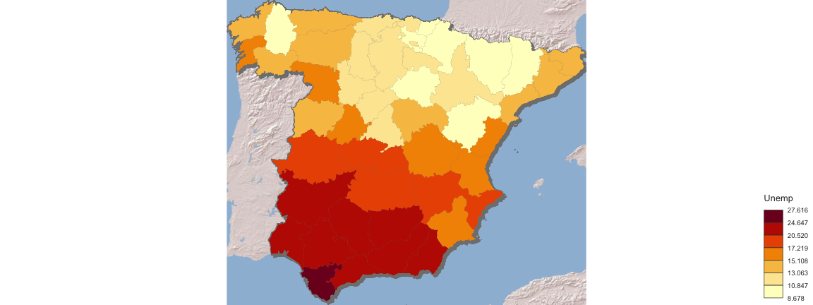
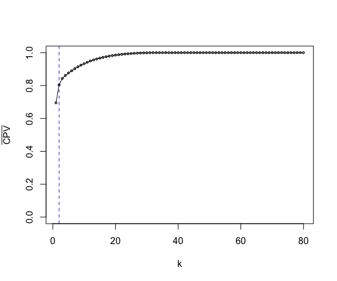
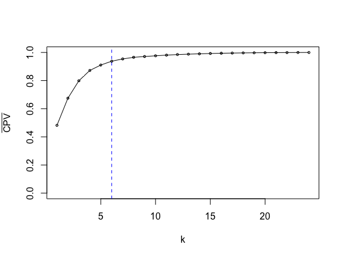
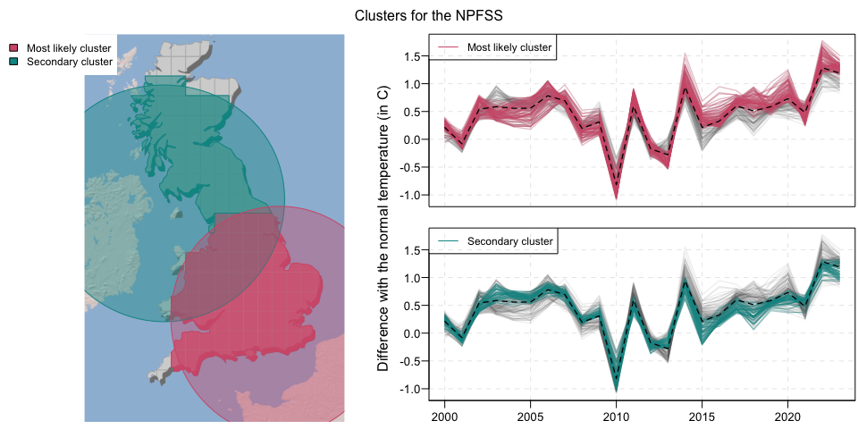
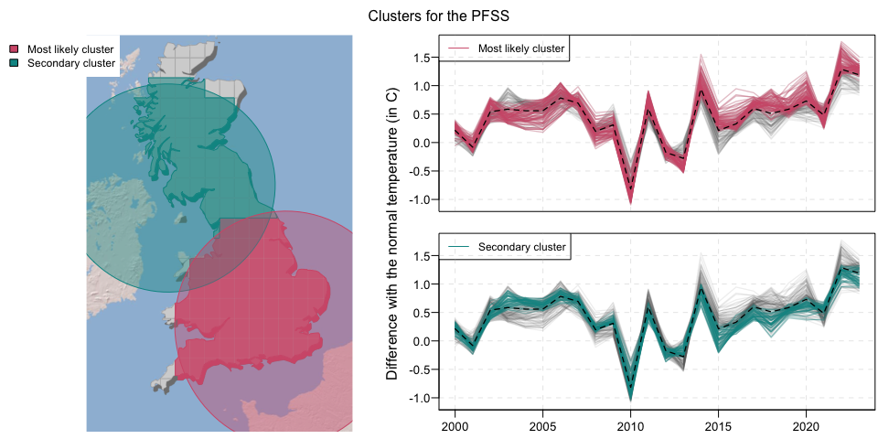
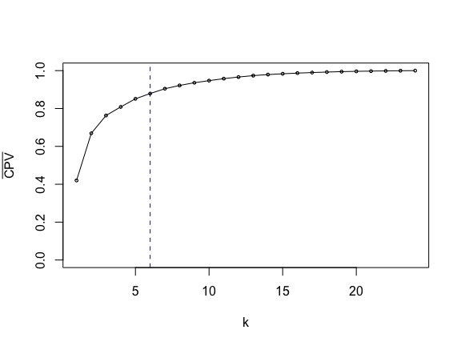
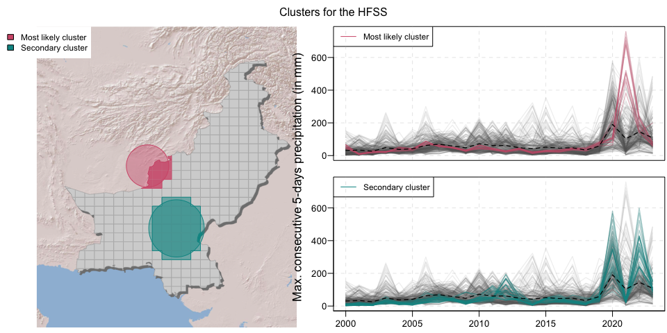

Supplementary material: Codes and Data for the paper \`\`A new
parametric spatial scan statistic for functional data: application to
climate change data’’
================
Zaineb Smida, Thibault Laurent, Lionel Cucala
(Last update: 2025-02-05)


This document provides the R code and data used to generate the last
part of the paper “A New Parametric Spatial Scan Statistic for
Functional Data: Application to Climate Change Data.” To reference this
work, please use the following citation:

Zaineb Smida, Thibault Laurent and Lionel Cucala (2025). [A Hotelling
spatial scan statistic for functional data: application to economic and
climate data](), *Submitted in Spatial Statistics*.

Packages needed:

``` r
library(mapsf) # cartography
library(maptiles) # import spatial contours
library(sf) # spatial data analysis
library(tidyverse) # tidyverse
library(latex2exp) # add LaTeX
library(ggh4x) # customize ggplot graphic
library(progress) # progress bar
library(rARPACK) # compute only the d first eigen values/eigen vectors
library(parallel) # parallel computing
```

Functions needed :

``` r
source("codes/PFSS.R") # compute PFSS method
source("codes/NPFSS.R") # compute NPFSS method
source("codes/DFSS.R") # compute DFSS method
source("codes/HFSS.R") # compute HFSS method
source("codes/other_functions.R") # additional functions
```

**Note:** Since the simulation results were obtained using computing
servers, we do not provide here the codes executed on the different
cores; however, we can make them available upon request.

# Application to real data

## Spanish region

The [spain_unemp.RData](spain_unemp.RData) file contains three objects:

- `Matcoordalpha`, the coordinates of the centroid of the Spanish
  regions (expressed in Cartesian coordinates),
- `MatX`, the unemployment trends in Spanish regions over 80 quarters
  from 2002 to 2022,
- `region_spain`, the spatial contours of the Spanish regions.

``` r
load("data/spain_unemp.RData")
dates <- seq(2002, 2021.75, by = 0.25)
y_lim <- range(MatX)
# import the OSM map
nc_osm <- get_tiles(region_spain, 
                      provider = "Esri.WorldShadedRelief", 
                      zoom = 7, crop = T)
# compute the distance between points
dist_proj <- as(dist(Matcoordalpha), "matrix")
# cartography
my_proj <- st_crs(region_spain)
spain <- st_union(region_spain)
```

First, we plot the data:

``` r
#pdf(file = "figures/spain_data.pdf", width = 10, height = 4.5)
par(mfrow = c(1, 2), mar = c(3.7, 3, 1, 1), oma = c(0, 0, 0, 0),
    las = 1, mgp = c(2.15, 0.75, 0))
# map
plot_tiles(nc_osm)
mf_shadow(spain, add = T, cex = 0.8)
plot(st_geometry(spain), border = rgb(0.5, 0.5, 0.5), lwd = 0.4, add = T,
     col = rgb(0.82, 0.82, 0.82))
plot(st_geometry(region_spain), border = rgb(1, 1, 1), lwd = 0.4, add = T,
     col = rgb(0.82, 0.82, 0.82))
# data
plot(dates, MatX[, 1], ylim = y_lim, xlab = 'Quarters of the period 2002-2022',
       ylab = 'Unemployment rate', xaxt = "n", 
     col = rgb(0.6, 0.6, 0.6, alpha = 0.5),
     type = "l")
# abline(v = seq(2002, 2022, by = 4), lty = 2, col = rgb(0.7, 0.7, 0.7, alpha = 0.3))
abline(h = seq(0, 40, by = 10), lty = 2, col = rgb(0.7, 0.7, 0.7, alpha = 0.3))

axis(1, at = seq(2002, 2022, by = 1),
     labels = F)
text(x = seq(2002, 2022, by = 1), y = par()$usr[3] - 0.03 * (par()$usr[4] - par()$usr[3]),
     labels = paste0(seq(2002, 2022, by = 1), "QI"),
     srt = 45, adj = 1, xpd = T, cex = 0.8)
for(j in 2:47)
  lines(dates, MatX[,j], ylim = y_lim, lwd = 1.3, 
        col = rgb(0.4, 0.4, 0.4, alpha = 0.3)) 
```


``` r
#dev.off()
#R.utils::compressPDF("figures/spain_data.pdf")
#qpdf::pdf_compress("compressedPDFs/spain_data.pdf")
```

#### Descriptive Analysis

We represent the variable “Unemployment” aggregated over different
2-year periods

``` r
nb_split <- 10
step_years <- split(1:80, 
           sort(rep_len(1:nb_split, length.out = length(dates))))
#pdf(paste0("figures/Spain_evol.pdf"), width = 10, height = 7)
par(mfrow = c(3, 4), oma = c(0, 0, 0, 0), mar = c(0, 0, 0, 0))
  my_vec <- NULL
    for (j in 1:nb_split) {
      my_vec <- c(my_vec, colMeans(MatX[step_years[[j]], ]))
    }
    my_interval <- round(classInt::classIntervals(my_vec, 7, style = "jenks")$brks, digits = 4)

    nom_pal <- "YlOrRd"
    my_pal <- rev(alpha(colorspace::sequential_hcl(7, palette = nom_pal), 1))

    for (j in 1:nb_split) {
      chosen_years_5 <- step_years[[j]]
      my_mean <- colMeans(MatX[step_years[[j]], ])
      my_col <- alpha(my_pal[findInterval(my_mean, my_interval, all.inside = T)],
                  1)
    
      plot_tiles(nc_osm)
      mf_shadow(spain, add = T, cex = 0.8)
      plot(st_geometry(region_spain), 
        col = my_col,
        border = my_col, lwd = 0.001, add = T)
      my_years <- dates[chosen_years_5]
      title(paste0(my_years[1], "-", round(my_years[length(my_years)])), line = -.75)
     plot(st_geometry(region_spain), border = rgb(0.9, 0.9, 0.9), 
          lwd = 0.00000001, add = T)
     plot(st_geometry(spain), border = rgb(0.5, 0.5, 0.5), lwd = 0.4, add = T)
     if(j == nb_split)
       maplegend::leg(type = "choro", val = my_interval, pos = "bottomright", 
                 pal = my_pal, val_rnd = 3, title = "Unemp")
    }
#dev.off()
#R.utils::compressPDF("figures/Spain_evol.pdf")
```


Average over all the years:

``` r
nb_split <- 1
step_years <- split(1:80, 
           sort(rep_len(1:nb_split, length.out = length(dates))))
#pdf(paste0("figures/Spain_mean.pdf"), width = 8, height = 7)
par(oma = c(0, 0, 0, 0), mar = c(0, 0, 0, 0))
  my_vec <- NULL
    for (j in 1:nb_split) {
      my_vec <- c(my_vec, colMeans(MatX[step_years[[j]], ]))
    }
    my_interval <- round(classInt::classIntervals(my_vec, 7, style = "jenks")$brks, digits = 4)

    nom_pal <- "YlOrRd"
    my_pal <- rev(alpha(colorspace::sequential_hcl(7, palette = nom_pal), 1))

    for (j in 1:nb_split) {
      chosen_years_5 <- step_years[[j]]
      my_mean <- colMeans(MatX[step_years[[j]], ])
      my_col <- alpha(my_pal[findInterval(my_mean, my_interval, all.inside = T)],
                  1)
    
      plot_tiles(nc_osm)
      mf_shadow(spain, add = T, cex = 0.8)
      plot(st_geometry(region_spain), 
        col = my_col,
        border = my_col, lwd = 0.001, add = T)
      my_years <- dates[chosen_years_5]
      # title(paste0(my_years[1], "-", round(my_years[length(my_years)])), line = -.75)
     plot(st_geometry(region_spain), border = rgb(0.9, 0.9, 0.9), 
          lwd = 0.00000001, add = T)
     plot(st_geometry(spain), border = rgb(0.5, 0.5, 0.5), lwd = 0.4, add = T)
     if(j == 1)
       maplegend::leg(type = "choro", val = my_interval, pos = "bottomright", 
                 pal = my_pal, val_rnd = 3, title = "Unemp")
    }
```



``` r
#dev.off()
# R.utils::compressPDF("figures/Spain_mean.pdf")
```

We calculate all possible clusters:

``` r
my_pairs_sp <- find_all_cluster(Matcoordalpha)
```

    ## Number of possible combinaison:  1613

We use the four methods to detect clusters.

### NPFSS method

**Most Likely Cluster (MLC)**

``` r
res_np <- compute_np(my_pairs_sp[[1]], my_pairs_sp[[2]], MatX)
res_np
```

    ## $stat
    ## [1] 2.950895
    ## 
    ## $vec
    ##  [1] 30 12 39 16 21 25 23  3  7 15 31  1 43 11 18  2  6

**Significance**

``` r
p_value_np <- 0
B <- 999
pb <- progress_bar$new(total = B)

for(b in 1:B) {
  pb$tick()
  perm <- sample(ncol(MatX))
  MatXsim <- MatX[, perm]
  temp <- compute_np(my_pairs_sp[[1]], my_pairs_sp[[2]], MatXsim)
  p_value_np <- p_value_np + (res_np$stat < temp$stat)
}
cat("p-value: ", (1 + p_value_np) /  (1 + B))
```

    ## p-value:  0.001

**Secondary cluster (2MLC)**

We remove all observations belonging to the most likely cluster from the
list of potential clusters. For example, if the most likely cluster
contains observations 1, 3, and 5, then the potential cluster with
observations 8, 1, 3, 5, and 10 is replaced by 8 and 10. We then compute
the NPFSS method on the new combinations.

``` r
cluster_g1_temp <- sapply(my_pairs_sp[[1]], function(x) setdiff(x, res_np$vec))
cluster_g2_temp <- sapply(my_pairs_sp[[2]], function(x) setdiff(x, res_np$vec))
id_pos <- union(which(sapply(cluster_g1_temp, function(x) length(x) == 0)),
          which(sapply(cluster_g2_temp, function(x) length(x) == 0)))
```

``` r
res_np_2 <- compute_np(cluster_g1_temp[-id_pos], 
                       cluster_g2_temp[-id_pos], MatX)
res_np_2
```

    ## $stat
    ## [1] 1.873267
    ## 
    ## $vec
    ##  [1] 32 19 36  4  9 47 24 40 10 13 22 27 42 34 38

**Significance**

``` r
p_value_np_2 <- 0
pb <- progress_bar$new(total = B)

for(b in 1:B) {
  pb$tick()
  perm <- sample(ncol(MatX))
  MatXsim <- MatX[, perm]
  temp <- compute_np(cluster_g1_temp[-id_pos], cluster_g2_temp[-id_pos], MatXsim)
  p_value_np_2 <- p_value_np_2 + (res_np_2$stat < temp$stat)
}
cat("p-value: ", (1 + p_value_np_2) / (1 + B))
```

    ## p-value:  0.023

### PFSS method

**Most Likely Cluster (MLC)**

``` r
res_p <- compute_p(my_pairs_sp[[1]], my_pairs_sp[[2]], MatX)
res_p
```

    ## $stat
    ## [1] 79.54792
    ## 
    ## $vec
    ##  [1] 16 39 25 30 15  7 21 12 23 43 11  3  1

**Significance**

``` r
p_value_p <- 0
pb <- progress_bar$new(total = B)

for(b in 1:B) {
  pb$tick()
  perm <- sample(ncol(MatX))
  MatXsim <- MatX[, perm]
  temp <- compute_np(my_pairs_sp[[1]], my_pairs_sp[[2]], MatXsim)
  p_value_p <- p_value_p + (res_p$stat < temp$stat)
}
cat("p-value: ", (1 + p_value_p) /  (1 + B))
```

    ## p-value:  0.001

**Secondary cluster (2MLC)**

``` r
cluster_g1_temp <- sapply(my_pairs_sp[[1]], function(x) setdiff(x, res_p$vec))
cluster_g2_temp <- sapply(my_pairs_sp[[2]], function(x) setdiff(x, res_p$vec))
id_pos <- union(which(sapply(cluster_g1_temp, function(x) length(x) == 0)),
          which(sapply(cluster_g2_temp, function(x) length(x) == 0)))
```

``` r
res_p_2 <- compute_p(cluster_g1_temp[-id_pos], 
                       cluster_g2_temp[-id_pos], MatX)
res_p_2
```

    ## $stat
    ## [1] 20.10678
    ## 
    ## $vec
    ##  [1] 19  9  4 32 36 10 13 40 47 24 34 22 38 45 27 42

**Significance of the secondary cluster**

``` r
p_value_p_2 <- 0
pb <- progress_bar$new(total = B)

for(b in 1:B) {
  pb$tick()
  perm <- sample(ncol(MatX))
  MatXsim <- MatX[, perm]
  temp <- compute_p(cluster_g1_temp[-id_pos], cluster_g2_temp[-id_pos], MatXsim)
  p_value_p_2 <- p_value_p_2 + (res_p_2$stat < temp$stat)
}
cat("p-value: ", (1 + p_value_p_2) /  (1 + B))
```

    ## p-value:  0.015

### DFFSS method

**Most Likely Cluster (MLC)**

``` r
res_dffss <- compute_dffss(my_pairs_sp[[1]], my_pairs_sp[[2]], MatX)
res_dffss
```

    ## $stat
    ## [1] 12.46398
    ## 
    ## $vec
    ##  [1] 16 39 25 30 15  7 21 12 23 43 11  3  1

**Significance**

``` r
p_value_dffss <- 0
pb <- progress_bar$new(total = B)

for(b in 1:B) {
  pb$tick()
  perm <- sample(ncol(MatX))
  MatXsim <- MatX[, perm]
  temp <- compute_dffss(my_pairs_sp[[1]], my_pairs_sp[[2]], MatX)
  p_value_dffss <- p_value_dffss + (res_dffss$stat < temp$stat)
}
(1 + p_value_dffss) /  (1 + B)
```

    ## p-value:  0.001

**Secondary cluster (2MLC)**

``` r
cluster_g1_temp <- sapply(my_pairs_sp[[1]], function(x) setdiff(x, res_dffss$vec))
cluster_g2_temp <- sapply(my_pairs_sp[[2]], function(x) setdiff(x, res_dffss$vec))
id_pos <- union(which(sapply(cluster_g1_temp, function(x) length(x) == 0)),
          which(sapply(cluster_g2_temp, function(x) length(x) == 0)))
```

``` r
res_dffss_2 <- compute_dffss(cluster_g1_temp[-id_pos], 
                       cluster_g2_temp[-id_pos], MatX)
res_dffss_2
```

    ## $stat
    ## [1] 7.587023
    ## 
    ## $vec
    ##  [1] 24 27 47 32 41  8 42 36 19 14 40 20  4  9 22 10 18 44 13 38 29 34

**Significance of the 2MLC**

``` r
p_value_dffss_2 <- 0
pb <- progress_bar$new(total = B)

for(b in 1:B) {
  pb$tick()
  perm <- sample(ncol(MatX))
  MatXsim <- MatX[, perm]
  temp <- compute_dffss(cluster_g1_temp[-id_pos], cluster_g2_temp[-id_pos], MatXsim)
  p_value_dffss_2 <- p_value_dffss_2 + (res_dffss_2$stat < temp$stat)
}
cat("p-value: ", (1 + p_value_dffss_2) /  (1 + B))
```

    ## p-value:  0.004

### HFSS method

**Most Likely Cluster (MLC)**

We first determine the optimal $K$:

``` r
#pdf("figures/spain_h_CPV.pdf", width = 6, height = 4)
temp <- compute_h(my_pairs_sp[[1]], my_pairs_sp[[2]], MatX, 
                           nrow(MatX), plot_eigen = T, ylim = c(0, 1),
                  xlab = "k", 
                  ylab = TeX("$\\bar{CPV}$"), cex = 0.5)
```

    ## Variance explained in % by the 10 first components:  83.23 89.16 91.08 92.38 93.32 94.06 94.73 95.3 95.83 96.23

``` r
abline(v = 2, lty = 2, col = "blue")
```


``` r
#dev.off()
# R.utils::compressPDF("figures/spain_h_CPV.pdf")
```

We select $K=2$, which explains approximately $90\%$ of the variance.
Note that using $K=10$, which accounts for $95\%$ of the variance, leads
to the same identified clusters.

``` r
res_h <- compute_h(my_pairs_sp[[1]], my_pairs_sp[[2]], MatX, 2)
res_h
```

    ## $stat
    ## [1] 124.6322
    ## 
    ## $vec
    ##  [1] 16 39 25 30 15  7 21 12 23 43 11  3  1

``` r
p_value_h <- 0
pb <- progress_bar$new(total = B)

for(b in 1:B) {
  pb$tick()
  perm <- sample(ncol(MatX))
  MatXsim <- MatX[, perm]
  temp <- compute_h(my_pairs_sp[[1]], my_pairs_sp[[2]], MatXsim, 2)
  p_value_h <- p_value_h + (res_h$stat < temp$stat)
}
(1 + p_value_h) /  (1 + B)
```

    ## p-value:  0.001

**Secondary cluster (2MLC)**

``` r
cluster_g1_temp <- sapply(my_pairs_sp[[1]], function(x) setdiff(x, res_h$vec))
cluster_g2_temp <- sapply(my_pairs_sp[[2]], function(x) setdiff(x, res_h$vec))
id_pos <- union(which(sapply(cluster_g1_temp, function(x) length(x) == 0)),
          which(sapply(cluster_g2_temp, function(x) length(x) == 0)))
```

We aim to find the optimal value of $K$:

``` r
#pdf("figures/spain_h_CPV_2.pdf", width = 6, height = 4)
temp <- compute_h(cluster_g1_temp[-id_pos], cluster_g2_temp[-id_pos], MatX, 
                           nrow(MatX), plot_eigen = T, ylim = c(0, 1),
                  xlab = "k", 
                  ylab = TeX("$\\bar{CPV}$"), cex = 0.5)
```

    ## Variance explained in % by the 10 first components:  69.49 80.38 84.3 86.13 87.64 88.97 90.24 91.41 92.4 93.32

``` r
abline(v = 2, lty = 2, col = "blue")
```



``` r
#dev.off()
# R.utils::compressPDF("figures/spain_h_CPV_2.pdf")
```

We choose $K=2$.

``` r
res_h_2 <- compute_h(cluster_g1_temp[-id_pos], 
                     cluster_g2_temp[-id_pos], MatX, 2)
res_h_2
```

    ## $stat
    ## [1] 44.60017
    ## 
    ## $vec
    ##  [1] 32 19 36  4  9 47 24 40 10 13 22 27 42 34 38

**Significance of the 2MLC**

``` r
p_value_h_2 <- 0
pb <- progress_bar$new(total = B)

for(b in 1:B) {
  pb$tick()
  perm <- sample(ncol(MatX))
  MatXsim <- MatX[, perm]
  temp <- compute_h(cluster_g1_temp[-id_pos], cluster_g2_temp[-id_pos], 
                    MatXsim, 2)
  p_value_h_2 <- p_value_h_2 + (res_h_2$stat < temp$stat)
}
cat("p-value: ", (1 + p_value_h_2) /  (1 + B))
```

    ## p-value:  0.003

### Summary of the results

**Visualization of the result**

``` r
res <- vector("list", 4)
res[[1]][[1]] <- res_h
res[[1]][[2]] <- res_h_2
res[[2]][[1]] <- res_dffss
res[[2]][[2]] <- res_dffss_2
res[[3]][[1]] <- res_np
res[[3]][[2]] <- res_np_2
res[[4]][[1]] <- res_p
res[[4]][[2]] <- res_p_2
names_method <- c("HFSS", "DFFSS", "NPFSS", "PFSS")
cols = c("#D35C79", "#009593")
```

We present the clusters detected on the data from Spain.

``` r
my_var <- 'Unemployment rate (in %)'
my_country <- "ESP" 

y_lim <- range(MatX)

for(k in 1:4) {
  my_cluster_1 <- res[[k]][[1]]$vec
  my_cluster_2 <- res[[k]][[2]]$vec

#pdf(file = paste0("figures/", my_country, "_", names_method[k], ".pdf"), width = 11.5, height = 3.9) 
sf_use_s2(F)
nf <- layout( matrix(c(1,1,2,3), nrow=2, byrow=F) )
  par(mar = c(1.5, 0, 0, 0.2), 
      oma = c(0.5, 0, 2.4, 0), mgp = c(2.4, 0.6, 0), las = 1)
  ##### Map #########
    # map
  col_geo <- rep(rgb(0.9, 0.9, 0.9, alpha = 0.1), nrow(Matcoordalpha))
  cex_geo <- rep(0.7, nrow(Matcoordalpha))
  col_geo[my_cluster_1] <- alpha(cols[1], 0.8)
  cex_geo[my_cluster_1] <- 1

  col_geo[my_cluster_2] <- alpha(cols[2], 0.5)
  cex_geo[my_cluster_2] <- 1
  
  
   plot_tiles(nc_osm)
  mf_shadow(spain, add = T, cex = 0.8)
  mf_shadow(st_union(region_spain[my_cluster_1, ]), 
                add = T, cex = 0.8, col = cols[1])
  mf_shadow(st_union(region_spain[my_cluster_2, ]), 
         add = T, col= cols[2], cex = 0.8)
      
  plot(st_geometry(spain), border = rgb(0.5, 0.5, 0.5), 
           lwd = 0.4, add = T, col = rgb(0.82, 0.82, 0.82))

  
  plot(st_geometry(region_spain), 
        border = "white",
        col = col_geo, 
        cex = cex_geo,
        pch = 16, asp = 1, add = T, lwd = 0.1)

  plot(st_geometry(st_union(region_spain[my_cluster_1, ])), 
         add = T, border= cols[1], col = NULL)
  plot(st_geometry(st_union(region_spain[my_cluster_2, ])), 
         add = T, border= cols[2], col = NULL)

      
    temp_1 <- draw.circle(Matcoordalpha[my_cluster_1[1], 1], 
                           Matcoordalpha[my_cluster_1[1], 2], 
                  as.numeric(dist_proj[my_cluster_1[1], 
                                       my_cluster_1[length(my_cluster_1)]]))

  temp_2 <- draw.circle(Matcoordalpha[my_cluster_2[1], 1], 
                           Matcoordalpha[my_cluster_2[1], 2], 
                  as.numeric(dist_proj[my_cluster_2[1], 
                                       my_cluster_2[length(my_cluster_2)]]))
    ###############
  polygon(temp_1$x, temp_1$y, border= cols[1],
             col = alpha(cols[1], 0.4), lty=1, lwd=1)

  polygon(temp_2$x, temp_2$y, border= cols[2],
             col = alpha(cols[2], 0.4), lty=1, lwd=1)
  
    mtext(my_var,
       side = 4, line = -2.8, las = 0)
    
  legend("topleft", legend = c("Most likely cluster", "Secondary cluster"),
         fill = c(cols[1], cols[2]), cex = 0.9, box.lty = 0)
      
  ##### Functional data
  plot(dates, MatX[, 1], ylim = y_lim, xlab = '',
       ylab = '', col = rgb(0.6, 0.6, 0.6, alpha = 0.5), xaxt = 'n', 
        type = "l")
  legend("topleft", legend = c("Most likely cluster"),
         lty = 1, col = c(cols[1]), cex = 0.9)
  abline(v = seq(2002, 2022, by = 4), lty = 2, 
             col = rgb(0.7, 0.7, 0.7, alpha = 0.3))
  abline(h = seq(0, 40, by = 10),
             lty = 2, col = rgb(0.7, 0.7, 0.7, alpha = 0.3))

  for (j in 2:ncol(MatX))
        lines(dates, MatX[, j], lwd = 1.3, 
          col = rgb(0.4, 0.4, 0.4, alpha = 0.1)) 
    
  for(i in my_cluster_1)
        lines(dates, MatX[, i], col = alpha(cols[1], 0.3),
          lty = 1, lwd = 1.3)
  
  lines(dates, rowMeans(MatX), lwd = 1.3, lty = 2)
  

plot(dates, MatX[, 1], ylim = y_lim, xlab = 'Years',
       ylab = '', xaxt = "n", 
       col = rgb(0.6, 0.6, 0.6, alpha = 0.5),
        type = "l")
  legend("topleft", legend = c("Secondary cluster"),
         lty = 1, col = c(cols[2]), cex = 0.9)
  abline(v = seq(2002, 2022, by = 4), lty = 2, 
             col = rgb(0.7, 0.7, 0.7, alpha = 0.3))
  abline(h = seq(0, 40, by = 10),
             lty = 2, col = rgb(0.7, 0.7, 0.7, alpha = 0.3))
  axis(1, at = seq(2002, 2022, by = 4), xlab = "years",
           labels = as.character(seq(2002, 2022, by = 4)))
  for (j in 2:ncol(MatX))
        lines(dates, MatX[, j], lwd = 1.3, 
          col = rgb(0.4, 0.4, 0.4, alpha = 0.1)) 
      
  for(i in my_cluster_2)
        lines(dates, MatX[, i], col = alpha(cols[2], 0.3),
          lty = 1, lwd = 1.3)
  
    
  lines(dates, rowMeans(MatX), lwd = 1.3, lty = 2)
  
  mtext(paste0("Clusters for the ", names_method[k]), side = 3, line = 0.8, outer = TRUE)
#dev.off()
#R.utils::compressPDF(paste0("figures/", my_country, "_", names_method[k], ".pdf"))
}
```


The following table presents a summary of the clusters found based on
the method used.

``` r
res_spain <- data.frame(nb_cluster_1 = c(length(res_np$vec), 
                            length(res_p$vec),
                            length(res_dffss$vec),
                            length(res_h$vec)),
           p_value_MLC = c(0.001, 0.001, 0.001, 0.001),
           nb_cluster_2 = c(length(res_np_2$vec), 
                            length(res_p_2$vec),
                            length(res_dffss_2$vec),
                            length(res_h_2$vec)),
           p_value_2MLC = c(0.023, 0.015, 0.004, 0.003))
row.names(res_spain) <- c("NPFSS", "PFSS", "DFFSS", "HFSS")
knitr::kable(res_spain)
```

|       | nb_cluster_1 | p_value_MLC | nb_cluster_2 | p_value_2MLC |
|:------|-------------:|------------:|-------------:|-------------:|
| NPFSS |           17 |       0.001 |           15 |        0.023 |
| PFSS  |           13 |       0.001 |           16 |        0.015 |
| DFFSS |           13 |       0.001 |           22 |        0.004 |
| HFSS  |           13 |       0.001 |           15 |        0.003 |

## Climate Data

### Great-Britain

``` r
# Initialisation
unique_year <- 1981:2023
chosen_years <- 20:43
my_var <- "t2m_diff_" 
my_country <- "GBR"
my_proj <- 3035 
```

Import the data:

``` r
load("data/GB.RData")
```

Download tiles and compose raster (SpatRaster)

``` r
nc_osm <- get_tiles(my_contours, 
                      provider = "Esri.WorldShadedRelief", 
                      zoom = 7, crop = F)
```

We compute all possible clusters:

``` r
coord_proj <- st_coordinates(st_centroid(coord_temp))
pairs_geo <- find_all_cluster(coord_proj)
```

    ## Number of possible combinaison:  13557

``` r
dist_proj <- as(dist(cbind(coord_proj[, 1], coord_proj[, 2])), "matrix")
```

We can restrict the cluster size to half of the total population. To do
so, simply run the following code:

``` r
size_c1 <- sapply(pairs_geo[[1]], function(x) length(x))
pairs_geo_restrict <- list(pairs_geo[[1]][size_c1 < nrow(coord_proj) / 2], 
                      pairs_geo[[2]][size_c1 < nrow(coord_proj) / 2])
```

#### Descriptive Analysis

First, we plot the data :

``` r
y_lim <- range(MatX)
dates <- unique_year[chosen_years]
#pdf(file = "figures/GBR_data.pdf", width = 10, height = 4.5)
par(mfrow = c(1, 2), mar = c(3.7, 3, 1, 1), oma = c(0, 0, 0, 0),
    las = 1, mgp = c(2.2, 0.8, 0))
# map
plot_tiles(nc_osm)
  mf_shadow(my_contours, add = T, cex = 0.8)
  plot(st_geometry(poly_cell), border = rgb(0.5, 0.5, 0.5), 
           lwd = 0.4, add = T, col = rgb(0.82, 0.82, 0.82))

# data
  plot(dates, MatX[1, ], ylim = y_lim, xlab = 'Years',
       ylab = 'Difference from average temperatures (in C)', xaxt = "n", 
       col = rgb(0.6, 0.6, 0.6, alpha = 0.5),
        type = "l")
  abline(v = seq(1980, 2025, by = 5), lty = 2, 
             col = rgb(0.7, 0.7, 0.7, alpha = 0.3))
  abline(h = seq(-4, 4, by = 0.5),
             lty = 2, col = rgb(0.7, 0.7, 0.7, alpha = 0.3))
  axis(1, at = seq(1980, 2025, by = 5), xlab = "years",
           labels = as.character(seq(1980, 2025, by = 5)))
  for (j in 2:nrow(MatX))
        lines(dates, MatX[j, ], lwd = 1.3, 
          col = rgb(0.4, 0.4, 0.4, alpha = 0.1)) 
```


``` r
#dev.off()
#  R.utils::compressPDF("figures/GBR_data.pdf")
```

We map the variable “Difference from average temperatures” aggregated
over different four-year periods.

``` r
nb_split <- 8
step_years <- split(chosen_years, 
           sort(rep_len(1:nb_split, length.out = length(chosen_years))))
#pdf(paste0("figures/GB_evol.pdf"), width = 12, height = 8)
par(mfrow = c(2, 4), oma = c(0, 0, 0, 0), mar = c(0, 0, 0, 0))
  my_vec <- NULL
    for (j in 1:nb_split) {
      my_vec <- c(my_vec, rowMeans(st_drop_geometry(poly_cell[, paste0(my_var, unique_year)[step_years[[j]]]])))
    }
    my_interval <- round(classInt::classIntervals(my_vec, 8, style = "jenks")$brks, digits = 4)

    nom_pal <- "YlOrRd"
    my_pal <- rev(alpha(colorspace::sequential_hcl(8, palette = nom_pal), 1))
    my_col <- my_pal[findInterval(poly_cell$my_mean, my_interval, all.inside = T)]

    for (j in 1:nb_split) {
      chosen_years_5 <- step_years[[j]]
      poly_cell$my_mean <- rowMeans(st_drop_geometry(poly_cell[, paste0(my_var, unique_year)[chosen_years_5]]))
      my_col <- alpha(my_pal[findInterval(poly_cell$my_mean, my_interval, all.inside = T)],
                  0.5)
    
      plot_tiles(nc_osm)
      plot(st_geometry(poly_cell), 
        col = my_col,
        border = my_col, lwd = 0.001, add = T)
      my_years <- unique_year[chosen_years_5]
      title(paste0(my_years[1], "-", my_years[length(my_years)]), line = -1.25)
     plot(st_geometry(my_contours), add = T, lwd = 0.5)
     if(j == 1)
       maplegend::leg(type = "choro", val = my_interval, pos = "topleft", 
                 pal = my_pal, val_rnd = 3, title = "Diff Temp")
    }
```


``` r
#dev.off()
 #    R.utils::compressPDF("figures/GB_evol.pdf")
```

Average mean of difference temperatures:

``` r
nb_split <- 1
step_years <- split(chosen_years, 
           sort(rep_len(1:nb_split, length.out = length(chosen_years))))
#pdf(paste0("figures/GBR_mean.pdf"), width = 7, height = 8)
par(oma = c(0, 0, 0, 0), mar = c(0, 0, 0, 0))
  my_vec <- NULL
    for (j in 1:nb_split) {
      my_vec <- c(my_vec, rowMeans(st_drop_geometry(poly_cell[, paste0(my_var, unique_year)[step_years[[j]]]])))
    }
    my_interval <- round(classInt::classIntervals(my_vec, 8, style = "jenks")$brks, digits = 4)

    nom_pal <- "YlOrRd"
    my_pal <- rev(alpha(colorspace::sequential_hcl(8, palette = nom_pal), 1))
    my_col <- my_pal[findInterval(poly_cell$my_mean, my_interval, all.inside = T)]

    for (j in 1:nb_split) {
      chosen_years_5 <- step_years[[j]]
      poly_cell$my_mean <- rowMeans(st_drop_geometry(poly_cell[, paste0(my_var, unique_year)[chosen_years_5]]))
      my_col <- alpha(my_pal[findInterval(poly_cell$my_mean, my_interval, all.inside = T)],
                  0.5)
    
      plot_tiles(nc_osm)
      plot(st_geometry(poly_cell), 
        col = my_col,
        border = my_col, lwd = 0.001, add = T)
      my_years <- unique_year[chosen_years_5]
     plot(st_geometry(my_contours), add = T, lwd = 0.5)
     if(j == 1)
       maplegend::leg(type = "choro", val = my_interval, pos = "topleft", 
                 pal = my_pal, val_rnd = 3, title = "Diff Temp")
    }
```


``` r
#dev.off()
#     R.utils::compressPDF("figures/GBR_mean.pdf")
```

#### NPFSS method

**Most Likely Cluster (MLC)**

``` r
res_np <- compute_np(pairs_geo[[1]], pairs_geo[[2]], t(MatX))
res_np
```

    ## $stat
    ## [1] 4.56314
    ## 
    ## $vec
    ##  [1] 126 133   3 125 127 134   4   2 132 139  12  13 140  11 138 124 128   1   5
    ## [20] 135  23 141  14 143  24  10  22 129 144  25  21 136   6  37  38  36 142  15
    ## [39]  39  35 145  26  52  53 130  51   7 137  16  40  54  50  27  70  71  69  55
    ## [58] 131  41  72   8  68  17  86  73  28  87  56  85  67  88  84  42

As the cluster size is somewhat large, we can, if needed, restrict the
size to $50\%$ of the number of observations.

``` r
if(length(res_np$vec) >= ceiling(nrow(MatX) / 2)) {
  res_np_restrict <- compute_np(pairs_geo_restrict[[1]], pairs_geo_restrict[[2]], t(MatX))
} else {
    res_np_restrict <- res_np
}
```

**Significance (using parallel computing)**

``` r
B <- 999
compute_fun_par <- function(b, fun, ...) {
  set.seed(b)
  perm <- sample(nrow(MatX))
  MatXsim <- MatX[perm, ]
  temp <- fun(c1, c2, t(MatXsim))
  temp$stat
}

c1 <- pairs_geo[[1]]
c2 <- pairs_geo[[2]]

require(parallel)
cl <- makeCluster(10)
clusterExport(cl, c("c1", "c2", "MatX", "norm"))
res_par_np <- clusterApplyLB(cl, 1:B, compute_fun_par, compute_np)
stopCluster(cl)

cat("p-value: ", (1 + sum(sapply(res_par_np, function(x) res_np$stat <x))) /  (1 + B))
```

    ## p-value:  0.001

**Secondary cluster (2MLC)**

``` r
# We exclude cells that are not contiguous.
temp_cl <- c(res_np$vec, 55, 56, 73, 74, 84, 85, 86, 87, 88, 89, 99, 100, 
             101, 102, 103, 113, 114) 
cluster_g1_temp <- sapply(pairs_geo[[1]], function(x) setdiff(x, temp_cl))
cluster_g2_temp <- sapply(pairs_geo[[2]], function(x) setdiff(x, temp_cl))
id_pos <- union(which(sapply(cluster_g1_temp, function(x) length(x) == 0)),
          which(sapply(cluster_g2_temp, function(x) length(x) == 0)))
```

``` r
res_np_2 <- compute_np(cluster_g1_temp[-id_pos], 
                       cluster_g2_temp[-id_pos], t(MatX))
res_np_2
```

    ## $stat
    ## [1] 2.54732
    ## 
    ## $vec
    ##  [1] 104  90 105  91  75  76 106 115  92  58  59  57  77  43  60 107  44 116  93
    ## [20]  78  45  29  61  30 108  94 117  31  46  79 122  18  19  62  32  20  47 109
    ## [39]  95 118   9  80 123  63  48 110 119  96

In the case where the size of the first cluster had been restricted to
$50\%$ of the population, the second cluster must be calculated by
removing the observations from the restricted cluster:

``` r
if(length(res_np$vec) >= ceiling(nrow(MatX) / 2)) {
  # We exclude cells that are not contiguous.
temp_cl <- c(res_np_restrict$vec, 55, 56, 73, 74, 84, 85, 86, 87, 88, 89, 99, 100, 
             101, 102, 103, 113, 114) 
cluster_g1_temp <- sapply(pairs_geo_restrict[[1]], function(x) setdiff(x, temp_cl))
cluster_g2_temp <- sapply(pairs_geo_restrict[[2]], function(x) setdiff(x, temp_cl))
id_pos <- union(which(sapply(cluster_g1_temp, function(x) length(x) == 0)),
          which(sapply(cluster_g2_temp, function(x) length(x) == 0)))

  res_np_restrict_2 <- compute_np(cluster_g1_temp[-id_pos], cluster_g2_temp[-id_pos], t(MatX))
} else {
    res_np_restrict_2 <- res_np_2
}
```

**Significance**

``` r
c1 <- cluster_g1_temp[-id_pos]
c2 <- cluster_g2_temp[-id_pos]

cl <- makeCluster(10)
clusterExport(cl, c("c1", "c2", "MatX", "norm"))
res_par_np <- clusterApplyLB(cl, 1:B, compute_fun_par, compute_np)
stopCluster(cl)

cat("p-value: ", (1 + sum(sapply(res_par_np, function(x) res_np_2$stat <x))) /  (1 + B))
```

    ## p-value:  0.001

#### PFSS method

**Most Likely Cluster (MLC)**

``` r
res_p <- compute_p(pairs_geo[[1]], pairs_geo[[2]], t(MatX))
res_p
```

    ## $stat
    ## [1] 89.93453
    ## 
    ## $vec
    ##  [1] 126 133   3 125 127 134   4   2 132 139  12  13 140  11 138 124 128   1   5
    ## [20] 135  23 141  14 143  24  10  22 129 144  25  21 136   6  37  38  36 142  15
    ## [39]  39  35 145  26  52  53 130  51   7 137  16  40  54  50  27  70  71  69  55
    ## [58] 131  41  72   8  68  17  86  73  28  87  56  85  67  88  84  42

As the cluster size is somewhat large, we can, if needed, restrict the
size to $50\%$ of the number of observations.

``` r
if(length(res_p$vec) >= ceiling(nrow(MatX) / 2)) {
  res_p_restrict <- compute_p(pairs_geo_restrict[[1]], pairs_geo_restrict[[2]], t(MatX))
} else {
    res_p_restrict <- res_p
}
```

**Significance**

``` r
c1 <- pairs_geo[[1]]
c2 <- pairs_geo[[2]]

cl <- makeCluster(10)
clusterExport(cl, c("c1", "c2", "MatX", "norm"))
res_par_p <- clusterApplyLB(cl, 1:B, compute_fun_par, compute_p)
stopCluster(cl)

cat("p-value: ", (1 + sum(sapply(res_par_p, function(x) res_p$stat <x))) /  (1 + B))
```

    ## p-value:  0.001

**Secondary cluster (2MLC)**

``` r
# We exclude cells that are not contiguous.
temp_cl <- c(res_p$vec, 55, 56, 73, 74, 84, 85, 86, 87, 88, 89, 99, 100, 
             101, 102, 103, 113, 114) 
cluster_g1_temp <- sapply(pairs_geo[[1]], function(x) setdiff(x, temp_cl))
cluster_g2_temp <- sapply(pairs_geo[[2]], function(x) setdiff(x, temp_cl))
id_pos <- union(which(sapply(cluster_g1_temp, function(x) length(x) == 0)),
          which(sapply(cluster_g2_temp, function(x) length(x) == 0)))
```

``` r
res_p_2 <- compute_p(cluster_g1_temp[-id_pos], 
                       cluster_g2_temp[-id_pos], t(MatX))
res_p_2
```

    ## $stat
    ## [1] 27.29104
    ## 
    ## $vec
    ##  [1] 105  91 104 106 115  92  90  76  77  75 107 116  93  59  60  58  78  44  61
    ## [20]  57 108  45  43  94 117  79 122  46  30  62  31  29 109  32  95 118  47  80
    ## [39] 123  19  20  18  63  48 110 119  96   9  81

In the case where the size of the first cluster had been restricted to
$50\%$ of the population, the second cluster must be calculated by
removing the observations from the restricted cluster:

``` r
if(length(res_p$vec) >= ceiling(nrow(MatX) / 2)) {
  # We exclude cells that are not contiguous.
temp_cl <- c(res_p_restrict$vec, 55, 56, 73, 74, 84, 85, 86, 87, 88, 89, 99, 100, 
             101, 102, 103, 113, 114) 
cluster_g1_temp <- sapply(pairs_geo_restrict[[1]], function(x) setdiff(x, temp_cl))
cluster_g2_temp <- sapply(pairs_geo_restrict[[2]], function(x) setdiff(x, temp_cl))
id_pos <- union(which(sapply(cluster_g1_temp, function(x) length(x) == 0)),
          which(sapply(cluster_g2_temp, function(x) length(x) == 0)))

  res_p_restrict_2 <- compute_p(cluster_g1_temp[-id_pos], cluster_g2_temp[-id_pos], t(MatX))
} else {
    res_p_restrict_2 <- res_p_2
}
```

**Significance**

``` r
c1 <- cluster_g1_temp[-id_pos]
c2 <- cluster_g2_temp[-id_pos]

cl <- makeCluster(10)
clusterExport(cl, c("c1", "c2", "MatX", "norm"))
res_par_p <- clusterApplyLB(cl, 1:B, compute_fun_par, compute_p)
stopCluster(cl)

cat("p-value: ", (1 + sum(sapply(res_par_p, function(x) res_p_2$stat <x))) /  (1 + B))
```

    ## p-value:  0.001

#### DFFSS method

**Most Likely Cluster (MLC)**

``` r
res_dffss <- compute_dffss(pairs_geo[[1]], pairs_geo[[2]], t(MatX))
res_dffss
```

    ## $stat
    ## [1] 20.21928
    ## 
    ## $vec
    ##   [1]  67  68  50  84  99  35 100  69  51  85 113  36  21 114  70  52  86  22
    ##  [19]  10  37 101  11  23  71  53  87   1  38 102  12   2  24 124   3  72  54
    ##  [37]  88  13 125  39  25   4 126  14 132  73  89  55 127  40 103 133   5  26
    ##  [55] 138  15 134 128 139  74  56   6  41  27 135 140 129  16   7 141  57 136
    ##  [73] 143  42  28 130  17 144 142 137   8  75  58  90  43 104 145 131  29  18
    ##  [91]   9  76  59  91  44 105  30  19  77  92  60  45 106 115

As the cluster size is somewhat large, we can, if needed, restrict the
size to $50\%$ of the number of observations.

``` r
if(length(res_dffss$vec) >= ceiling(nrow(MatX) / 2)) {
  res_dffss_restrict <- compute_dffss(pairs_geo_restrict[[1]], pairs_geo_restrict[[2]], t(MatX))
} else {
    res_dffss_restrict <- res_dffss
}
```

**Significance**

``` r
c1 <- pairs_geo[[1]]
c2 <- pairs_geo[[2]]

cl <- makeCluster(10)
clusterExport(cl, c("c1", "c2", "MatX", "norm"))
res_par_dffss <- clusterApplyLB(cl, 1:B, compute_fun_par, compute_dffss)
stopCluster(cl)

cat("p-value: ", (1 + sum(sapply(res_par_dffss, function(x) res_p$stat <x))) /  (1 + B))
```

    ## p-value:  0.001

**Secondary cluster (2MLC)**

``` r
cluster_g1_temp <- sapply(pairs_geo[[1]], function(x) setdiff(x, res_dffss$vec))
cluster_g2_temp <- sapply(pairs_geo[[2]], function(x) setdiff(x, res_dffss$vec))
id_pos <- union(which(sapply(cluster_g1_temp, function(x) length(x) == 0)),
          which(sapply(cluster_g2_temp, function(x) length(x) == 0)))
```

``` r
res_dffss_2 <- compute_dffss(cluster_g1_temp[-id_pos], 
                       cluster_g2_temp[-id_pos], t(MatX))
res_dffss_2
```

    ## $stat
    ## [1] 12.10897
    ## 
    ## $vec
    ##  [1] 116 107 117 108 122  93  94 118  78 109 123  79  95  61  80  62 119 110  96
    ## [20]  63

In the case where the size of the first cluster had been restricted to
$50\%$ of the population, the second cluster must be calculated by
removing the observations from the restricted cluster:

``` r
if(length(res_dffss$vec) >= ceiling(nrow(MatX) / 2)) {
  # We exclude cells that are not contiguous.
temp_cl <- c(res_dffss_restrict$vec, 55, 56, 73, 74, 84, 85, 86, 87, 88, 89, 99, 100, 
             101, 102, 103, 113, 114) 
cluster_g1_temp <- sapply(pairs_geo_restrict[[1]], function(x) setdiff(x, temp_cl))
cluster_g2_temp <- sapply(pairs_geo_restrict[[2]], function(x) setdiff(x, temp_cl))
id_pos <- union(which(sapply(cluster_g1_temp, function(x) length(x) == 0)),
          which(sapply(cluster_g2_temp, function(x) length(x) == 0)))

  res_dffss_restrict_2 <- compute_dffss(cluster_g1_temp[-id_pos], 
                                        cluster_g2_temp[-id_pos], t(MatX))
} else {
    res_dffss_restrict_2 <- res_dffss_2
}
```

**Significance**

``` r
c1 <- cluster_g1_temp[-id_pos]
c2 <- cluster_g2_temp[-id_pos]

cl <- makeCluster(10)
clusterExport(cl, c("c1", "c2", "MatX", "norm"))
res_par_dffss <- clusterApplyLB(cl, 1:B, compute_fun_par, compute_dffss)
stopCluster(cl)

cat("p-value: ", (1 + sum(sapply(res_par_dffss, function(x) res_dffss_2$stat <x))) /  (1 + B))
```

    ## p-value:  0.001

#### HFSS method

**Most Likely Cluster (MLC)**

First, we determine the value of $K$:

``` r
#pdf(paste0("figures/", my_country, "_h_CPV.pdf"), width = 6, height = 4)
temp <- compute_h(pairs_geo[[1]], pairs_geo[[2]], t(MatX), 
                           ncol(MatX), plot_eigen = T, ylim = c(0, 1),
                  xlab = "k", 
                  ylab = TeX("$\\bar{CPV}$"), cex = 0.5)
```

    ## Variance explained in % by the 10 first components:  48.21 67.49 79.88 87.21 91.05 93.79 95.39 96.54 97.12 97.63

``` r
abline(v = 6, lty = 2, col = "blue")
```



``` r
#dev.off()
```

We select $K=6$:

``` r
res_h <- compute_h(pairs_geo[[1]], pairs_geo[[2]], t(MatX), 6)
res_h
```

    ## $stat
    ## [1] 765.3215
    ## 
    ## $vec
    ##  [1]  34  49  33  48  64  65  63  81  47  82  80  66  62  96  83  79  97  95  32
    ## [20]  46  61  98 110  94 111 109  78 112 108  31  45  20 119  93 120 118  60 121
    ## [39]  77 107 117  92 123  30  19  44 116  59 122 106

**Significance**

``` r
c1 <- pairs_geo[[1]]
c2 <- pairs_geo[[2]]

cl <- makeCluster(10)
clusterExport(cl, c("c1", "c2", "MatX", "norm"))
res_par_h <- clusterApplyLB(cl, 1:B, compute_fun_par, compute_h, 6)
stopCluster(cl)

cat("p-value: ", (1 + sum(sapply(res_par_h, function(x) res_h$stat <x))) /  (1 + B))
```

    ## p-value:  0.001

**Secondary cluster (2MLC)**

``` r
cluster_g1_temp <- sapply(pairs_geo[[1]], function(x) setdiff(x, res_h$vec))
cluster_g2_temp <- sapply(pairs_geo[[2]], function(x) setdiff(x, res_h$vec))
id_pos <- union(which(sapply(cluster_g1_temp, function(x) length(x) == 0)),
          which(sapply(cluster_g2_temp, function(x) length(x) == 0)))
```

We seek the optimal value of $K$:

``` r
#pdf(paste0("figures/", my_country, "_h_CPV_2.pdf"), width = 6, height = 4)
temp <- compute_h(cluster_g1_temp[-id_pos], cluster_g2_temp[-id_pos], t(MatX), 
                           ncol(MatX), plot_eigen = T, ylim = c(0, 1),
                  xlab = "k", 
                  ylab = TeX("$\\bar{CPV}$"), cex = 0.5)
```

    ## Variance explained in % by the 10 first components:  45.1 72.24 85.58 90.74 93.01 94.91 96.15 96.99 97.73 98.25

``` r
abline(v = 6, lty = 2, col = "blue")
```


``` r
#dev.off()
```

We choose $K=6$.

``` r
res_h_2 <- compute_h(cluster_g1_temp[-id_pos], 
                     cluster_g2_temp[-id_pos], t(MatX), 6)
res_h_2
```

    ## $stat
    ## [1] 356.866
    ## 
    ## $vec
    ##  [1] 138 132 139 133 125 126 124 140 134 143   2 127   3   1 141   4 144 135  11
    ## [20]  12  10 128  13   5  22 142  23  21 145 136 129

**Significance of 2MLC**

``` r
c1 <- cluster_g1_temp[-id_pos]
c2 <- cluster_g2_temp[-id_pos]

cl <- makeCluster(10)
clusterExport(cl, c("c1", "c2", "MatX", "norm"))
res_par_h <- clusterApplyLB(cl, 1:B, compute_fun_par, compute_h, 6)
stopCluster(cl)

cat("p-value: ", (1 + sum(sapply(res_par_h, function(x) res_h_2$stat <x))) /  (1 + B))
```

    ## p-value:  0.001

#### Summary of the results

**Visualization of the result**

``` r
res <- vector("list", 4)
res[[1]][[1]] <- res_h
res[[1]][[2]] <- res_h_2
res[[2]][[1]] <- res_dffss
res[[2]][[2]] <- res_dffss_2
res[[3]][[1]] <- res_np
res[[3]][[2]] <- res_np_2
res[[4]][[1]] <- res_p
res[[4]][[2]] <- res_p_2
```

We present the clusters detected on the data from GB:

``` r
my_var <- 'Difference with the normal temperature (in C)'
dates <- unique_year[chosen_years]
y_lim <- range(MatX)

for(k in 1:4) {
  my_cluster_1 <- res[[k]][[1]]$vec
  my_cluster_2 <- res[[k]][[2]]$vec

#pdf(file = paste0("figures/", my_country, "_", names_method[k], ".pdf"), width = 11.5, height = 3.8) 
sf_use_s2(F)
nf <- layout( matrix(c(1,1,2,3), nrow=2, byrow=F) )
  par(mar = c(1.5, 0, 0, 0.2), 
      oma = c(0.5, 0, 2.4, 0), mgp = c(2.4, 0.6, 0), las = 1)
  ##### Map #########
    # map
  col_geo <- rep(rgb(0.9, 0.9, 0.9, alpha = 0.1), nrow(poly_cell))
  cex_geo <- rep(0.7, nrow(poly_cell))
  col_geo[my_cluster_1] <- alpha(cols[1], 0.8)
  cex_geo[my_cluster_1] <- 1

  col_geo[my_cluster_2] <- alpha(cols[2], 0.5)
  cex_geo[my_cluster_2] <- 1
  
  plot_tiles(nc_osm)
  mf_shadow(my_contours, add = T, cex = 0.8)
  mf_shadow(st_union(poly_cell[my_cluster_1, ]), 
                add = T, cex = 0.8, col = cols[1])
  mf_shadow(st_union(poly_cell[my_cluster_2, ]), 
         add = T, col= cols[2], cex = 0.8)
      
  plot(st_geometry(poly_cell), border = rgb(0.5, 0.5, 0.5), 
           lwd = 0.4, add = T, col = rgb(0.82, 0.82, 0.82))

  
  plot(st_geometry(poly_cell), 
        border = "white",
        col = col_geo, 
        cex = cex_geo,
        pch = 16, asp = 1, add = T, lwd = 0.1)

  plot(st_geometry(st_union(poly_cell[my_cluster_1, ])), 
         add = T, border= cols[1], col = NULL)
  plot(st_geometry(st_union(poly_cell[my_cluster_2, ])), 
         add = T, border= cols[2], col = NULL)
      
  temp_1 <- draw.circle(coord_proj[my_cluster_1[1], 1], 
                           coord_proj[my_cluster_1[1], 2], 
                  as.numeric(dist_proj[my_cluster_1[1], 
                                       my_cluster_1[length(my_cluster_1)]]))

    my_circle_1 <- st_transform(st_sfc(st_polygon(
         list(
           cbind(
             c(temp_1$x, temp_1$x[1]), 
             c(temp_1$y, temp_1$y[1]))
         )), crs = my_proj
       ), 4326)
    
  temp_2 <- draw.circle(coord_proj[my_cluster_2[1], 1], 
                           coord_proj[my_cluster_2[1], 2], 
                  as.numeric(dist_proj[my_cluster_2[1], 
                                       my_cluster_2[length(my_cluster_2)]]))
    
  my_circle_2 <- st_transform(st_sfc(st_polygon(
         list(
           cbind(
             c(temp_2$x, temp_2$x[1]), 
             c(temp_2$y, temp_2$y[1]))
         )), crs = my_proj
       ), 4326)
  
  
  ###############
  plot(st_geometry(my_circle_2), add = T, border= cols[2],
             col = alpha(cols[2], 0.4), lty=1, lwd=1)
  plot(st_geometry(my_circle_1), add = T, border= cols[1],
             col = alpha(cols[1], 0.4), lty=1, lwd=1)
  
    mtext(my_var,
       side = 4, line = -3.5, las = 0)
    
  legend("topleft", legend = c("Most likely cluster", "Secondary cluster"),
         fill = c(cols[1], cols[2]), cex = 0.9, box.lty = 0)
      
  ##### Functional data
  plot(dates, MatX[1, ], ylim = y_lim, xlab = '',
       ylab = '', col = rgb(0.6, 0.6, 0.6, alpha = 0.5), xaxt = 'n', 
        type = "l")
  legend("topleft", legend = c("Most likely cluster"),
         lty = 1, col = c(cols[1]), cex = 0.9)
  abline(v = seq(1980, 2025, by = 5), lty = 2, 
             col = rgb(0.7, 0.7, 0.7, alpha = 0.3))
  abline(h = seq(-4, 4, by = 0.5),
             lty = 2, col = rgb(0.7, 0.7, 0.7, alpha = 0.3))

  for (j in 2:nrow(MatX))
        lines(dates, MatX[j, ], lwd = 1.3, 
          col = rgb(0.4, 0.4, 0.4, alpha = 0.1)) 
    
  for(i in my_cluster_1)
        lines(dates, MatX[i, ], col = alpha(cols[1], 0.3),
          lty = 1, lwd = 1.3)
  
  lines(dates, colMeans(MatX), lwd = 1.3, lty = 2)
  

plot(dates, MatX[1, ], ylim = y_lim, xlab = 'Years',
       ylab = 'Difference from average temperatures (in C)', xaxt = "n", 
       col = rgb(0.6, 0.6, 0.6, alpha = 0.5),
        type = "l")
  legend("topleft", legend = c("Secondary cluster"),
         lty = 1, col = c(cols[2]), cex = 0.9)
  abline(v = seq(1980, 2025, by = 5), lty = 2, 
             col = rgb(0.7, 0.7, 0.7, alpha = 0.3))
  abline(h = seq(-4, 4, by = 0.5),
             lty = 2, col = rgb(0.7, 0.7, 0.7, alpha = 0.3))
  axis(1, at = seq(1980, 2025, by = 5), xlab = "years",
           labels = as.character(seq(1980, 2025, by = 5)))
  for (j in 2:nrow(MatX))
        lines(dates, MatX[j, ], lwd = 1.3, 
          col = rgb(0.4, 0.4, 0.4, alpha = 0.1)) 
      
  for(i in my_cluster_2)
        lines(dates, MatX[i, ], col = alpha(cols[2], 0.3),
          lty = 1, lwd = 1.3)
  
    
  lines(dates, colMeans(MatX), lwd = 1.3, lty = 2)
  
  mtext(paste0("Clusters for the ", names_method[k]), side = 3, line = 0.8, outer = TRUE)
#dev.off()
#  R.utils::compressPDF(paste0("figures/", my_country, "_", names_method[k], ".pdf"))
}
```



The following table presents a summary of the clusters found based on
the method used.

``` r
res_GB <- data.frame(nb_cluster_1 = c(length(res_np$vec), 
                            length(res_p$vec),
                            length(res_dffss$vec),
                            length(res_h$vec)),
           p_value_MLC = c(0.001, 0.001, 0.001, 0.001),
           nb_cluster_2 = c(length(res_np_2$vec), 
                            length(res_p_2$vec),
                            length(res_dffss_2$vec),
                            length(res_h_2$vec)),
           p_value_2MLC = c(0.001, 0.001, 0.001, 0.001))
row.names(res_GB) <- c("NPFSS", "PFSS", "DFFSS", "HFSS")
knitr::kable(res_GB)
```

|       | nb_cluster_1 | p_value_MLC | nb_cluster_2 | p_value_2MLC |
|:------|-------------:|------------:|-------------:|-------------:|
| NPFSS |           73 |       0.001 |           48 |        0.001 |
| PFSS  |           73 |       0.001 |           49 |        0.001 |
| DFFSS |          104 |       0.001 |           20 |        0.001 |
| HFSS  |           50 |       0.001 |           31 |        0.001 |

In the case where the size of the first cluster had been restricted to
50% of the population, we display the corresponding clusters. Since the
Hotelling method has not changed, it is not shown here.

``` r
res[[2]][[1]] <- res_dffss_restrict
res[[2]][[2]] <- res_dffss_restrict_2
res[[3]][[1]] <- res_np_restrict
res[[3]][[2]] <- res_np_restrict_2
res[[4]][[1]] <- res_p_restrict
res[[4]][[2]] <- res_p_restrict_2
my_var <- 'Difference with the normal temperature (in C)'
dates <- unique_year[chosen_years]
y_lim <- range(MatX)

for(k in 2:4) {
  my_cluster_1 <- res[[k]][[1]]$vec
  my_cluster_2 <- res[[k]][[2]]$vec

#pdf(file = paste0("figures/", my_country, "_", names_method[k], "_restrict.pdf"), width = 11.5, height = 3.8) 
sf_use_s2(F)
nf <- layout( matrix(c(1,1,2,3), nrow=2, byrow=F) )
  par(mar = c(1.5, 0, 0, 0.2), 
      oma = c(0.5, 0, 2.4, 0), mgp = c(2.4, 0.6, 0), las = 1)
  ##### Map #########
    # map
  col_geo <- rep(rgb(0.9, 0.9, 0.9, alpha = 0.1), nrow(poly_cell))
  cex_geo <- rep(0.7, nrow(poly_cell))
  col_geo[my_cluster_1] <- alpha(cols[1], 0.8)
  cex_geo[my_cluster_1] <- 1

  col_geo[my_cluster_2] <- alpha(cols[2], 0.5)
  cex_geo[my_cluster_2] <- 1
  
  plot_tiles(nc_osm)
  mf_shadow(my_contours, add = T, cex = 0.8)
  mf_shadow(st_union(poly_cell[my_cluster_1, ]), 
                add = T, cex = 0.8, col = cols[1])
  mf_shadow(st_union(poly_cell[my_cluster_2, ]), 
         add = T, col= cols[2], cex = 0.8)
      
  plot(st_geometry(poly_cell), border = rgb(0.5, 0.5, 0.5), 
           lwd = 0.4, add = T, col = rgb(0.82, 0.82, 0.82))

  
  plot(st_geometry(poly_cell), 
        border = "white",
        col = col_geo, 
        cex = cex_geo,
        pch = 16, asp = 1, add = T, lwd = 0.1)

  plot(st_geometry(st_union(poly_cell[my_cluster_1, ])), 
         add = T, border= cols[1], col = NULL)
  plot(st_geometry(st_union(poly_cell[my_cluster_2, ])), 
         add = T, border= cols[2], col = NULL)
      
  temp_1 <- draw.circle(coord_proj[my_cluster_1[1], 1], 
                           coord_proj[my_cluster_1[1], 2], 
                  as.numeric(dist_proj[my_cluster_1[1], 
                                       my_cluster_1[length(my_cluster_1)]]))

    my_circle_1 <- st_transform(st_sfc(st_polygon(
         list(
           cbind(
             c(temp_1$x, temp_1$x[1]), 
             c(temp_1$y, temp_1$y[1]))
         )), crs = my_proj
       ), 4326)
    
  temp_2 <- draw.circle(coord_proj[my_cluster_2[1], 1], 
                           coord_proj[my_cluster_2[1], 2], 
                  as.numeric(dist_proj[my_cluster_2[1], 
                                       my_cluster_2[length(my_cluster_2)]]))
    
  my_circle_2 <- st_transform(st_sfc(st_polygon(
         list(
           cbind(
             c(temp_2$x, temp_2$x[1]), 
             c(temp_2$y, temp_2$y[1]))
         )), crs = my_proj
       ), 4326)
  
  
  ###############
  plot(st_geometry(my_circle_2), add = T, border= cols[2],
             col = alpha(cols[2], 0.4), lty=1, lwd=1)
  plot(st_geometry(my_circle_1), add = T, border= cols[1],
             col = alpha(cols[1], 0.4), lty=1, lwd=1)
  
    mtext(my_var,
       side = 4, line = -3.5, las = 0)
    
  legend("topleft", legend = c("Most likely cluster", "Secondary cluster"),
         fill = c(cols[1], cols[2]), cex = 0.9, box.lty = 0)
      
  ##### Functional data
  plot(dates, MatX[1, ], ylim = y_lim, xlab = '',
       ylab = '', col = rgb(0.6, 0.6, 0.6, alpha = 0.5), xaxt = 'n', 
        type = "l")
  legend("topleft", legend = c("Most likely cluster"),
         lty = 1, col = c(cols[1]), cex = 0.9)
  abline(v = seq(1980, 2025, by = 5), lty = 2, 
             col = rgb(0.7, 0.7, 0.7, alpha = 0.3))
  abline(h = seq(-4, 4, by = 0.5),
             lty = 2, col = rgb(0.7, 0.7, 0.7, alpha = 0.3))

  for (j in 2:nrow(MatX))
        lines(dates, MatX[j, ], lwd = 1.3, 
          col = rgb(0.4, 0.4, 0.4, alpha = 0.1)) 
    
  for(i in my_cluster_1)
        lines(dates, MatX[i, ], col = alpha(cols[1], 0.3),
          lty = 1, lwd = 1.3)
  
  lines(dates, colMeans(MatX), lwd = 1.3, lty = 2)
  

plot(dates, MatX[1, ], ylim = y_lim, xlab = 'Years',
       ylab = 'Difference from average temperatures (in C)', xaxt = "n", 
       col = rgb(0.6, 0.6, 0.6, alpha = 0.5),
        type = "l")
  legend("topleft", legend = c("Secondary cluster"),
         lty = 1, col = c(cols[2]), cex = 0.9)
  abline(v = seq(1980, 2025, by = 5), lty = 2, 
             col = rgb(0.7, 0.7, 0.7, alpha = 0.3))
  abline(h = seq(-4, 4, by = 0.5),
             lty = 2, col = rgb(0.7, 0.7, 0.7, alpha = 0.3))
  axis(1, at = seq(1980, 2025, by = 5), xlab = "years",
           labels = as.character(seq(1980, 2025, by = 5)))
  for (j in 2:nrow(MatX))
        lines(dates, MatX[j, ], lwd = 1.3, 
          col = rgb(0.4, 0.4, 0.4, alpha = 0.1)) 
      
  for(i in my_cluster_2)
        lines(dates, MatX[i, ], col = alpha(cols[2], 0.3),
          lty = 1, lwd = 1.3)
  
    
  lines(dates, colMeans(MatX), lwd = 1.3, lty = 2)
  
  mtext(paste0("Clusters for the ", names_method[k]), side = 3, line = 0.8, outer = TRUE)
#dev.off()
#  R.utils::compressPDF(paste0("figures/", my_country, "_", names_method[k], ".pdf"))
}
```


### Nigeria

Initialization:

``` r
my_country <- "NGA"
my_proj <- 32629 
my_var <- "prec_5days_" 
```

Import the data:

``` r
load("data/nigeria.RData")
```

Download tiles and compose raster (SpatRaster)

``` r
nc_osm <- get_tiles(my_contours, 
                      provider = "Esri.WorldShadedRelief", 
                      zoom = 7, crop = F)
```

We compute all possible clusters:

``` r
coord_proj <- st_coordinates(st_centroid(coord_temp))
  pairs_geo <- find_all_cluster(coord_proj)
```

    ## Number of possible combinaison:  70172

``` r
  dist_proj <- as(dist(cbind(coord_proj[, 1], coord_proj[, 2])), "matrix")
  dist_4326 <- as(dist(cbind(poly_cell$long, poly_cell$lat)), "matrix")
  coord_4326 <- st_transform(poly_cell, 4326)
```

We can restrict the cluster size to half of the total population. To do
so, simply run the following code:

``` r
size_c1 <- sapply(pairs_geo[[1]], function(x) length(x))
pairs_geo_restrict <- list(pairs_geo[[1]][size_c1 < nrow(coord_proj) / 2], 
                      pairs_geo[[2]][size_c1 < nrow(coord_proj) / 2])
```

#### Descriptive Analysis

First, we plot the data:

``` r
y_lim <- range(MatX)
dates <- unique_year[chosen_years]
title_var <- 'Maximum consecutive 5-days precipitation (in mm)'
#pdf(file = "figures/NGA_data.pdf", width = 12, height = 4.5)
par(mfrow = c(1, 2), mar = c(3.7, 3, 1, 1), oma = c(0, 0, 0, 0),
    las = 1, mgp = c(2.2, 0.5, 0))
# map
plot_tiles(nc_osm)
  mf_shadow(my_contours, add = T, cex = 0.8)
  plot(st_geometry(poly_cell), border = rgb(0.5, 0.5, 0.5), 
           lwd = 0.4, add = T, col = rgb(0.82, 0.82, 0.82))

# data
  plot(dates, MatX[1, ], ylim = y_lim, xlab = 'Years',
       ylab = title_var, xaxt = "n", 
       col = rgb(0.6, 0.6, 0.6, alpha = 0.5),
        type = "l")
  abline(v = seq(1980, 2025, by = 5), lty = 2, 
             col = rgb(0.7, 0.7, 0.7, alpha = 0.3))
abline(h = seq(0, 2500, by = 500),
             lty = 2, col = rgb(0.7, 0.7, 0.7, alpha = 0.3))
  axis(1, at = seq(1980, 2025, by = 5), xlab = "years",
           labels = as.character(seq(1980, 2025, by = 5)))
  for (j in 2:nrow(MatX))
        lines(dates, MatX[j, ], lwd = 1.3, 
          col = rgb(0.4, 0.4, 0.4, alpha = 0.1)) 
```


``` r
#dev.off()
#  R.utils::compressPDF("figures/NGA_data.pdf")
```

We map the average of the variable over a 3-year window:

``` r
nb_split <- 8
step_years <- split(chosen_years, 
           sort(rep_len(1:nb_split, length.out = length(chosen_years))))
#pdf(paste0("figures/NGA_evol.pdf"), width = 12, height = 5)
par(mfrow = c(2, 4), oma = c(0, 0, 0, 0), mar = c(0, 0, 0, 0))
  my_vec <- NULL
    for (j in 1:nb_split) {
      my_vec <- c(my_vec, rowMeans(st_drop_geometry(poly_cell[, paste0(my_var, unique_year)[step_years[[j]]]])))
    }
    my_interval <- round(classInt::classIntervals(my_vec, 8, style = "jenks")$brks, digits = 4)

    nom_pal <- "YlGnBu"
    my_pal <- rev(alpha(colorspace::sequential_hcl(8, palette = nom_pal), 1))
    my_col <- my_pal[findInterval(poly_cell$my_mean, my_interval, all.inside = T)]

    for (j in 1:nb_split) {
      chosen_years_5 <- step_years[[j]]
      poly_cell$my_mean <- rowMeans(st_drop_geometry(poly_cell[, paste0(my_var, unique_year)[chosen_years_5]]))
      my_col <- alpha(my_pal[findInterval(poly_cell$my_mean, my_interval, all.inside = T)],
                  0.5)
    
      plot_tiles(nc_osm)
      plot(st_geometry(poly_cell), 
        col = my_col,
        border = my_col, lwd = 0.001, add = T)
      my_years <- unique_year[chosen_years_5]
      title(paste0(my_years[1], "-", my_years[length(my_years)]), line = -1.25)
     plot(st_geometry(my_contours), add = T, lwd = 0.5)
     if(j == 1)
       maplegend::leg(type = "choro", val = my_interval, pos = "topleft", 
                 pal = my_pal, val_rnd = 3, title = "Prec 5-days")
    }
```


``` r
#dev.off()
#      R.utils::compressPDF("figures/NGA_evol.pdf")
```

Average mean:

``` r
nb_split <- 1
step_years <- split(chosen_years, 
           sort(rep_len(1:nb_split, length.out = length(chosen_years))))
#pdf(paste0("figures/NGA_mean.pdf"), width = 7, height = 5)
par(oma = c(0, 0, 0, 0), mar = c(0, 0, 0, 0))
  my_vec <- NULL
    for (j in 1:nb_split) {
      my_vec <- c(my_vec, rowMeans(st_drop_geometry(poly_cell[, paste0(my_var, unique_year)[step_years[[j]]]])))
    }
    my_interval <- round(classInt::classIntervals(my_vec, 8, style = "jenks")$brks, digits = 4)

    nom_pal <- "YlGnBu"
    my_pal <- rev(alpha(colorspace::sequential_hcl(8, palette = nom_pal), 1))
    my_col <- my_pal[findInterval(poly_cell$my_mean, my_interval, all.inside = T)]

    for (j in 1:nb_split) {
      chosen_years_5 <- step_years[[j]]
      poly_cell$my_mean <- rowMeans(st_drop_geometry(poly_cell[, paste0(my_var, unique_year)[chosen_years_5]]))
      my_col <- alpha(my_pal[findInterval(poly_cell$my_mean, my_interval, all.inside = T)],
                  0.5)
    
      plot_tiles(nc_osm)
      plot(st_geometry(poly_cell), 
        col = my_col,
        border = my_col, lwd = 0.001, add = T)
      my_years <- unique_year[chosen_years_5]
      #title(paste0(my_years[1], "-", my_years[length(my_years)]), line = -1.25)
     plot(st_geometry(my_contours), add = T, lwd = 0.5)
     if(j == 1)
       maplegend::leg(type = "choro", val = my_interval, pos = "topleft", 
                 pal = my_pal, val_rnd = 3, title = "Prec 5-days")
    }
```


``` r
#dev.off()
 #   R.utils::compressPDF("figures/NGA_mean.pdf")
```

#### NPFSS method

**Most Likely Cluster (MLC)**

``` r
res_np <- compute_np(pairs_geo[[1]], pairs_geo[[2]], t(MatX))
res_np
```

    ## $stat
    ## [1] 4.492757
    ## 
    ## $vec
    ##   [1] 241 240 222 221 259 239 220 258 203 202 277 238 201 276 219 257 184   8
    ##  [19] 183   7 200 275 237 182 218 256   6 199 274 181   5 164  23 165 163 236
    ##  [37]  22 217 255 162  21 180   4 198 273 161  20 235 146 216 254 147 145  37
    ##  [55] 179   3  36 160  19 144 197  35 272 143  34 159 234 178  18   2 215 253
    ##  [73] 130 142 129  33 196  52 271  51 128  50 158  17 141 127 177   1  32 252
    ##  [91]  49 233 270 126 214 285  48 157 140 115  16  67  31 114  66 195 125  15
    ## [109]  65 251 113  47 232 269  64 139 213 176 284 112  30 124  29  63  46 194
    ## [127]  14 111  79  78 250 156 231  62 123 268  77  44 175 212  45  28 283 110
    ## [145]  76 193  61  13  75 138 155 109 249  43  59 230 174 267  89  74  27 211
    ## [163]  88  60 282  87 137 192  86 122 154  12  73  58  42  71 101  85 173 248
    ## [181] 229 266  26 210  72 281 136  84 121 191  94 153 108  57  11  70  93  41
    ## [199]  83  92

As the cluster size is somewhat large, we can, if needed, restrict the
size to $50\%$ of the number of observations.

``` r
if(length(res_np$vec) >= ceiling(nrow(MatX) / 2)) {
  res_np_restrict <- compute_np(pairs_geo_restrict[[1]], pairs_geo_restrict[[2]], t(MatX))
} else {
    res_np_restrict <- res_np
}
```

**Significance (using parallel computing)**

``` r
B <- 999

c1 <- pairs_geo[[1]]
c2 <- pairs_geo[[2]]

cl <- makeCluster(10)
clusterExport(cl, c("c1", "c2", "MatX", "norm"))
res_par_np <- clusterApplyLB(cl, 1:B, compute_fun_par, compute_np)
stopCluster(cl)

cat("p-value: ", (1 + sum(sapply(res_par_np, function(x) res_np$stat <x))) /  (1 + B))
```

    ## p-value:  0.001

**Secondary cluster (2MLC)**

``` r
cluster_g1_temp <- sapply(pairs_geo[[1]], function(x) setdiff(x, res_np$vec))
cluster_g2_temp <- sapply(pairs_geo[[2]], function(x) setdiff(x, res_np$vec))
id_pos <- union(which(sapply(cluster_g1_temp, function(x) length(x) == 0)),
          which(sapply(cluster_g2_temp, function(x) length(x) == 0)))
```

``` r
res_np_2 <- compute_np(cluster_g1_temp[-id_pos], 
                       cluster_g2_temp[-id_pos], t(MatX))
res_np_2
```

    ## $stat
    ## [1] 3.094837
    ## 
    ## $vec
    ##  [1] 166 167 185 186 168 148 187 204 205 169 206 149 188 223 131 224 207 170 150
    ## [20] 189 225 132 208 226 171 242 243 151 190 244 116 227 133 209 245 172 152 117
    ## [39] 228 260 102 261 246 134 262 263 103 118

In the case where the size of the first cluster had been restricted to
$50\%$ of the population, the second cluster must be calculated by
removing the observations from the restricted cluster:

``` r
if(length(res_np$vec) >= ceiling(nrow(MatX) / 2)) {
  cluster_g1_temp <- sapply(pairs_geo_restrict[[1]], function(x) 
    setdiff(x, res_np_restrict$vec))
  cluster_g2_temp <- sapply(pairs_geo_restrict[[2]], function(x) 
    setdiff(x, res_np_restrict$vec))
id_pos <- union(which(sapply(cluster_g1_temp, function(x) length(x) == 0)),
          which(sapply(cluster_g2_temp, function(x) length(x) == 0)))

  res_np_restrict_2 <- compute_np(cluster_g1_temp[-id_pos], cluster_g2_temp[-id_pos], t(MatX))
} else {
    res_np_restrict_2 <- res_np_2
}
```

**Significance**

``` r
c1 <- cluster_g1_temp[-id_pos]
c2 <- cluster_g2_temp[-id_pos]

cl <- makeCluster(10)
clusterExport(cl, c("c1", "c2", "MatX", "norm"))
res_par_np <- clusterApplyLB(cl, 1:B, compute_fun_par, compute_np)
stopCluster(cl)

cat("p-value: ", (1 + sum(sapply(res_par_np, function(x) res_np_2$stat < x))) /  (1 + B))
```

    ## p-value:  0.001

#### PFSS method

**Most Likely Cluster (MLC)**

``` r
res_p <- compute_p(pairs_geo[[1]], pairs_geo[[2]], t(MatX))
res_p
```

    ## $stat
    ## [1] 202.6172
    ## 
    ## $vec
    ## [1] 254 255 253 235 272 236 234 273 271

**Significance**

``` r
c1 <- pairs_geo[[1]]
c2 <- pairs_geo[[2]]

cl <- makeCluster(10)
clusterExport(cl, c("c1", "c2", "MatX", "norm"))
res_par_p <- clusterApplyLB(cl, 1:B, compute_fun_par, compute_p)
stopCluster(cl)

cat("p-value: ", (1 + sum(sapply(res_par_p, function(x) res_p$stat <x))) /  (1 + B))
```

    ## p-value:  0.001

**Secondary cluster (2MLC)**

``` r
cluster_g1_temp <- sapply(pairs_geo[[1]], function(x) setdiff(x, res_p$vec))
cluster_g2_temp <- sapply(pairs_geo[[2]], function(x) setdiff(x, res_p$vec))
id_pos <- union(which(sapply(cluster_g1_temp, function(x) length(x) == 0)),
          which(sapply(cluster_g2_temp, function(x) length(x) == 0)))
```

``` r
res_p_2 <- compute_p(cluster_g1_temp[-id_pos], 
                       cluster_g2_temp[-id_pos], t(MatX))
res_p_2
```

    ## $stat
    ## [1] 84.68518
    ## 
    ## $vec
    ##  [1] 185 186 166 204 167 205 187 168 206 223 224 188 148 225 169 207 242 149 243
    ## [20] 226 189 170 208 244 150 227 131 245 190 260 171 261 209 262 132

**Significance**

``` r
c1 <- cluster_g1_temp[-id_pos]
c2 <- cluster_g2_temp[-id_pos]

cl <- makeCluster(10)
clusterExport(cl, c("c1", "c2", "MatX", "norm"))
res_par_p <- clusterApplyLB(cl, 1:B, compute_fun_par, compute_p)
stopCluster(cl)

cat("p-value: ", (1 + sum(sapply(res_par_p, function(x) res_p_2$stat <x))) /  (1 + B))
```

    ## p-value:  0.001

#### DFFSS method

**Most Likely Cluster (MLC)**

``` r
res_dffss <- compute_dffss(pairs_geo[[1]], pairs_geo[[2]], t(MatX))
res_dffss
```

    ## $stat
    ## [1] 25.44364
    ## 
    ## $vec
    ##  [1] 185 186 166 204 167 205 187 168 206 223 224 188 148 225 169 207 242 149 243
    ## [20] 226 189 170 208 244 150 227 131 245 190 260 171 261 209 262 132

**Significance**

``` r
c1 <- pairs_geo[[1]]
c2 <- pairs_geo[[2]]

cl <- makeCluster(10)
clusterExport(cl, c("c1", "c2", "MatX", "norm"))
res_par_dffss <- clusterApplyLB(cl, 1:B, compute_fun_par, compute_dffss)
stopCluster(cl)

cat("p-value: ", (1 + sum(sapply(res_par_dffss, function(x) res_p$stat <x))) /  (1 + B))
```

    ## p-value:  0.001

**Secondary cluster (2MLC)**

``` r
cluster_g1_temp <- sapply(pairs_geo[[1]], function(x) setdiff(x, res_dffss$vec))
cluster_g2_temp <- sapply(pairs_geo[[2]], function(x) setdiff(x, res_dffss$vec))
id_pos <- union(which(sapply(cluster_g1_temp, function(x) length(x) == 0)),
          which(sapply(cluster_g2_temp, function(x) length(x) == 0)))
```

``` r
res_dffss_2 <- compute_dffss(cluster_g1_temp[-id_pos], 
                       cluster_g2_temp[-id_pos], t(MatX))
res_dffss_2
```

    ## $stat
    ## [1] 23.78445
    ## 
    ## $vec
    ## [1] 254 255 253 235 272 236 234 273 271

**Significance**

``` r
c1 <- cluster_g1_temp[-id_pos]
c2 <- cluster_g2_temp[-id_pos]

cl <- makeCluster(10)
clusterExport(cl, c("c1", "c2", "MatX", "norm"))
res_par_dffss <- clusterApplyLB(cl, 1:B, compute_fun_par, compute_dffss)
stopCluster(cl)

cat("p-value: ", (1 + sum(sapply(res_par_dffss, function(x) res_dffss_2$stat <x))) /  (1 + B))
```

    ## p-value:  0.001

#### HFSS Method

**Most Likely Cluster (MLC)**

First, we determine the value of $K$:

``` r
#pdf(paste0("figures/", my_country, "_h_CPV.pdf"), width = 6, height = 4)
temp <- compute_h(pairs_geo[[1]], pairs_geo[[2]], t(MatX), 
                           ncol(MatX), plot_eigen = T, ylim = c(0, 1),
                  xlab = "k", 
                  ylab = TeX("$\\bar{CPV}$"), cex = 0.5)
```

    ## Variance explained in % by the 10 first components:  62.51 79.72 85.9 89.73 92.04 93.67 94.99 95.94 96.68 97.28

``` r
abline(v = 6, lty = 2, col = "blue")
```


``` r
#dev.off()
```

We select $K=6$:

``` r
res_h <- compute_h(pairs_geo[[1]], pairs_geo[[2]], t(MatX), 6)
res_h
```

    ## $stat
    ## [1] 663.3982
    ## 
    ## $vec
    ## [1] 254 255 253 235 272 236 234 273 271

``` r
c1 <- pairs_geo[[1]]
c2 <- pairs_geo[[2]]

cl <- makeCluster(10)
clusterExport(cl, c("c1", "c2", "MatX", "norm"))
res_par_h <- clusterApplyLB(cl, 1:B, compute_fun_par, compute_h, 6)
stopCluster(cl)

cat("p-value: ", (1 + sum(sapply(res_par_h, function(x) res_h$stat <x))) /  (1 + B))
```

    ## p-value:  0.001

**Secondary cluster (2MLC)**

``` r
cluster_g1_temp <- sapply(pairs_geo[[1]], function(x) setdiff(x, res_h$vec))
cluster_g2_temp <- sapply(pairs_geo[[2]], function(x) setdiff(x, res_h$vec))
id_pos <- union(which(sapply(cluster_g1_temp, function(x) length(x) == 0)),
          which(sapply(cluster_g2_temp, function(x) length(x) == 0)))
```

We seek the optimal value of $K$:

``` r
#pdf(paste0("figures/", my_country, "_h_CPV_2.pdf"), width = 6, height = 4)
temp <- compute_h(cluster_g1_temp[-id_pos], cluster_g2_temp[-id_pos], t(MatX), 
                           ncol(MatX), plot_eigen = T, ylim = c(0, 1),
                  xlab = "k", 
                  ylab = TeX("$\\bar{CPV}$"), cex = 0.5)
```

    ## Variance explained in % by the 10 first components:  42.01 66.88 76.29 80.84 85.13 87.91 90.44 92.18 93.61 94.71

``` r
abline(v = 6, lty = 2, col = "blue")
```



``` r
#dev.off()
```

We choose $K=6$.

``` r
res_h_2 <- compute_h(cluster_g1_temp[-id_pos], 
                     cluster_g2_temp[-id_pos], t(MatX), 6)
res_h_2
```

    ## $stat
    ## [1] 573.5423
    ## 
    ## $vec
    ##  [1] 224 225 223 205 243 206 204 244 242 226 207 245 186 261 187 185 262 260 227
    ## [20] 188 263 208 246 167 168 166 189 264 228 209 247 169 278 190 265 170

**Significance of the 2MLC**

``` r
c1 <- cluster_g1_temp[-id_pos]
c2 <- cluster_g2_temp[-id_pos]

cl <- makeCluster(10)
clusterExport(cl, c("c1", "c2", "MatX", "norm"))
res_par_h <- clusterApplyLB(cl, 1:B, compute_fun_par, compute_h, 6)
stopCluster(cl)

cat("p-value: ", (1 + sum(sapply(res_par_h, function(x) res_h_2$stat <x))) /  (1 + B))
```

    ## p-value:  0.001

#### Summary of the results

**Visualization of the result**

``` r
res <- vector("list", 4)
res[[1]][[1]] <- res_h
res[[1]][[2]] <- res_h_2
res[[2]][[1]] <- res_dffss
res[[2]][[2]] <- res_dffss_2
res[[3]][[1]] <- res_np
res[[3]][[2]] <- res_np_2
res[[4]][[1]] <- res_p
res[[4]][[2]] <- res_p_2
```

We present the clusters detected on the data from Nigeria:

``` r
title_var <- 'Max. consecutive 5-days precipitation (in mm)'
dates <- unique_year[chosen_years]
y_lim <- range(MatX)

for(k in 1:4) {
  my_cluster_1 <- res[[k]][[1]]$vec
  my_cluster_2 <- res[[k]][[2]]$vec

pdf(file = paste0("figures/", my_country, "_", names_method[k], ".pdf"), width = 13, height = 4.) 

sf_use_s2(F)
nf <- layout( matrix(c(1,1,2,3), nrow=2, byrow=F) )
  par(mar = c(1.5, 0, 0, 0.2), 
      oma = c(0.5, 0, 2.4, 0), mgp = c(2.4, 0.6, 0), las = 1)
  ##### Map #########
    # map
  col_geo <- rep(rgb(0.9, 0.9, 0.9, alpha = 0.1), nrow(poly_cell))
  cex_geo <- rep(0.7, nrow(poly_cell))
  col_geo[my_cluster_1] <- alpha(cols[1], 0.8)
  cex_geo[my_cluster_1] <- 1

  col_geo[my_cluster_2] <- alpha(cols[2], 0.5)
  cex_geo[my_cluster_2] <- 1
  
  plot_tiles(nc_osm)
  mf_shadow(my_contours, add = T, cex = 0.8)
  mf_shadow(st_union(poly_cell[my_cluster_1, ]), 
                add = T, cex = 0.8, col = cols[1])
  mf_shadow(st_union(poly_cell[my_cluster_2, ]), 
         add = T, col= cols[2], cex = 0.8)
      
  plot(st_geometry(poly_cell), border = rgb(0.5, 0.5, 0.5), 
           lwd = 0.4, add = T, col = rgb(0.82, 0.82, 0.82))

  
  plot(st_geometry(poly_cell), 
        border = "white",
        col = col_geo, 
        cex = cex_geo,
        pch = 16, asp = 1, add = T, lwd = 0.1)

  plot(st_geometry(st_union(poly_cell[my_cluster_1, ])), 
         add = T, border= cols[1], col = NULL)
  plot(st_geometry(st_union(poly_cell[my_cluster_2, ])), 
         add = T, border= cols[2], col = NULL)
      
  temp_1 <- draw.circle(coord_proj[my_cluster_1[1], 1], 
                           coord_proj[my_cluster_1[1], 2], 
                  as.numeric(dist_proj[my_cluster_1[1], 
                                       my_cluster_1[length(my_cluster_1)]]))

    my_circle_1 <- st_transform(st_sfc(st_polygon(
         list(
           cbind(
             c(temp_1$x, temp_1$x[1]), 
             c(temp_1$y, temp_1$y[1]))
         )), crs = my_proj
       ), 4326)
    
  temp_2 <- draw.circle(coord_proj[my_cluster_2[1], 1], 
                           coord_proj[my_cluster_2[1], 2], 
                  as.numeric(dist_proj[my_cluster_2[1], 
                                       my_cluster_2[length(my_cluster_2)]]))
    
  my_circle_2 <- st_transform(st_sfc(st_polygon(
         list(
           cbind(
             c(temp_2$x, temp_2$x[1]), 
             c(temp_2$y, temp_2$y[1]))
         )), crs = my_proj
       ), 4326)
  
  
  ###############
  plot(st_geometry(my_circle_2), add = T, border= cols[2],
             col = alpha(cols[2], 0.4), lty=1, lwd=1)
  plot(st_geometry(my_circle_1), add = T, border= cols[1],
             col = alpha(cols[1], 0.4), lty=1, lwd=1)
  
    mtext(title_var, side = 4, line = -3.5, las = 0, cex = 0.8)
    
  legend("topleft", legend = c("Most likely cluster", "Secondary cluster"),
         fill = c(cols[1], cols[2]), cex = 0.9, box.lty = 0)
      
  ##### Functional data
  plot(dates, MatX[1, ], ylim = y_lim, xlab = '',
       ylab = '', col = rgb(0.6, 0.6, 0.6, alpha = 0.5), xaxt = 'n', 
        type = "l")
  legend("topleft", legend = c("Most likely cluster"),
         lty = 1, col = c(cols[1]), cex = 0.9)
  abline(v = seq(1980, 2025, by = 5), lty = 2, 
             col = rgb(0.7, 0.7, 0.7, alpha = 0.3))
  abline(h = seq(0, 2500, by = 500),
             lty = 2, col = rgb(0.7, 0.7, 0.7, alpha = 0.3))

  for (j in 2:nrow(MatX))
        lines(dates, MatX[j, ], lwd = 1.3, 
          col = rgb(0.4, 0.4, 0.4, alpha = 0.1)) 
    
  for(i in my_cluster_1)
        lines(dates, MatX[i, ], col = alpha(cols[1], 0.3),
          lty = 1, lwd = 1.3)
  
  lines(dates, colMeans(MatX), lwd = 1.3, lty = 2)
  

plot(dates, MatX[1, ], ylim = y_lim, xlab = 'Years',
       ylab = title_var, xaxt = "n", 
       col = rgb(0.6, 0.6, 0.6, alpha = 0.5),
        type = "l")
  legend("topleft", legend = c("Secondary cluster"),
         lty = 1, col = c(cols[2]), cex = 0.9)
  abline(v = seq(1980, 2025, by = 5), lty = 2, 
             col = rgb(0.7, 0.7, 0.7, alpha = 0.3))
  abline(h = seq(0, 2500, by = 500),
             lty = 2, col = rgb(0.7, 0.7, 0.7, alpha = 0.3))
  axis(1, at = seq(1980, 2025, by = 5), xlab = "years",
           labels = as.character(seq(1980, 2025, by = 5)))
  for (j in 2:nrow(MatX))
        lines(dates, MatX[j, ], lwd = 1.3, 
          col = rgb(0.4, 0.4, 0.4, alpha = 0.1)) 
      
  for(i in my_cluster_2)
        lines(dates, MatX[i, ], col = alpha(cols[2], 0.3),
          lty = 1, lwd = 1.3)
  
    
  lines(dates, colMeans(MatX), lwd = 1.3, lty = 2)
  
  mtext(paste0("Clusters for the ", names_method[k]), side = 3, line = 0.8, outer = TRUE)
dev.off()
#  R.utils::compressPDF(paste0("figures/", my_country, "_", names_method[k], ".pdf"))
}
```

The following table presents a summary of the clusters found based on
the method used.

``` r
res_NGA <- data.frame(nb_cluster_1 = c(length(res_np$vec), 
                            length(res_p$vec),
                            length(res_dffss$vec),
                            length(res_h$vec)),
           p_value_MLC = c(0.001, 0.001, 0.001, 0.001),
           nb_cluster_2 = c(length(res_np_2$vec), 
                            length(res_p_2$vec),
                            length(res_dffss_2$vec),
                            length(res_h_2$vec)),
           p_value_2MLC = c(0.001, 0.001, 0.001, 0.001))
row.names(res_NGA) <- c("NPFSS", "PFSS", "DFFSS", "HFSS")
knitr::kable(res_NGA)
```

|       | nb_cluster_1 | p_value_MLC | nb_cluster_2 | p_value_2MLC |
|:------|-------------:|------------:|-------------:|-------------:|
| NPFSS |          200 |       0.001 |           48 |        0.001 |
| PFSS  |            9 |       0.001 |           35 |        0.001 |
| DFFSS |           35 |       0.001 |            9 |        0.001 |
| HFSS  |            9 |       0.001 |           36 |        0.001 |

In the case where the size of the first cluster had been restricted to
50% of the population, we display the corresponding clusters. Only the
non-parametric method is different, and it is the only one we present
here.

``` r
res[[3]][[1]] <- res_np_restrict
res[[3]][[2]] <- res_np_restrict_2

y_lim <- range(MatX)

for(k in 3:3) {
  my_cluster_1 <- res[[k]][[1]]$vec
  my_cluster_2 <- res[[k]][[2]]$vec

pdf(file = paste0("figures/", my_country, "_", names_method[k], "_restrict.pdf"), width = 13, height = 4) 
sf_use_s2(F)
nf <- layout( matrix(c(1,1,2,3), nrow=2, byrow=F) )
  par(mar = c(1.5, 0, 0, 0.2), 
      oma = c(0.5, 0, 2.4, 0), mgp = c(2.4, 0.6, 0), las = 1)
  ##### Map #########
    # map
  col_geo <- rep(rgb(0.9, 0.9, 0.9, alpha = 0.1), nrow(poly_cell))
  cex_geo <- rep(0.7, nrow(poly_cell))
  col_geo[my_cluster_1] <- alpha(cols[1], 0.8)
  cex_geo[my_cluster_1] <- 1

  col_geo[my_cluster_2] <- alpha(cols[2], 0.5)
  cex_geo[my_cluster_2] <- 1
  
  plot_tiles(nc_osm)
  mf_shadow(my_contours, add = T, cex = 0.8)
  mf_shadow(st_union(poly_cell[my_cluster_1, ]), 
                add = T, cex = 0.8, col = cols[1])
  mf_shadow(st_union(poly_cell[my_cluster_2, ]), 
         add = T, col= cols[2], cex = 0.8)
      
  plot(st_geometry(poly_cell), border = rgb(0.5, 0.5, 0.5), 
           lwd = 0.4, add = T, col = rgb(0.82, 0.82, 0.82))

  
  plot(st_geometry(poly_cell), 
        border = "white",
        col = col_geo, 
        cex = cex_geo,
        pch = 16, asp = 1, add = T, lwd = 0.1)

  plot(st_geometry(st_union(poly_cell[my_cluster_1, ])), 
         add = T, border= cols[1], col = NULL)
  plot(st_geometry(st_union(poly_cell[my_cluster_2, ])), 
         add = T, border= cols[2], col = NULL)
      
  temp_1 <- draw.circle(coord_proj[my_cluster_1[1], 1], 
                           coord_proj[my_cluster_1[1], 2], 
                  as.numeric(dist_proj[my_cluster_1[1], 
                                       my_cluster_1[length(my_cluster_1)]]))

    my_circle_1 <- st_transform(st_sfc(st_polygon(
         list(
           cbind(
             c(temp_1$x, temp_1$x[1]), 
             c(temp_1$y, temp_1$y[1]))
         )), crs = my_proj
       ), 4326)
    
  temp_2 <- draw.circle(coord_proj[my_cluster_2[1], 1], 
                           coord_proj[my_cluster_2[1], 2], 
                  as.numeric(dist_proj[my_cluster_2[1], 
                                       my_cluster_2[length(my_cluster_2)]]))
    
  my_circle_2 <- st_transform(st_sfc(st_polygon(
         list(
           cbind(
             c(temp_2$x, temp_2$x[1]), 
             c(temp_2$y, temp_2$y[1]))
         )), crs = my_proj
       ), 4326)
  
  
  ###############
  plot(st_geometry(my_circle_2), add = T, border= cols[2],
             col = alpha(cols[2], 0.4), lty=1, lwd=1)
  plot(st_geometry(my_circle_1), add = T, border= cols[1],
             col = alpha(cols[1], 0.4), lty=1, lwd=1)
  
    mtext(title_var,
       side = 4, line = -3.5, las = 0)
    
  legend("topleft", legend = c("Most likely cluster", "Secondary cluster"),
         fill = c(cols[1], cols[2]), cex = 0.9, box.lty = 0)
      
  ##### Functional data
  plot(dates, MatX[1, ], ylim = y_lim, xlab = '',
       ylab = '', col = rgb(0.6, 0.6, 0.6, alpha = 0.5), xaxt = 'n', 
        type = "l")
  legend("topleft", legend = c("Most likely cluster"),
         lty = 1, col = c(cols[1]), cex = 0.9)
  abline(v = seq(1980, 2025, by = 5), lty = 2, 
             col = rgb(0.7, 0.7, 0.7, alpha = 0.3))
  abline(h = seq(-4, 4, by = 0.5),
             lty = 2, col = rgb(0.7, 0.7, 0.7, alpha = 0.3))

  for (j in 2:nrow(MatX))
        lines(dates, MatX[j, ], lwd = 1.3, 
          col = rgb(0.4, 0.4, 0.4, alpha = 0.1)) 
    
  for(i in my_cluster_1)
        lines(dates, MatX[i, ], col = alpha(cols[1], 0.3),
          lty = 1, lwd = 1.3)
  
  lines(dates, colMeans(MatX), lwd = 1.3, lty = 2)
  

plot(dates, MatX[1, ], ylim = y_lim, xlab = 'Years',
       ylab = title_var, xaxt = "n", 
       col = rgb(0.6, 0.6, 0.6, alpha = 0.5),
        type = "l")
  legend("topleft", legend = c("Secondary cluster"),
         lty = 1, col = c(cols[2]), cex = 0.9)
  abline(v = seq(1980, 2025, by = 5), lty = 2, 
             col = rgb(0.7, 0.7, 0.7, alpha = 0.3))
  abline(h = seq(-4, 4, by = 0.5),
             lty = 2, col = rgb(0.7, 0.7, 0.7, alpha = 0.3))
  axis(1, at = seq(1980, 2025, by = 5), xlab = "years",
           labels = as.character(seq(1980, 2025, by = 5)))
  for (j in 2:nrow(MatX))
        lines(dates, MatX[j, ], lwd = 1.3, 
          col = rgb(0.4, 0.4, 0.4, alpha = 0.1)) 
      
  for(i in my_cluster_2)
        lines(dates, MatX[i, ], col = alpha(cols[2], 0.3),
          lty = 1, lwd = 1.3)
  
    
  lines(dates, colMeans(MatX), lwd = 1.3, lty = 2)
  
  mtext(paste0("Clusters for the ", names_method[k]), side = 3, line = 0.8, outer = TRUE)
dev.off()
#  R.utils::compressPDF(paste0("figures/", my_country, "_", names_method[k], ".pdf"))
}
```

### Pakistan

We select the ISO3 code for Pakistan:

``` r
my_country <- "PAK"
my_proj <- 9678 
my_var <- "prec_5days_" 
```

Import the data:

``` r
load("data/pakistan.RData")
```

Download tiles and compose raster (SpatRaster)

``` r
nc_osm <- get_tiles(my_contours, 
                      provider = "Esri.WorldShadedRelief", 
                      zoom = 7, crop = F)
```

We compute all possible clusters:

``` r
coord_proj <- st_coordinates(st_centroid(coord_temp))
  pairs_geo <- find_all_cluster(coord_proj)
```

    ## Number of possible combinaison:  71053

``` r
  dist_proj <- as(dist(cbind(coord_proj[, 1], coord_proj[, 2])), "matrix")
  dist_4326 <- as(dist(cbind(poly_cell$long, poly_cell$lat)), "matrix")
  coord_4326 <- st_transform(poly_cell, 4326)
```

We can restrict the cluster size to half of the total population. To do
so, simply run the following code:

``` r
size_c1 <- sapply(pairs_geo[[1]], function(x) length(x))
pairs_geo_restrict <- list(pairs_geo[[1]][size_c1 < nrow(coord_proj) / 2], 
                      pairs_geo[[2]][size_c1 < nrow(coord_proj) / 2])
```

#### Descriptive Analysis

First, we plot the data:

``` r
y_lim <- range(MatX)
title_var <- 'Maximum consecutive 5-days precipitation (in mm)'
#pdf(file = "figures/PAK_data.pdf", width = 10, height = 4.5)
par(mfrow = c(1, 2), mar = c(3.7, 3, 1, 1), oma = c(0, 0, 0, 0),
    las = 1, mgp = c(2.2, 0.8, 0))
# map
plot_tiles(nc_osm)
  mf_shadow(my_contours, add = T, cex = 0.8)
  plot(st_geometry(poly_cell), border = rgb(0.5, 0.5, 0.5), 
           lwd = 0.4, add = T, col = rgb(0.82, 0.82, 0.82))

# data
  plot(dates, MatX[1, ], ylim = y_lim, xlab = 'Years',
       ylab = title_var, xaxt = "n", 
       col = rgb(0.6, 0.6, 0.6, alpha = 0.5),
        type = "l")
  abline(v = seq(1980, 2025, by = 5), lty = 2, 
             col = rgb(0.7, 0.7, 0.7, alpha = 0.3))
abline(h = seq(0, 800, by = 200),
             lty = 2, col = rgb(0.7, 0.7, 0.7, alpha = 0.3))
  axis(1, at = seq(1980, 2025, by = 5), xlab = "years",
           labels = as.character(seq(1980, 2025, by = 5)))
  for (j in 2:nrow(MatX))
        lines(dates, MatX[j, ], lwd = 1.3, 
          col = rgb(0.4, 0.4, 0.4, alpha = 0.1)) 
```


``` r
#dev.off()
# R.utils::compressPDF(paste0("figures/PAK_data.pdf"))
```

We map the average of the variable over a three-year window:

``` r
nb_split <- 8
step_years <- split(chosen_years, 
           sort(rep_len(1:nb_split, length.out = length(chosen_years))))
#pdf(paste0("figures/PAK_evol.pdf"), width = 12, height = 8)
par(mfrow = c(2, 4), oma = c(0, 0, 0, 0), mar = c(0, 0, 0, 0))
  my_vec <- NULL
    for (j in 1:nb_split) {
      my_vec <- c(my_vec, rowMeans(st_drop_geometry(poly_cell[, paste0(my_var, unique_year)[step_years[[j]]]])))
    }
    my_interval <- round(classInt::classIntervals(my_vec, 8, style = "jenks")$brks, digits = 4)

    nom_pal <- "YlGnBu"
    my_pal <- rev(alpha(colorspace::sequential_hcl(8, palette = nom_pal), 1))
    my_col <- my_pal[findInterval(poly_cell$my_mean, my_interval, all.inside = T)]

    for (j in 1:nb_split) {
      chosen_years_5 <- step_years[[j]]
      poly_cell$my_mean <- rowMeans(st_drop_geometry(poly_cell[, paste0(my_var, unique_year)[chosen_years_5]]))
      my_col <- alpha(my_pal[findInterval(poly_cell$my_mean, my_interval, all.inside = T)],
                  0.5)
    
      plot_tiles(nc_osm)
      plot(st_geometry(poly_cell), 
        col = my_col,
        border = my_col, lwd = 0.001, add = T)
      my_years <- unique_year[chosen_years_5]
      title(paste0(my_years[1], "-", my_years[length(my_years)]), line = -1.25)
     plot(st_geometry(my_contours), add = T, lwd = 0.5)
     if(j == 1)
       maplegend::leg(type = "choro", val = my_interval, pos = "topleft", 
                 pal = my_pal, val_rnd = 3, title = "Prec 5-days")
    }
```


``` r
#dev.off()
# R.utils::compressPDF(paste0("figures/PAK_evol.pdf"))
```

Average mean:

``` r
nb_split <- 1
step_years <- split(chosen_years, 
           sort(rep_len(1:nb_split, length.out = length(chosen_years))))
#pdf(paste0("figures/PAK_mean.pdf"), width = 8, height = 8)
par(oma = c(0, 0, 0, 0), mar = c(0, 0, 0, 0))
  my_vec <- NULL
    for (j in 1:nb_split) {
      my_vec <- c(my_vec, rowMeans(st_drop_geometry(poly_cell[, paste0(my_var, unique_year)[step_years[[j]]]])))
    }
    my_interval <- round(classInt::classIntervals(my_vec, 8, style = "jenks")$brks, digits = 4)

    nom_pal <- "YlGnBu"
    my_pal <- rev(alpha(colorspace::sequential_hcl(8, palette = nom_pal), 1))
    my_col <- my_pal[findInterval(poly_cell$my_mean, my_interval, all.inside = T)]

    for (j in 1:nb_split) {
      chosen_years_5 <- step_years[[j]]
      poly_cell$my_mean <- rowMeans(st_drop_geometry(poly_cell[, paste0(my_var, unique_year)[chosen_years_5]]))
      my_col <- alpha(my_pal[findInterval(poly_cell$my_mean, my_interval, all.inside = T)],
                  0.5)
    
      plot_tiles(nc_osm)
      plot(st_geometry(poly_cell), 
        col = my_col,
        border = my_col, lwd = 0.001, add = T)
      my_years <- unique_year[chosen_years_5]
      #title(paste0(my_years[1], "-", my_years[length(my_years)]), line = -1.25)
     plot(st_geometry(my_contours), add = T, lwd = 0.5)
     if(j == 1)
       maplegend::leg(type = "choro", val = my_interval, pos = "topleft", 
                 pal = my_pal, val_rnd = 3, title = "Prec 5-days")
    }
```


``` r
#dev.off()
 #   R.utils::compressPDF(paste0("figures/PAK_mean.pdf"))
```

#### NPFSS method

**Most Likely Cluster (MLC)**

``` r
res_np <- compute_np(pairs_geo[[1]], pairs_geo[[2]], t(MatX))
res_np
```

    ## $stat
    ## [1] 4.568634
    ## 
    ## $vec
    ##   [1] 246 247 229 264 230 228 248 211 265 231 212 210 213 209 249 266 232 195
    ##  [19] 196 194 281 214 197 193 250 267 233 177 198 178 282 176 215 179 175 251
    ##  [37] 268 234 295 199 180 283 216 159 160 158 161 157 296 181 200 252 174 269
    ##  [55] 235 162 284 156 217 302 182 142 143 173 141 297 163 201 192 155 144 253
    ##  [73] 140 270 236 145 285 218 208 139 164 183 172 154 298 202 146 125 191 126
    ##  [91] 138 124 254 127 271 237 123 165 303 286 184 153 147 219 128 207 171 122
    ## [109] 137 299 203 129 190 305 121 166 148 108 109 255 107 272 304 152 238 136
    ## [127] 110 185 130 106 287 170 220 111 120 105 300 204 306 149 189 167 112 131
    ## [145] 135 151 104 119 256 186 273 239  92  93 169  91 113 288  94 221  90 103
    ## [163] 132  95 205 168 134  89 118 114 150  96 102 187  88 257 274 240  97 289
    ## [181]  78 222  79  77  80 117 133  87  76 206  81 101  98  75  82 188  86 258
    ## [199] 275  74 241 116 290  83 223 100  68  69  67  73  70  85  66  71  65 115
    ## [217]  72  99 259 276 242  84 291  64 224 301

**Significance (using parallel computing)**

``` r
c1 <- pairs_geo[[1]]
c2 <- pairs_geo[[2]]

require(parallel)
cl <- makeCluster(10)
clusterExport(cl, c("c1", "c2", "MatX", "norm"))
res_par_np <- clusterApplyLB(cl, 1:B, compute_fun_par, compute_np)
stopCluster(cl)

cat("p-value: ", (1 + sum(sapply(res_par_np, function(x) res_np$stat < x))) /  (1 + B))
```

    ## p-value:  0.001

As the cluster size is somewhat large, we can, if needed, restrict the
size to $50\%$ of the number of observations.

``` r
if(length(res_np$vec) >= ceiling(nrow(MatX) / 2)) {
  res_np_restrict <- compute_np(pairs_geo_restrict[[1]], pairs_geo_restrict[[2]], t(MatX))
} else {
    res_np_restrict <- res_np
}
```

**Secondary cluster (2MLC)**

``` r
cluster_g1_temp <- sapply(pairs_geo[[1]], function(x) setdiff(x, res_np$vec))
cluster_g2_temp <- sapply(pairs_geo[[2]], function(x) setdiff(x, res_np$vec))
id_pos <- union(which(sapply(cluster_g1_temp, function(x) length(x) == 0)),
          which(sapply(cluster_g2_temp, function(x) length(x) == 0)))
```

``` r
res_np_2 <- compute_np(cluster_g1_temp[-id_pos], 
                       cluster_g2_temp[-id_pos], t(MatX))
res_np_2
```

    ## $stat
    ## [1] 2.894225
    ## 
    ## $vec
    ##  [1] 50 51 49 60 40 61 59 41 39 48 30 58 38 31 29

**Significance**

``` r
c1 <- cluster_g1_temp[-id_pos]
c2 <- cluster_g2_temp[-id_pos]

cl <- makeCluster(10)
clusterExport(cl, c("c1", "c2", "MatX", "norm"))
res_par_np <- clusterApplyLB(cl, 1:B, compute_fun_par, compute_np)
stopCluster(cl)

cat("p-value: ", (1 + sum(sapply(res_par_np, function(x) res_np_2$stat < x))) /  (1 + B))
```

    ## p-value:  0.001

In the case where the size of the first cluster had been restricted to
$50\%$ of the population, the second cluster must be calculated by
removing the observations from the restricted cluster:

``` r
if(length(res_np$vec) >= ceiling(nrow(MatX) / 2)) {
  cluster_g1_temp <- sapply(pairs_geo_restrict[[1]], function(x) 
    setdiff(x, res_np_restrict$vec))
  cluster_g2_temp <- sapply(pairs_geo_restrict[[2]], function(x) 
    setdiff(x, res_np_restrict$vec))
id_pos <- union(which(sapply(cluster_g1_temp, function(x) length(x) == 0)),
          which(sapply(cluster_g2_temp, function(x) length(x) == 0)))

  res_np_restrict_2 <- compute_np(cluster_g1_temp[-id_pos], cluster_g2_temp[-id_pos], t(MatX))
} else {
    res_np_restrict_2 <- res_np_2
}
```

#### PFSS method

**Most Likely Cluster (MLC)**

``` r
res_p <- compute_p(pairs_geo[[1]], pairs_geo[[2]], t(MatX))
res_p
```

    ## $stat
    ## [1] 48.70816
    ## 
    ## $vec
    ##   [1] 246 247 229 264 230 228 248 211 265 231 212 210 213 209 249 266 232 195
    ##  [19] 196 194 281 214 197 193 250 267 233 177 198 178 282 176 215 179 175 251
    ##  [37] 268 234 295 199 180 283 216 159 160 158 161 157 296 181 200 252 174 269
    ##  [55] 235 162 284 156 217 302 182 142 143 173 141 297 163 201 192 155 144 253
    ##  [73] 140 270 236 145 285 218 208 139 164 183 172 154 298 202 146 125 191 126
    ##  [91] 138 124 254 127 271 237 123 165 303 286 184 153 147 219 128 207 171 122
    ## [109] 137 299 203 129 190 305 121 166 148 108 109 255 107 272 304 152 238 136
    ## [127] 110 185 130 106 287 170 220 111 120 105 300 204 306 149 189 167 112 131
    ## [145] 135 151 104 119 256 186 273 239  92  93 169  91 113 288  94 221  90 103
    ## [163] 132  95 205 168 134  89 118 114 150  96 102 187  88 257 274 240  97 289
    ## [181]  78 222  79  77  80 117 133  87  76 206  81 101  98  75  82 188  86 258
    ## [199] 275  74 241 116 290  83 223 100  68  69  67  73  70  85  66  71  65 115
    ## [217]  72  99 259 276 242  84 291  64 224 301

**Significance**

``` r
c1 <- pairs_geo[[1]]
c2 <- pairs_geo[[2]]

cl <- makeCluster(10)
clusterExport(cl, c("c1", "c2", "MatX", "norm"))
res_par_p <- clusterApplyLB(cl, 1:B, compute_fun_par, compute_p)
stopCluster(cl)

cat("p-value: ", (1 + sum(sapply(res_par_p, function(x) res_p$stat <x))) /  (1 + B))
```

    ## p-value:  0.001

As the cluster size is somewhat large, we can, if needed, restrict the
size to $50\%$ of the number of observations.

``` r
if(length(res_p$vec) >= ceiling(nrow(MatX) / 2)) {
  res_p_restrict <- compute_p(pairs_geo_restrict[[1]], pairs_geo_restrict[[2]], t(MatX))
} else {
    res_p_restrict <- res_p
}
```

**Secondary cluster (2MLC)**

``` r
cluster_g1_temp <- sapply(pairs_geo[[1]], function(x) setdiff(x, res_p$vec))
cluster_g2_temp <- sapply(pairs_geo[[2]], function(x) setdiff(x, res_p$vec))
id_pos <- union(which(sapply(cluster_g1_temp, function(x) length(x) == 0)),
          which(sapply(cluster_g2_temp, function(x) length(x) == 0)))
```

``` r
res_p_2 <- compute_p(cluster_g1_temp[-id_pos], 
                       cluster_g2_temp[-id_pos], t(MatX))
res_p_2
```

    ## $stat
    ## [1] 47.41137
    ## 
    ## $vec
    ##  [1] 61 60 51 50 59 41 49 40 39 58 48 31 30 38

**Significance**

``` r
c1 <- cluster_g1_temp[-id_pos]
c2 <- cluster_g2_temp[-id_pos]

cl <- makeCluster(10)
clusterExport(cl, c("c1", "c2", "MatX", "norm"))
res_par_p <- clusterApplyLB(cl, 1:B, compute_fun_par, compute_p)
stopCluster(cl)

cat("p-value: ", (1 + sum(sapply(res_par_p, function(x) res_p_2$stat <x))) /  (1 + B))
```

    ## p-value:  0.001

In the case where the size of the first cluster had been restricted to
50% of the population, the second cluster must be calculated by removing
the observations from the restricted cluster:

``` r
if(length(res_p$vec) >= ceiling(nrow(MatX) / 2)) {
  # We exclude cells that are not contiguous.
cluster_g1_temp <- sapply(pairs_geo_restrict[[1]], function(x) setdiff(x, res_p_restrict$vec))
cluster_g2_temp <- sapply(pairs_geo_restrict[[2]], function(x) setdiff(x, res_p_restrict$vec))
id_pos <- union(which(sapply(cluster_g1_temp, function(x) length(x) == 0)),
          which(sapply(cluster_g2_temp, function(x) length(x) == 0)))

  res_p_restrict_2 <- compute_p(cluster_g1_temp[-id_pos], cluster_g2_temp[-id_pos], t(MatX))
} else {
    res_p_restrict_2 <- res_p_2
}
```

#### DFFSS method

**Most Likely Cluster (MLC)**

``` r
res_dffss <- compute_dffss(pairs_geo[[1]], pairs_geo[[2]], t(MatX))
res_dffss
```

    ## $stat
    ## [1] 25.83991
    ## 
    ## $vec
    ##  [1] 303 304 305 298 306 299 297 302 285 300 296 286 284 287 283 295

**Significance**

``` r
c1 <- pairs_geo[[1]]
c2 <- pairs_geo[[2]]

cl <- makeCluster(10)
clusterExport(cl, c("c1", "c2", "MatX", "norm"))
res_par_dffss <- clusterApplyLB(cl, 1:B, compute_fun_par, compute_dffss)
stopCluster(cl)

cat("p-value: ", (1 + sum(sapply(res_par_dffss, function(x) res_p$stat <x))) /  (1 + B))
```

    ## p-value:  0.001

**Secondary cluster (2MLC)**

``` r
cluster_g1_temp <- sapply(pairs_geo[[1]], function(x) setdiff(x, res_dffss$vec))
cluster_g2_temp <- sapply(pairs_geo[[2]], function(x) setdiff(x, res_dffss$vec))
id_pos <- union(which(sapply(cluster_g1_temp, function(x) length(x) == 0)),
          which(sapply(cluster_g2_temp, function(x) length(x) == 0)))
```

``` r
res_dffss_2 <- compute_dffss(cluster_g1_temp[-id_pos], 
                       cluster_g2_temp[-id_pos], t(MatX))
res_dffss_2
```

    ## $stat
    ## [1] 23.20898
    ## 
    ## $vec
    ##  [1] 115 116 133  99 117 134 100 150 118 151  84 135 101 169 152  85 170 119 136
    ## [20] 102 171 153  86 189 190

**Significance**

``` r
c1 <- cluster_g1_temp[-id_pos]
c2 <- cluster_g2_temp[-id_pos]

cl <- makeCluster(10)
clusterExport(cl, c("c1", "c2", "MatX", "norm"))
res_par_dffss <- clusterApplyLB(cl, 1:B, compute_fun_par, compute_dffss)
stopCluster(cl)

cat("p-value: ", (1 + sum(sapply(res_par_dffss, function(x) res_dffss_2$stat <x))) /  (1 + B))
```

    ## p-value:  0.001

### HFSS method

**Most Likely Cluster (MLC)**

First, we determine the value of $K$ (Figure S23 on the left from the
supplementary material):

``` r
#pdf(paste0("figures/", my_country, "_h_CPV.pdf"), width = 6, height = 4)
temp <- compute_h(pairs_geo[[1]], pairs_geo[[2]], t(MatX), 
                           ncol(MatX), plot_eigen = T, ylim = c(0, 1),
                  xlab = "k", 
                  ylab = TeX("$\\bar{CPV}$"), cex = 0.5)
```

    ## Variance explained in % by the 10 first components:  30.03 53.64 68.29 77.6 84.99 89.76 91.91 93.52 94.87 95.91

``` r
abline(v = 6, lty = 2, col = "blue")
```


``` r
#dev.off()
```

We choose $K=6$:

``` r
res_h <- compute_h(pairs_geo[[1]], pairs_geo[[2]], t(MatX), 6)
res_h
```

    ## $stat
    ## [1] 570.3949
    ## 
    ## $vec
    ##  [1]  83  82  97  98  96  81 113  95  71 114 112

**Significance**

``` r
c1 <- pairs_geo[[1]]
c2 <- pairs_geo[[2]]

cl <- makeCluster(10)
clusterExport(cl, c("c1", "c2", "MatX", "norm"))
res_par_h <- clusterApplyLB(cl, 1:B, compute_fun_par, compute_h, 6)
stopCluster(cl)

cat("p-value: ", (1 + sum(sapply(res_par_h, function(x) res_h$stat <x))) /  (1 + B))
```

    ## p-value:  0.001

**Secondary cluster (2MLC)**

``` r
cluster_g1_temp <- sapply(pairs_geo[[1]], function(x) setdiff(x, res_h$vec))
cluster_g2_temp <- sapply(pairs_geo[[2]], function(x) setdiff(x, res_h$vec))
id_pos <- union(which(sapply(cluster_g1_temp, function(x) length(x) == 0)),
          which(sapply(cluster_g2_temp, function(x) length(x) == 0)))
```

We seek the optimal value of $K$:

``` r
#pdf(paste0("figures/", my_country, "_h_CPV_2.pdf"), width = 6, height = 4)
temp <- compute_h(cluster_g1_temp[-id_pos], cluster_g2_temp[-id_pos], t(MatX), 
                           ncol(MatX), plot_eigen = T, ylim = c(0, 1),
                  xlab = "k", 
                  ylab = TeX("$\\bar{CPV}$"), cex = 0.5)
```

    ## Variance explained in % by the 10 first components:  33.05 56.84 68.03 77.17 83.4 88.36 90.77 92.61 94.14 95.35

``` r
abline(v = 6, lty = 2, col = "blue")
```


``` r
#dev.off()
```

We choose $K=6$.

``` r
res_h_2 <- compute_h(cluster_g1_temp[-id_pos], 
                     cluster_g2_temp[-id_pos], t(MatX), 6)
res_h_2
```

    ## $stat
    ## [1] 524.82
    ## 
    ## $vec
    ##  [1] 123 124 122 140 106 141 139 107 105 125 121 157  90 142 138 108 104 158 156
    ## [20]  91  89 159 155  92 126 120  88 143 137 109 103

**Significance of the 2MLC**

``` r
c1 <- cluster_g1_temp[-id_pos]
c2 <- cluster_g2_temp[-id_pos]

cl <- makeCluster(10)
clusterExport(cl, c("c1", "c2", "MatX", "norm"))
res_par_h <- clusterApplyLB(cl, 1:B, compute_fun_par, compute_h, 6)
stopCluster(cl)

cat("p-value: ", (1 + sum(sapply(res_par_h, function(x) res_h_2$stat <x))) /  (1 + B))
```

    ## p-value:  0.001

### Summary of the results

**Visualization of the result**

``` r
res <- vector("list", 4)
res[[1]][[1]] <- res_h
res[[1]][[2]] <- res_h_2
res[[2]][[1]] <- res_dffss
res[[2]][[2]] <- res_dffss_2
res[[3]][[1]] <- res_np
res[[3]][[2]] <- res_np_2
res[[4]][[1]] <- res_p
res[[4]][[2]] <- res_p_2
```

We present the clusters detected on the data from Pakistan:

``` r
title_var <- 'Max. consecutive 5-days precipitation (in mm)'
dates <- unique_year[chosen_years]
y_lim <- range(MatX)

for(k in 1:4) {
  my_cluster_1 <- res[[k]][[1]]$vec
  my_cluster_2 <- res[[k]][[2]]$vec

#pdf(file = paste0("figures/", my_country, "_", names_method[k], ".pdf"), width = 13, height = 4.2) 
  sf_use_s2(F)
nf <- layout( matrix(c(1,1,2,3), nrow=2, byrow=F) )
  par(mar = c(1.5, 0, 0, 0.2), 
      oma = c(0.5, 0, 2.4, 0), mgp = c(2.4, 0.6, 0), las = 1)
  ##### Map #########
    # map
  col_geo <- rep(rgb(0.9, 0.9, 0.9, alpha = 0.1), nrow(poly_cell))
  cex_geo <- rep(0.7, nrow(poly_cell))
  col_geo[my_cluster_1] <- alpha(cols[1], 0.8)
  cex_geo[my_cluster_1] <- 1

  col_geo[my_cluster_2] <- alpha(cols[2], 0.5)
  cex_geo[my_cluster_2] <- 1
  
  plot_tiles(nc_osm)
  mf_shadow(my_contours, add = T, cex = 0.8)
  mf_shadow(st_union(poly_cell[my_cluster_1, ]), 
                add = T, cex = 0.8, col = cols[1])
  mf_shadow(st_union(poly_cell[my_cluster_2, ]), 
         add = T, col= cols[2], cex = 0.8)
      
  plot(st_geometry(poly_cell), border = rgb(0.5, 0.5, 0.5), 
           lwd = 0.4, add = T, col = rgb(0.82, 0.82, 0.82))

  
  plot(st_geometry(poly_cell), 
        border = "white",
        col = col_geo, 
        cex = cex_geo,
        pch = 16, asp = 1, add = T, lwd = 0.1)

  plot(st_geometry(st_union(poly_cell[my_cluster_1, ])), 
         add = T, border= cols[1], col = NULL)
  plot(st_geometry(st_union(poly_cell[my_cluster_2, ])), 
         add = T, border= cols[2], col = NULL)
      
  temp_1 <- draw.circle(coord_proj[my_cluster_1[1], 1], 
                           coord_proj[my_cluster_1[1], 2], 
                  as.numeric(dist_proj[my_cluster_1[1], 
                                       my_cluster_1[length(my_cluster_1)]]))

    my_circle_1 <- st_transform(st_sfc(st_polygon(
         list(
           cbind(
             c(temp_1$x, temp_1$x[1]), 
             c(temp_1$y, temp_1$y[1]))
         )), crs = my_proj
       ), 4326)
    
  temp_2 <- draw.circle(coord_proj[my_cluster_2[1], 1], 
                           coord_proj[my_cluster_2[1], 2], 
                  as.numeric(dist_proj[my_cluster_2[1], 
                                       my_cluster_2[length(my_cluster_2)]]))
    
  my_circle_2 <- st_transform(st_sfc(st_polygon(
         list(
           cbind(
             c(temp_2$x, temp_2$x[1]), 
             c(temp_2$y, temp_2$y[1]))
         )), crs = my_proj
       ), 4326)
  
  
  ###############
  plot(st_geometry(my_circle_2), add = T, border= cols[2],
             col = alpha(cols[2], 0.4), lty=1, lwd=1)
  plot(st_geometry(my_circle_1), add = T, border= cols[1],
             col = alpha(cols[1], 0.4), lty=1, lwd=1)
  
    mtext(title_var, side = 4, line = -3.5, las = 0, cex = 1.1)
    
  legend("topleft", legend = c("Most likely cluster", "Secondary cluster"),
         fill = c(cols[1], cols[2]), cex = 0.9, box.lty = 0)
      
  ##### Functional data
  plot(dates, MatX[1, ], ylim = y_lim, xlab = '',
       ylab = '', col = rgb(0.6, 0.6, 0.6, alpha = 0.5), xaxt = 'n', 
        type = "l")
  legend("topleft", legend = c("Most likely cluster"),
         lty = 1, col = c(cols[1]), cex = 0.9)
  abline(v = seq(1980, 2025, by = 5), lty = 2, 
             col = rgb(0.7, 0.7, 0.7, alpha = 0.3))
  abline(h = seq(0, 2500, by = 200),
             lty = 2, col = rgb(0.7, 0.7, 0.7, alpha = 0.3))

  for (j in 2:nrow(MatX))
        lines(dates, MatX[j, ], lwd = 1.3, 
          col = rgb(0.4, 0.4, 0.4, alpha = 0.1)) 
    
  for(i in my_cluster_1)
        lines(dates, MatX[i, ], col = alpha(cols[1], 0.3),
          lty = 1, lwd = 1.3)
  
  lines(dates, colMeans(MatX), lwd = 1.3, lty = 2)
  

plot(dates, MatX[1, ], ylim = y_lim, xlab = 'Years',
       ylab = title_var, xaxt = "n", 
       col = rgb(0.6, 0.6, 0.6, alpha = 0.5),
        type = "l")
  legend("topleft", legend = c("Secondary cluster"),
         lty = 1, col = c(cols[2]), cex = 0.9)
  abline(v = seq(1980, 2025, by = 5), lty = 2, 
             col = rgb(0.7, 0.7, 0.7, alpha = 0.3))
  abline(h = seq(0, 2500, by = 200),
             lty = 2, col = rgb(0.7, 0.7, 0.7, alpha = 0.3))
  axis(1, at = seq(1980, 2025, by = 5), xlab = "years",
           labels = as.character(seq(1980, 2025, by = 5)))
  for (j in 2:nrow(MatX))
        lines(dates, MatX[j, ], lwd = 1.3, 
          col = rgb(0.4, 0.4, 0.4, alpha = 0.1)) 
      
  for(i in my_cluster_2)
        lines(dates, MatX[i, ], col = alpha(cols[2], 0.3),
          lty = 1, lwd = 1.3)
  
    
  lines(dates, colMeans(MatX), lwd = 1.3, lty = 2)
  
  mtext(paste0("Clusters for the ", names_method[k]), side = 3, line = 0.8, outer = TRUE)
#dev.off()
#R.utils::compressPDF(paste0("figures/", my_country, "_", names_method[k], ".pdf"))
}
```



The following table presents a summary of the clusters found based on
the method used.

``` r
res_PAK <- data.frame(nb_cluster_1 = c(length(res_np$vec), 
                            length(res_p$vec),
                            length(res_dffss$vec),
                            length(res_h$vec)),
           p_value_MLC = c(0.001, 0.001, 0.001, 0.001),
           nb_cluster_2 = c(length(res_np_2$vec), 
                            length(res_p_2$vec),
                            length(res_dffss_2$vec),
                            length(res_h_2$vec)),
           p_value_2MLC = c(0.001, 0.001, 0.001, 0.001))
row.names(res_PAK) <- c("NPFSS", "PFSS", "DFFSS", "HFSS")
knitr::kable(res_PAK)
```

|       | nb_cluster_1 | p_value_MLC | nb_cluster_2 | p_value_2MLC |
|:------|-------------:|------------:|-------------:|-------------:|
| NPFSS |          226 |       0.001 |           15 |        0.001 |
| PFSS  |          226 |       0.001 |           14 |        0.001 |
| DFFSS |           16 |       0.001 |           25 |        0.001 |
| HFSS  |           11 |       0.001 |           31 |        0.001 |

In the case where the size of the first cluster had been restricted to
50% of the population, we display the corresponding clusters. Since the
Hotelling and DFSS methods have not changed, it is not shown here.

``` r
res <- vector("list", 4)
res[[3]][[1]] <- res_np_restrict
res[[3]][[2]] <- res_np_restrict_2
res[[4]][[1]] <- res_p_restrict
res[[4]][[2]] <- res_p_restrict_2

title_var <- 'Max. consecutive 5-days precipitation (in mm)'
dates <- unique_year[chosen_years]
y_lim <- range(MatX)

for(k in 3:4) {
  my_cluster_1 <- res[[k]][[1]]$vec
  my_cluster_2 <- res[[k]][[2]]$vec

#pdf(file = paste0("figures/", my_country, "_", names_method[k], "_restrict.pdf"), width = 13, height = 4.2) 
  sf_use_s2(F)
nf <- layout( matrix(c(1,1,2,3), nrow=2, byrow=F) )
  par(mar = c(1.5, 0, 0, 0.2), 
      oma = c(0.5, 0, 2.4, 0), mgp = c(2.4, 0.6, 0), las = 1)
  ##### Map #########
    # map
  col_geo <- rep(rgb(0.9, 0.9, 0.9, alpha = 0.1), nrow(poly_cell))
  cex_geo <- rep(0.7, nrow(poly_cell))
  col_geo[my_cluster_1] <- alpha(cols[1], 0.8)
  cex_geo[my_cluster_1] <- 1

  col_geo[my_cluster_2] <- alpha(cols[2], 0.5)
  cex_geo[my_cluster_2] <- 1
  
  plot_tiles(nc_osm)
  mf_shadow(my_contours, add = T, cex = 0.8)
  mf_shadow(st_union(poly_cell[my_cluster_1, ]), 
                add = T, cex = 0.8, col = cols[1])
  mf_shadow(st_union(poly_cell[my_cluster_2, ]), 
         add = T, col= cols[2], cex = 0.8)
      
  plot(st_geometry(poly_cell), border = rgb(0.5, 0.5, 0.5), 
           lwd = 0.4, add = T, col = rgb(0.82, 0.82, 0.82))

  
  plot(st_geometry(poly_cell), 
        border = "white",
        col = col_geo, 
        cex = cex_geo,
        pch = 16, asp = 1, add = T, lwd = 0.1)

  plot(st_geometry(st_union(poly_cell[my_cluster_1, ])), 
         add = T, border= cols[1], col = NULL)
  plot(st_geometry(st_union(poly_cell[my_cluster_2, ])), 
         add = T, border= cols[2], col = NULL)
      
  temp_1 <- draw.circle(coord_proj[my_cluster_1[1], 1], 
                           coord_proj[my_cluster_1[1], 2], 
                  as.numeric(dist_proj[my_cluster_1[1], 
                                       my_cluster_1[length(my_cluster_1)]]))

    my_circle_1 <- st_transform(st_sfc(st_polygon(
         list(
           cbind(
             c(temp_1$x, temp_1$x[1]), 
             c(temp_1$y, temp_1$y[1]))
         )), crs = my_proj
       ), 4326)
    
  temp_2 <- draw.circle(coord_proj[my_cluster_2[1], 1], 
                           coord_proj[my_cluster_2[1], 2], 
                  as.numeric(dist_proj[my_cluster_2[1], 
                                       my_cluster_2[length(my_cluster_2)]]))
    
  my_circle_2 <- st_transform(st_sfc(st_polygon(
         list(
           cbind(
             c(temp_2$x, temp_2$x[1]), 
             c(temp_2$y, temp_2$y[1]))
         )), crs = my_proj
       ), 4326)
  
  
  ###############
  plot(st_geometry(my_circle_2), add = T, border= cols[2],
             col = alpha(cols[2], 0.4), lty=1, lwd=1)
  plot(st_geometry(my_circle_1), add = T, border= cols[1],
             col = alpha(cols[1], 0.4), lty=1, lwd=1)
  
    mtext(title_var, side = 4, line = -3.5, las = 0, cex = 0.8)
    
  legend("topleft", legend = c("Most likely cluster", "Secondary cluster"),
         fill = c(cols[1], cols[2]), cex = 0.9, box.lty = 0)
      
  ##### Functional data
  plot(dates, MatX[1, ], ylim = y_lim, xlab = '',
       ylab = '', col = rgb(0.6, 0.6, 0.6, alpha = 0.5), xaxt = 'n', 
        type = "l")
  legend("topleft", legend = c("Most likely cluster"),
         lty = 1, col = c(cols[1]), cex = 0.9)
  abline(v = seq(1980, 2025, by = 5), lty = 2, 
             col = rgb(0.7, 0.7, 0.7, alpha = 0.3))
  abline(h = seq(0, 2500, by = 200),
             lty = 2, col = rgb(0.7, 0.7, 0.7, alpha = 0.3))

  for (j in 2:nrow(MatX))
        lines(dates, MatX[j, ], lwd = 1.3, 
          col = rgb(0.4, 0.4, 0.4, alpha = 0.1)) 
    
  for(i in my_cluster_1)
        lines(dates, MatX[i, ], col = alpha(cols[1], 0.3),
          lty = 1, lwd = 1.3)
  
  lines(dates, colMeans(MatX), lwd = 1.3, lty = 2)
  

plot(dates, MatX[1, ], ylim = y_lim, xlab = 'Years',
       ylab = title_var, xaxt = "n", 
       col = rgb(0.6, 0.6, 0.6, alpha = 0.5),
        type = "l")
  legend("topleft", legend = c("Secondary cluster"),
         lty = 1, col = c(cols[2]), cex = 0.9)
  abline(v = seq(1980, 2025, by = 5), lty = 2, 
             col = rgb(0.7, 0.7, 0.7, alpha = 0.3))
  abline(h = seq(0, 2500, by = 200),
             lty = 2, col = rgb(0.7, 0.7, 0.7, alpha = 0.3))
  axis(1, at = seq(1980, 2025, by = 5), xlab = "years",
           labels = as.character(seq(1980, 2025, by = 5)))
  for (j in 2:nrow(MatX))
        lines(dates, MatX[j, ], lwd = 1.3, 
          col = rgb(0.4, 0.4, 0.4, alpha = 0.1)) 
      
  for(i in my_cluster_2)
        lines(dates, MatX[i, ], col = alpha(cols[2], 0.3),
          lty = 1, lwd = 1.3)
  
    
  lines(dates, colMeans(MatX), lwd = 1.3, lty = 2)
  
  mtext(paste0("Clusters for the ", names_method[k]), side = 3, line = 0.8, outer = TRUE)
#dev.off()
#R.utils::compressPDF(paste0("figures/", my_country, "_", names_method[k], ".pdf"))
}
```


### Venezuela

We select the ISO3 code for Venezuela:

``` r
my_country <- "VEN"
my_proj <- 4247
 my_var <- "hwd_upp_" 
```

Import the data:

``` r
load("data/venezuela.RData")
```

Download tiles and compose raster (SpatRaster)

``` r
nc_osm <- get_tiles(my_contours, 
                      provider = "Esri.WorldShadedRelief", 
                      zoom = 7, crop = F)
```

We compute all possible clusters:

``` r
coord_proj <- st_coordinates(st_centroid(coord_temp))
  pairs_geo <- find_all_cluster(coord_proj)
```

    ## Number of possible combinaison:  76138

``` r
  dist_proj <- as(dist(cbind(coord_proj[, 1], coord_proj[, 2])), "matrix")
  dist_4326 <- as(dist(cbind(poly_cell$long, poly_cell$lat)), "matrix")
  coord_4326 <- st_transform(poly_cell, 4326)
```

We can restrict the cluster size to half of the total population. To do
so, simply run the following code:”

``` r
size_c1 <- sapply(pairs_geo[[1]], function(x) length(x))
pairs_geo_restrict <- list(pairs_geo[[1]][size_c1 < nrow(coord_proj) / 2], 
                      pairs_geo[[2]][size_c1 < nrow(coord_proj) / 2])
```

#### Descriptive Analysis

First, we plot the data :

``` r
y_lim <- range(MatX)
title_var <- 'Heat wave duration (in days)'
#pdf(file = "figures/VEN_data.pdf", width = 11, height = 4.5)
par(mfrow = c(1, 2), mar = c(3.7, 3, 1, 1), oma = c(0, 0, 0, 0),
    las = 1, mgp = c(2.2, 0.8, 0))
# map
plot_tiles(nc_osm)
  mf_shadow(my_contours, add = T, cex = 0.8)
  plot(st_geometry(poly_cell), border = rgb(0.5, 0.5, 0.5), 
           lwd = 0.4, add = T, col = rgb(0.82, 0.82, 0.82))

# data
  plot(dates, MatX[1, ], ylim = y_lim, xlab = 'Years',
       ylab = title_var, xaxt = "n", 
       col = rgb(0.6, 0.6, 0.6, alpha = 0.5),
        type = "l")
  abline(v = seq(1980, 2025, by = 5), lty = 2, 
             col = rgb(0.7, 0.7, 0.7, alpha = 0.3))
abline(h = seq(0, 250, by = 50),
             lty = 2, col = rgb(0.7, 0.7, 0.7, alpha = 0.3))
  axis(1, at = seq(1980, 2025, by = 5), xlab = "years",
           labels = as.character(seq(1980, 2025, by = 5)))
  for (j in 2:nrow(MatX))
        lines(dates, MatX[j, ], lwd = 1.3, 
          col = rgb(0.4, 0.4, 0.4, alpha = 0.1)) 
```


``` r
#dev.off()
#  R.utils::compressPDF("figures/VEN_data.pdf")
```

We map the average of the variable over a 3-year window.

``` r
nb_split <- 8
step_years <- split(chosen_years, 
           sort(rep_len(1:nb_split, length.out = length(chosen_years))))
#pdf(paste0("figures/VEN_evol.pdf"), width = 12, height = 5)
par(mfrow = c(2, 4), oma = c(0, 0, 0, 0), mar = c(0, 0, 0, 0))
  my_vec <- NULL
    for (j in 1:nb_split) {
      my_vec <- c(my_vec, rowMeans(st_drop_geometry(poly_cell[, paste0(my_var, unique_year)[step_years[[j]]]])))
    }
    my_interval <- round(classInt::classIntervals(my_vec, 7, style = "jenks")$brks, digits = 4)

    nom_pal <- "YlGnBu"
    my_pal <- rev(alpha(colorspace::sequential_hcl(7, palette = nom_pal), 1))
    my_col <- my_pal[findInterval(poly_cell$my_mean, my_interval, all.inside = T)]

    for (j in 1:nb_split) {
      chosen_years_5 <- step_years[[j]]
      poly_cell$my_mean <- rowMeans(st_drop_geometry(poly_cell[, paste0(my_var, unique_year)[chosen_years_5]]))
      my_col <- alpha(my_pal[findInterval(poly_cell$my_mean, my_interval, all.inside = T)],
                  0.5)
    
      plot_tiles(nc_osm)
      plot(st_geometry(poly_cell), 
        col = my_col,
        border = my_col, lwd = 0.001, add = T)
      my_years <- unique_year[chosen_years_5]
      title(paste0(my_years[1], "-", my_years[length(my_years)]), line = -1.25)
     plot(st_geometry(my_contours), add = T, lwd = 0.5)
     if(j == 1)
       maplegend::leg(type = "choro", val = my_interval, pos = "topleft", 
                 pal = my_pal, val_rnd = 3, title = "Heatwave days")
    }
```


``` r
#dev.off()
# R.utils::compressPDF("figures/VEN_evol.pdf")    
```

Average:

``` r
nb_split <- 1
step_years <- split(chosen_years, 
           sort(rep_len(1:nb_split, length.out = length(chosen_years))))
#pdf(paste0("figures/VEN_mean.pdf"), width = 7, height = 5)
par(oma = c(0, 0, 0, 0), mar = c(0, 0, 0, 0))
  my_vec <- NULL
    for (j in 1:nb_split) {
      my_vec <- c(my_vec, rowMeans(st_drop_geometry(poly_cell[, paste0(my_var, unique_year)[step_years[[j]]]])))
    }
    my_interval <- round(classInt::classIntervals(my_vec, 7, style = "jenks")$brks, digits = 4)

    nom_pal <- "YlGnBu"
    my_pal <- rev(alpha(colorspace::sequential_hcl(7, palette = nom_pal), 1))
    my_col <- my_pal[findInterval(poly_cell$my_mean, my_interval, all.inside = T)]

    for (j in 1:nb_split) {
      chosen_years_5 <- step_years[[j]]
      poly_cell$my_mean <- rowMeans(st_drop_geometry(poly_cell[, paste0(my_var, unique_year)[chosen_years_5]]))
      my_col <- alpha(my_pal[findInterval(poly_cell$my_mean, my_interval, all.inside = T)],
                  0.5)
    
      plot_tiles(nc_osm)
      plot(st_geometry(poly_cell), 
        col = my_col,
        border = my_col, lwd = 0.001, add = T)
      my_years <- unique_year[chosen_years_5]
   #   title(paste0(my_years[1], "-", my_years[length(my_years)]), line = -1.25)
     plot(st_geometry(my_contours), add = T, lwd = 0.5)
     if(j == 1)
       maplegend::leg(type = "choro", val = my_interval, pos = "topleft", 
                 pal = my_pal, val_rnd = 3, title = "Heatwave days")
    }
```


``` r
#dev.off()
#    R.utils::compressPDF("figures/VEN_mean.pdf")
```

#### NPFSS method

**Most Likely Cluster (MLC)**

``` r
res_np <- compute_np(pairs_geo[[1]], pairs_geo[[2]], t(MatX))
res_np
```

    ## $stat
    ## [1] 5.599516
    ## 
    ## $vec
    ##   [1] 220 221 219 232 205 233 231 206 204 222 218 234 230 207 203 244 187 243
    ##  [19] 245 188 186 223 217 246 242 189 185 208 235 229 202 256 167 255 257 168
    ##  [37] 166 247 241 190 184 209 216 191 224 228 201 254 258 169 165 173 236 240
    ##  [55] 183 259 253 170 164 266 146 210 215 265 267 147 145 192 225 200 264 268
    ##  [73] 148 144 248 153 163 174 237 182 269 149 143 211 214 226 199 277 125 154
    ##  [91] 249 162 276 278 126 124 260 132 142 238 181 275 279 127 123

**Significance (using parallel computing)**

``` r
c1 <- pairs_geo[[1]]
c2 <- pairs_geo[[2]]

cl <- makeCluster(10)
clusterExport(cl, c("c1", "c2", "MatX", "norm"))
res_par_np <- clusterApplyLB(cl, 1:B, compute_fun_par, compute_np)
stopCluster(cl)

cat("p-value: ", (1 + sum(sapply(res_par_np, function(x) res_np$stat < x))) /  (1 + B))
```

    ## p-value:  0.001

**Secondary cluster (2MLC)**

``` r
cluster_g1_temp <- sapply(pairs_geo[[1]], function(x) setdiff(x, res_np$vec))
cluster_g2_temp <- sapply(pairs_geo[[2]], function(x) setdiff(x, res_np$vec))
id_pos <- union(which(sapply(cluster_g1_temp, function(x) length(x) == 0)),
          which(sapply(cluster_g2_temp, function(x) length(x) == 0)))
```

``` r
res_np_2 <- compute_np(cluster_g1_temp[-id_pos], 
                       cluster_g2_temp[-id_pos], t(MatX))
res_np_2
```

    ## $stat
    ## [1] 4.223656
    ## 
    ## $vec
    ##  [1]  62  63  61  45  80  46  44  81  79  64  60  43  47  82  30  99  31  29 100
    ## [20]  98  65  32 101  97  48  83  78  16 118  17  15 119 117  33 102  96  66  59
    ## [39]  49  84  77  18 120 116  34 103

**Significance**

``` r
c1 <- cluster_g1_temp[-id_pos]
c2 <- cluster_g2_temp[-id_pos]

cl <- makeCluster(10)
clusterExport(cl, c("c1", "c2", "MatX", "norm"))
res_par_np <- clusterApplyLB(cl, 1:B, compute_fun_par, compute_np)
stopCluster(cl)

cat("p-value: ", (1 + sum(sapply(res_par_np, function(x) res_np_2$stat < x))) /  (1 + B))
```

    ## p-value:  0.001

#### PFSS method

**Most Likely Cluster (MLC)**

``` r
res_p <- compute_p(pairs_geo[[1]], pairs_geo[[2]], t(MatX))
res_p
```

    ## $stat
    ## [1] 150.8187
    ## 
    ## $vec
    ##  [1] 232 233 231 220 244 219 221 245 243 234 230 222 246 218 242 256 205 255 257
    ## [20] 206 204 235 229 258 254 207 203 223 247 217 241 266 187 265 267 188 186 259
    ## [39] 253 208 202 224 228 209 236 216 240 264 268 189 185 191 248 201 269 190 184
    ## [58] 277 167 225 276 278 168 166 210 237 215 275 279 169 165 260 173

**Significance**

``` r
c1 <- pairs_geo[[1]]
c2 <- pairs_geo[[2]]

cl <- makeCluster(10)
clusterExport(cl, c("c1", "c2", "MatX", "norm"))
res_par_p <- clusterApplyLB(cl, 1:B, compute_fun_par, compute_p)
stopCluster(cl)

cat("p-value: ", (1 + sum(sapply(res_par_p, function(x) res_p$stat <x))) /  (1 + B))
```

    ## p-value:  0.001

**Secondary cluster (2MLC)**

``` r
cluster_g1_temp <- sapply(pairs_geo[[1]], function(x) setdiff(x, res_p$vec))
cluster_g2_temp <- sapply(pairs_geo[[2]], function(x) setdiff(x, res_p$vec))
id_pos <- union(which(sapply(cluster_g1_temp, function(x) length(x) == 0)),
          which(sapply(cluster_g2_temp, function(x) length(x) == 0)))
```

``` r
res_p_2 <- compute_p(cluster_g1_temp[-id_pos], 
                       cluster_g2_temp[-id_pos], t(MatX))
res_p_2
```

    ## $stat
    ## [1] 72.37469
    ## 
    ## $vec
    ##  [1]  62  63  61  45  80  46  44  81  79  64  60  43  47  82  30  99  31  29 100
    ## [20]  98  65  32 101  97  48  83  78

**Significance**

``` r
c1 <- cluster_g1_temp[-id_pos]
c2 <- cluster_g2_temp[-id_pos]

cl <- makeCluster(10)
clusterExport(cl, c("c1", "c2", "MatX", "norm"))
res_par_p <- clusterApplyLB(cl, 1:B, compute_fun_par, compute_p)
stopCluster(cl)

cat("p-value: ", (1 + sum(sapply(res_par_p, function(x) res_p_2$stat <x))) /  (1 + B))
```

    ## p-value:  0.001

#### DFFSS method

**Most Likely Cluster (MLC)**

``` r
res_dffss <- compute_dffss(pairs_geo[[1]], pairs_geo[[2]], t(MatX))
res_dffss
```

    ## $stat
    ## [1] 25.80327
    ## 
    ## $vec
    ##  [1] 232 233 231 220 244 219 221 245 243 234 230 222 246 218 242 256 205 255 257
    ## [20] 206 204 235 229 258 254 207 203 223 247 217 241 266 187 265 267 188 186 259
    ## [39] 253 208 202 224 228 209 236 216 240 264 268 189 185 191 248 201 269 190 184
    ## [58] 277 167 225 276 278 168 166 210 237 215 275 279 169 165 260 173

**Significance**

``` r
c1 <- pairs_geo[[1]]
c2 <- pairs_geo[[2]]

cl <- makeCluster(10)
clusterExport(cl, c("c1", "c2", "MatX", "norm"))
res_par_dffss <- clusterApplyLB(cl, 1:B, compute_fun_par, compute_dffss)
stopCluster(cl)

cat("p-value: ", (1 + sum(sapply(res_par_dffss, function(x) res_p$stat <x))) /  (1 + B))
```

    ## p-value:  0.001

**Secondary cluster (2MLC)**

``` r
cluster_g1_temp <- sapply(pairs_geo[[1]], function(x) setdiff(x, res_dffss$vec))
cluster_g2_temp <- sapply(pairs_geo[[2]], function(x) setdiff(x, res_dffss$vec))
id_pos <- union(which(sapply(cluster_g1_temp, function(x) length(x) == 0)),
          which(sapply(cluster_g2_temp, function(x) length(x) == 0)))
```

``` r
res_dffss_2 <- compute_dffss(cluster_g1_temp[-id_pos], 
                       cluster_g2_temp[-id_pos], t(MatX))
res_dffss_2
```

    ## $stat
    ## [1] 23.59767
    ## 
    ## $vec
    ##  [1]  61  62  60  44  79  43  45  80  63  46  81  78  29  98  30  99  97  64  59
    ## [20]  31 100  96  47  82

**Significance**

``` r
c1 <- cluster_g1_temp[-id_pos]
c2 <- cluster_g2_temp[-id_pos]

cl <- makeCluster(10)
clusterExport(cl, c("c1", "c2", "MatX", "norm"))
res_par_dffss <- clusterApplyLB(cl, 1:B, compute_fun_par, compute_dffss)
stopCluster(cl)

cat("p-value: ", (1 + sum(sapply(res_par_dffss, function(x) res_dffss_2$stat <x))) /  (1 + B))
```

    ## p-value:  0.001

### HFSS method

**Most Likely Cluster (MLC)**

First, we determine the value of $K$:

``` r
#pdf(paste0("figures/", my_country, "_h_CPV.pdf"), width = 6, height = 4)
temp <- compute_h(pairs_geo[[1]], pairs_geo[[2]], t(MatX), 
                           ncol(MatX), plot_eigen = T, ylim = c(0, 1),
                  xlab = "k", 
                  ylab = TeX("$\\bar{CPV}$"), cex = 0.5)
```

    ## Variance explained in % by the 10 first components:  52.58 72.55 82.14 89.04 91.83 93.95 95.22 96.19 97.09 97.73

``` r
abline(v = 6, lty = 2, col = "blue")
```


``` r
#dev.off()
```

We choose $K=6$:

``` r
res_h <- compute_h(pairs_geo[[1]], pairs_geo[[2]], t(MatX), 6)
res_h
```

    ## $stat
    ## [1] 868.5283
    ## 
    ## $vec
    ##  [1]  62  63  61  45  80  46  44  81  79  64  60  43  47  82  30  99  31  29 100
    ## [20]  98  65  32 101  97  48  83  78  16 118  17  15 119 117  33 102

**Significance**

``` r
c1 <- pairs_geo[[1]]
c2 <- pairs_geo[[2]]

cl <- makeCluster(10)
clusterExport(cl, c("c1", "c2", "MatX", "norm"))
res_par_h <- clusterApplyLB(cl, 1:B, compute_fun_par, compute_h, 6)
stopCluster(cl)

cat("p-value: ", (1 + sum(sapply(res_par_h, function(x) res_h$stat <x))) /  (1 + B))
```

    ## p-value:  0.001

**Secondary cluster (2MLC)**

``` r
cluster_g1_temp <- sapply(pairs_geo[[1]], function(x) setdiff(x, res_h$vec))
cluster_g2_temp <- sapply(pairs_geo[[2]], function(x) setdiff(x, res_h$vec))
id_pos <- union(which(sapply(cluster_g1_temp, function(x) length(x) == 0)),
          which(sapply(cluster_g2_temp, function(x) length(x) == 0)))
```

We seek the optimal value of $K$:

``` r
#pdf(paste0("figures/", my_country, "_h_CPV_2.pdf"), width = 6, height = 4)
temp <- compute_h(cluster_g1_temp[-id_pos], cluster_g2_temp[-id_pos], t(MatX), 
                           ncol(MatX), plot_eigen = T, ylim = c(0, 1),
                  xlab = "k", 
                  ylab = TeX("$\\bar{CPV}$"), cex = 0.5)
```

    ## Variance explained in % by the 10 first components:  62.47 79.57 87.5 90.63 93.12 94.77 96.08 97.03 97.7 98.16

``` r
abline(v = 6, lty = 2, col = "blue")
```


``` r
#dev.off()
```

We choose $K=6$.

``` r
res_h_2 <- compute_h(cluster_g1_temp[-id_pos], 
                     cluster_g2_temp[-id_pos], t(MatX), 6)
res_h_2
```

    ## $stat
    ## [1] 593.5724
    ## 
    ## $vec
    ##  [1] 231 232 230 219 243 220 218 244 242 233 229 221 245 217 241 255 204 254 256
    ## [20] 205 203 234 228 257 253 206 202 222 246 216 240 265 186 264 266 187 185 258
    ## [39] 207 201 235 223 247 215 267 188 184 208 259 200 268 189 183 276 166 224 275
    ## [58] 277 167 165 209 236 214 278 168 164 269 190 182 191 248

**Significance of the 2MLC**

``` r
c1 <- cluster_g1_temp[-id_pos]
c2 <- cluster_g2_temp[-id_pos]

cl <- makeCluster(10)
clusterExport(cl, c("c1", "c2", "MatX", "norm"))
res_par_h <- clusterApplyLB(cl, 1:B, compute_fun_par, compute_h, 6)
stopCluster(cl)

cat("p-value: ", (1 + sum(sapply(res_par_h, function(x) res_h_2$stat <x))) /  (1 + B))
```

    ## p-value:  0.001

### Summary of the results

**Visualization of the result**

``` r
res <- vector("list", 4)
res[[1]][[1]] <- res_h
res[[1]][[2]] <- res_h_2
res[[2]][[1]] <- res_dffss
res[[2]][[2]] <- res_dffss_2
res[[3]][[1]] <- res_np
res[[3]][[2]] <- res_np_2
res[[4]][[1]] <- res_p
res[[4]][[2]] <- res_p_2
```

We present the clusters detected on the data from Venezuela:

``` r
my_var <- 'Heat wave duration (in days)'
dates <- unique_year[chosen_years]
y_lim <- range(MatX)

for(k in 1:4) {
  my_cluster_1 <- res[[k]][[1]]$vec
  my_cluster_2 <- res[[k]][[2]]$vec

#pdf(file = paste0("figures/", my_country, "_", names_method[k], ".pdf"), width = 13, height = 4.2) 
sf_use_s2(F)
nf <- layout( matrix(c(1,1,2,3), nrow=2, byrow=F) )
  par(mar = c(1.5, 0, 0, 0.2), 
      oma = c(0.5, 0, 2.4, 0), mgp = c(2.4, 0.6, 0), las = 1)
  ##### Map #########
    # map
  col_geo <- rep(rgb(0.9, 0.9, 0.9, alpha = 0.1), nrow(poly_cell))
  cex_geo <- rep(0.7, nrow(poly_cell))
  col_geo[my_cluster_1] <- alpha(cols[1], 0.8)
  cex_geo[my_cluster_1] <- 1

  col_geo[my_cluster_2] <- alpha(cols[2], 0.5)
  cex_geo[my_cluster_2] <- 1
  
  plot_tiles(nc_osm)
  mf_shadow(my_contours, add = T, cex = 0.8)
  mf_shadow(st_union(poly_cell[my_cluster_1, ]), 
                add = T, cex = 0.8, col = cols[1])
  mf_shadow(st_union(poly_cell[my_cluster_2, ]), 
         add = T, col= cols[2], cex = 0.8)
      
  plot(st_geometry(poly_cell), border = rgb(0.5, 0.5, 0.5), 
           lwd = 0.4, add = T, col = rgb(0.82, 0.82, 0.82))

  
  plot(st_geometry(poly_cell), 
        border = "white",
        col = col_geo, 
        cex = cex_geo,
        pch = 16, asp = 1, add = T, lwd = 0.1)

  plot(st_geometry(st_union(poly_cell[my_cluster_1, ])), 
         add = T, border= cols[1], col = NULL)
  plot(st_geometry(st_union(poly_cell[my_cluster_2, ])), 
         add = T, border= cols[2], col = NULL)
      
  temp_1 <- draw.circle(coord_proj[my_cluster_1[1], 1], 
                           coord_proj[my_cluster_1[1], 2], 
                  as.numeric(dist_proj[my_cluster_1[1], 
                                       my_cluster_1[length(my_cluster_1)]]))

    my_circle_1 <- st_transform(st_sfc(st_polygon(
         list(
           cbind(
             c(temp_1$x, temp_1$x[1]), 
             c(temp_1$y, temp_1$y[1]))
         )), crs = my_proj
       ), 4326)
    
  temp_2 <- draw.circle(coord_proj[my_cluster_2[1], 1], 
                           coord_proj[my_cluster_2[1], 2], 
                  as.numeric(dist_proj[my_cluster_2[1], 
                                       my_cluster_2[length(my_cluster_2)]]))
    
  my_circle_2 <- st_transform(st_sfc(st_polygon(
         list(
           cbind(
             c(temp_2$x, temp_2$x[1]), 
             c(temp_2$y, temp_2$y[1]))
         )), crs = my_proj
       ), 4326)
  
  
  ###############
  plot(st_geometry(my_circle_2), add = T, border= cols[2],
             col = alpha(cols[2], 0.4), lty=1, lwd=1)
  plot(st_geometry(my_circle_1), add = T, border= cols[1],
             col = alpha(cols[1], 0.4), lty=1, lwd=1)
  
    mtext(my_var, side = 4, line = -3.5, las = 0, cex = 0.8)
    
  legend("topleft", legend = c("Most likely cluster", "Secondary cluster"),
         fill = c(cols[1], cols[2]), cex = 0.9, box.lty = 0)
      
  ##### Functional data
  plot(dates, MatX[1, ], ylim = y_lim, xlab = '',
       ylab = '', col = rgb(0.6, 0.6, 0.6, alpha = 0.5), xaxt = 'n', 
        type = "l")
  legend("topleft", legend = c("Most likely cluster"),
         lty = 1, col = c(cols[1]), cex = 0.9)
  abline(v = seq(1980, 2025, by = 5), lty = 2, 
             col = rgb(0.7, 0.7, 0.7, alpha = 0.3))
  abline(h = seq(0, 2500, by = 200),
             lty = 2, col = rgb(0.7, 0.7, 0.7, alpha = 0.3))

  for (j in 2:nrow(MatX))
        lines(dates, MatX[j, ], lwd = 1.3, 
          col = rgb(0.4, 0.4, 0.4, alpha = 0.1)) 
    
  for(i in my_cluster_1)
        lines(dates, MatX[i, ], col = alpha(cols[1], 0.3),
          lty = 1, lwd = 1.3)
  
  lines(dates, colMeans(MatX), lwd = 1.3, lty = 2)
  

plot(dates, MatX[1, ], ylim = y_lim, xlab = 'Years',
       ylab = my_var, xaxt = "n", 
       col = rgb(0.6, 0.6, 0.6, alpha = 0.5),
        type = "l")
  legend("topleft", legend = c("Secondary cluster"),
         lty = 1, col = c(cols[2]), cex = 0.9)
  abline(v = seq(1980, 2025, by = 5), lty = 2, 
             col = rgb(0.7, 0.7, 0.7, alpha = 0.3))
  abline(h = seq(0, 2500, by = 200),
             lty = 2, col = rgb(0.7, 0.7, 0.7, alpha = 0.3))
  axis(1, at = seq(1980, 2025, by = 5), xlab = "years",
           labels = as.character(seq(1980, 2025, by = 5)))
  for (j in 2:nrow(MatX))
        lines(dates, MatX[j, ], lwd = 1.3, 
          col = rgb(0.4, 0.4, 0.4, alpha = 0.1)) 
      
  for(i in my_cluster_2)
        lines(dates, MatX[i, ], col = alpha(cols[2], 0.3),
          lty = 1, lwd = 1.3)
  
    
  lines(dates, colMeans(MatX), lwd = 1.3, lty = 2)
  
  mtext(paste0("Clusters for the ", names_method[k]), side = 3, line = 0.8, outer = TRUE)
#dev.off()
#R.utils::compressPDF(paste0("figures/", my_country, "_", names_method[k], ".pdf"))

}
```


The following table presents a summary of the clusters found based on
the method used.

``` r
res_VEN <- data.frame(nb_cluster_1 = c(length(res_np$vec), 
                            length(res_p$vec),
                            length(res_dffss$vec),
                            length(res_h$vec)),
           p_value_MLC = c(0.001, 0.001, 0.001, 0.001),
           nb_cluster_2 = c(length(res_np_2$vec), 
                            length(res_p_2$vec),
                            length(res_dffss_2$vec),
                            length(res_h_2$vec)),
           p_value_2MLC = c(0.001, 0.001, 0.001, 0.001))
row.names(res_VEN) <- c("NPFSS", "PFSS", "DFFSS", "HFSS")
knitr::kable(res_VEN)
```

|       | nb_cluster_1 | p_value_MLC | nb_cluster_2 | p_value_2MLC |
|:------|-------------:|------------:|-------------:|-------------:|
| NPFSS |          105 |       0.001 |           46 |        0.001 |
| PFSS  |           73 |       0.001 |           27 |        0.001 |
| DFFSS |           73 |       0.001 |           24 |        0.001 |
| HFSS  |           35 |       0.001 |           71 |        0.001 |
