Supplementary material of the paper: \`\`A new parametric spatial scan
statistic for functional data: application to climate change data’’
================
Zaineb Smida and Thibault Laurent
Last update: 2024-09-13


- [1 Functions created](#1-functions-created)
  - [1.1 Simulation of functional
    data](#11-simulation-of-functional-data)
  - [1.2 Detect all potential
    clusters](#12-detect-all-potential-clusters)
  - [1.3 Representation of a circle in a
    map](#13-representation-of-a-circle-in-a-map)
  - [1.4 Package HDSpatialScan](#14-package-hdspatialscan)
  - [1.5 Functions for Scan Statistic](#15-functions-for-scan-statistic)
- [2 Simulation part](#2-simulation-part)
  - [2.1 The spatial data](#21-the-spatial-data)
  - [2.2 The different shifts/probabilistic
    models](#22-the-different-shiftsprobabilistic-models)
  - [2.3 Results](#23-results)
  - [2.4 Checking Robustess](#24-checking-robustess)
- [3 Empirical part](#3-empirical-part)
  - [3.1 Spanish region](#31-spanish-region)
  - [3.2 Climate Data](#32-climate-data)

This document presents the **R** codes used to obtain the computational
results included in the paper “A new parametric spatial scan statistic
for functional data: application to climate change data”. To cite this
work, please use:

Zaineb Smida and Thibault Laurent (2024). [A Hotelling spatial scan
statistic for functional data: application to economic and climate
data](), *WP*.

Packages needed:

``` r
library(mapsf) # cartography
library(maptiles) # import spatial contours
library(sf) # spatial data analysis
library(tidyverse) # tidyverse
library(latex2exp) # add LaTeX
library(ggh4x) # customize ggplot graphic
library(progress) # progress bar
library(rARPACK) # compute only the d first eigen values/eigen vectors
library(parallel) # parallel computing
```

The document is divided into three sections:

- the first part presents the functions created for this work,
- the second part allows to reproduce results presented in the section
  `Simulations Study`,
- the last part allows to reproduce the results presented in the section
  `Application to real data`.

# 1 Functions created

## 1.1 Simulation of functional data

The function `simulvec()` allows to simulate functional data as
presented in section `Simulation Study` in the article. It takes two
arguments:

- `npoints` the number of measurement,
- `shape`: the law of the random variable $Z$ (`"gauss"`, `"student"`,
  `"chisq"` or `"exp"`).

``` r
simulvec <- function(npoints, shape = "gauss") {
  # initi
  vect <- (0:npoints)/npoints
  k <- 1
  sigma <- 1/((k - 0.5) * pi)
  
  vecyphi <- sqrt(2) * sin(vect/sigma)
  
  if(shape == "gauss") {
    y <- rnorm(1, mean = 0, sd = sigma)
  } else {
    if(shape == "student") { 
      y <- sigma * rt(1, 4)
    } else  {
      if(shape == "chisq") { 
        y <- sigma * rchisq(1, 4)
      } else {
        y <- sigma * rexp(1, 0.5)
      }
    }
  }
  vecY <- y * vecyphi
  exvecY <- vecY
  
  flag <- TRUE
  k <- 2
  while (flag) {
    
    sigma <- 1/((k - 0.5) * pi)
    if(shape == "gauss") {
      y <- rnorm(1, mean = 0, sd = sigma)
    } else {
      if(shape == "student") { 
        y <- sigma * rt(1, 4)
      } else  {
        if(shape == "chisq") { 
        y <- sigma * rchisq(1, 4)
        } else {
          y <- sigma * rexp(1, 4)  
        }
      }
    }
    
    vecyphi <- sqrt(2) * sin(vect/sigma)
    
    exvecY <- vecY
    vecY <- vecY + y * vecyphi
    flag <- (sum((vecY - exvecY) ^ 2) / sum((vecY) ^ 2) > 0.001)
    k <- k + 1
  }
  vecY
}
```

**Example**: we simulate a sample of 50 functions measured at 100
equidistant points.

``` r
nobs <- 50
npoints <- 75
X <- matrix(0, npoints + 25, nobs)
set.seed(777)
for (k in 1:nobs) {
  X[, k] <- simulvec(npoints + 24, shape = "gauss") 
}
```

**Remark:** it is usual to leave aside the first simulated data. Here,
we plot the functional data (figure on the left) and we only keep the
last 75 values (figure on the right)

``` r
par(oma = c(0, 0, 0, 0), mar = c(3, 3, 1, 1), las = 1, mfrow = c(1, 2))
matplot(X, type = "l", lty = 1, col ="grey")
abline(v = 25, lty = 2)
X <- X[26:100, ]
matplot(X, type = "l", lty = 1, col ="grey")
```

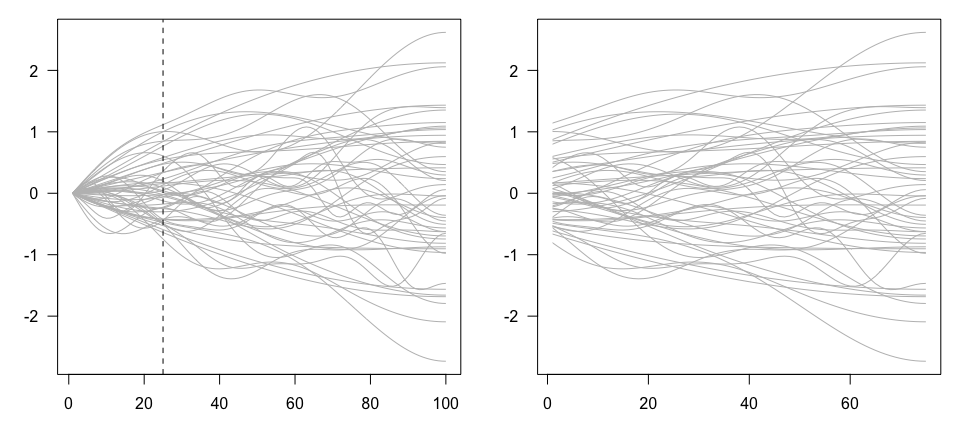

## 1.2 Detect all potential clusters

The function `find_all_cluster()` takes as argument the matrix of
Cartesian coordinates and returns all potential clusters. It returns a
list of size 2. The first element is a list with all the potential
clusters and the second element is a list with the complement of the
potential clusters.

If the geographical coordinates are given in Longitude/Latitude, we
recommend the user to transform them in an appropriate Coordinate
Reference System (see, for instance, <https://epsg.io>), using package
**sf**.

``` r
find_all_cluster <- function (Matcoord) {
  n <- nrow(Matcoord)
  Matdist <- as.matrix(dist(Matcoord, upper = TRUE))
  vecord_list <- vector("list", n)
  for (k in 1:n) {
    vecord_list[[k]] <- order(Matdist[, k])
  }
  res_cluster_g1 <- vector("list", 0)
  res_cluster_g2 <- vector("list", 0)
  
  matrix_g1 <- vector("list", n)

  for(k in 1:n) {
    matrix_g1[[k]] <- rep(0, n)
  }
  
  nb_combi <- 0
  for (k in 1:(n-1)) {
    for (j in 1:n) {
      temp_1 <- vecord_list[[j]][1:k]
      temp_2 <- vecord_list[[j]][(k+1):n]

      my_vec <- my_vec_2 <-numeric(n)
      my_vec[temp_1] <- 1
      my_vec_2[temp_2] <- 1
      # my_length <- k
      cond_1 <-  any(matrix_g1[[k]] %*% my_vec == k)
      cond_2 <-  any(matrix_g1[[n-k]] %*% my_vec_2 == n-k)
        
      if (!(any(cond_1) | any(cond_2))) {
        nb_combi <- nb_combi + 1
        res_cluster_g1[[nb_combi]] <- temp_1
        res_cluster_g2[[nb_combi]] <- temp_2
        matrix_g1[[k]] <- rbind(matrix_g1[[k]], my_vec)
    #    matrix_g2[[n-k]] <- rbind(matrix_g2[[n-k]], rep(1, n) - my_vec)
      }
    }
  }
  cat("Number of unique combination: ", nb_combi, "\n")
  return(list(vec_g1 = res_cluster_g1,
              vec_g2 = res_cluster_g2))
}
```

**Example:** we consider a random spatial point process with 50
observations.

``` r
set.seed(1)
matCoord <- cbind(runif(nobs), runif(nobs))
plot(matCoord, xlab = "x", ylab = "y", asp = 1)
```

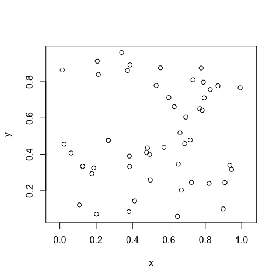

We compute all potentially spatial clusters:

``` r
my_pairs_ex <- find_all_cluster(matCoord)
```

    ## Number of unique combination:  1644

**Remark**: once the potential clusters have been identified, this
allows us to test 1644 combinations instead of $50\times 49=2450$.

## 1.3 Representation of a circle in a map

The function `draw.circle()` returns the coordinates of a circle of
radius `radius` and centered around coordinates `x` and `y`:

``` r
draw.circle <- function (x, y, radius, nv = 100) {
  ymult <- 1
  angle.inc <- 2 * pi/nv
  angles <- seq(0, 2 * pi - angle.inc, by = angle.inc)
  for (circle in 1:length(radius)) {
    xv <- cos(angles) * radius[circle] + x
    yv <- sin(angles) * radius[circle] * ymult + y
  }
  invisible(list(x = xv, y = yv))
}
```

**Example**: we consider a fictitious cluster $C$ of size eight in the
data created previously. The cluster is centered around the observation
50 and contains the eight closest observations to observation 50. The
radius of the cluster is the distance between the observation 50 and the
last observation in the cluster (observation 13).

``` r
my_cluster <- c(50, 9, 15, 8, 43, 17, 32, 13)
my_dist <- dist(matCoord[c(50, 13), ])
```

``` r
plot(matCoord, xlab = "x", ylab = "y", asp = 1)
points(matCoord[my_cluster, ], pch = 16, col = "red")
temp_plot <- draw.circle(matCoord[50, 1], matCoord[50, 2], 
                         my_dist, nv = 100)
lines(temp_plot, col = "red")
```

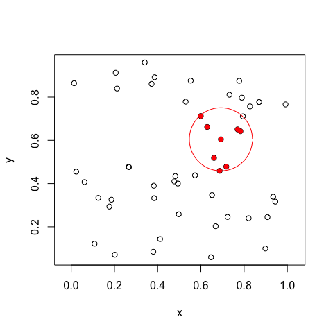

For the rest of this section, we modify the functional data of the
fictitious cluster. We apply a shift $\Delta_2(t)=ct(1-t)$, with $c=2$.
We aim to detect the cluster by using several methods.

``` r
t.disc <- (1:75) / (75)
for(k in 1:8)
  X[, my_cluster[k]] <- X[, k] + 2 * t.disc
```

``` r
par(oma = c(0, 0, 0, 0), mar = c(3, 3, 1, 1), las = 1, mfrow = c(1, 2))
# The function
matplot(X, type = "l", lty = 1, col ="grey")
matplot(X[, my_cluster], type = "l", lty = 1, col ="red", add = T)
# The map
plot(matCoord, xlab = "x", ylab = "y", asp = 1)
points(matCoord[my_cluster, ], pch = 16, col = "red")
lines(temp_plot, col = "red")
```

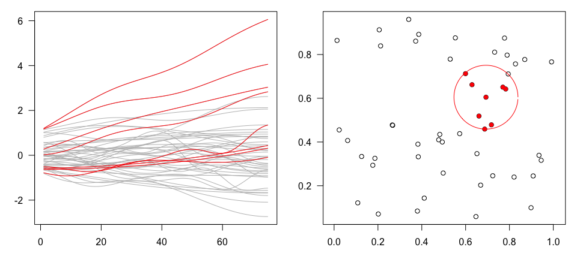

## 1.4 Package HDSpatialScan

The function `SpatialScan()` from package `HDSpatialScan` (Frévent et
al, 2021) can be used to compute various methods. It takes as main
arguments the name(s) of the method, the spatial coordinates and the
functional data of the observations. Additional parameters may be used,
like the minimum/maximum size of the cluster to be detected, the number
of replications to be used to compute the significance, etc.

For instance, to compute the four methods (“DFFSS”, “PFSS”, “NPFSS”,
“HFSS”), the function `SpatialScan()` can be used like this:

``` r
fss_result <- HDSpatialScan::SpatialScan(c("NPFSS", "PFSS", "DFFSS", "Horvath"),
        t(X), sites_coord = matCoord, mini = 1, maxi = 49,
        system = "Euclidean", MC=99, typeI = 0.25)
```

For practical reasons, we implement our own functions and use them in
our simulation framework.

## 1.5 Functions for Scan Statistic

We implement the functions `compute_np()`, `compute_p()`,
`compute_dffss()` and `compute_h()`, that correspond to the four methods
“NPFSS”, “PFSS”, “DFFSS”, “HFSS”. Each function takes as argument the
list of the possible cluster `c1` (resp. the complement of the possible
cluster `c2`) and the functional data `my_mat`. They return the value of
the test statistic that was the largest among all the possible
combination. They also return the associated cluster. The functions used
are available in the file
[functions_to_cluster.R](functions_to_cluster.R)

``` r
source("codes/functions_to_cluster.R")
```

### 1.5.1 Non Parametric NPFSS method

To compute the result of the NPFSS method, we use the function
`compute_np()`. We obtain the following value of statistic and
associated cluster.

``` r
res_np <- compute_np(my_pairs_ex[[1]], my_pairs_ex[[2]], X)
res_np
```

    ## $stat
    ## [1] 1.592877
    ## 
    ## $vec
    ##  [1] 10 47 24 34 12  1 25 38 28 14  5 48 31 33 40 19 22 27 16  3 11  2 26 23 45
    ## [26]  8 32 30  9 13 36 17 50 44 42 39 15 43 41 49 37 46 35 20  4

The detected cluster contains 45 observations. To compute the
significance, we make $B$ permutations on the data and compute the
number of times the scan statistic is lower than the observed one:

``` r
p_value_np <- 0
B <- 99
pb <- progress_bar$new(total = B)

for(b in 1:B) {
  pb$tick()
  perm <- sample(ncol(X))
  MatXsim <- X[, perm]
  temp <- compute_np(my_pairs_ex[[1]], my_pairs_ex[[2]], MatXsim)
  p_value_np <- p_value_np + (res_np$stat < temp$stat)
}
cat("p-value: ", p_value_np / 100)
```

    ## p-value:  0.33

In this example, the cluster detected by the method NPFSS is not
significant.

### 1.5.2 Parametric PFSS

To compute the result of the PFSS method, we use the function
`compute_p()`.

``` r
res_p <- compute_p(my_pairs_ex[[1]], my_pairs_ex[[2]], X)
res_p
```

    ## $stat
    ## [1] 25.85029
    ## 
    ## $vec
    ## [1]  8 13

The cluster detected contains 2 observations. To compute the
significance, we make $B$ permutations on the data and compute the
number of times the scan statistic is lower than the observed one:

``` r
p_value_p <- 0
B <- 99
pb <- progress_bar$new(total = B)

for(b in 1:B) {
  pb$tick()
  perm <- sample(ncol(X))
  MatXsim <- X[, perm]
  temp <- compute_p(my_pairs_ex[[1]], my_pairs_ex[[2]], MatXsim)
  p_value_p <- p_value_p + (res_p$stat < temp$stat)
}
p_value_p / 100
```

    ## p-value:  0.03

The detected cluster is significant. Among the 2 observations, 2 belongs
to the real cluster.

### 1.5.3 Method DFFSS

To compute the result of the DFFSS method, we use the function
`compute_dffss()`.

``` r
res_dffss <- compute_dffss(my_pairs_ex[[1]], my_pairs_ex[[2]], X)
res_dffss
```

    ## $stat
    ## [1] 5.469082
    ## 
    ## $vec
    ## [1]  8 13

The detected cluster contains 2 observations. To compute the
significance, we make $B$ permutations on the data and compute the
number of times the scan statistic is lower than the observed one:

``` r
p_value_dffss <- 0
B <- 99
pb <- progress_bar$new(total = B)

for(b in 1:B) {
  pb$tick()
  perm <- sample(ncol(X))
  MatXsim <- X[, perm]
  temp <- compute_dffss(my_pairs_ex[[1]], my_pairs_ex[[2]], MatXsim)
  p_value_dffss <- p_value_dffss + (res_dffss$stat < temp$stat)
}
p_value_dffss / 100
```

    ## p-value:  0.03

The detected cluster is significant. Among the 2 observations, 2 belongs
to the real cluster.

### 1.5.4 Method Horvath/Hotelling

To compute the result of the Horvath/Hotelling method, we use the
function `compute_h()`. An additional argument allows to select the
value of $d$, corresponding to the number of eigen vectors in the
formula $\displaystyle\sum_{k=1}^d\frac{a_k^2}{\lambda_k}$.

The choice of $d$ has a strong role on the result. For instance, if $d$
equals the number of measurements (i.e. 75 in our example), we remark
that the statistic test is abnormally huge and the detected cluster
contains only one observation (which is a False Positive).

This is due to numerical precision errors obtained for the small eigen
values. Indeed, when $k$ becomes large, we divide a term very small (and
sometimes even negative like in the order of $-10^{-16}$) by another
term also very small. In that case, the numerical precision errors
explain why we obtain a result that can tend to +/- infinity.

One solution proposed for choosing the value $d$ is to use the
cumulative percentage of total variance (CPV) criteria (see for
instance, Joseph, Galeano and Lilo, 2015. The CPV is defined as follow :
$CPV(k)=\frac{\displaystyle\sum_{j=1}^k\lambda_j}{\displaystyle\sum_{j=1}^{npoints}\lambda_j}$.
Then, we select the value of $d$ as the value of $k$ from which the
function CPV grows very slowly to 1.

The argument `plot_eigen` allows to plot CPV of the function
`compute_h()`. Here, we recommend choosing $d=5$ which leads to explain
more than $99.8\%$.

**Example** when $d=npoints$:

``` r
res_h <- compute_h(my_pairs_ex[[1]], my_pairs_ex[[2]], X, d = npoints,
                           plot_eigen = T)
```

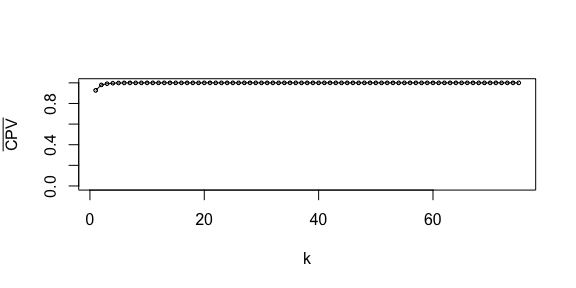

    ## Variance explained in % by the 10 first components:  92.7 98.02 99.14 99.62 99.87 99.93 99.97 99.99 100 100

``` r
res_h
```

    ## $stat
    ## [1] 3.021964e+12
    ## 
    ## $vec
    ## [1] 20

**Example** when $d=5$:

``` r
res_h <- compute_h(my_pairs_ex[[1]], my_pairs_ex[[2]], X, d = 5)
res_h
```

    ## $stat
    ## [1] 42.26277
    ## 
    ## $vec
    ## [1] 50  9 15  8 43 17 32 13

To compute the significance, we make $B$ permutations on the data and
compute the number of times the scan statistic is lower than the
observed one:

``` r
p_value_h <- 0
B <- 99
pb <- progress_bar$new(total = B)

for(b in 1:B) {
  pb$tick()
  perm <- sample(ncol(X))
  MatXsim <- X[, perm]
  temp <- compute_h(my_pairs_ex[[1]], my_pairs_ex[[2]], MatXsim,
                               k = 5)
  p_value_h <- p_value_h + (res_h$stat < temp$stat)
}
p_value_h / 100
```

    ## p-value:  0.02

The detected cluster is significant. Among the 8 observations, 8 belongs
to the real cluster.

**Improving computational time**: if `plot_eigen=T`, the spectral
decomposition of the covariance matrix is done with the function
`eigen()`. It means that all the eigen values/eigen vectors are
computed. If `plot_eigen=F`, we use the function `eigs_sym()` from
package **rARPACK** that allows to compute only the $d$ first eigen
values/eigen vectors. It improves the computation time by a factor 3.

# 2 Simulation part

## 2.1 The spatial data

We import first the contours of the French departments:

``` r
dep <- read_sf("data/departements.geojson")
dep <- dep[!dep$code %in% c("2A", "2B"), ]
dep <- dep[order(dep$code), ]
my_region <- st_union(dep)
nc_osm <- get_tiles(dep, provider = "Esri.WorldShadedRelief", 
                      zoom = 7, crop = T)
```

Then, we compute the Cartesian coordinates of the centroids of the
departments in the official French Coordinates Reference System (CRS
2154), such that the distances between locations are computed in meters.

``` r
my_proj <- 2154
dep_proj <- st_transform(dep, 2154)
Matcoord <- st_coordinates(st_centroid(dep_proj))
dist_proj <- as(dist(Matcoord), "matrix")
```

We show the departments located around the city of Paris (74, 92, 91,
93, 77, 90, 94, 76) that will be simulated differently from the rest of
the departments, such that they represent the cluster we would like to
detect.

``` r
cols = c("#D35C79", "#009593")
# id of the cluster
vecclus <- c(74, 92, 91, 93, 77, 90, 94, 76)
# graphical parameters
col_geo <- rep(rgb(0.9, 0.9, 0.9, alpha = 0.1), nrow(Matcoord))
col_geo[vecclus] <- alpha(cols[1], 0.8)
```

``` r
#pdf("figures/french_cluster.pdf", width = 7, height = 7)
par(oma = c(0, 0, 0, 0), mar = c(0, 0, 0, 0))
plot_tiles(nc_osm, adjust = T)
mf_shadow(st_geometry(st_union(dep[vecclus, ])), add = T, cex = 0.5)
plot(st_geometry(dep), border = "white", col = col_geo,  
     add = T, lwd = 0.1)
plot(st_geometry(my_region), add = T, lwd = 0.5)
```

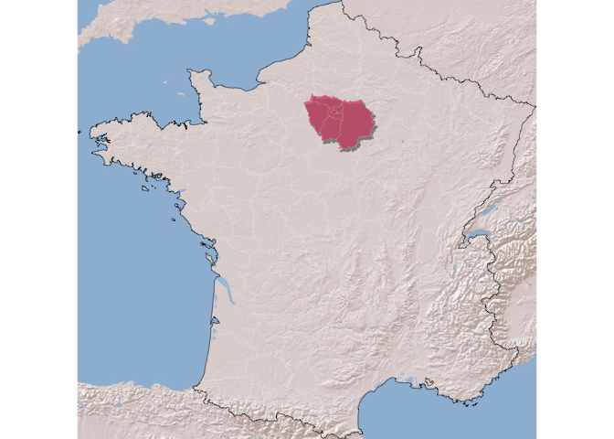

``` r
#text(par()$usr[1] + 0.03 * (par()$usr[2] - par()$usr[1]), 
#     par()$usr[4] - 0.07 * (par()$usr[4] - par()$usr[3]), 
#     labels = "A)", pos = 4, cex = 2)
#dev.off()
```

## 2.2 The different shifts/probabilistic models

We consider three types of shift:

- $\Delta_1(t)=ct$,
- $\Delta_2(t)=ct(1-t)$,
- $\Delta_3(t)=c\exp(-100(t-0.5)^2)/3$,

and four different probabilistic models $Z_{i,k}/\sigma_k$:

- a Gaussian $N(0,1)$,
- a Student $t(4)$
- a Chi $\chi^2(4)$
- an Exponential $e(4)$

with $i=1,\ldots,94$ and $t=1,\ldots,200$. The first 100 simulations are
not kept to give time for the process to converge. For each combination
shift/probabilistic, we consider different values of $c$.

``` r
nobs <- nrow(Matcoord)
npoints <- 100
ndrop <- 100
t.disc <- (1:(npoints)) / (npoints) 
veccluster <- rep(0, nobs)
veccluster[vecclus] <- 1 
```

For $c=3$, we plot an example of simulations for each of the combination
shift/probabilistic model:

``` r
alpha <- 10
X_aggregated <- data.frame(
  x = integer(),
  y = numeric(), 
  shift = character(),
  proba = character()
) 
for(type_shift in 2:4) {
  for(shape in c("gauss", "student", "chisq", "exp")) {
    X <- matrix(0, npoints+ndrop, nobs)
    for (k in 1:nobs) {
      X[, k] <- simulvec(npoints+(ndrop-1), shape = shape) 
      if(type_shift == 1) {
        X[(ndrop+1):nrow(X), k] <- X[(ndrop+1):nrow(X), k] + alpha * (veccluster[k] == 1)
        } else {
          if (type_shift == 2) {
            alpha <- 3
            X[(ndrop+1):nrow(X), k] <- X[(ndrop+1):nrow(X), k] + alpha * t.disc * (veccluster[k] == 1)
            } else {
              if (type_shift == 3) {
                alpha <- 10
                X[(ndrop+1):nrow(X), k] <- X[(ndrop+1):nrow(X), k] + alpha * t.disc * (1 - t.disc) * (veccluster[k] == 1)
                } else {
                  alpha <- 10
                  X[(ndrop+1):nrow(X), k] <- X[(ndrop+1):nrow(X), k] + alpha * exp(-100 * (t.disc - 0.5) ^ 2) / 3 * (veccluster[k] == 1)
                }
            }
        }
    }
    # drop first observation 
    X <- X[-(1:ndrop), ]
    # aggregate data 
    X_aggregated <- rbind(X_aggregated,
                          data.frame(
                            x = seq(0, 1, length.out = 100),
                            y = as.vector(X), 
                            shift = type_shift,
                            proba = shape,
                            id = rep(1:94, each = 100)
                          ))
  }
}
X_aggregated$shift <- factor(X_aggregated$shift) 
levels(X_aggregated$shift) = c(`2` = TeX("$\\Delta_1(t)$"), 
                               `3` = TeX("$\\Delta_2(t)$"), 
                               `4` = TeX("$\\Delta_3(t)$"))
X_aggregated$Cluster <- factor(ifelse(X_aggregated$id %in% vecclus, "Yes", "No"),
                               levels = c("No", "Yes"))
X_aggregated$proba <- factor(X_aggregated$proba, levels = c("gauss", "student", "chisq", "exp"))
levels(X_aggregated$proba) <- c(`gauss` = TeX("$N(0,1)$"), 
                                `student` = TeX("$t(4)$"), 
                                `exp` = TeX("$Exp(4)$"),
                                `chisq` = TeX("$\\chi^2(4)$"))
```

- $\Delta_1(t)=ct$,
- $\Delta_2(t)=ct(1-t)$,
- $\Delta_3(t)=c\exp(-100(t-0.5)^2)/3$,

``` r
temp <- X_aggregated[order(as.numeric(X_aggregated$Cluster), X_aggregated$id),]
X_aggregated %>%
  ggplot(aes(x = x, y = y, color = Cluster)) +
  geom_line(aes(group = id)) +
  theme_bw() +
  theme(strip.background = element_rect(color = "black", fill = alpha("#EE9E94", 0.1))) +
  facet_grid(rows=vars(proba),
  cols=vars(shift),
  labeller=label_parsed,
  scales = "free") +
      scale_colour_manual(values = c("grey", "tomato2")) +
  xlab(TeX("$t$")) +
  ylab(TeX("$X_i(t)$"))
```

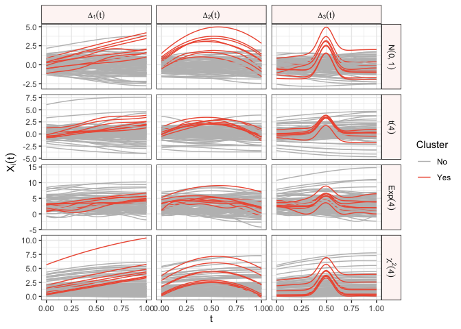

``` r
ggsave("figures/simu.pdf", width = 10, height = 8)
```

## 2.3 Results

We used a server with 94 cores and launched on each core a unique
parameter set shift/probabilistic model/value of $c$. The computation
time was around 7 days. We repeated the following procedure on each
core:

``` r
parms_df <- rbind(
  # line 1 
  data.frame(
    shape = "gauss", type_shift = 2, alpha = seq(0, 3, 0.5), sizeclust = 8),
  data.frame(
    shape = "gauss", type_shift = 3, alpha = seq(0, 10.5, 1.5), sizeclust = 8),
  data.frame(
    shape = "gauss", type_shift = 4, alpha = seq(0, 12, 2), sizeclust = 8),  
  # line 2
  data.frame(
    shape = "student", type_shift = 2, alpha = seq(0, 7, 1), sizeclust = 8),
  data.frame(
    shape = "student", type_shift = 3, alpha = seq(0, 14, 2), sizeclust = 8),
  data.frame(
    shape = "student", type_shift = 4, alpha = seq(0, 14, 2), sizeclust = 8),  
  # line 3
  data.frame(
    shape = "chisq", type_shift = 2, alpha = seq(0, 14, 2), sizeclust = 8),
  data.frame(
    shape = "chisq", type_shift = 3, alpha = seq(0, 14, 2), sizeclust = 8),
  data.frame(
    shape = "chisq", type_shift = 4, alpha = seq(0, 14, 2), sizeclust = 8),  
  # line 4
  data.frame(
    shape = "exp", type_shift = 2, alpha = seq(0, 7, 1), sizeclust = 8),
  data.frame(
    shape = "exp", type_shift = 3, alpha = seq(0, 14, 2), sizeclust = 8),
  data.frame(
    shape = "exp", type_shift = 4, alpha = seq(0, 14, 2), sizeclust = 8)
)
```

Repeat 200 times:

- simulate a set of functional data (with a shift on the Paris region),
- compute the scan statistic for the following methods: “HFSS”, “PFSS”,
  “NPFSS”, “DFFSS”,
- draw 199 permutation samples, and compute the scan statistics on each
  of them to obtain significance.

From the significance and the detected clusters, we compute:

- the power,
- the percentage of True Positive,
- the percentage of False Negative.

For the Horvath/Hotelling method, for reasons of simplification, we fix
the value of $d=5$ which leads to explain more or less $99\%$ of the
variance.

The codes used are given in the files
[batch_cluster_size_8.R](codes/batch_cluster_size_8.R), by using the
functions in [functions_to_cluster.R](codes/functions_to_cluster.R).

We present the results in a format that can be easily represented in a
graph:

``` r
power_to_plot <- data.frame(
  shape = character(0),
  type_shift = integer(0),
  alpha = numeric(0)
)
nb_est <- 10
for(k in 1:nrow(parms_df)) {
  power_to_plot <- rbind(
    power_to_plot,
    parms_df[rep(k, nb_est), 1:3])
}
power_to_plot$method <- c("DFFSS", "PFSS", "NPFSS", "hotelling_1", "hotelling_2", 
                          "hotelling_3", "hotelling_4", "HFSS", "hotelling_10", 
                          "hotelling_15")
FP_to_plot <- TP_to_plot <- power_to_plot

for(k in 1:length(res_par_1)) {
  power_to_plot$value[(1:nb_est)+(k-1)*nb_est] <- (res_par_1[[k]]$power + res_par_2[[k]]$power + 
                                                     res_par_3[[k]]$power + res_par_4[[k]]$power) / 200 # res.final$power / 100 # 
  TP_to_plot$value[(1:nb_est)+(k-1)*nb_est] <- (res_par_1[[k]]$nTP + res_par_2[[k]]$nTP + 
                                                  res_par_3[[k]]$nTP + res_par_4[[k]]$nTP) /  
    (res_par_1[[k]]$power + res_par_2[[k]]$power + res_par_3[[k]]$power + res_par_4[[k]]$power) / 8 # res.final$nTP / res.final$power / 8 # 
  FP_to_plot$value[(1:nb_est)+(k-1)*nb_est] <- (res_par_1[[k]]$nFP + res_par_2[[k]]$nFP + 
                                                  res_par_3[[k]]$nFP + res_par_4[[k]]$nFP) /  
    (res_par_1[[k]]$power + res_par_2[[k]]$power + res_par_3[[k]]$power + res_par_4[[k]]$power) / 86 #res.final$nFP / res.final$power / 8 # res_par[[k]]$nFP / res_par[[k]]$power / 8
}
power_to_plot$criteria <- "power"
TP_to_plot$criteria <- "TP"
FP_to_plot$criteria <- "FP"
to_plot <- rbind(power_to_plot, TP_to_plot, FP_to_plot)
# we select the most interseting points
parms_df_select <- rbind(
  # line 1 
  data.frame(
    shape = "gauss", type_shift = 2, alpha = seq(0, 3, 0.5)[-2], sizeclust = 8),
  data.frame(
    shape = "gauss", type_shift = 3, alpha = seq(0, 10.5, 1.5)[-c(2, 8)], sizeclust = 8),
  data.frame(
    shape = "gauss", type_shift = 4, alpha = seq(0, 12, 2)[-2], sizeclust = 8),  
  # line 2
  data.frame(
    shape = "student", type_shift = 2, alpha = seq(0, 7, 1)[-c(2, 8)], sizeclust = 8),
  data.frame(
    shape = "student", type_shift = 3, alpha = seq(0, 14, 2)[-c(2, 8)], sizeclust = 8),
  data.frame(
    shape = "student", type_shift = 4, alpha = seq(0, 14, 2)[-c(2, 8)], sizeclust = 8),  
  # line 3
  data.frame(
    shape = "chisq", type_shift = 2, alpha = seq(0, 14, 2)[-c(2, 8)], sizeclust = 8),
  data.frame(
    shape = "chisq", type_shift = 3, alpha = seq(0, 14, 2)[-c(2, 8)], sizeclust = 8),
  data.frame(
    shape = "chisq", type_shift = 4, alpha = seq(0, 14, 2)[-c(2, 8)], sizeclust = 8),  
  # line 4
  data.frame(
    shape = "exp", type_shift = 2, alpha = seq(0, 7, 1)[-c(2, 8)], sizeclust = 8),
  data.frame(
    shape = "exp", type_shift = 3, alpha = seq(0, 14, 2)[-c(2, 8)], sizeclust = 8),
  data.frame(
    shape = "exp", type_shift = 4, alpha = seq(0, 14, 2)[-c(2, 8)], sizeclust = 8)
)
to_plot <- merge(parms_df_select, to_plot, by = c("shape", "type_shift", "alpha"))
# we give labels
to_plot$type_shift <- factor(to_plot$type_shift) 
levels(to_plot$type_shift) = c(`2` = TeX("$\\Delta_1(t)$"), # TeX("$\\Delta_1(t)=ct$"), 
                         `3` = TeX("$\\Delta_2(t)$"),  # TeX("$\\Delta_2(t)=ct(1-t)$"), 
                         `4` = TeX("$\\Delta_3(t)$")) #  TeX("$\\Delta_3(t)=\\frac{c}{3}\\exp(-100(t-0.5)^2)$"))
to_plot$shape <- factor(to_plot$shape, levels = c("gauss", "student", "exp", "chisq"))
levels(to_plot$shape) <- c(`gauss` = TeX("$N(0,1)$"), 
                                `student` = TeX("$t(4)$"), 
                                `exp` = TeX("$Exp(4)$"),
                                `chisq` = TeX("$\\chi^2(4)$"))
to_plot$method <- factor(to_plot$method, c("HFSS", "DFFSS", "PFSS", "NPFSS"))
```

### 2.3.1 Power

``` r
to_plot %>%
  filter(criteria == "power") %>%
   filter(method %in% c("DFFSS", "PFSS", "NPFSS", "HFSS")) %>%
  ggplot(aes(x = alpha, y = value, color = method)) +
  geom_line(data = to_plot %>% 
              filter(criteria == "power") %>%
              filter(method %in% c("DFFSS", "PFSS", "NPFSS", "HFSS")), 
            aes(group = method)) +
  geom_point(size = 0.8, pch = 15) +
  ggh4x::facet_grid2(rows=vars(shape),
  cols=vars(type_shift),
  labeller=label_parsed, scales = "free_x", independent = "x")  +
  theme_bw()
```

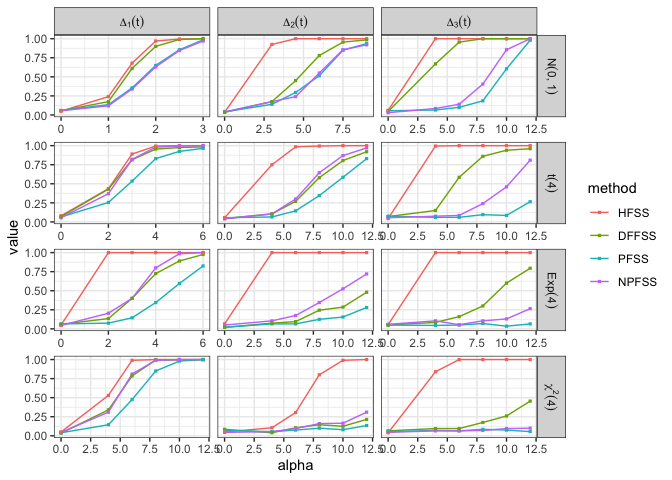

``` r
# ggsave("figures/simu_8_power.pdf", width = 9, height = 8)
```

When the probabilistic model is from the Exponential distribution, the
method “HFSS” dramatically improves the power for any shift. When the
probabilistic distribution belongs to Normal, Student or $\chi^2$, the
method “HFSS” behaves slightly better for $\Delta_1$ and much better for
$\Delta_2$ and $\Delta_3$.

### 2.3.2 True Positive

``` r
to_plot %>%
  filter(criteria == "TP") %>%
  filter(alpha != 0) %>%
   filter(method %in% c("DFFSS", "PFSS", "NPFSS", "HFSS")) %>%
  ggplot(aes(x = alpha, y = value, color = method)) +
  geom_line(data = to_plot %>% 
              filter(criteria == "TP") %>%
              filter(method %in% c("DFFSS", "PFSS", "NPFSS", "HFSS")) %>%
              filter(alpha != 0), 
            aes(group = method)) +
  geom_point(size = 1, pch = 15, alpha = 0) +
  geom_point(data = to_plot %>% 
              filter(criteria == "TP") %>%
              filter(method %in% c("DFFSS", "PFSS", "NPFSS", "HFSS")) %>%
              filter(alpha != 0),
             size = 0.8, pch = 15) +
  ggh4x::facet_grid2(rows=vars(shape),
  cols=vars(type_shift),
  labeller=label_parsed, scales = "free_x", independent = "x") +
  theme_bw()
```

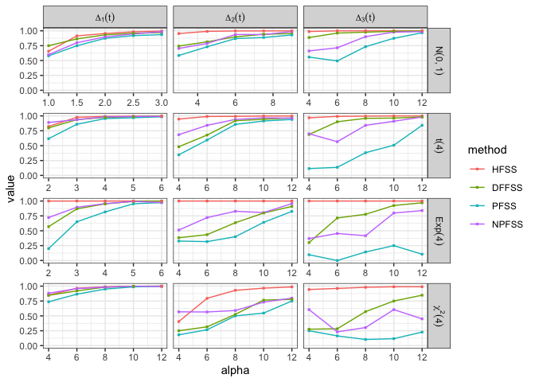

``` r
#ggsave("figures/simu_8_TP.pdf", width = 9, height = 8)
```

The percentage of True positive with the method “HFSS”, tends to be
better for any situations, excepted for $\Delta_1$, when the
probabilistic model is Gaussian or Student. In that case, the percentage
of TP is slightly for small values of $c$.

### 2.3.3 False Positive

``` r
to_plot %>%
  filter(criteria == "FP") %>%
  filter(alpha != 0) %>%
   filter(method %in% c("DFFSS", "PFSS", "NPFSS", "HFSS")) %>%
  ggplot(aes(x = alpha, y = value, color = method)) +
  geom_line(data = to_plot %>% 
              filter(criteria == "FP") %>%
              filter(method %in% c("DFFSS", "PFSS", "NPFSS", "HFSS")) %>%
              filter(alpha != 0), 
            aes(group = method)) +
  geom_point(size = 1, pch = 15, alpha = 0) +
  geom_point(data = to_plot %>% 
              filter(criteria == "FP") %>%
              filter(method %in% c("DFFSS", "PFSS", "NPFSS", "HFSS")) %>%
              filter(alpha != 0),
             size = 0.8, pch = 15) +
  ggh4x::facet_grid2(rows=vars(shape),
  cols=vars(type_shift),
  labeller=label_parsed, scales = "free_x", independent = "x")  +
  theme_bw()
```

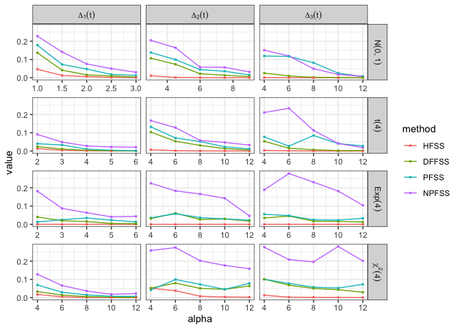

``` r
#ggsave("figures/simu_8_FP.pdf", width = 9, height = 8)
```

The percentage of False positive with the method “HFSS”, tends to be
better for any shift/probabilistic model.

### 2.3.4 Delta 1

``` r
threshold <- data.frame(
  yintercept = c(0.05, NA, NA), 
  criteria = factor(c("power", "TP", "FP"), levels = c("power", "TP", "FP")))
to_plot$criteria <- factor(to_plot$criteria, levels = c("power", "TP", "FP"))
to_plot2 <- to_plot[-which(to_plot$alpha == 0 & to_plot$criteria == "TP"), ]
to_plot2 <- to_plot2[-which(to_plot2$alpha == 0 & to_plot2$criteria == "FP"), ]
to_plot2 %>%
  filter(type_shift == "Delta[1](t)") %>%
  filter(method %in% c("DFFSS", "PFSS", "NPFSS", "HFSS")) %>%
  ggplot(aes(x = alpha, y = value, color = method)) +
  geom_line(data = to_plot2 %>% 
              filter(type_shift == "Delta[1](t)") %>%
              filter(method %in% c("DFFSS", "PFSS", "NPFSS", "HFSS")), 
            aes(group = method)) +
  geom_point(size = 0.8, pch = 15) +
  geom_hline(data = to_plot2 %>% filter(criteria == "power"), 
               aes(yintercept = 0.05, 
                 linetype = "0.05")) +
  ggh4x::facet_grid2(rows=vars(criteria),
                     cols=vars(shape),
                     labeller=label_parsed,
                     scales = "free", 
                     axes = "margins")  +
  theme_bw() +
  xlab(TeX("$\\alpha$")) +
  ylab("") +
  ggtitle(TeX("$\\Delta_1$")) +
  theme(plot.title = element_text(hjust = 0.5),
        legend.position = "bottom") +
  scale_linetype_manual(name = "threshold", values = 2) +
  theme(strip.background = element_rect(colour = "black", 
        fill = alpha("#EE9E94", 0.1)))
```

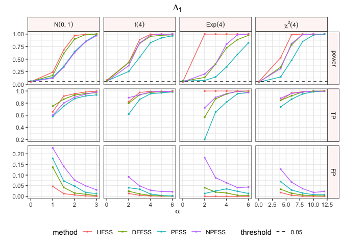

``` r
# ggsave("figures/simu_8_delta_1.pdf", width = 8, height = 6.5)
```

### 2.3.5 Delta 2

``` r
threshold <- data.frame(
  yintercept = c(0.05, NA, NA), 
  criteria = factor(c("power", "TP", "FP"), levels = c("power", "TP", "FP")))
to_plot$criteria <- factor(to_plot$criteria, levels = c("power", "TP", "FP"))
to_plot2 <- to_plot[-which(to_plot$alpha == 0 & to_plot$criteria == "TP"), ]
to_plot2 <- to_plot2[-which(to_plot2$alpha == 0 & to_plot2$criteria == "FP"), ]
to_plot2 %>%
  filter(type_shift == "Delta[2](t)") %>%
   # filter(alpha != 0 & criteria == "TP") %>%
   filter(method %in% c("DFFSS", "PFSS", "NPFSS", "HFSS")) %>%
  ggplot(aes(x = alpha, y = value, color = method)) +
  geom_line(data = to_plot2 %>% 
              filter(type_shift == "Delta[2](t)") %>%
              filter(method %in% c("DFFSS", "PFSS", "NPFSS", "HFSS")), 
            aes(group = method)) +
  geom_point(size = 0.8, pch = 15) +
#  geom_hline(aes(yintercept = yintercept, 
#                 linetype = criteria), data = threshold,
#             linetype = 2) +
    geom_hline(data = to_plot2 %>% filter(criteria == "power"), 
               aes(yintercept = 0.05, 
                 linetype = "0.05")) +
  ggh4x::facet_grid2(rows=vars(criteria),
                     cols=vars(shape),
                     labeller=label_parsed,
                     scales = "free", 
                     axes = "margins")  +
  theme_bw() +
  xlab(TeX("$\\alpha$")) +
  ylab("") +
  ggtitle(TeX("$\\Delta_2$")) +
  theme(plot.title = element_text(hjust = 0.5),
        legend.position = "bottom") +
  scale_linetype_manual(name = "threshold", values = 2) +
  theme(strip.background = element_rect(colour = "black", 
        fill = alpha("#EE9E94", 0.1)))
```

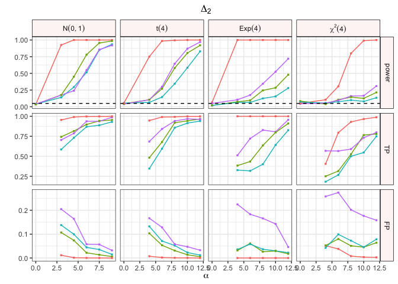

``` r
# ggsave("figures/simu_8_delta_2.pdf", width = 8, height = 6.5)
```

### 2.3.6 Delta 3

``` r
threshold <- data.frame(
  yintercept = c(0.05, NA, NA), 
  criteria = factor(c("power", "TP", "FP"), levels = c("power", "TP", "FP")))
to_plot$criteria <- factor(to_plot$criteria, levels = c("power", "TP", "FP"))
to_plot2 <- to_plot[-which(to_plot$alpha == 0 & to_plot$criteria == "TP"), ]
to_plot2 <- to_plot2[-which(to_plot2$alpha == 0 & to_plot2$criteria == "FP"), ]
to_plot2 %>%
  filter(type_shift == "Delta[3](t)") %>%
   # filter(alpha != 0 & criteria == "TP") %>%
   filter(method %in% c("DFFSS", "PFSS", "NPFSS", "HFSS")) %>%
  ggplot(aes(x = alpha, y = value, color = method)) +
  geom_line(data = to_plot2 %>% 
              filter(type_shift == "Delta[3](t)") %>%
              filter(method %in% c("DFFSS", "PFSS", "NPFSS", "HFSS")), 
            aes(group = method)) +
  geom_point(size = 0.8, pch = 15) +
#  geom_hline(aes(yintercept = yintercept, 
#                 linetype = criteria), data = threshold,
#             linetype = 2) +
    geom_hline(data = to_plot2 %>% filter(criteria == "power"), 
               aes(yintercept = 0.05, 
                 linetype = "0.05")) +
  ggh4x::facet_grid2(rows=vars(criteria),
                     cols=vars(shape),
                     labeller=label_parsed,
                     scales = "free", 
                     axes = "margins")  +
  theme_bw() +
  xlab(TeX("$\\alpha$")) +
  ylab("") +
  ggtitle(TeX("$\\Delta_3$")) +
  theme(plot.title = element_text(hjust = 0.5),
        legend.position = "bottom") +
  scale_linetype_manual(name = "threshold", values = 2) +
  theme(strip.background = element_rect(colour = "black", 
        fill = alpha("#EE9E94", 0.1)))
```

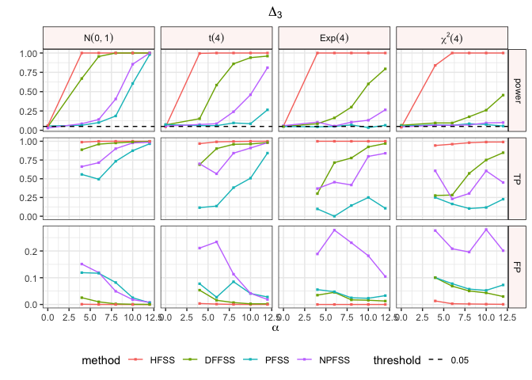

``` r
# ggsave("figures/simu_8_delta_3.pdf", width = 8, height = 6.5)
```

## 2.4 Checking Robustess

We apply the same procedure by varying the size of the cluster. We
consider a cluster of size 10. We added two more departments to the
previous list: 59, 27

``` r
# id of the cluster
vecclus <- c(74, 92, 91, 93, 77, 90, 94, 76, 59, 27)
# graphical parameters
col_geo <- rep(rgb(0.9, 0.9, 0.9, alpha = 0.1), nrow(Matcoord))
col_geo[vecclus] <- alpha("#D35C79", 0.8)
```

``` r
#pdf("figures/french_cluster_10.pdf", width = 7, height = 7)
par(oma = c(0, 0, 0, 0), mar = c(0, 0, 0, 0))
plot_tiles(nc_osm, adjust = T)
mf_shadow(st_geometry(st_union(dep[vecclus, ])), add = T, cex = 0.5)
plot(st_geometry(dep), border = "white", col = col_geo,  
     add = T, lwd = 0.1)
plot(st_geometry(my_region), add = T, lwd = 0.5)
```

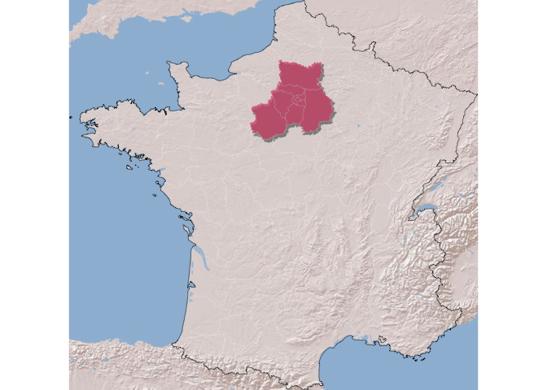

``` r
#text(par()$usr[1] + 0.03 * (par()$usr[2] - par()$usr[1]), 
#     par()$usr[4] - 0.07 * (par()$usr[4] - par()$usr[3]), 
#     labels = "B)", pos = 4, cex = 2)
#dev.off()
```

The interpretations are the same as in the previous section.

``` r
power_to_plot <- data.frame(
  shape = character(0),
  type_shift = integer(0),
  alpha = numeric(0)
)
nb_est <- 10
for(k in 1:nrow(parms_df)) {
  power_to_plot <- rbind(
    power_to_plot,
    parms_df[rep(k, nb_est), 1:3])
}
power_to_plot$method <- c("DFFSS", "PFSS", "NPFSS", "hotelling_1", "hotelling_2", 
                          "hotelling_3", "hotelling_4", "HFSS", "hotelling_10", 
                          "hotelling_15")
FP_to_plot <- TP_to_plot <- power_to_plot

for(k in 1:length(res_par_1)) {
  power_to_plot$value[(1:nb_est)+(k-1)*nb_est] <- (
    res_par_1[[k]]$power + res_par_2[[k]]$power +  
    res_par_3[[k]]$power  + res_par_4[[k]]$power) / 200 
  TP_to_plot$value[(1:nb_est)+(k-1)*nb_est] <- (
    res_par_1[[k]]$nTP + res_par_2[[k]]$nTP + 
      res_par_3[[k]]$nTP + res_par_4[[k]]$nTP) /  
    (res_par_1[[k]]$power + res_par_2[[k]]$power + 
       res_par_3[[k]]$power + res_par_4[[k]]$power) / 8 
  FP_to_plot$value[(1:nb_est)+(k-1)*nb_est] <- (
    res_par_1[[k]]$nFP + res_par_2[[k]]$nFP + 
      res_par_3[[k]]$nFP + res_par_4[[k]]$nFP) /  
    (res_par_1[[k]]$power + res_par_2[[k]]$power + 
       res_par_3[[k]]$power + res_par_4[[k]]$power) / 86 
}
power_to_plot$criteria <- "power"
TP_to_plot$criteria <- "TP"
FP_to_plot$criteria <- "FP"
to_plot <- rbind(power_to_plot, TP_to_plot, FP_to_plot)
# we select the most interseting points
parms_df_select <- rbind(
  # line 1
  data.frame(
    shape = "gauss", type_shift = 2, alpha = seq(0, 3, 0.5)[-c(2)], sizeclust = 10),
  data.frame(
    shape = "gauss", type_shift = 3, alpha = seq(0, 10.5, 1.5)[-c(2, 8)], sizeclust = 10),
  data.frame(
    shape = "gauss", type_shift = 4, alpha = seq(0, 12, 2)[-c(2, 8)], sizeclust = 10),
  # line 2
  data.frame(
    shape = "student", type_shift = 2, alpha = seq(0, 7, 1)[-c(2, 8)], sizeclust = 10),
  data.frame(
    shape = "student", type_shift = 3, alpha = seq(0, 14, 2)[-c(2, 8)], sizeclust = 10),
  data.frame(
    shape = "student", type_shift = 4, alpha = seq(0, 14, 2)[-c(2, 8)], sizeclust = 10),
  # line 3
  data.frame(
    shape = "chisq", type_shift = 2, alpha = seq(0, 14, 2)[-c(2, 8)], sizeclust = 10),
  data.frame(
    shape = "chisq", type_shift = 3, alpha = seq(0, 14, 2)[-c(2, 8)], sizeclust = 10),
  data.frame(
    shape = "chisq", type_shift = 4, alpha = seq(0, 14, 2)[-c(2, 8)], sizeclust = 10),
  # line 4
  data.frame(
    shape = "exp", type_shift = 2, alpha = seq(0, 7, 1)[-c(2, 8)], sizeclust = 10),
  data.frame(
    shape = "exp", type_shift = 3, alpha = seq(0, 14, 2)[-c(2, 8)], sizeclust = 10),
  data.frame(
    shape = "exp", type_shift = 4, alpha = seq(0, 14, 2)[-c(2, 8)], sizeclust = 10)
)
to_plot <- merge(parms_df_select, to_plot, by = c("shape", "type_shift", "alpha"))
# we give labels
to_plot$type_shift <- factor(to_plot$type_shift) 
levels(to_plot$type_shift) = c(`2` = TeX("$\\Delta_1(t)$"), # TeX("$\\Delta_1(t)=ct$"), 
                         `3` = TeX("$\\Delta_2(t)$"),  # TeX("$\\Delta_2(t)=ct(1-t)$"), 
                         `4` = TeX("$\\Delta_3(t)$")) #  TeX("$\\Delta_3(t)=\\frac{c}{3}\\exp(-100(t-0.5)^2)$"))
to_plot$shape <- factor(to_plot$shape, levels = c("gauss", "student", "exp", "chisq"))
levels(to_plot$shape) <- c(`gauss` = TeX("$N(0,1)$"), 
                                `student` = TeX("$t(4)$"), 
                                `exp` = TeX("$Exp(4)$"),
                                `chisq` = TeX("$\\chi^2(4)$"))
to_plot$method <- factor(to_plot$method, c("HFSS", "DFFSS", "PFSS", "NPFSS"))
```

### 2.4.1 Power

``` r
to_plot %>%
  filter(criteria == "power") %>%
   filter(method %in% c("DFFSS", "PFSS", "NPFSS", "HFSS")) %>%
  ggplot(aes(x = alpha, y = value, color = method)) +
  geom_line(data = to_plot %>% 
              filter(criteria == "power") %>%
              filter(method %in% c("DFFSS", "PFSS", "NPFSS", "HFSS")), 
            aes(group = method)) +
  geom_point(size = 0.8, pch = 15) +
  ggh4x::facet_grid2(rows=vars(shape),
  cols=vars(type_shift),
  labeller=label_parsed, scales = "free_x", independent = "x")
```


``` r
#ggsave("figures/simu_10_power.pdf", width = 9, height = 8)
```

### 2.4.2 True Positive

``` r
to_plot %>%
  filter(criteria == "TP") %>%
   filter(method %in% c("DFFSS", "PFSS", "NPFSS", "HFSS")) %>%
  ggplot(aes(x = alpha, y = value, color = method)) +
  geom_line(data = to_plot %>% 
              filter(criteria == "TP") %>%
              filter(method %in% c("DFFSS", "PFSS", "NPFSS", "HFSS")) %>%
              filter(alpha != 0), 
            aes(group = method)) +
  geom_point(size = 1, pch = 15, alpha = 0) +
  geom_point(data = to_plot %>% 
              filter(criteria == "TP") %>%
              filter(method %in% c("DFFSS", "PFSS", "NPFSS", "HFSS")) %>%
              filter(alpha != 0),
             size = 0.8, pch = 15) +
  ggh4x::facet_grid2(rows=vars(shape),
  cols=vars(type_shift),
  labeller=label_parsed, scales = "free_x", independent = "x")
```

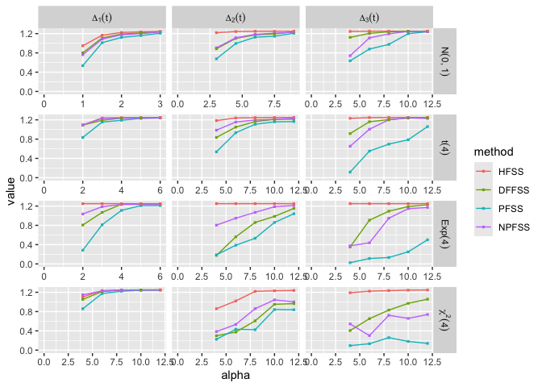

``` r
#ggsave("figures/simu_10_TP.pdf", width = 9, height = 8)
```

### 2.4.3 False Positive

``` r
to_plot %>%
  filter(criteria == "FP") %>%
   filter(method %in% c("DFFSS", "PFSS", "NPFSS", "HFSS")) %>%
  ggplot(aes(x = alpha, y = value, color = method)) +
  geom_line(data = to_plot %>% 
              filter(criteria == "FP") %>%
              filter(method %in% c("DFFSS", "PFSS", "NPFSS", "HFSS")) %>%
              filter(alpha != 0), 
            aes(group = method)) +
  geom_point(size = 1, pch = 15, alpha = 0) +
  geom_point(data = to_plot %>% 
              filter(criteria == "FP") %>%
              filter(method %in% c("DFFSS", "PFSS", "NPFSS", "HFSS")) %>%
              filter(alpha != 0),
             size = 0.8, pch = 15) +
  ggh4x::facet_grid2(rows=vars(shape),
  cols=vars(type_shift),
  labeller=label_parsed, scales = "free_x", independent = "x")
```

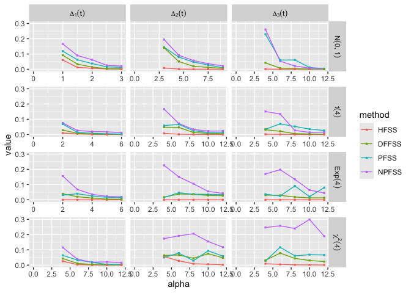

``` r
#ggsave("figures/simu_10_FP.pdf", width = 9, height = 8)
```

### 2.4.4 Delta 1

``` r
threshold <- data.frame(
  yintercept = c(0.05, NA, NA), 
  criteria = factor(c("power", "TP", "FP"), levels = c("power", "TP", "FP")))
to_plot$criteria <- factor(to_plot$criteria, levels = c("power", "TP", "FP"))
to_plot2 <- to_plot[-which(to_plot$alpha == 0 & to_plot$criteria == "TP"), ]
to_plot2 <- to_plot2[-which(to_plot2$alpha == 0 & to_plot2$criteria == "FP"), ]
to_plot2 %>%
  filter(type_shift == "Delta[1](t)") %>%
   # filter(alpha != 0 & criteria == "TP") %>%
   filter(method %in% c("DFFSS", "PFSS", "NPFSS", "HFSS")) %>%
  ggplot(aes(x = alpha, y = value, color = method)) +
  geom_line(data = to_plot2 %>% 
              filter(type_shift == "Delta[1](t)") %>%
              filter(method %in% c("DFFSS", "PFSS", "NPFSS", "HFSS")), 
            aes(group = method)) +
  geom_point(size = 0.8, pch = 15) +
#  geom_hline(aes(yintercept = yintercept, 
#                 linetype = criteria), data = threshold,
#             linetype = 2) +
    geom_hline(data = to_plot2 %>% filter(criteria == "power"), 
               aes(yintercept = 0.05, 
                 linetype = "0.05")) +
  ggh4x::facet_grid2(rows=vars(criteria),
                     cols=vars(shape),
                     labeller=label_parsed,
                     scales = "free", 
                     axes = "margins")  +
  theme_bw() +
  xlab(TeX("$\\alpha$")) +
  ylab("") +
  ggtitle(TeX("$\\Delta_1$")) +
  theme(plot.title = element_text(hjust = 0.5),
        legend.position = "bottom") +
  scale_linetype_manual(name = "threshold", values = 2) +
  theme(strip.background = element_rect(colour = "black", 
        fill = alpha("#EE9E94", 0.1)))
```

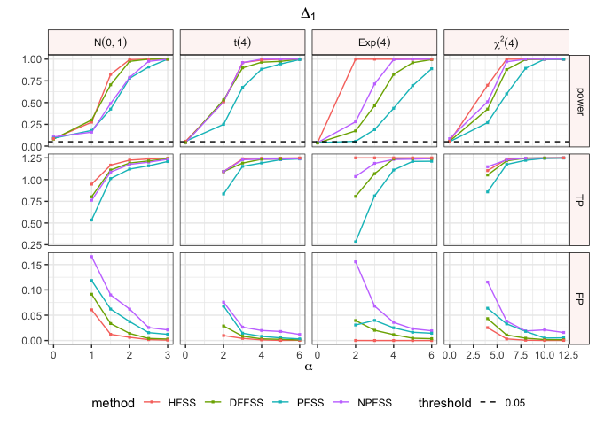

``` r
#ggsave("figures/simu_10_delta_1.pdf", width = 8, height = 6.5)
```

### 2.4.5 Delta 2

``` r
threshold <- data.frame(
  yintercept = c(0.05, NA, NA), 
  criteria = factor(c("power", "TP", "FP"), levels = c("power", "TP", "FP")))
to_plot$criteria <- factor(to_plot$criteria, levels = c("power", "TP", "FP"))
to_plot2 <- to_plot[-which(to_plot$alpha == 0 & to_plot$criteria == "TP"), ]
to_plot2 <- to_plot2[-which(to_plot2$alpha == 0 & to_plot2$criteria == "FP"), ]
to_plot2 %>%
  filter(type_shift == "Delta[2](t)") %>%
   # filter(alpha != 0 & criteria == "TP") %>%
   filter(method %in% c("DFFSS", "PFSS", "NPFSS", "HFSS")) %>%
  ggplot(aes(x = alpha, y = value, color = method)) +
  geom_line(data = to_plot2 %>% 
              filter(type_shift == "Delta[2](t)") %>%
              filter(method %in% c("DFFSS", "PFSS", "NPFSS", "HFSS")), 
            aes(group = method)) +
  geom_point(size = 0.8, pch = 15) +
#  geom_hline(aes(yintercept = yintercept, 
#                 linetype = criteria), data = threshold,
#             linetype = 2) +
    geom_hline(data = to_plot2 %>% filter(criteria == "power"), 
               aes(yintercept = 0.05, 
                 linetype = "0.05")) +
  ggh4x::facet_grid2(rows=vars(criteria),
                     cols=vars(shape),
                     labeller=label_parsed,
                     scales = "free", 
                     axes = "margins")  +
  theme_bw() +
  xlab(TeX("$\\alpha$")) +
  ylab("") +
  ggtitle(TeX("$\\Delta_2$")) +
  theme(plot.title = element_text(hjust = 0.5),
        legend.position = "bottom") +
  scale_linetype_manual(name = "threshold", values = 2) +
  theme(strip.background = element_rect(colour = "black", 
        fill = alpha("#EE9E94", 0.1)))
```

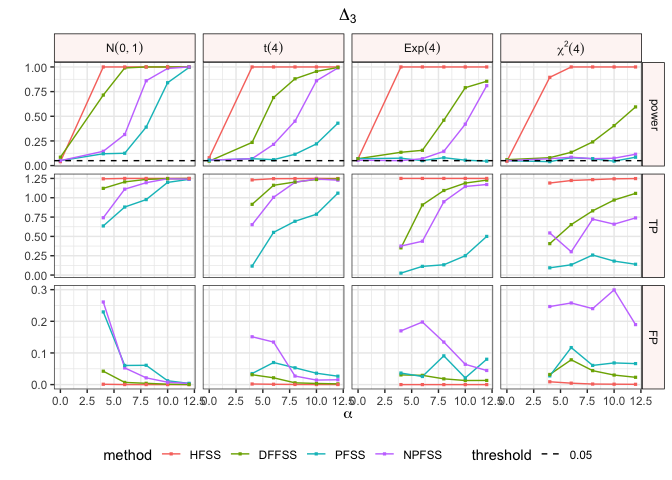

``` r
#ggsave("figures/simu_10_delta_2.pdf", width = 8, height = 6.5)
```

### 2.4.6 Delta 3

``` r
threshold <- data.frame(
  yintercept = c(0.05, NA, NA), 
  criteria = factor(c("power", "TP", "FP"), levels = c("power", "TP", "FP")))
to_plot$criteria <- factor(to_plot$criteria, levels = c("power", "TP", "FP"))
to_plot2 <- to_plot[-which(to_plot$alpha == 0 & to_plot$criteria == "TP"), ]
to_plot2 <- to_plot2[-which(to_plot2$alpha == 0 & to_plot2$criteria == "FP"), ]
to_plot2 %>%
  filter(type_shift == "Delta[3](t)") %>%
   # filter(alpha != 0 & criteria == "TP") %>%
   filter(method %in% c("DFFSS", "PFSS", "NPFSS", "HFSS")) %>%
  ggplot(aes(x = alpha, y = value, color = method)) +
  geom_line(data = to_plot2 %>% 
              filter(type_shift == "Delta[3](t)") %>%
              filter(method %in% c("DFFSS", "PFSS", "NPFSS", "HFSS")), 
            aes(group = method)) +
  geom_point(size = 0.8, pch = 15) +
#  geom_hline(aes(yintercept = yintercept, 
#                 linetype = criteria), data = threshold,
#             linetype = 2) +
    geom_hline(data = to_plot2 %>% filter(criteria == "power"), 
               aes(yintercept = 0.05, 
                 linetype = "0.05")) +
  ggh4x::facet_grid2(rows=vars(criteria),
                     cols=vars(shape),
                     labeller=label_parsed,
                     scales = "free", 
                     axes = "margins")  +
  theme_bw() +
  xlab(TeX("$\\alpha$")) +
  ylab("") +
  ggtitle(TeX("$\\Delta_3$")) +
  theme(plot.title = element_text(hjust = 0.5),
        legend.position = "bottom") +
  scale_linetype_manual(name = "threshold", values = 2) +
  theme(strip.background = element_rect(colour = "black", 
        fill = alpha("#EE9E94", 0.1)))
```

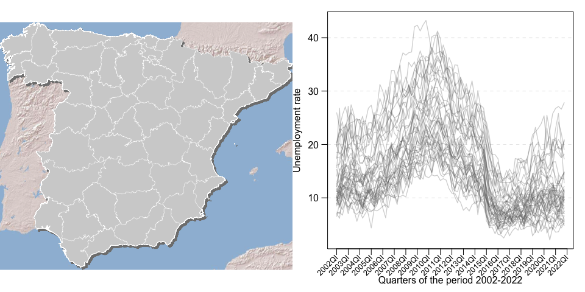

``` r
#ggsave("figures/simu_10_delta_3.pdf", width = 8, height = 6.5)
```

# 3 Empirical part

## 3.1 Spanish region

The file [spain_unemp.RData](spain_unemp.RData) contains three objects:

- `Matcoordalpha`, the coordinates of the centroid of the Spanish
  regions (expressed in Cartesian coordinates),
- `MatX`, the unemployment evolution of the Spanish regions across 80
  quarters from 2002 to 2022,
- `region_spain`, the spatial contours of the Spanish regions.

``` r
load("data/spain_unemp.RData")
dates <- seq(2002, 2021.75, by = 0.25)
y_lim <- range(MatX)
# import the OSM map
nc_osm <- get_tiles(region_spain, 
                      provider = "Esri.WorldShadedRelief", 
                      zoom = 7, crop = T)
# compute the distance between points
dist_proj <- as(dist(Matcoordalpha), "matrix")
# cartography
my_proj <- st_crs(region_spain)
spain <- st_union(region_spain)
```

We first plot the data:

``` r
#pdf(file = "figures/spain_data.pdf", width = 10, height = 4.5)
par(mfrow = c(1, 2), mar = c(3.7, 3, 1, 1), oma = c(0, 0, 0, 0),
    las = 1, mgp = c(2.15, 0.75, 0))
# map
plot_tiles(nc_osm)
mf_shadow(spain, add = T, cex = 0.8)
plot(st_geometry(spain), border = rgb(0.5, 0.5, 0.5), lwd = 0.4, add = T,
     col = rgb(0.82, 0.82, 0.82))
plot(st_geometry(region_spain), border = rgb(1, 1, 1), lwd = 0.4, add = T,
     col = rgb(0.82, 0.82, 0.82))
# data
plot(dates, MatX[, 1], ylim = y_lim, xlab = 'Quarters of the period 2002-2022',
       ylab = 'Unemployment rate', xaxt = "n", 
     col = rgb(0.6, 0.6, 0.6, alpha = 0.5),
     type = "l")
# abline(v = seq(2002, 2022, by = 4), lty = 2, col = rgb(0.7, 0.7, 0.7, alpha = 0.3))
abline(h = seq(0, 40, by = 10), lty = 2, col = rgb(0.7, 0.7, 0.7, alpha = 0.3))

axis(1, at = seq(2002, 2022, by = 1),
     labels = F)
text(x = seq(2002, 2022, by = 1), y = par()$usr[3] - 0.03 * (par()$usr[4] - par()$usr[3]),
     labels = paste0(seq(2002, 2022, by = 1), "QI"),
     srt = 45, adj = 1, xpd = T, cex = 0.8)
for(j in 2:47)
  lines(dates, MatX[,j], ylim = y_lim, lwd = 1.3, 
        col = rgb(0.4, 0.4, 0.4, alpha = 0.3)) 
```


``` r
#dev.off()
```

#### 3.1.0.1 Descriptive Analysis

We represent the variable “Unemployment” aggregated over different
periods of 2 years (i.e. eight quarters).

``` r
nb_split <- 10
step_years <- split(1:80, 
           sort(rep_len(1:nb_split, length.out = length(dates))))
#pdf(paste0("figures/Spain_evol.pdf"), width = 10, height = 7)
par(mfrow = c(3, 4), oma = c(0, 0, 0, 0), mar = c(0, 0, 0, 0))
  my_vec <- NULL
    for (j in 1:nb_split) {
      my_vec <- c(my_vec, colMeans(MatX[step_years[[j]], ]))
    }
    my_interval <- round(classInt::classIntervals(my_vec, 7, style = "jenks")$brks, digits = 4)

    nom_pal <- "YlOrRd"
    my_pal <- rev(alpha(colorspace::sequential_hcl(7, palette = nom_pal), 1))

    for (j in 1:nb_split) {
      chosen_years_5 <- step_years[[j]]
      my_mean <- colMeans(MatX[step_years[[j]], ])
      my_col <- alpha(my_pal[findInterval(my_mean, my_interval, all.inside = T)],
                  1)
    
      plot_tiles(nc_osm)
      mf_shadow(spain, add = T, cex = 0.8)
      plot(st_geometry(region_spain), 
        col = my_col,
        border = my_col, lwd = 0.001, add = T)
      my_years <- dates[chosen_years_5]
      title(paste0(my_years[1], "-", round(my_years[length(my_years)])), line = -.75)
     plot(st_geometry(region_spain), border = rgb(0.9, 0.9, 0.9), 
          lwd = 0.00000001, add = T)
     plot(st_geometry(spain), border = rgb(0.5, 0.5, 0.5), lwd = 0.4, add = T)
     if(j == nb_split)
       maplegend::leg(type = "choro", val = my_interval, pos = "bottomright", 
                 pal = my_pal, val_rnd = 3, title = "Unemp")
    }
#dev.off()
```

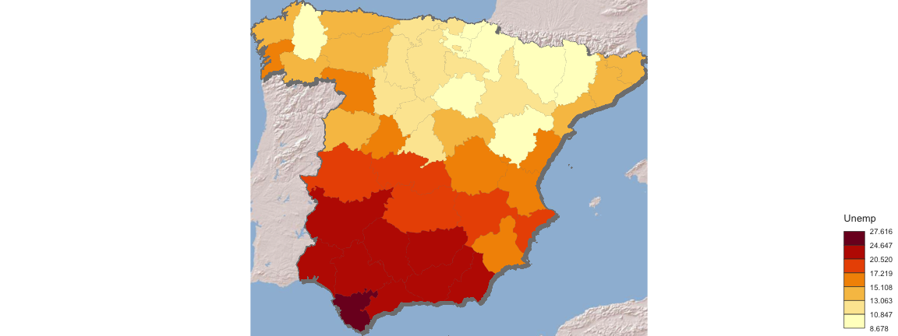

Average across all the years :

``` r
nb_split <- 1
step_years <- split(1:80, 
           sort(rep_len(1:nb_split, length.out = length(dates))))
#pdf(paste0("figures/Spain_mean.pdf"), width = 8, height = 7)
par(oma = c(0, 0, 0, 0), mar = c(0, 0, 0, 0))
  my_vec <- NULL
    for (j in 1:nb_split) {
      my_vec <- c(my_vec, colMeans(MatX[step_years[[j]], ]))
    }
    my_interval <- round(classInt::classIntervals(my_vec, 7, style = "jenks")$brks, digits = 4)

    nom_pal <- "YlOrRd"
    my_pal <- rev(alpha(colorspace::sequential_hcl(7, palette = nom_pal), 1))

    for (j in 1:nb_split) {
      chosen_years_5 <- step_years[[j]]
      my_mean <- colMeans(MatX[step_years[[j]], ])
      my_col <- alpha(my_pal[findInterval(my_mean, my_interval, all.inside = T)],
                  1)
    
      plot_tiles(nc_osm)
      mf_shadow(spain, add = T, cex = 0.8)
      plot(st_geometry(region_spain), 
        col = my_col,
        border = my_col, lwd = 0.001, add = T)
      my_years <- dates[chosen_years_5]
      # title(paste0(my_years[1], "-", round(my_years[length(my_years)])), line = -.75)
     plot(st_geometry(region_spain), border = rgb(0.9, 0.9, 0.9), 
          lwd = 0.00000001, add = T)
     plot(st_geometry(spain), border = rgb(0.5, 0.5, 0.5), lwd = 0.4, add = T)
     if(j == 1)
       maplegend::leg(type = "choro", val = my_interval, pos = "bottomright", 
                 pal = my_pal, val_rnd = 3, title = "Unemp")
    }
```


``` r
#dev.off()
```

We compute all the potential clusters :

``` r
my_pairs_sp <- find_all_cluster(Matcoordalpha)
```

    ## Number of possible combinaison:  1613

We use the different methods to detect clusters.

### 3.1.1 NPFSS method

**Most likely cluster**

``` r
res_np <- compute_np(my_pairs_sp[[1]], my_pairs_sp[[2]], MatX)
res_np
```

    ## $stat
    ## [1] 2.950895
    ## 
    ## $vec
    ##  [1] 30 12 39 16 21 25 23  3  7 15 31  1 43 11 18  2  6

**Significance**

``` r
p_value_np <- 0
B <- 999
pb <- progress_bar$new(total = B)

for(b in 1:B) {
  pb$tick()
  perm <- sample(ncol(MatX))
  MatXsim <- MatX[, perm]
  temp <- compute_np(my_pairs_sp[[1]], my_pairs_sp[[2]], MatXsim)
  p_value_np <- p_value_np + (res_np$stat < temp$stat)
}
cat("p-value: ", (1 + p_value_np) /  (1 + B))
```

    ## p-value:  0.001

**Secondary cluster 1**

We drop from the list of potential cluster all the observations
belonging to the most likely cluster. For instance, if the most likely
cluster contains the observations 1, 3, 5, the potential cluster with
observations 8, 1, 3, 5, 10, is replaced by 8, 10. We then compute the
NPFSS method on the new possible combinations

``` r
cluster_g1_temp <- sapply(my_pairs_sp[[1]], function(x) setdiff(x, res_np$vec))
cluster_g2_temp <- sapply(my_pairs_sp[[2]], function(x) setdiff(x, res_np$vec))
id_pos <- union(which(sapply(cluster_g1_temp, function(x) length(x) == 0)),
          which(sapply(cluster_g2_temp, function(x) length(x) == 0)))
```

``` r
res_np_2 <- compute_np(cluster_g1_temp[-id_pos], 
                       cluster_g2_temp[-id_pos], MatX)
res_np_2
```

    ## $stat
    ## [1] 1.873267
    ## 
    ## $vec
    ##  [1] 32 19 36  4  9 47 24 40 10 13 22 27 42 34 38

**Significance**

``` r
p_value_np_2 <- 0
pb <- progress_bar$new(total = B)

for(b in 1:B) {
  pb$tick()
  perm <- sample(ncol(MatX))
  MatXsim <- MatX[, perm]
  temp <- compute_np(cluster_g1_temp[-id_pos], cluster_g2_temp[-id_pos], MatXsim)
  p_value_np_2 <- p_value_np_2 + (res_np_2$stat < temp$stat)
}
cat("p-value: ", (1 + p_value_np_2) / (1 + B))
```

    ## p-value:  0.023

### 3.1.2 PFSS method

**Most likely cluster**

``` r
res_p <- compute_p(my_pairs_sp[[1]], my_pairs_sp[[2]], MatX)
res_p
```

    ## $stat
    ## [1] 79.54792
    ## 
    ## $vec
    ##  [1] 16 39 25 30 15  7 21 12 23 43 11  3  1

**Significance**

``` r
p_value_p <- 0
pb <- progress_bar$new(total = B)

for(b in 1:B) {
  pb$tick()
  perm <- sample(ncol(MatX))
  MatXsim <- MatX[, perm]
  temp <- compute_np(my_pairs_sp[[1]], my_pairs_sp[[2]], MatXsim)
  p_value_p <- p_value_p + (res_p$stat < temp$stat)
}
cat("p-value: ", (1 + p_value_p) /  (1 + B))
```

    ## p-value:  0.001

**Secondary cluster 1**

``` r
cluster_g1_temp <- sapply(my_pairs_sp[[1]], function(x) setdiff(x, res_p$vec))
cluster_g2_temp <- sapply(my_pairs_sp[[2]], function(x) setdiff(x, res_p$vec))
id_pos <- union(which(sapply(cluster_g1_temp, function(x) length(x) == 0)),
          which(sapply(cluster_g2_temp, function(x) length(x) == 0)))
```

``` r
res_p_2 <- compute_p(cluster_g1_temp[-id_pos], 
                       cluster_g2_temp[-id_pos], MatX)
res_p_2
```

    ## $stat
    ## [1] 20.10678
    ## 
    ## $vec
    ##  [1] 19  9  4 32 36 10 13 40 47 24 34 22 38 45 27 42

**Significance of the secondary cluster 1**

``` r
p_value_p_2 <- 0
pb <- progress_bar$new(total = B)

for(b in 1:B) {
  pb$tick()
  perm <- sample(ncol(MatX))
  MatXsim <- MatX[, perm]
  temp <- compute_p(cluster_g1_temp[-id_pos], cluster_g2_temp[-id_pos], MatXsim)
  p_value_p_2 <- p_value_p_2 + (res_p_2$stat < temp$stat)
}
cat("p-value: ", (1 + p_value_p_2) /  (1 + B))
```

    ## p-value:  0.015

### 3.1.3 DFFSS method

**Most likely cluster**

``` r
res_dffss <- compute_dffss(my_pairs_sp[[1]], my_pairs_sp[[2]], MatX)
res_dffss
```

    ## $stat
    ## [1] 12.46398
    ## 
    ## $vec
    ##  [1] 16 39 25 30 15  7 21 12 23 43 11  3  1

**Significance**

``` r
p_value_dffss <- 0
pb <- progress_bar$new(total = B)

for(b in 1:B) {
  pb$tick()
  perm <- sample(ncol(MatX))
  MatXsim <- MatX[, perm]
  temp <- compute_dffss(my_pairs_sp[[1]], my_pairs_sp[[2]], MatX)
  p_value_dffss <- p_value_dffss + (res_dffss$stat < temp$stat)
}
(1 + p_value_dffss) /  (1 + B)
```

    ## p-value:  0.001

**Secondary cluster 1**

``` r
cluster_g1_temp <- sapply(my_pairs_sp[[1]], function(x) setdiff(x, res_dffss$vec))
cluster_g2_temp <- sapply(my_pairs_sp[[2]], function(x) setdiff(x, res_dffss$vec))
id_pos <- union(which(sapply(cluster_g1_temp, function(x) length(x) == 0)),
          which(sapply(cluster_g2_temp, function(x) length(x) == 0)))
```

``` r
res_dffss_2 <- compute_dffss(cluster_g1_temp[-id_pos], 
                       cluster_g2_temp[-id_pos], MatX)
res_dffss_2
```

    ## $stat
    ## [1] 7.587023
    ## 
    ## $vec
    ##  [1] 24 27 47 32 41  8 42 36 19 14 40 20  4  9 22 10 18 44 13 38 29 34

**Significance of the secondary cluster 1**

``` r
p_value_dffss_2 <- 0
pb <- progress_bar$new(total = B)

for(b in 1:B) {
  pb$tick()
  perm <- sample(ncol(MatX))
  MatXsim <- MatX[, perm]
  temp <- compute_dffss(cluster_g1_temp[-id_pos], cluster_g2_temp[-id_pos], MatXsim)
  p_value_dffss_2 <- p_value_dffss_2 + (res_dffss_2$stat < temp$stat)
}
cat("p-value: ", (1 + p_value_dffss_2) /  (1 + B))
```

    ## p-value:  0.004

### 3.1.4 HFSS method

**Most likely cluster**

We first determine the value of $d$:

``` r
#pdf("figures/spain_h_CPV.pdf", width = 6, height = 4)
temp <- compute_h(my_pairs_sp[[1]], my_pairs_sp[[2]], MatX, 
                           d = nrow(MatX), plot_eigen = T)
```

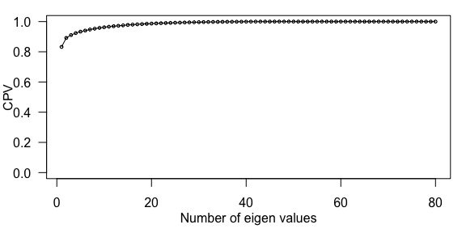

    ## Variance explained in % by the 10 first components:  83.23 89.16 91.08 92.38 93.32 94.06 94.73 95.3 95.83 96.23

``` r
#dev.off()
```

We choose $d=2$ (which corresponds to around $90\%$ of the variance
explained; note that using $d=10$, which corresponds to $95\%$ of the
variance leads to the same detected cluster)

``` r
res_h <- compute_h(my_pairs_sp[[1]], my_pairs_sp[[2]], MatX, d = 2)
res_h
```

    ## $stat
    ## [1] 124.6322
    ## 
    ## $vec
    ##  [1] 16 39 25 30 15  7 21 12 23 43 11  3  1

``` r
p_value_h <- 0
pb <- progress_bar$new(total = B)

for(b in 1:B) {
  pb$tick()
  perm <- sample(ncol(MatX))
  MatXsim <- MatX[, perm]
  temp <- compute_h(my_pairs_sp[[1]], my_pairs_sp[[2]], MatXsim,
                               d = 2)
  p_value_h <- p_value_h + (res_h$stat < temp$stat)
}
(1 + p_value_h) /  (1 + B)
```

    ## p-value:  0.001

**Secondary cluster 1**

``` r
cluster_g1_temp <- sapply(my_pairs_sp[[1]], function(x) setdiff(x, res_h$vec))
cluster_g2_temp <- sapply(my_pairs_sp[[2]], function(x) setdiff(x, res_h$vec))
id_pos <- union(which(sapply(cluster_g1_temp, function(x) length(x) == 0)),
          which(sapply(cluster_g2_temp, function(x) length(x) == 0)))
```

We look for an optimal value of $d$:

``` r
#pdf("figures/spain_h_CPV_2.pdf", width = 6, height = 4)
temp <- compute_h(cluster_g1_temp[-id_pos], cluster_g2_temp[-id_pos], MatX, 
                           d = nrow(MatX), plot_eigen = T)
```

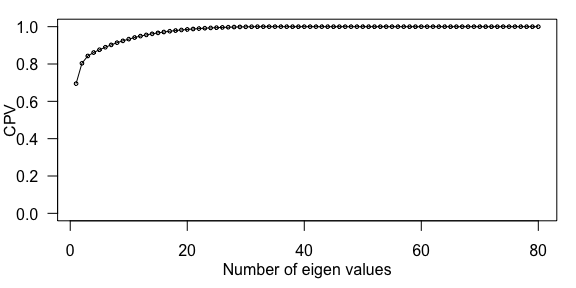

    ## Variance explained in % by the 10 first components:  69.49 80.38 84.3 86.13 87.64 88.97 90.24 91.41 92.4 93.32

``` r
#dev.off()
```

We choose $d=2$.

``` r
res_h_2 <- compute_h(cluster_g1_temp[-id_pos], 
                     cluster_g2_temp[-id_pos], MatX, d = 2)
res_h_2
```

    ## $stat
    ## [1] 44.60017
    ## 
    ## $vec
    ##  [1] 32 19 36  4  9 47 24 40 10 13 22 27 42 34 38

**Significance of the secondary cluster 1**

``` r
p_value_h_2 <- 0
pb <- progress_bar$new(total = B)

for(b in 1:B) {
  pb$tick()
  perm <- sample(ncol(MatX))
  MatXsim <- MatX[, perm]
  temp <- compute_h(cluster_g1_temp[-id_pos], cluster_g2_temp[-id_pos], 
                    MatXsim, d = 2)
  p_value_h_2 <- p_value_h_2 + (res_h_2$stat < temp$stat)
}
cat("p-value: ", (1 + p_value_h_2) /  (1 + B))
```

    ## p-value:  0.003

### 3.1.5 Summary of the results

**Visualization of the result**

``` r
res <- vector("list", 4)
res[[1]][[1]] <- res_h
res[[1]][[2]] <- res_h_2
res[[2]][[1]] <- res_dffss
res[[2]][[2]] <- res_dffss_2
res[[3]][[1]] <- res_np
res[[3]][[2]] <- res_np_2
res[[4]][[1]] <- res_p
res[[4]][[2]] <- res_p_2
names_method <- c("HFSS", "DFFSS", "NPFSS", "PFSS")
cols = c("#D35C79", "#009593")
```

``` r
my_var <- 'Unemployment rate (in %)'
my_country <- "ESP" 

y_lim <- range(MatX)

for(k in 1:4) {
  my_cluster_1 <- res[[k]][[1]]$vec
  my_cluster_2 <- res[[k]][[2]]$vec

#pdf(file = paste0("figures/", my_country, "_", names_method[k], ".pdf"), width = 11.5, height = 3.9) 
sf_use_s2(F)
nf <- layout( matrix(c(1,1,2,3), nrow=2, byrow=F) )
  par(mar = c(1.5, 0, 0, 0.2), 
      oma = c(0.5, 0, 2.4, 0), mgp = c(2.4, 0.6, 0), las = 1)
  ##### Map #########
    # map
  col_geo <- rep(rgb(0.9, 0.9, 0.9, alpha = 0.1), nrow(Matcoordalpha))
  cex_geo <- rep(0.7, nrow(Matcoordalpha))
  col_geo[my_cluster_1] <- alpha(cols[1], 0.8)
  cex_geo[my_cluster_1] <- 1

  col_geo[my_cluster_2] <- alpha(cols[2], 0.5)
  cex_geo[my_cluster_2] <- 1
  
  
   plot_tiles(nc_osm)
  mf_shadow(spain, add = T, cex = 0.8)
  mf_shadow(st_union(region_spain[my_cluster_1, ]), 
                add = T, cex = 0.8, col = cols[1])
  mf_shadow(st_union(region_spain[my_cluster_2, ]), 
         add = T, col= cols[2], cex = 0.8)
      
  plot(st_geometry(spain), border = rgb(0.5, 0.5, 0.5), 
           lwd = 0.4, add = T, col = rgb(0.82, 0.82, 0.82))

  
  plot(st_geometry(region_spain), 
        border = "white",
        col = col_geo, 
        cex = cex_geo,
        pch = 16, asp = 1, add = T, lwd = 0.1)

  plot(st_geometry(st_union(region_spain[my_cluster_1, ])), 
         add = T, border= cols[1], col = NULL)
  plot(st_geometry(st_union(region_spain[my_cluster_2, ])), 
         add = T, border= cols[2], col = NULL)

      
    temp_1 <- draw.circle(Matcoordalpha[my_cluster_1[1], 1], 
                           Matcoordalpha[my_cluster_1[1], 2], 
                  as.numeric(dist_proj[my_cluster_1[1], 
                                       my_cluster_1[length(my_cluster_1)]]))

  temp_2 <- draw.circle(Matcoordalpha[my_cluster_2[1], 1], 
                           Matcoordalpha[my_cluster_2[1], 2], 
                  as.numeric(dist_proj[my_cluster_2[1], 
                                       my_cluster_2[length(my_cluster_2)]]))
    ###############
  polygon(temp_1$x, temp_1$y, border= cols[1],
             col = alpha(cols[1], 0.4), lty=1, lwd=1)

  polygon(temp_2$x, temp_2$y, border= cols[2],
             col = alpha(cols[2], 0.4), lty=1, lwd=1)
  
    mtext(my_var,
       side = 4, line = -2.8, las = 0)
    
  legend("topleft", legend = c("Most likely cluster", "Secondary cluster 1"),
         fill = c(cols[1], cols[2]), cex = 0.9, box.lty = 0)
      
  ##### Functional data
  plot(dates, MatX[, 1], ylim = y_lim, xlab = '',
       ylab = '', col = rgb(0.6, 0.6, 0.6, alpha = 0.5), xaxt = 'n', 
        type = "l")
  legend("topleft", legend = c("Most likely cluster"),
         lty = 1, col = c(cols[1]), cex = 0.9)
  abline(v = seq(2002, 2022, by = 4), lty = 2, 
             col = rgb(0.7, 0.7, 0.7, alpha = 0.3))
  abline(h = seq(0, 40, by = 10),
             lty = 2, col = rgb(0.7, 0.7, 0.7, alpha = 0.3))

  for (j in 2:ncol(MatX))
        lines(dates, MatX[, j], lwd = 1.3, 
          col = rgb(0.4, 0.4, 0.4, alpha = 0.1)) 
    
  for(i in my_cluster_1)
        lines(dates, MatX[, i], col = alpha(cols[1], 0.3),
          lty = 1, lwd = 1.3)
  
  lines(dates, rowMeans(MatX), lwd = 1.3, lty = 2)
  

plot(dates, MatX[, 1], ylim = y_lim, xlab = 'Years',
       ylab = '', xaxt = "n", 
       col = rgb(0.6, 0.6, 0.6, alpha = 0.5),
        type = "l")
  legend("topleft", legend = c("Secondary cluster 1"),
         lty = 1, col = c(cols[2]), cex = 0.9)
  abline(v = seq(2002, 2022, by = 4), lty = 2, 
             col = rgb(0.7, 0.7, 0.7, alpha = 0.3))
  abline(h = seq(0, 40, by = 10),
             lty = 2, col = rgb(0.7, 0.7, 0.7, alpha = 0.3))
  axis(1, at = seq(2002, 2022, by = 4), xlab = "years",
           labels = as.character(seq(2002, 2022, by = 4)))
  for (j in 2:ncol(MatX))
        lines(dates, MatX[, j], lwd = 1.3, 
          col = rgb(0.4, 0.4, 0.4, alpha = 0.1)) 
      
  for(i in my_cluster_2)
        lines(dates, MatX[, i], col = alpha(cols[2], 0.3),
          lty = 1, lwd = 1.3)
  
    
  lines(dates, rowMeans(MatX), lwd = 1.3, lty = 2)
  
  mtext(paste0("Clusters for the ", names_method[k]), side = 3, line = 0.8, outer = TRUE)
#dev.off()
}
```

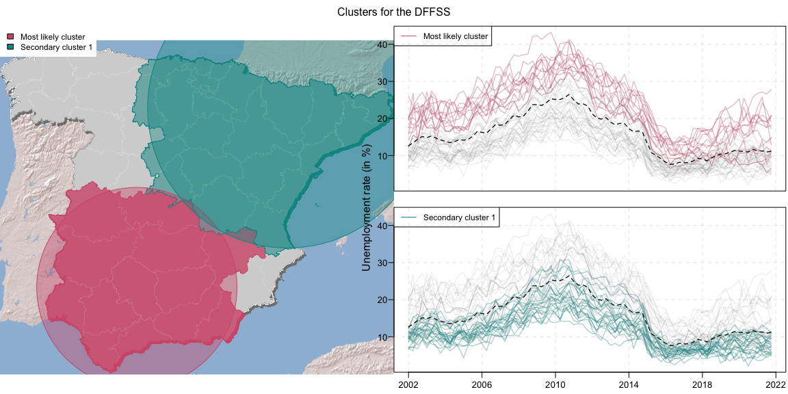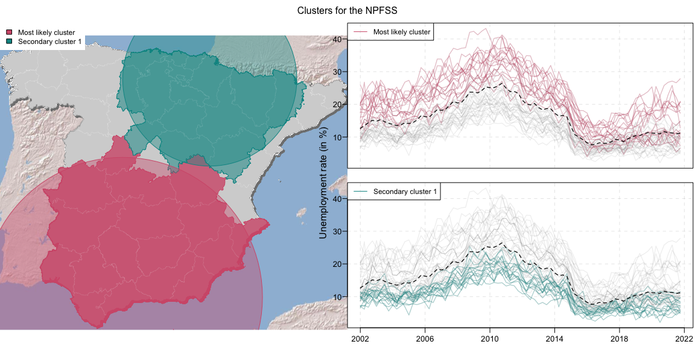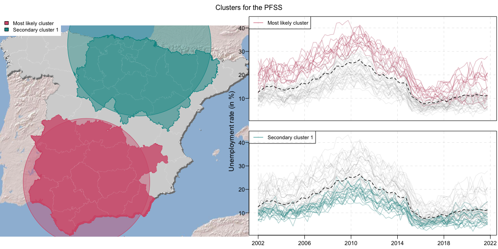

We present in the following table the results obtained by the different
methods.

``` r
res_spain <- data.frame(nb_cluster_1 = c(length(res_np$vec), 
                            length(res_p$vec),
                            length(res_dffss$vec),
                            length(res_h$vec)),
           sign_cluster_1 = c(0.001, 0.001, 0.001, 0.001),
           nb_cluster_2 = c(length(res_np_2$vec), 
                            length(res_p_2$vec),
                            length(res_dffss_2$vec),
                            length(res_h_2$vec)),
           sign_cluster_2 = c(0.023, 0.015, 0.004, 0.003))
row.names(res_spain) <- c("NPFSS", "PFSS", "DFFSS", "HFSS")
knitr::kable(res_spain)
```

|       | nb_cluster_1 | sign_cluster_1 | nb_cluster_2 | sign_cluster_2 |
|-------|-------------:|---------------:|-------------:|---------------:|
| NPFSS |           17 |          0.001 |           15 |          0.023 |
| PFSS  |           13 |          0.001 |           16 |          0.015 |
| DFFSS |           13 |          0.001 |           22 |          0.004 |
| HFSS  |           13 |          0.001 |           15 |          0.003 |

## 3.2 Climate Data

### 3.2.1 Preparation of the data

Import the data:

``` r
load("data/my_grid.RData")
coord_region <- st_as_sf(my_grid, coords = c("long", "lat"),
                         crs = 4326)
countries_regions <- st_read("data/world-administrative-boundaries.geojson")
```

    ## Reading layer `world-administrative-boundaries' from data source 
    ##   `/Users/thibaultlaurent/Documents/map_spain/scan_functional_hotelling/data/world-administrative-boundaries.geojson' 
    ##   using driver `GeoJSON'
    ## Simple feature collection with 256 features and 9 fields
    ## Geometry type: MULTIPOLYGON
    ## Dimension:     XY
    ## Bounding box:  xmin: -180 ymin: -58.49861 xmax: 180 ymax: 83.6236
    ## Geodetic CRS:  WGS 84

Preparation of the data:

``` r
# transforn the points into grid
long_lat_temp <- my_grid[, c("long", "lat")] %>%
  filter(lat > -90, lat < 90, long > -180, long < 180) %>%
  arrange(lat, long)   %>%
  select(long, lat)
df_sf_temp <- st_as_sf(long_lat_temp, coords = c("long", "lat"))
st_crs(df_sf_temp) <- 4326
all_cells <- df_sf_temp %>% 
  st_make_grid(cellsize = c(0.625, 0.5), 
               offset = c(-179.375 - 0.3125, -89.5 -0.25)) %>% # c(-180 - 0.3125, -90 - 0.25))
  st_as_sf() %>% 
  st_join(df_sf_temp) 
```

    ## although coordinates are longitude/latitude, st_intersects assumes that they
    ## are planar

``` r
all_cells$long <- long_lat_temp$long
all_cells$lat <- long_lat_temp$lat
# Initialisation
unique_year <- 1981:2023
chosen_years <- 20:43
```

### 3.2.2 Great-Britain

We select the ISO3 corresponding to Great-Britain.

``` r
my_country <- "GBR"
my_proj <- 3035 
```

``` r
select_countries <- countries_regions[countries_regions$color_code %in% my_country, ]
  
# drop the islands
sf_obj <- select_countries %>%
    filter(iso3 == my_country[1]) %>%
    mutate(area = st_area(geometry)) %>%
    top_n(1, area) %>%
    rowid_to_column() %>%
    st_cast("POLYGON")  %>% 
    mutate(area = st_area(geometry)) %>%
    group_by(rowid) %>%
    top_n(1, area)
  
if(length(my_country) > 1) {
  for(i in 2:length(my_country)) {
    sf_obj <- rbind(sf_obj, select_countries %>%
      filter(iso3 == my_country[i]) %>%
      mutate(area = st_area(geometry)) %>%
      top_n(1, area) %>%
      rowid_to_column() %>%
      st_cast("POLYGON")  %>% 
      mutate(area = st_area(geometry)) %>%
      group_by(rowid) %>%
      top_n(1, area)
    )
  }
  }
is_intersect <- st_intersects(all_cells, sf_obj)
is_intersect <- which(sapply(is_intersect, function(x) length(x) != 0))
lldata_poly <- all_cells[is_intersect, ]
  
my_contours <- st_intersection(countries_regions, 
                               st_union(lldata_poly, is_coverage = T))

# dowload tiles and compose raster (SpatRaster)
nc_osm <- get_tiles(my_contours, 
                      provider = "Esri.WorldShadedRelief", 
                      zoom = 7, crop = F)
poly_cell <- merge(lldata_poly, my_grid, by = c("long", "lat"))
# coordinates of the centroid
coord_temp <- st_transform(poly_cell, my_proj)
# simplify the geometry
poly_cell <- st_intersection(poly_cell, my_contours)
poly_cell <- poly_cell[!duplicated(cbind(poly_cell$long, poly_cell$lat)), ]
```

We compute all the potential clusters:

``` r
  coord_proj <- st_coordinates(st_centroid(coord_temp))
  pairs_geo <- find_all_cluster(coord_proj)
```

    ## Number of possible combinaison:  13644

``` r
  dist_proj <- as(dist(cbind(coord_proj[, 1], coord_proj[, 2])), "matrix")

  dist_4326 <- as(dist(cbind(poly_cell$long, poly_cell$lat)), "matrix")
  coord_4326 <- st_transform(poly_cell, 4326) 
```

``` r
  my_var <- "t2m_diff_" 
  temp_var <- poly_cell[, paste0(my_var, unique_year)[chosen_years]]
  MatX <- as.matrix(st_drop_geometry(temp_var))
```

#### 3.2.2.1 Descriptive Analysis

We first plot the data:

``` r
y_lim <- range(MatX)
dates <- unique_year[chosen_years]
#pdf(file = "figures/GBR_data.pdf", width = 10, height = 4.5)
par(mfrow = c(1, 2), mar = c(3.7, 3, 1, 1), oma = c(0, 0, 0, 0),
    las = 1, mgp = c(2.2, 0.8, 0))
# map
plot_tiles(nc_osm)
  mf_shadow(my_contours, add = T, cex = 0.8)
  plot(st_geometry(poly_cell), border = rgb(0.5, 0.5, 0.5), 
           lwd = 0.4, add = T, col = rgb(0.82, 0.82, 0.82))

# data
  plot(dates, MatX[1, ], ylim = y_lim, xlab = 'Years',
       ylab = 'Difference from average temperatures (in C)', xaxt = "n", 
       col = rgb(0.6, 0.6, 0.6, alpha = 0.5),
        type = "l")
  abline(v = seq(1980, 2025, by = 5), lty = 2, 
             col = rgb(0.7, 0.7, 0.7, alpha = 0.3))
  abline(h = seq(-4, 4, by = 0.5),
             lty = 2, col = rgb(0.7, 0.7, 0.7, alpha = 0.3))
  axis(1, at = seq(1980, 2025, by = 5), xlab = "years",
           labels = as.character(seq(1980, 2025, by = 5)))
  for (j in 2:nrow(MatX))
        lines(dates, MatX[j, ], lwd = 1.3, 
          col = rgb(0.4, 0.4, 0.4, alpha = 0.1)) 
```

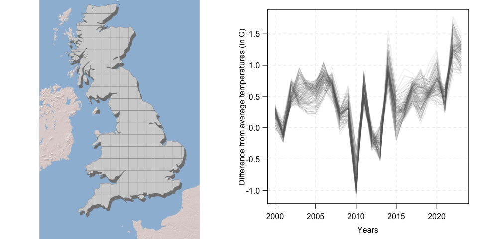

``` r
#dev.off()
```

We map the variable “Difference from average temperatures” aggregated
over different periods of four years.

``` r
nb_split <- 8
step_years <- split(chosen_years, 
           sort(rep_len(1:nb_split, length.out = length(chosen_years))))
#pdf(paste0("figures/GB_evol.pdf"), width = 12, height = 8)
par(mfrow = c(2, 4), oma = c(0, 0, 0, 0), mar = c(0, 0, 0, 0))
  my_vec <- NULL
    for (j in 1:nb_split) {
      my_vec <- c(my_vec, rowMeans(st_drop_geometry(poly_cell[, paste0(my_var, unique_year)[step_years[[j]]]])))
    }
    my_interval <- round(classInt::classIntervals(my_vec, 8, style = "jenks")$brks, digits = 4)

    nom_pal <- "YlOrRd"
    my_pal <- rev(alpha(colorspace::sequential_hcl(8, palette = nom_pal), 1))
    my_col <- my_pal[findInterval(poly_cell$my_mean, my_interval, all.inside = T)]

    for (j in 1:nb_split) {
      chosen_years_5 <- step_years[[j]]
      poly_cell$my_mean <- rowMeans(st_drop_geometry(poly_cell[, paste0(my_var, unique_year)[chosen_years_5]]))
      my_col <- alpha(my_pal[findInterval(poly_cell$my_mean, my_interval, all.inside = T)],
                  0.5)
    
      plot_tiles(nc_osm)
      plot(st_geometry(poly_cell), 
        col = my_col,
        border = my_col, lwd = 0.001, add = T)
      my_years <- unique_year[chosen_years_5]
      title(paste0(my_years[1], "-", my_years[length(my_years)]), line = -1.25)
     plot(st_geometry(my_contours), add = T, lwd = 0.5)
     if(j == 1)
       maplegend::leg(type = "choro", val = my_interval, pos = "topleft", 
                 pal = my_pal, val_rnd = 3, title = "Diff Temp")
    }
```

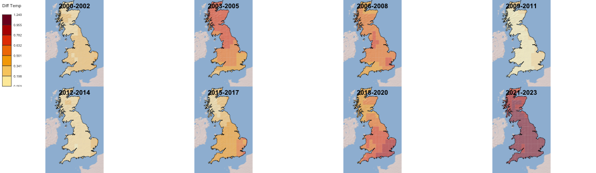

``` r
#dev.off()
```

Average mean of difference temperatures:

``` r
nb_split <- 1
step_years <- split(chosen_years, 
           sort(rep_len(1:nb_split, length.out = length(chosen_years))))
#pdf(paste0("figures/GBR_mean.pdf"), width = 7, height = 8)
par(oma = c(0, 0, 0, 0), mar = c(0, 0, 0, 0))
  my_vec <- NULL
    for (j in 1:nb_split) {
      my_vec <- c(my_vec, rowMeans(st_drop_geometry(poly_cell[, paste0(my_var, unique_year)[step_years[[j]]]])))
    }
    my_interval <- round(classInt::classIntervals(my_vec, 8, style = "jenks")$brks, digits = 4)

    nom_pal <- "YlOrRd"
    my_pal <- rev(alpha(colorspace::sequential_hcl(8, palette = nom_pal), 1))
    my_col <- my_pal[findInterval(poly_cell$my_mean, my_interval, all.inside = T)]

    for (j in 1:nb_split) {
      chosen_years_5 <- step_years[[j]]
      poly_cell$my_mean <- rowMeans(st_drop_geometry(poly_cell[, paste0(my_var, unique_year)[chosen_years_5]]))
      my_col <- alpha(my_pal[findInterval(poly_cell$my_mean, my_interval, all.inside = T)],
                  0.5)
    
      plot_tiles(nc_osm)
      plot(st_geometry(poly_cell), 
        col = my_col,
        border = my_col, lwd = 0.001, add = T)
      my_years <- unique_year[chosen_years_5]
     # title(paste0(my_years[1], "-", my_years[length(my_years)]), line = -1.25)
     plot(st_geometry(my_contours), add = T, lwd = 0.5)
     if(j == 1)
       maplegend::leg(type = "choro", val = my_interval, pos = "topleft", 
                 pal = my_pal, val_rnd = 3, title = "Diff Temp")
    }
```

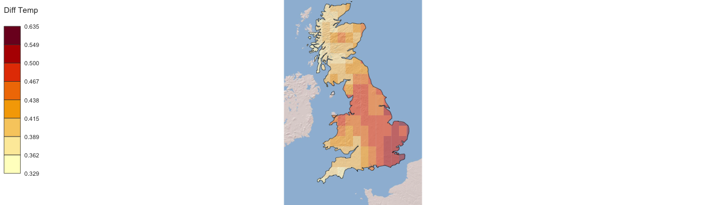

``` r
#dev.off()
```

#### 3.2.2.2 NPFSS method

**Most likely cluster**

``` r
res_np <- compute_np(pairs_geo[[1]], pairs_geo[[2]], t(MatX))
res_np
```

    ## $stat
    ## [1] 4.56314
    ## 
    ## $vec
    ##  [1] 126   3 133 125 127 134   4   2 132  12 139 140  13  11 138 124 128 135   5
    ## [20]   1  23 141  14  24 143  10  22 129 144  25  21 136   6  37  38  36 142  15
    ## [39]  39  35 145  26  52  53 130  51 137   7  16  40  54  50  27  70  71  69  55
    ## [58] 131  41  72   8  68  17  86  73  28  87  56  85  67  88  42  84

**Significance (using parallel computing)**

``` r
B <- 999
compute_fun_par <- function(b, fun, ...) {
  set.seed(b)
  perm <- sample(nrow(MatX))
  MatXsim <- MatX[perm, ]
  temp <- fun(c1, c2, t(MatXsim))
  temp$stat
}

c1 <- pairs_geo[[1]]
c2 <- pairs_geo[[2]]

require(parallel)
cl <- makeCluster(10)
clusterExport(cl, c("c1", "c2", "MatX", "norm"))
res_par_np <- clusterApplyLB(cl, 1:B, compute_fun_par, compute_np)
stopCluster(cl)

cat("p-value: ", (1 + sum(sapply(res_par_np, function(x) res_np$stat <x))) /  (1 + B))
```

    ## p-value:  0.001

**Secondary cluster 1**

``` r
cluster_g1_temp <- sapply(pairs_geo[[1]], function(x) setdiff(x, res_np$vec))
cluster_g2_temp <- sapply(pairs_geo[[2]], function(x) setdiff(x, res_np$vec))
id_pos <- union(which(sapply(cluster_g1_temp, function(x) length(x) == 0)),
          which(sapply(cluster_g2_temp, function(x) length(x) == 0)))
```

``` r
res_np_2 <- compute_np(cluster_g1_temp[-id_pos], 
                       cluster_g2_temp[-id_pos], t(MatX))
res_np_2
```

    ## $stat
    ## [1] 2.655224
    ## 
    ## $vec
    ##  [1]  89 103 102  74 101  57  75  90  58 104  43 100  29 114  18  76  91  59 105
    ## [20]  44  99   9  30 113  19  77  92  60 106  45

**Significance**

``` r
c1 <- cluster_g1_temp[-id_pos]
c2 <- cluster_g2_temp[-id_pos]

cl <- makeCluster(10)
clusterExport(cl, c("c1", "c2", "MatX", "norm"))
res_par_np <- clusterApplyLB(cl, 1:B, compute_fun_par, compute_np)
stopCluster(cl)

cat("p-value: ", (1 + sum(sapply(res_par_np, function(x) res_np_2$stat <x))) /  (1 + B))
```

    ## p-value:  0.001

#### 3.2.2.3 PFSS method

**Most likely cluster**

``` r
res_p <- compute_p(pairs_geo[[1]], pairs_geo[[2]], t(MatX))
res_p
```

    ## $stat
    ## [1] 89.93453
    ## 
    ## $vec
    ##  [1] 126   3 133 125 127 134   4   2 132  12 139 140  13  11 138 124 128 135   5
    ## [20]   1  23 141  14  24 143  10  22 129 144  25  21 136   6  37  38  36 142  15
    ## [39]  39  35 145  26  52  53 130  51 137   7  16  40  54  50  27  70  71  69  55
    ## [58] 131  41  72   8  68  17  86  73  28  87  56  85  67  88  42  84

**Significance**

``` r
c1 <- pairs_geo[[1]]
c2 <- pairs_geo[[2]]

cl <- makeCluster(10)
clusterExport(cl, c("c1", "c2", "MatX", "norm"))
res_par_p <- clusterApplyLB(cl, 1:B, compute_fun_par, compute_p)
stopCluster(cl)

cat("p-value: ", (1 + sum(sapply(res_par_p, function(x) res_p$stat <x))) /  (1 + B))
```

    ## p-value:  0.001

**Secondary cluster 1**

``` r
cluster_g1_temp <- sapply(pairs_geo[[1]], function(x) setdiff(x, res_p$vec))
cluster_g2_temp <- sapply(pairs_geo[[2]], function(x) setdiff(x, res_p$vec))
id_pos <- union(which(sapply(cluster_g1_temp, function(x) length(x) == 0)),
          which(sapply(cluster_g2_temp, function(x) length(x) == 0)))
```

``` r
res_p_2 <- compute_p(cluster_g1_temp[-id_pos], 
                       cluster_g2_temp[-id_pos], t(MatX))
res_p_2
```

    ## $stat
    ## [1] 20.95592
    ## 
    ## $vec
    ##  [1] 100  99 114 113 101 102  89 103  74  57  90  75 104  58  43  29  18  91  76
    ## [20] 105  59   9  44  30  19  92  77 106  60 115  45  31  20  93  78 107  61 116
    ## [39]  46  32  94  79 108  62 117  47 122  95  80 109  63 118

**Significance**

``` r
c1 <- cluster_g1_temp[-id_pos]
c2 <- cluster_g2_temp[-id_pos]

cl <- makeCluster(10)
clusterExport(cl, c("c1", "c2", "MatX", "norm"))
res_par_p <- clusterApplyLB(cl, 1:B, compute_fun_par, compute_p)
stopCluster(cl)

cat("p-value: ", (1 + sum(sapply(res_par_p, function(x) res_p_2$stat <x))) /  (1 + B))
```

    ## p-value:  0.001

#### 3.2.2.4 DFFSS method

**Most likely cluster**

``` r
res_dffss <- compute_dffss(pairs_geo[[1]], pairs_geo[[2]], t(MatX))
res_dffss
```

    ## $stat
    ## [1] 20.21928
    ## 
    ## $vec
    ##   [1]  70  86  52  69  71  53  87  85  51 101  37  38 102  36  68  72  54  88
    ##  [19]  84  50  23  39  24 100  35  22  67  73  25 114  21  55  89  12  13  11
    ##  [37]  40 103  99  14  10  26 113   3   4  74   2  56  41  15   5   1  27 126
    ##  [55] 127 125   6  16 128  57 124  42 133 129  28 134   7 132 135  17  75  58
    ##  [73]  90 130 136  43 104 139 140   8 138  29 141 137  18 131 142  76 143  59
    ##  [91]  91   9  44 105 144  30 145  19  77  60  92  45 106 115

**Significance**

``` r
c1 <- pairs_geo[[1]]
c2 <- pairs_geo[[2]]

cl <- makeCluster(10)
clusterExport(cl, c("c1", "c2", "MatX", "norm"))
res_par_dffss <- clusterApplyLB(cl, 1:B, compute_fun_par, compute_dffss)
stopCluster(cl)

cat("p-value: ", (1 + sum(sapply(res_par_dffss, function(x) res_p$stat <x))) /  (1 + B))
```

    ## p-value:  0.001

**Secondary cluster 1**

``` r
cluster_g1_temp <- sapply(pairs_geo[[1]], function(x) setdiff(x, res_dffss$vec))
cluster_g2_temp <- sapply(pairs_geo[[2]], function(x) setdiff(x, res_dffss$vec))
id_pos <- union(which(sapply(cluster_g1_temp, function(x) length(x) == 0)),
          which(sapply(cluster_g2_temp, function(x) length(x) == 0)))
```

``` r
res_dffss_2 <- compute_dffss(cluster_g1_temp[-id_pos], 
                       cluster_g2_temp[-id_pos], t(MatX))
res_dffss_2
```

    ## $stat
    ## [1] 12.10897
    ## 
    ## $vec
    ##  [1] 116 107 117 122 108  93  94 118  78 123 109  79  95  61  80  62 119 110  96
    ## [20]  63

**Significance**

``` r
c1 <- cluster_g1_temp[-id_pos]
c2 <- cluster_g2_temp[-id_pos]

cl <- makeCluster(10)
clusterExport(cl, c("c1", "c2", "MatX", "norm"))
res_par_dffss <- clusterApplyLB(cl, 1:B, compute_fun_par, compute_dffss)
stopCluster(cl)

cat("p-value: ", (1 + sum(sapply(res_par_dffss, function(x) res_dffss_2$stat <x))) /  (1 + B))
```

    ## p-value:  0.001

#### 3.2.2.5 HFSS method

**Most likely cluster**

We first determine the value of $d$:

``` r
#pdf(paste0("figures/", my_country, "_h_CPV.pdf"), width = 6, height = 4)
temp <- compute_h(pairs_geo[[1]], pairs_geo[[2]], t(MatX), 
                           d = ncol(MatX), plot_eigen = T)
```

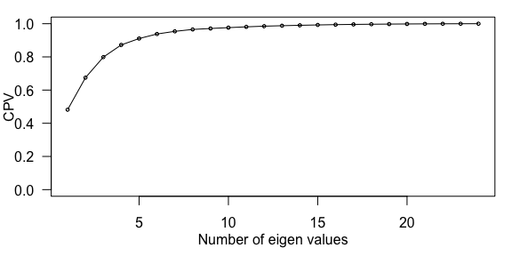

    ## Variance explained in % by the 10 first components:  48.2 67.5 79.88 87.21 91.05 93.79 95.39 96.54 97.12 97.63

``` r
#dev.off()
```

We choose $d=6$:

``` r
res_h <- compute_h(pairs_geo[[1]], pairs_geo[[2]], t(MatX), d = 6)
res_h
```

    ## $stat
    ## [1] 765.3215
    ## 
    ## $vec
    ##  [1]  34  49  33  48  64  65  63  81  47  82  80  66  62  96  83  97  79  95  32
    ## [20]  46  61  98 110  94 111 109  78 112 108  31 119  20  45  93 120 118  60 121
    ## [39]  77 117 107 123  92  30  19  44 116 122  59 106

**Significance**

``` r
c1 <- pairs_geo[[1]]
c2 <- pairs_geo[[2]]

cl <- makeCluster(10)
clusterExport(cl, c("c1", "c2", "MatX", "norm"))
res_par_h <- clusterApplyLB(cl, 1:B, compute_fun_par, compute_h, d = 6)
stopCluster(cl)

cat("p-value: ", (1 + sum(sapply(res_par_h, function(x) res_h$stat <x))) /  (1 + B))
```

    ## p-value:  0.001

**Secondary cluster 1**

``` r
cluster_g1_temp <- sapply(pairs_geo[[1]], function(x) setdiff(x, res_h$vec))
cluster_g2_temp <- sapply(pairs_geo[[2]], function(x) setdiff(x, res_h$vec))
id_pos <- union(which(sapply(cluster_g1_temp, function(x) length(x) == 0)),
          which(sapply(cluster_g2_temp, function(x) length(x) == 0)))
```

We look for an optimal value of $d$:

``` r
#pdf(paste0("figures/", my_country, "_h_CPV_2.pdf"), width = 6, height = 4)
temp <- compute_h(cluster_g1_temp[-id_pos], cluster_g2_temp[-id_pos], t(MatX), 
                           d = ncol(MatX), plot_eigen = T)
```

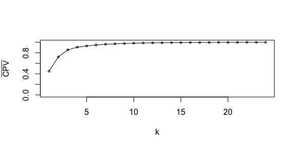

    ## Variance explained in % by the 10 first components:  45.12 72.27 85.58 90.74 93.01 94.91 96.16 97 97.73 98.25

``` r
#dev.off()
```

We choose $d=6$.

``` r
res_h_2 <- compute_h(cluster_g1_temp[-id_pos], 
                     cluster_g2_temp[-id_pos], t(MatX), d = 6)
res_h_2
```

    ## $stat
    ## [1] 356.866
    ## 
    ## $vec
    ##  [1] 138 132 139 133 125 126 124 140 143 134   2 127   3   1 141   4 144 135  11
    ## [20]  12  10 128  13   5  22 142  23 145 136  21 129

**Significance of the secondary cluster 1**

``` r
c1 <- cluster_g1_temp[-id_pos]
c2 <- cluster_g2_temp[-id_pos]

cl <- makeCluster(10)
clusterExport(cl, c("c1", "c2", "MatX", "norm"))
res_par_h <- clusterApplyLB(cl, 1:B, compute_fun_par, compute_h, d = 6)
stopCluster(cl)

cat("p-value: ", (1 + sum(sapply(res_par_h, function(x) res_h_2$stat <x))) /  (1 + B))
```

    ## p-value:  0.001

#### 3.2.2.6 Summary of the results

**Visualization of the result**

``` r
res <- vector("list", 4)
res[[1]][[1]] <- res_h
res[[1]][[2]] <- res_h_2
res[[2]][[1]] <- res_dffss
res[[2]][[2]] <- res_dffss_2
res[[3]][[1]] <- res_np
res[[3]][[2]] <- res_np_2
res[[4]][[1]] <- res_p
res[[4]][[2]] <- res_p_2
```

``` r
my_var <- 'Difference with the normal temperature (in C)'
dates <- unique_year[chosen_years]
y_lim <- range(MatX)

for(k in 1:4) {
  my_cluster_1 <- res[[k]][[1]]$vec
  my_cluster_2 <- res[[k]][[2]]$vec

#pdf(file = paste0("figures/", my_country, "_", names_method[k], ".pdf"), width = 11.5, height = 3.8) 
sf_use_s2(F)
nf <- layout( matrix(c(1,1,2,3), nrow=2, byrow=F) )
  par(mar = c(1.5, 0, 0, 0.2), 
      oma = c(0.5, 0, 2.4, 0), mgp = c(2.4, 0.6, 0), las = 1)
  ##### Map #########
    # map
  col_geo <- rep(rgb(0.9, 0.9, 0.9, alpha = 0.1), nrow(poly_cell))
  cex_geo <- rep(0.7, nrow(poly_cell))
  col_geo[my_cluster_1] <- alpha(cols[1], 0.8)
  cex_geo[my_cluster_1] <- 1

  col_geo[my_cluster_2] <- alpha(cols[2], 0.5)
  cex_geo[my_cluster_2] <- 1
  
  plot_tiles(nc_osm)
  mf_shadow(my_contours, add = T, cex = 0.8)
  mf_shadow(st_union(poly_cell[my_cluster_1, ]), 
                add = T, cex = 0.8, col = cols[1])
  mf_shadow(st_union(poly_cell[my_cluster_2, ]), 
         add = T, col= cols[2], cex = 0.8)
      
  plot(st_geometry(poly_cell), border = rgb(0.5, 0.5, 0.5), 
           lwd = 0.4, add = T, col = rgb(0.82, 0.82, 0.82))

  
  plot(st_geometry(poly_cell), 
        border = "white",
        col = col_geo, 
        cex = cex_geo,
        pch = 16, asp = 1, add = T, lwd = 0.1)

  plot(st_geometry(st_union(poly_cell[my_cluster_1, ])), 
         add = T, border= cols[1], col = NULL)
  plot(st_geometry(st_union(poly_cell[my_cluster_2, ])), 
         add = T, border= cols[2], col = NULL)
      
  temp_1 <- draw.circle(coord_proj[my_cluster_1[1], 1], 
                           coord_proj[my_cluster_1[1], 2], 
                  as.numeric(dist_proj[my_cluster_1[1], 
                                       my_cluster_1[length(my_cluster_1)]]))

    my_circle_1 <- st_transform(st_sfc(st_polygon(
         list(
           cbind(
             c(temp_1$x, temp_1$x[1]), 
             c(temp_1$y, temp_1$y[1]))
         )), crs = my_proj
       ), 4326)
    
  temp_2 <- draw.circle(coord_proj[my_cluster_2[1], 1], 
                           coord_proj[my_cluster_2[1], 2], 
                  as.numeric(dist_proj[my_cluster_2[1], 
                                       my_cluster_2[length(my_cluster_2)]]))
    
  my_circle_2 <- st_transform(st_sfc(st_polygon(
         list(
           cbind(
             c(temp_2$x, temp_2$x[1]), 
             c(temp_2$y, temp_2$y[1]))
         )), crs = my_proj
       ), 4326)
  
  
  ###############
  plot(st_geometry(my_circle_2), add = T, border= cols[2],
             col = alpha(cols[2], 0.4), lty=1, lwd=1)
  plot(st_geometry(my_circle_1), add = T, border= cols[1],
             col = alpha(cols[1], 0.4), lty=1, lwd=1)
  
    mtext(my_var,
       side = 4, line = -3.5, las = 0)
    
  legend("topleft", legend = c("Most likely cluster", "Secondary cluster 1"),
         fill = c(cols[1], cols[2]), cex = 0.9, box.lty = 0)
      
  ##### Functional data
  plot(dates, MatX[1, ], ylim = y_lim, xlab = '',
       ylab = '', col = rgb(0.6, 0.6, 0.6, alpha = 0.5), xaxt = 'n', 
        type = "l")
  legend("topleft", legend = c("Most likely cluster"),
         lty = 1, col = c(cols[1]), cex = 0.9)
  abline(v = seq(1980, 2025, by = 5), lty = 2, 
             col = rgb(0.7, 0.7, 0.7, alpha = 0.3))
  abline(h = seq(-4, 4, by = 0.5),
             lty = 2, col = rgb(0.7, 0.7, 0.7, alpha = 0.3))

  for (j in 2:nrow(MatX))
        lines(dates, MatX[j, ], lwd = 1.3, 
          col = rgb(0.4, 0.4, 0.4, alpha = 0.1)) 
    
  for(i in my_cluster_1)
        lines(dates, MatX[i, ], col = alpha(cols[1], 0.3),
          lty = 1, lwd = 1.3)
  
  lines(dates, colMeans(MatX), lwd = 1.3, lty = 2)
  

plot(dates, MatX[1, ], ylim = y_lim, xlab = 'Years',
       ylab = 'Difference from average temperatures (in C)', xaxt = "n", 
       col = rgb(0.6, 0.6, 0.6, alpha = 0.5),
        type = "l")
  legend("topleft", legend = c("Secondary cluster 1"),
         lty = 1, col = c(cols[2]), cex = 0.9)
  abline(v = seq(1980, 2025, by = 5), lty = 2, 
             col = rgb(0.7, 0.7, 0.7, alpha = 0.3))
  abline(h = seq(-4, 4, by = 0.5),
             lty = 2, col = rgb(0.7, 0.7, 0.7, alpha = 0.3))
  axis(1, at = seq(1980, 2025, by = 5), xlab = "years",
           labels = as.character(seq(1980, 2025, by = 5)))
  for (j in 2:nrow(MatX))
        lines(dates, MatX[j, ], lwd = 1.3, 
          col = rgb(0.4, 0.4, 0.4, alpha = 0.1)) 
      
  for(i in my_cluster_2)
        lines(dates, MatX[i, ], col = alpha(cols[2], 0.3),
          lty = 1, lwd = 1.3)
  
    
  lines(dates, colMeans(MatX), lwd = 1.3, lty = 2)
  
  mtext(paste0("Clusters for the ", names_method[k]), side = 3, line = 0.8, outer = TRUE)
#dev.off()
}
```

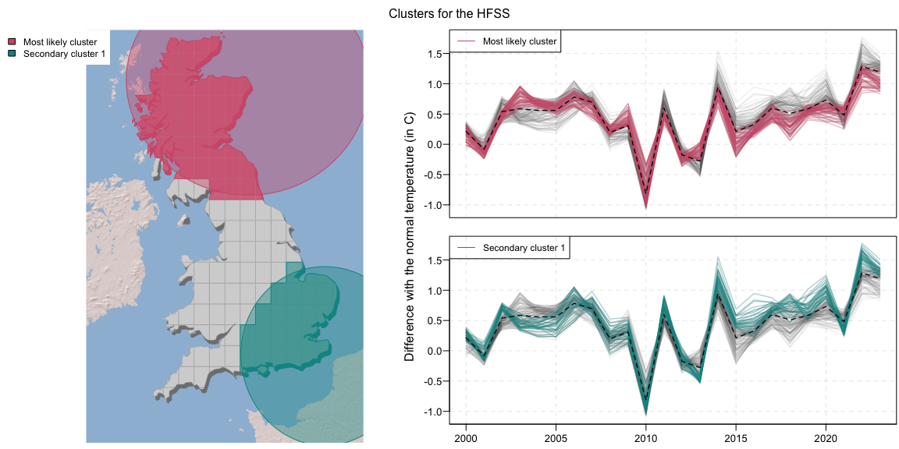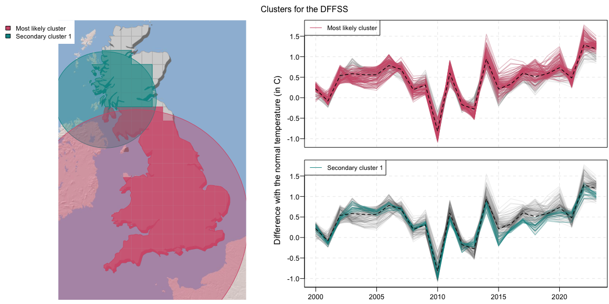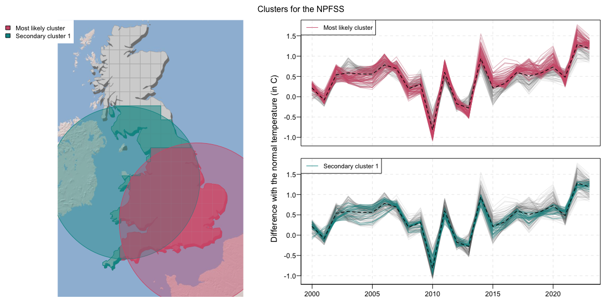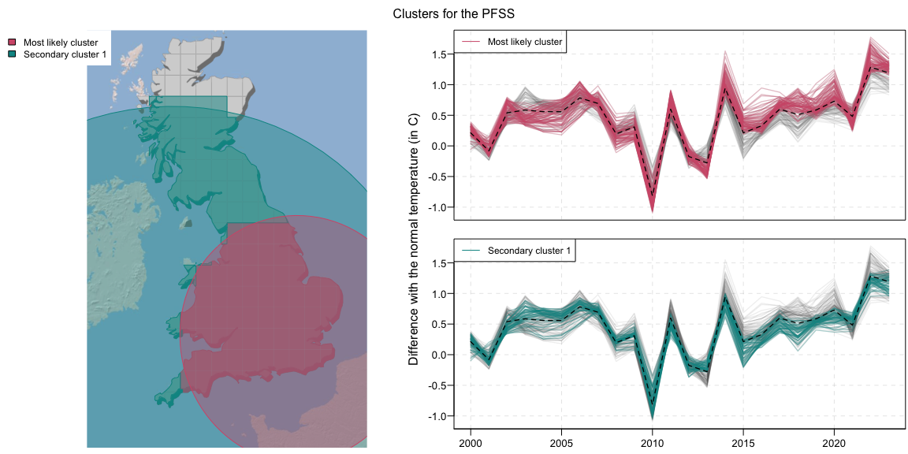

``` r
res_GB <- data.frame(nb_cluster_1 = c(length(res_np$vec), 
                            length(res_p$vec),
                            length(res_dffss$vec),
                            length(res_h$vec)),
           sign_cluster_1 = c(0.001, 0.001, 0.001, 0.001),
           nb_cluster_2 = c(length(res_np_2$vec), 
                            length(res_p_2$vec),
                            length(res_dffss_2$vec),
                            length(res_h_2$vec)),
           sign_cluster_2 = c(0.001, 0.001, 0.001, 0.001))
row.names(res_GB) <- c("NPFSS", "PFSS", "DFFSS", "HFSS")
knitr::kable(res_GB)
```

|       | nb_cluster_1 | sign_cluster_1 | nb_cluster_2 | sign_cluster_2 |
|-------|-------------:|---------------:|-------------:|---------------:|
| NPFSS |           73 |          0.001 |           30 |          0.001 |
| PFSS  |           73 |          0.001 |           52 |          0.001 |
| DFFSS |          104 |          0.001 |           20 |          0.001 |
| HFSS  |           50 |          0.001 |           31 |          0.001 |

### 3.2.3 Nigeria

We select the ISO3 of Nigeria:

``` r
my_country <- "NGA"
my_proj <- 32629 
```

``` r
select_countries <- countries_regions[countries_regions$color_code %in% my_country, ]
  
# drop the islands
sf_obj <- select_countries %>%
    filter(iso3 == my_country[1]) %>%
    mutate(area = st_area(geometry)) %>%
    top_n(1, area) %>%
    rowid_to_column() %>%
    st_cast("POLYGON")  %>% 
    mutate(area = st_area(geometry)) %>%
    group_by(rowid) %>%
    top_n(1, area)
  
if(length(my_country) > 1) {
  for(i in 2:length(my_country)) {
    sf_obj <- rbind(sf_obj, select_countries %>%
      filter(iso3 == my_country[i]) %>%
      mutate(area = st_area(geometry)) %>%
      top_n(1, area) %>%
      rowid_to_column() %>%
      st_cast("POLYGON")  %>% 
      mutate(area = st_area(geometry)) %>%
      group_by(rowid) %>%
      top_n(1, area)
    )
  }
  }
is_intersect <- st_intersects(all_cells, sf_obj)
is_intersect <- which(sapply(is_intersect, function(x) length(x) != 0))
lldata_poly <- all_cells[is_intersect, ]
  
my_contours <- st_intersection(select_countries, 
                               st_union(lldata_poly, is_coverage = T))

# dowload tiles and compose raster (SpatRaster)
nc_osm <- get_tiles(my_contours, 
                      provider = "Esri.WorldShadedRelief", 
                      zoom = 7, crop = F)
poly_cell <- merge(lldata_poly, my_grid, by = c("long", "lat"))
# coordinates of the centroid
coord_temp <- st_transform(poly_cell, my_proj)
# simplify the geometry
poly_cell <- st_intersection(poly_cell, my_contours)
```

We compute all the potential clusters:

``` r
  coord_proj <- st_coordinates(st_centroid(coord_temp))
  pairs_geo <- find_all_cluster(coord_proj)
```

    ## Number of possible combinaison:  70172

``` r
  dist_proj <- as(dist(cbind(coord_proj[, 1], coord_proj[, 2])), "matrix")

  dist_4326 <- as(dist(cbind(poly_cell$long, poly_cell$lat)), "matrix")
  coord_4326 <- st_transform(poly_cell, 4326) 
```

``` r
  my_var <- "prec_5days_" 
  temp_var <- poly_cell[, paste0(my_var, unique_year)[chosen_years]]
  MatX <- as.matrix(st_drop_geometry(temp_var))
```

#### 3.2.3.1 Descriptive Analysis

We first plot the data:

``` r
y_lim <- range(MatX)
title_var <- 'Maximum consecutive 5-days precipitation (in mm)'
#pdf(file = "figures/NGA_data.pdf", width = 12, height = 4.5)
par(mfrow = c(1, 2), mar = c(3.7, 3, 1, 1), oma = c(0, 0, 0, 0),
    las = 1, mgp = c(2.2, 0.5, 0))
# map
plot_tiles(nc_osm)
  mf_shadow(my_contours, add = T, cex = 0.8)
  plot(st_geometry(poly_cell), border = rgb(0.5, 0.5, 0.5), 
           lwd = 0.4, add = T, col = rgb(0.82, 0.82, 0.82))

# data
  plot(dates, MatX[1, ], ylim = y_lim, xlab = 'Years',
       ylab = title_var, xaxt = "n", 
       col = rgb(0.6, 0.6, 0.6, alpha = 0.5),
        type = "l")
  abline(v = seq(1980, 2025, by = 5), lty = 2, 
             col = rgb(0.7, 0.7, 0.7, alpha = 0.3))
abline(h = seq(0, 2500, by = 500),
             lty = 2, col = rgb(0.7, 0.7, 0.7, alpha = 0.3))
  axis(1, at = seq(1980, 2025, by = 5), xlab = "years",
           labels = as.character(seq(1980, 2025, by = 5)))
  for (j in 2:nrow(MatX))
        lines(dates, MatX[j, ], lwd = 1.3, 
          col = rgb(0.4, 0.4, 0.4, alpha = 0.1)) 
```


``` r
#dev.off()
```

We map the average of the variable over a 3-year window.

``` r
nb_split <- 8
step_years <- split(chosen_years, 
           sort(rep_len(1:nb_split, length.out = length(chosen_years))))
#pdf(paste0("figures/NGA_evol.pdf"), width = 12, height = 5)
par(mfrow = c(2, 4), oma = c(0, 0, 0, 0), mar = c(0, 0, 0, 0))
  my_vec <- NULL
    for (j in 1:nb_split) {
      my_vec <- c(my_vec, rowMeans(st_drop_geometry(poly_cell[, paste0(my_var, unique_year)[step_years[[j]]]])))
    }
    my_interval <- round(classInt::classIntervals(my_vec, 8, style = "jenks")$brks, digits = 4)

    nom_pal <- "YlGnBu"
    my_pal <- rev(alpha(colorspace::sequential_hcl(8, palette = nom_pal), 1))
    my_col <- my_pal[findInterval(poly_cell$my_mean, my_interval, all.inside = T)]

    for (j in 1:nb_split) {
      chosen_years_5 <- step_years[[j]]
      poly_cell$my_mean <- rowMeans(st_drop_geometry(poly_cell[, paste0(my_var, unique_year)[chosen_years_5]]))
      my_col <- alpha(my_pal[findInterval(poly_cell$my_mean, my_interval, all.inside = T)],
                  0.5)
    
      plot_tiles(nc_osm)
      plot(st_geometry(poly_cell), 
        col = my_col,
        border = my_col, lwd = 0.001, add = T)
      my_years <- unique_year[chosen_years_5]
      title(paste0(my_years[1], "-", my_years[length(my_years)]), line = -1.25)
     plot(st_geometry(my_contours), add = T, lwd = 0.5)
     if(j == 1)
       maplegend::leg(type = "choro", val = my_interval, pos = "topleft", 
                 pal = my_pal, val_rnd = 3, title = "Prec 5-days")
    }
```

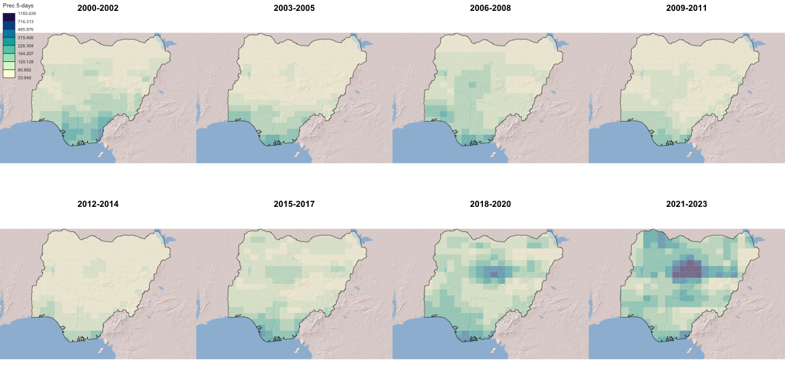

``` r
#dev.off()
```

Average mean:

``` r
nb_split <- 1
step_years <- split(chosen_years, 
           sort(rep_len(1:nb_split, length.out = length(chosen_years))))
#pdf(paste0("figures/NGA_mean.pdf"), width = 7, height = 5)
par(oma = c(0, 0, 0, 0), mar = c(0, 0, 0, 0))
  my_vec <- NULL
    for (j in 1:nb_split) {
      my_vec <- c(my_vec, rowMeans(st_drop_geometry(poly_cell[, paste0(my_var, unique_year)[step_years[[j]]]])))
    }
    my_interval <- round(classInt::classIntervals(my_vec, 8, style = "jenks")$brks, digits = 4)

    nom_pal <- "YlGnBu"
    my_pal <- rev(alpha(colorspace::sequential_hcl(8, palette = nom_pal), 1))
    my_col <- my_pal[findInterval(poly_cell$my_mean, my_interval, all.inside = T)]

    for (j in 1:nb_split) {
      chosen_years_5 <- step_years[[j]]
      poly_cell$my_mean <- rowMeans(st_drop_geometry(poly_cell[, paste0(my_var, unique_year)[chosen_years_5]]))
      my_col <- alpha(my_pal[findInterval(poly_cell$my_mean, my_interval, all.inside = T)],
                  0.5)
    
      plot_tiles(nc_osm)
      plot(st_geometry(poly_cell), 
        col = my_col,
        border = my_col, lwd = 0.001, add = T)
      my_years <- unique_year[chosen_years_5]
      #title(paste0(my_years[1], "-", my_years[length(my_years)]), line = -1.25)
     plot(st_geometry(my_contours), add = T, lwd = 0.5)
     if(j == 1)
       maplegend::leg(type = "choro", val = my_interval, pos = "topleft", 
                 pal = my_pal, val_rnd = 3, title = "Prec 5-days")
    }
```

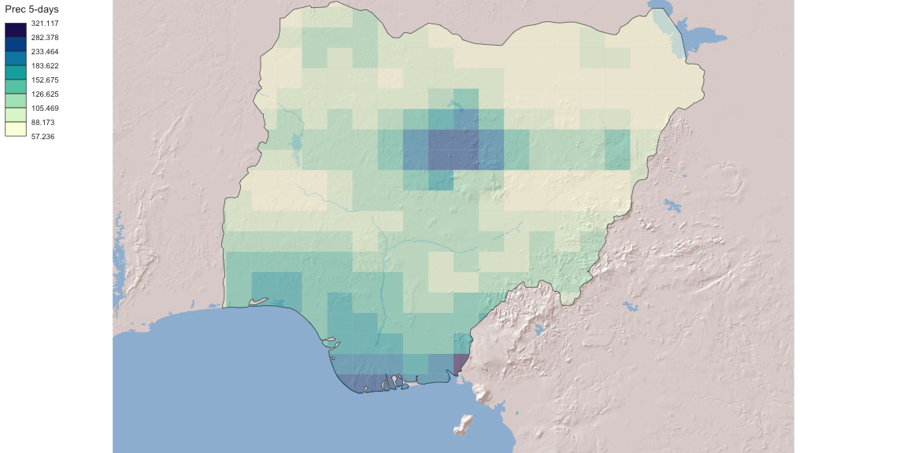

``` r
#dev.off()
```

#### 3.2.3.2 NPFSS method

**Most likely cluster**

``` r
res_np <- compute_np(pairs_geo[[1]], pairs_geo[[2]], t(MatX))
res_np
```

    ## $stat
    ## [1] 4.492757
    ## 
    ## $vec
    ##   [1] 241 240 222 221 259 239 220 258 203 202 277 238 201 276 219 257 184   8
    ##  [19] 183   7 200 275 237 182 218 256   6 199 274 181   5 164  23 165 163 236
    ##  [37]  22 217 255 162  21 180   4 198 273 161  20 235 146 216 254 147 145  37
    ##  [55] 179   3  36 160  19 144 197  35 272 143  34 159 234 178  18   2 215 253
    ##  [73] 130 142 129  33 196  52 271  51 128  50 158  17 141 127 177   1  32 252
    ##  [91]  49 233 270 126 214 285  48 157 140 115  16  67  31 114  66 195 125  15
    ## [109]  65 251 113  47 232 269  64 139 213 176 284 112  30 124  29  63  46 194
    ## [127]  14 111  79  78 250 156 231  62 123 268  77  44 175 212  45  28 283 110
    ## [145]  76 193  61  13  75 138 155 109 249  43  59 230 174 267  89  74  27 211
    ## [163]  88  60 282  87 137 192  86 122 154  12  73  58  42  71 101  85 173 248
    ## [181] 229 266  26 210  72 281 136  84 121 191  94 153 108  57  11  70  93  41
    ## [199]  83  92

**Significance (using parallel computing)**

``` r
B <- 999

c1 <- pairs_geo[[1]]
c2 <- pairs_geo[[2]]

cl <- makeCluster(10)
clusterExport(cl, c("c1", "c2", "MatX", "norm"))
res_par_np <- clusterApplyLB(cl, 1:B, compute_fun_par, compute_np)
stopCluster(cl)

cat("p-value: ", (1 + sum(sapply(res_par_np, function(x) res_np$stat <x))) /  (1 + B))
```

    ## p-value:  0.001

**Secondary cluster 1**

``` r
cluster_g1_temp <- sapply(pairs_geo[[1]], function(x) setdiff(x, res_np$vec))
cluster_g2_temp <- sapply(pairs_geo[[2]], function(x) setdiff(x, res_np$vec))
id_pos <- union(which(sapply(cluster_g1_temp, function(x) length(x) == 0)),
          which(sapply(cluster_g2_temp, function(x) length(x) == 0)))
```

``` r
res_np_2 <- compute_np(cluster_g1_temp[-id_pos], 
                       cluster_g2_temp[-id_pos], t(MatX))
res_np_2
```

    ## $stat
    ## [1] 3.094837
    ## 
    ## $vec
    ##  [1] 166 167 185 186 168 148 187 204 205 169 206 149 188 223 131 224 207 170 150
    ## [20] 189 225 132 208 226 171 242 243 151 190 244 116 227 133 209 245 172 152 117
    ## [39] 228 260 102 261 246 134 262 263 103 118

**Significance**

``` r
c1 <- cluster_g1_temp[-id_pos]
c2 <- cluster_g2_temp[-id_pos]

cl <- makeCluster(10)
clusterExport(cl, c("c1", "c2", "MatX", "norm"))
res_par_np <- clusterApplyLB(cl, 1:B, compute_fun_par, compute_np)
stopCluster(cl)

cat("p-value: ", (1 + sum(sapply(res_par_np, function(x) res_np_2$stat < x))) /  (1 + B))
```

    ## p-value:  0.001

#### 3.2.3.3 PFSS method

**Most likely cluster**

``` r
res_p <- compute_p(pairs_geo[[1]], pairs_geo[[2]], t(MatX))
res_p
```

    ## $stat
    ## [1] 202.6172
    ## 
    ## $vec
    ## [1] 254 255 253 235 272 236 234 273 271

**Significance**

``` r
c1 <- pairs_geo[[1]]
c2 <- pairs_geo[[2]]

cl <- makeCluster(10)
clusterExport(cl, c("c1", "c2", "MatX", "norm"))
res_par_p <- clusterApplyLB(cl, 1:B, compute_fun_par, compute_p)
stopCluster(cl)

cat("p-value: ", (1 + sum(sapply(res_par_p, function(x) res_p$stat <x))) /  (1 + B))
```

    ## p-value:  0.001

**Secondary cluster 1**

``` r
cluster_g1_temp <- sapply(pairs_geo[[1]], function(x) setdiff(x, res_p$vec))
cluster_g2_temp <- sapply(pairs_geo[[2]], function(x) setdiff(x, res_p$vec))
id_pos <- union(which(sapply(cluster_g1_temp, function(x) length(x) == 0)),
          which(sapply(cluster_g2_temp, function(x) length(x) == 0)))
```

``` r
res_p_2 <- compute_p(cluster_g1_temp[-id_pos], 
                       cluster_g2_temp[-id_pos], t(MatX))
res_p_2
```

    ## $stat
    ## [1] 84.68518
    ## 
    ## $vec
    ##  [1] 185 186 166 204 167 205 187 168 206 223 224 188 148 225 169 207 242 149 243
    ## [20] 226 189 170 208 244 150 227 131 245 190 260 171 261 209 262 132

**Significance**

``` r
c1 <- cluster_g1_temp[-id_pos]
c2 <- cluster_g2_temp[-id_pos]

cl <- makeCluster(10)
clusterExport(cl, c("c1", "c2", "MatX", "norm"))
res_par_p <- clusterApplyLB(cl, 1:B, compute_fun_par, compute_p)
stopCluster(cl)

cat("p-value: ", (1 + sum(sapply(res_par_p, function(x) res_p_2$stat <x))) /  (1 + B))
```

    ## p-value:  0.001

#### 3.2.3.4 DFFSS method

**Most likely cluster**

``` r
res_dffss <- compute_dffss(pairs_geo[[1]], pairs_geo[[2]], t(MatX))
res_dffss
```

    ## $stat
    ## [1] 25.44364
    ## 
    ## $vec
    ##  [1] 185 186 166 204 167 205 187 168 206 223 224 188 148 225 169 207 242 149 243
    ## [20] 226 189 170 208 244 150 227 131 245 190 260 171 261 209 262 132

**Significance**

``` r
c1 <- pairs_geo[[1]]
c2 <- pairs_geo[[2]]

cl <- makeCluster(10)
clusterExport(cl, c("c1", "c2", "MatX", "norm"))
res_par_dffss <- clusterApplyLB(cl, 1:B, compute_fun_par, compute_dffss)
stopCluster(cl)

cat("p-value: ", (1 + sum(sapply(res_par_dffss, function(x) res_p$stat <x))) /  (1 + B))
```

    ## p-value:  0.001

**Secondary cluster 1**

``` r
cluster_g1_temp <- sapply(pairs_geo[[1]], function(x) setdiff(x, res_dffss$vec))
cluster_g2_temp <- sapply(pairs_geo[[2]], function(x) setdiff(x, res_dffss$vec))
id_pos <- union(which(sapply(cluster_g1_temp, function(x) length(x) == 0)),
          which(sapply(cluster_g2_temp, function(x) length(x) == 0)))
```

``` r
res_dffss_2 <- compute_dffss(cluster_g1_temp[-id_pos], 
                       cluster_g2_temp[-id_pos], t(MatX))
res_dffss_2
```

    ## $stat
    ## [1] 23.78445
    ## 
    ## $vec
    ## [1] 254 255 253 235 272 236 234 273 271

**Significance**

``` r
c1 <- cluster_g1_temp[-id_pos]
c2 <- cluster_g2_temp[-id_pos]

cl <- makeCluster(10)
clusterExport(cl, c("c1", "c2", "MatX", "norm"))
res_par_dffss <- clusterApplyLB(cl, 1:B, compute_fun_par, compute_dffss)
stopCluster(cl)

cat("p-value: ", (1 + sum(sapply(res_par_dffss, function(x) res_dffss_2$stat <x))) /  (1 + B))
```

    ## p-value:  0.001

#### 3.2.3.5 HFSS Method

**Most likely cluster**

We first determine the value of $d$:

``` r
#pdf(paste0("figures/", my_country, "_h_CPV.pdf"), width = 6, height = 4)
temp <- compute_h(pairs_geo[[1]], pairs_geo[[2]], t(MatX), 
                           d = ncol(MatX), plot_eigen = T)
```


    ## Variance explained in % by the 10 first components:  62.51 79.72 85.9 89.73 92.04 93.67 94.99 95.94 96.68 97.28

``` r
#dev.off()
```

We choose $d=6$:

``` r
res_h <- compute_h(pairs_geo[[1]], pairs_geo[[2]], t(MatX), d = 6)
res_h
```

    ## $stat
    ## [1] 663.3982
    ## 
    ## $vec
    ## [1] 254 255 253 235 272 236 234 273 271

``` r
c1 <- pairs_geo[[1]]
c2 <- pairs_geo[[2]]

cl <- makeCluster(10)
clusterExport(cl, c("c1", "c2", "MatX", "norm"))
res_par_h <- clusterApplyLB(cl, 1:B, compute_fun_par, compute_h, d = 6)
stopCluster(cl)

cat("p-value: ", (1 + sum(sapply(res_par_h, function(x) res_h$stat <x))) /  (1 + B))
```

    ## p-value:  0.001

**Secondary cluster 1**

``` r
cluster_g1_temp <- sapply(pairs_geo[[1]], function(x) setdiff(x, res_h$vec))
cluster_g2_temp <- sapply(pairs_geo[[2]], function(x) setdiff(x, res_h$vec))
id_pos <- union(which(sapply(cluster_g1_temp, function(x) length(x) == 0)),
          which(sapply(cluster_g2_temp, function(x) length(x) == 0)))
```

We look for an optimal value of $d$:

``` r
#pdf(paste0("figures/", my_country, "_h_CPV_2.pdf"), width = 6, height = 4)
temp <- compute_h(cluster_g1_temp[-id_pos], cluster_g2_temp[-id_pos], t(MatX), 
                           d = ncol(MatX), plot_eigen = T)
```


    ## Variance explained in % by the 10 first components:  42.01 66.88 76.29 80.84 85.13 87.91 90.44 92.18 93.61 94.71

``` r
#dev.off()
```

We choose $d=6$.

``` r
res_h_2 <- compute_h(cluster_g1_temp[-id_pos], 
                     cluster_g2_temp[-id_pos], t(MatX), d = 6)
res_h_2
```

    ## $stat
    ## [1] 573.5423
    ## 
    ## $vec
    ##  [1] 224 225 223 205 243 206 204 244 242 226 207 245 186 261 187 185 262 260 227
    ## [20] 188 263 208 246 167 168 166 189 264 228 209 247 169 278 190 265 170

**Significance of the secondary cluster 1**

``` r
c1 <- cluster_g1_temp[-id_pos]
c2 <- cluster_g2_temp[-id_pos]

cl <- makeCluster(10)
clusterExport(cl, c("c1", "c2", "MatX", "norm"))
res_par_h <- clusterApplyLB(cl, 1:B, compute_fun_par, compute_h, d = 6)
stopCluster(cl)

cat("p-value: ", (1 + sum(sapply(res_par_h, function(x) res_h_2$stat <x))) /  (1 + B))
```

    ## p-value:  0.001

#### 3.2.3.6 Summary of the results

**Visualization of the result**

``` r
res <- vector("list", 4)
res[[1]][[1]] <- res_h
res[[1]][[2]] <- res_h_2
res[[2]][[1]] <- res_dffss
res[[2]][[2]] <- res_dffss_2
res[[3]][[1]] <- res_np
res[[3]][[2]] <- res_np_2
res[[4]][[1]] <- res_p
res[[4]][[2]] <- res_p_2
```

``` r
title_var <- 'Maximum consecutive 5-days precipitation (in mm)'
dates <- unique_year[chosen_years]
y_lim <- range(MatX)

for(k in 1:4) {
  my_cluster_1 <- res[[k]][[1]]$vec
  my_cluster_2 <- res[[k]][[2]]$vec

#pdf(file = paste0("figures/", my_country, "_", names_method[k], ".pdf"), width = 13, height = 4.) 
sf_use_s2(F)
nf <- layout( matrix(c(1,1,2,3), nrow=2, byrow=F) )
  par(mar = c(1.5, 0, 0, 0.2), 
      oma = c(0.5, 0, 2.4, 0), mgp = c(2.4, 0.6, 0), las = 1)
  ##### Map #########
    # map
  col_geo <- rep(rgb(0.9, 0.9, 0.9, alpha = 0.1), nrow(poly_cell))
  cex_geo <- rep(0.7, nrow(poly_cell))
  col_geo[my_cluster_1] <- alpha(cols[1], 0.8)
  cex_geo[my_cluster_1] <- 1

  col_geo[my_cluster_2] <- alpha(cols[2], 0.5)
  cex_geo[my_cluster_2] <- 1
  
  plot_tiles(nc_osm)
  mf_shadow(my_contours, add = T, cex = 0.8)
  mf_shadow(st_union(poly_cell[my_cluster_1, ]), 
                add = T, cex = 0.8, col = cols[1])
  mf_shadow(st_union(poly_cell[my_cluster_2, ]), 
         add = T, col= cols[2], cex = 0.8)
      
  plot(st_geometry(poly_cell), border = rgb(0.5, 0.5, 0.5), 
           lwd = 0.4, add = T, col = rgb(0.82, 0.82, 0.82))

  
  plot(st_geometry(poly_cell), 
        border = "white",
        col = col_geo, 
        cex = cex_geo,
        pch = 16, asp = 1, add = T, lwd = 0.1)

  plot(st_geometry(st_union(poly_cell[my_cluster_1, ])), 
         add = T, border= cols[1], col = NULL)
  plot(st_geometry(st_union(poly_cell[my_cluster_2, ])), 
         add = T, border= cols[2], col = NULL)
      
  temp_1 <- draw.circle(coord_proj[my_cluster_1[1], 1], 
                           coord_proj[my_cluster_1[1], 2], 
                  as.numeric(dist_proj[my_cluster_1[1], 
                                       my_cluster_1[length(my_cluster_1)]]))

    my_circle_1 <- st_transform(st_sfc(st_polygon(
         list(
           cbind(
             c(temp_1$x, temp_1$x[1]), 
             c(temp_1$y, temp_1$y[1]))
         )), crs = my_proj
       ), 4326)
    
  temp_2 <- draw.circle(coord_proj[my_cluster_2[1], 1], 
                           coord_proj[my_cluster_2[1], 2], 
                  as.numeric(dist_proj[my_cluster_2[1], 
                                       my_cluster_2[length(my_cluster_2)]]))
    
  my_circle_2 <- st_transform(st_sfc(st_polygon(
         list(
           cbind(
             c(temp_2$x, temp_2$x[1]), 
             c(temp_2$y, temp_2$y[1]))
         )), crs = my_proj
       ), 4326)
  
  
  ###############
  plot(st_geometry(my_circle_2), add = T, border= cols[2],
             col = alpha(cols[2], 0.4), lty=1, lwd=1)
  plot(st_geometry(my_circle_1), add = T, border= cols[1],
             col = alpha(cols[1], 0.4), lty=1, lwd=1)
  
    mtext(my_var, side = 4, line = -3.5, las = 0, cex = 0.8)
    
  legend("topleft", legend = c("Most likely cluster", "Secondary cluster 1"),
         fill = c(cols[1], cols[2]), cex = 0.9, box.lty = 0)
      
  ##### Functional data
  plot(dates, MatX[1, ], ylim = y_lim, xlab = '',
       ylab = '', col = rgb(0.6, 0.6, 0.6, alpha = 0.5), xaxt = 'n', 
        type = "l")
  legend("topleft", legend = c("Most likely cluster"),
         lty = 1, col = c(cols[1]), cex = 0.9)
  abline(v = seq(1980, 2025, by = 5), lty = 2, 
             col = rgb(0.7, 0.7, 0.7, alpha = 0.3))
  abline(h = seq(0, 2500, by = 500),
             lty = 2, col = rgb(0.7, 0.7, 0.7, alpha = 0.3))

  for (j in 2:nrow(MatX))
        lines(dates, MatX[j, ], lwd = 1.3, 
          col = rgb(0.4, 0.4, 0.4, alpha = 0.1)) 
    
  for(i in my_cluster_1)
        lines(dates, MatX[i, ], col = alpha(cols[1], 0.3),
          lty = 1, lwd = 1.3)
  
  lines(dates, colMeans(MatX), lwd = 1.3, lty = 2)
  

plot(dates, MatX[1, ], ylim = y_lim, xlab = 'Years',
       ylab = title_var, xaxt = "n", 
       col = rgb(0.6, 0.6, 0.6, alpha = 0.5),
        type = "l")
  legend("topleft", legend = c("Secondary cluster 1"),
         lty = 1, col = c(cols[2]), cex = 0.9)
  abline(v = seq(1980, 2025, by = 5), lty = 2, 
             col = rgb(0.7, 0.7, 0.7, alpha = 0.3))
  abline(h = seq(0, 2500, by = 500),
             lty = 2, col = rgb(0.7, 0.7, 0.7, alpha = 0.3))
  axis(1, at = seq(1980, 2025, by = 5), xlab = "years",
           labels = as.character(seq(1980, 2025, by = 5)))
  for (j in 2:nrow(MatX))
        lines(dates, MatX[j, ], lwd = 1.3, 
          col = rgb(0.4, 0.4, 0.4, alpha = 0.1)) 
      
  for(i in my_cluster_2)
        lines(dates, MatX[i, ], col = alpha(cols[2], 0.3),
          lty = 1, lwd = 1.3)
  
    
  lines(dates, colMeans(MatX), lwd = 1.3, lty = 2)
  
  mtext(paste0("Clusters for the ", names_method[k]), side = 3, line = 0.8, outer = TRUE)
#dev.off()
}
```

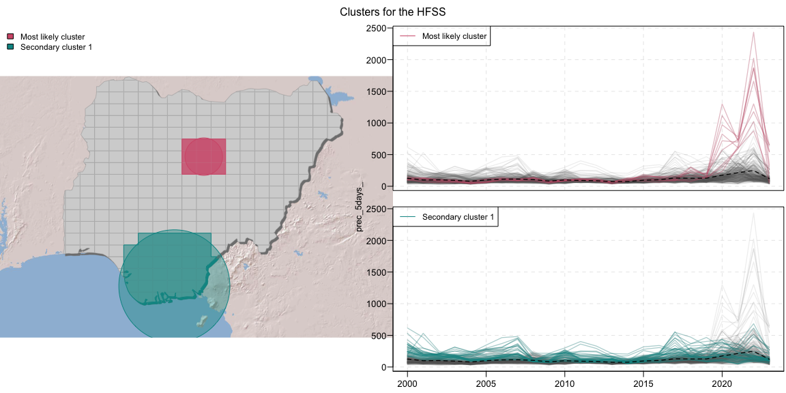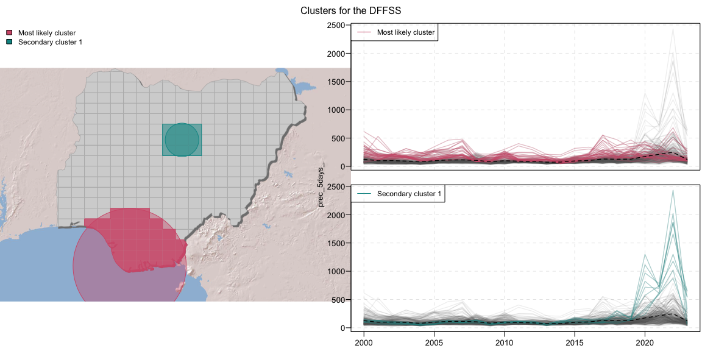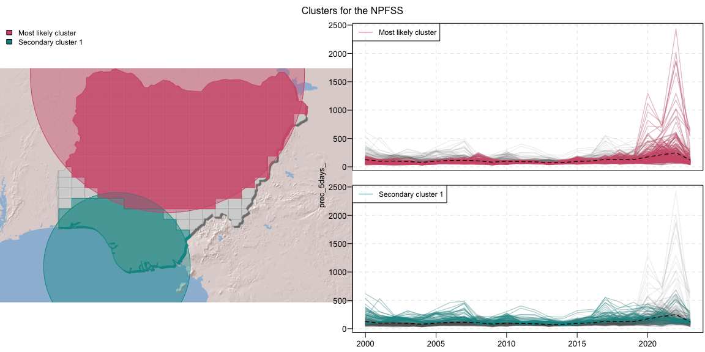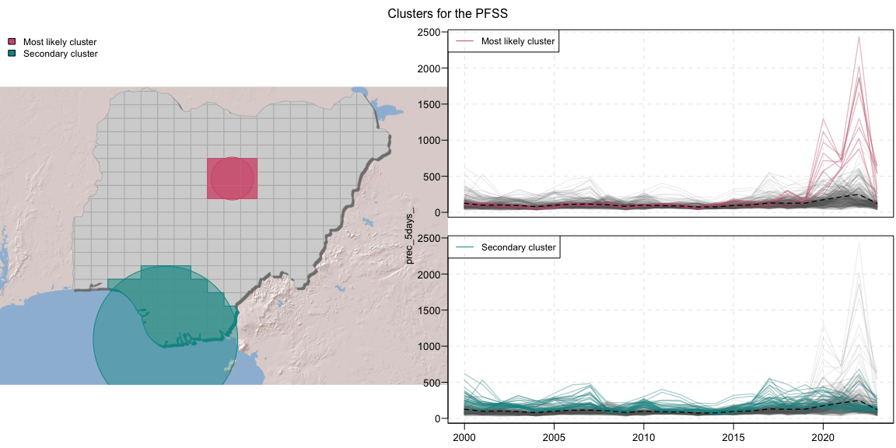

We present in the following table the results obtained by the different
methods.

``` r
res_NGA <- data.frame(nb_cluster_1 = c(length(res_np$vec), 
                            length(res_p$vec),
                            length(res_dffss$vec),
                            length(res_h$vec)),
           sign_cluster_1 = c(0.001, 0.001, 0.001, 0.001),
           nb_cluster_2 = c(length(res_np_2$vec), 
                            length(res_p_2$vec),
                            length(res_dffss_2$vec),
                            length(res_h_2$vec)),
           sign_cluster_2 = c(0.001, 0.001, 0.001, 0.001))
row.names(res_NGA) <- c("NPFSS", "PFSS", "DFFSS", "HFSS")
knitr::kable(res_NGA)
```

|       | nb_cluster_1 | sign_cluster_1 | nb_cluster_2 | sign_cluster_2 |
|-------|-------------:|---------------:|-------------:|---------------:|
| NPFSS |          200 |          0.001 |           48 |          0.001 |
| PFSS  |            9 |          0.001 |           35 |          0.001 |
| DFFSS |           35 |          0.001 |            9 |          0.001 |
| HFSS  |            9 |          0.001 |           36 |          0.001 |

### 3.2.4 Pakistan

We select the ISO3 for Pakistan:

``` r
my_country <- "PAK"
my_proj <- 9678 
```

``` r
select_countries <- countries_regions[countries_regions$color_code %in% my_country, ]
  
# drop the islands
sf_obj <- select_countries %>%
    filter(iso3 == my_country[1]) %>%
    mutate(area = st_area(geometry)) %>%
    top_n(1, area) %>%
    rowid_to_column() %>%
    st_cast("POLYGON")  %>% 
    mutate(area = st_area(geometry)) %>%
    group_by(rowid) %>%
    top_n(1, area)
  
if(length(my_country) > 1) {
  for(i in 2:length(my_country)) {
    sf_obj <- rbind(sf_obj, select_countries %>%
      filter(iso3 == my_country[i]) %>%
      mutate(area = st_area(geometry)) %>%
      top_n(1, area) %>%
      rowid_to_column() %>%
      st_cast("POLYGON")  %>% 
      mutate(area = st_area(geometry)) %>%
      group_by(rowid) %>%
      top_n(1, area)
    )
  }
  }
is_intersect <- st_intersects(all_cells, sf_obj)
is_intersect <- which(sapply(is_intersect, function(x) length(x) != 0))
lldata_poly <- all_cells[is_intersect, ]
  
my_contours <- st_intersection(select_countries, 
                               st_union(lldata_poly, is_coverage = T))

# dowload tiles and compose raster (SpatRaster)
nc_osm <- get_tiles(my_contours, 
                      provider = "Esri.WorldShadedRelief", 
                      zoom = 7, crop = F)
poly_cell <- merge(lldata_poly, my_grid, by = c("long", "lat"))
# coordinates of the centroid
coord_temp <- st_transform(poly_cell, my_proj)
# simplify the geometry
poly_cell <- st_intersection(poly_cell, my_contours)
```

We compute all the potential clusters:

``` r
  coord_proj <- st_coordinates(st_centroid(coord_temp))
  pairs_geo <- find_all_cluster(coord_proj)
```

    ## Number of possible combinaison:  71053

``` r
  dist_proj <- as(dist(cbind(coord_proj[, 1], coord_proj[, 2])), "matrix")

  dist_4326 <- as(dist(cbind(poly_cell$long, poly_cell$lat)), "matrix")
  coord_4326 <- st_transform(poly_cell, 4326) 
```

``` r
  my_var <- "prec_5days_" 
  temp_var <- poly_cell[, paste0(my_var, unique_year)[chosen_years]]
  MatX <- as.matrix(st_drop_geometry(temp_var))
```

#### 3.2.4.1 Descriptive Analysis

We first plot the data:

``` r
y_lim <- range(MatX)
title_var <- 'Maximum consecutive 5-days precipitation (in mm)'
#pdf(file = "figures/PAK_data.pdf", width = 10, height = 4.5)
par(mfrow = c(1, 2), mar = c(3.7, 3, 1, 1), oma = c(0, 0, 0, 0),
    las = 1, mgp = c(2.2, 0.8, 0))
# map
plot_tiles(nc_osm)
  mf_shadow(my_contours, add = T, cex = 0.8)
  plot(st_geometry(poly_cell), border = rgb(0.5, 0.5, 0.5), 
           lwd = 0.4, add = T, col = rgb(0.82, 0.82, 0.82))

# data
  plot(dates, MatX[1, ], ylim = y_lim, xlab = 'Years',
       ylab = title_var, xaxt = "n", 
       col = rgb(0.6, 0.6, 0.6, alpha = 0.5),
        type = "l")
  abline(v = seq(1980, 2025, by = 5), lty = 2, 
             col = rgb(0.7, 0.7, 0.7, alpha = 0.3))
abline(h = seq(0, 800, by = 200),
             lty = 2, col = rgb(0.7, 0.7, 0.7, alpha = 0.3))
  axis(1, at = seq(1980, 2025, by = 5), xlab = "years",
           labels = as.character(seq(1980, 2025, by = 5)))
  for (j in 2:nrow(MatX))
        lines(dates, MatX[j, ], lwd = 1.3, 
          col = rgb(0.4, 0.4, 0.4, alpha = 0.1)) 
```


``` r
#dev.off()
```

We map the average of the variable over a 3-year window Before the last
period, the Southeaster and the North were a little bit more impacted by
heavy precipitations. However, during the last period, heavy rainfall
affected the whole country.

``` r
nb_split <- 8
step_years <- split(chosen_years, 
           sort(rep_len(1:nb_split, length.out = length(chosen_years))))
#pdf(paste0("figures/PAK_evol.pdf"), width = 12, height = 8)
par(mfrow = c(2, 4), oma = c(0, 0, 0, 0), mar = c(0, 0, 0, 0))
  my_vec <- NULL
    for (j in 1:nb_split) {
      my_vec <- c(my_vec, rowMeans(st_drop_geometry(poly_cell[, paste0(my_var, unique_year)[step_years[[j]]]])))
    }
    my_interval <- round(classInt::classIntervals(my_vec, 8, style = "jenks")$brks, digits = 4)

    nom_pal <- "YlGnBu"
    my_pal <- rev(alpha(colorspace::sequential_hcl(8, palette = nom_pal), 1))
    my_col <- my_pal[findInterval(poly_cell$my_mean, my_interval, all.inside = T)]

    for (j in 1:nb_split) {
      chosen_years_5 <- step_years[[j]]
      poly_cell$my_mean <- rowMeans(st_drop_geometry(poly_cell[, paste0(my_var, unique_year)[chosen_years_5]]))
      my_col <- alpha(my_pal[findInterval(poly_cell$my_mean, my_interval, all.inside = T)],
                  0.5)
    
      plot_tiles(nc_osm)
      plot(st_geometry(poly_cell), 
        col = my_col,
        border = my_col, lwd = 0.001, add = T)
      my_years <- unique_year[chosen_years_5]
      title(paste0(my_years[1], "-", my_years[length(my_years)]), line = -1.25)
     plot(st_geometry(my_contours), add = T, lwd = 0.5)
     if(j == 1)
       maplegend::leg(type = "choro", val = my_interval, pos = "topleft", 
                 pal = my_pal, val_rnd = 3, title = "Prec 5-days")
    }
```

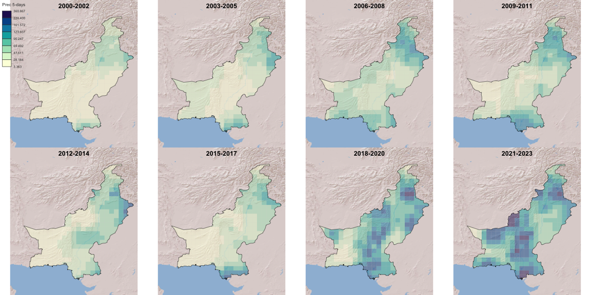

``` r
#dev.off()
```

Average mean:

``` r
nb_split <- 1
step_years <- split(chosen_years, 
           sort(rep_len(1:nb_split, length.out = length(chosen_years))))
#pdf(paste0("figures/PAK_mean.pdf"), width = 8, height = 8)
par(oma = c(0, 0, 0, 0), mar = c(0, 0, 0, 0))
  my_vec <- NULL
    for (j in 1:nb_split) {
      my_vec <- c(my_vec, rowMeans(st_drop_geometry(poly_cell[, paste0(my_var, unique_year)[step_years[[j]]]])))
    }
    my_interval <- round(classInt::classIntervals(my_vec, 8, style = "jenks")$brks, digits = 4)

    nom_pal <- "YlGnBu"
    my_pal <- rev(alpha(colorspace::sequential_hcl(8, palette = nom_pal), 1))
    my_col <- my_pal[findInterval(poly_cell$my_mean, my_interval, all.inside = T)]

    for (j in 1:nb_split) {
      chosen_years_5 <- step_years[[j]]
      poly_cell$my_mean <- rowMeans(st_drop_geometry(poly_cell[, paste0(my_var, unique_year)[chosen_years_5]]))
      my_col <- alpha(my_pal[findInterval(poly_cell$my_mean, my_interval, all.inside = T)],
                  0.5)
    
      plot_tiles(nc_osm)
      plot(st_geometry(poly_cell), 
        col = my_col,
        border = my_col, lwd = 0.001, add = T)
      my_years <- unique_year[chosen_years_5]
      #title(paste0(my_years[1], "-", my_years[length(my_years)]), line = -1.25)
     plot(st_geometry(my_contours), add = T, lwd = 0.5)
     if(j == 1)
       maplegend::leg(type = "choro", val = my_interval, pos = "topleft", 
                 pal = my_pal, val_rnd = 3, title = "Prec 5-days")
    }
```

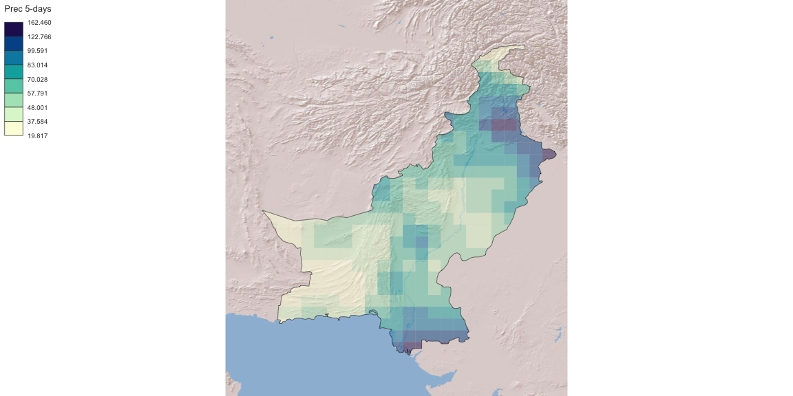

``` r
#dev.off()
```

#### 3.2.4.2 NPFSS method

**Most likely cluster**

``` r
res_np <- compute_np(pairs_geo[[1]], pairs_geo[[2]], t(MatX))
res_np
```

    ## $stat
    ## [1] 4.568634
    ## 
    ## $vec
    ##   [1] 246 247 229 264 230 228 248 211 265 231 212 210 213 209 249 266 232 195
    ##  [19] 196 194 281 214 197 193 250 267 233 177 198 178 282 176 215 179 175 251
    ##  [37] 268 234 295 199 180 283 216 159 160 158 161 157 296 181 200 252 174 269
    ##  [55] 235 162 284 156 217 302 182 142 143 173 141 297 163 201 192 155 144 253
    ##  [73] 140 270 236 145 285 218 208 139 164 183 172 154 298 202 146 125 191 126
    ##  [91] 138 124 254 127 271 237 123 165 303 286 184 153 147 219 128 207 171 122
    ## [109] 137 299 203 129 190 305 121 166 148 108 109 255 107 272 304 152 238 136
    ## [127] 110 185 130 106 287 170 220 111 120 105 300 204 306 149 189 167 112 131
    ## [145] 135 151 104 119 256 186 273 239  92  93 169  91 113 288  94 221  90 103
    ## [163] 132  95 205 168 134  89 118 114 150  96 102 187  88 257 274 240  97 289
    ## [181]  78 222  79  77  80 117 133  87  76 206  81 101  98  75  82 188  86 258
    ## [199] 275  74 241 116 290  83 223 100  68  69  67  73  70  85  66  71  65 115
    ## [217]  72  99 259 276 242  84 291  64 224 301

**Significance (using parallel computing)**

``` r
c1 <- pairs_geo[[1]]
c2 <- pairs_geo[[2]]

require(parallel)
cl <- makeCluster(10)
clusterExport(cl, c("c1", "c2", "MatX", "norm"))
res_par_np <- clusterApplyLB(cl, 1:B, compute_fun_par, compute_np)
stopCluster(cl)

cat("p-value: ", (1 + sum(sapply(res_par_np, function(x) res_np$stat < x))) /  (1 + B))
```

    ## p-value:  0.001

**Secondary cluster 1**

``` r
cluster_g1_temp <- sapply(pairs_geo[[1]], function(x) setdiff(x, res_np$vec))
cluster_g2_temp <- sapply(pairs_geo[[2]], function(x) setdiff(x, res_np$vec))
id_pos <- union(which(sapply(cluster_g1_temp, function(x) length(x) == 0)),
          which(sapply(cluster_g2_temp, function(x) length(x) == 0)))
```

``` r
res_np_2 <- compute_np(cluster_g1_temp[-id_pos], 
                       cluster_g2_temp[-id_pos], t(MatX))
res_np_2
```

    ## $stat
    ## [1] 2.894225
    ## 
    ## $vec
    ##  [1] 50 51 49 60 40 61 59 41 39 48 30 58 38 31 29

**Significance**

``` r
c1 <- cluster_g1_temp[-id_pos]
c2 <- cluster_g2_temp[-id_pos]

cl <- makeCluster(10)
clusterExport(cl, c("c1", "c2", "MatX", "norm"))
res_par_np <- clusterApplyLB(cl, 1:B, compute_fun_par, compute_np)
stopCluster(cl)

cat("p-value: ", (1 + sum(sapply(res_par_np, function(x) res_np_2$stat < x))) /  (1 + B))
```

    ## p-value:  0.001

#### 3.2.4.3 PFSS method

**Most likely cluster**

``` r
res_p <- compute_p(pairs_geo[[1]], pairs_geo[[2]], t(MatX))
res_p
```

    ## $stat
    ## [1] 48.70816
    ## 
    ## $vec
    ##   [1] 246 247 229 264 230 228 248 211 265 231 212 210 213 209 249 266 232 195
    ##  [19] 196 194 281 214 197 193 250 267 233 177 198 178 282 176 215 179 175 251
    ##  [37] 268 234 295 199 180 283 216 159 160 158 161 157 296 181 200 252 174 269
    ##  [55] 235 162 284 156 217 302 182 142 143 173 141 297 163 201 192 155 144 253
    ##  [73] 140 270 236 145 285 218 208 139 164 183 172 154 298 202 146 125 191 126
    ##  [91] 138 124 254 127 271 237 123 165 303 286 184 153 147 219 128 207 171 122
    ## [109] 137 299 203 129 190 305 121 166 148 108 109 255 107 272 304 152 238 136
    ## [127] 110 185 130 106 287 170 220 111 120 105 300 204 306 149 189 167 112 131
    ## [145] 135 151 104 119 256 186 273 239  92  93 169  91 113 288  94 221  90 103
    ## [163] 132  95 205 168 134  89 118 114 150  96 102 187  88 257 274 240  97 289
    ## [181]  78 222  79  77  80 117 133  87  76 206  81 101  98  75  82 188  86 258
    ## [199] 275  74 241 116 290  83 223 100  68  69  67  73  70  85  66  71  65 115
    ## [217]  72  99 259 276 242  84 291  64 224 301

**Significance**

``` r
c1 <- pairs_geo[[1]]
c2 <- pairs_geo[[2]]

cl <- makeCluster(10)
clusterExport(cl, c("c1", "c2", "MatX", "norm"))
res_par_p <- clusterApplyLB(cl, 1:B, compute_fun_par, compute_p)
stopCluster(cl)

cat("p-value: ", (1 + sum(sapply(res_par_p, function(x) res_p$stat <x))) /  (1 + B))
```

    ## p-value:  0.001

**Secondary cluster 1**

``` r
cluster_g1_temp <- sapply(pairs_geo[[1]], function(x) setdiff(x, res_p$vec))
cluster_g2_temp <- sapply(pairs_geo[[2]], function(x) setdiff(x, res_p$vec))
id_pos <- union(which(sapply(cluster_g1_temp, function(x) length(x) == 0)),
          which(sapply(cluster_g2_temp, function(x) length(x) == 0)))
```

``` r
res_p_2 <- compute_p(cluster_g1_temp[-id_pos], 
                       cluster_g2_temp[-id_pos], t(MatX))
res_p_2
```

    ## $stat
    ## [1] 47.41137
    ## 
    ## $vec
    ##  [1] 61 60 51 50 59 41 49 40 39 58 48 31 30 38

**Significance**

``` r
c1 <- cluster_g1_temp[-id_pos]
c2 <- cluster_g2_temp[-id_pos]

cl <- makeCluster(10)
clusterExport(cl, c("c1", "c2", "MatX", "norm"))
res_par_p <- clusterApplyLB(cl, 1:B, compute_fun_par, compute_p)
stopCluster(cl)

cat("p-value: ", (1 + sum(sapply(res_par_p, function(x) res_p_2$stat <x))) /  (1 + B))
```

    ## p-value:  0.001

#### 3.2.4.4 DFFSS method

**Most likely cluster**

``` r
res_dffss <- compute_dffss(pairs_geo[[1]], pairs_geo[[2]], t(MatX))
res_dffss
```

    ## $stat
    ## [1] 25.83991
    ## 
    ## $vec
    ##  [1] 303 304 305 298 306 299 297 302 285 300 296 286 284 287 283 295

**Significance**

``` r
c1 <- pairs_geo[[1]]
c2 <- pairs_geo[[2]]

cl <- makeCluster(10)
clusterExport(cl, c("c1", "c2", "MatX", "norm"))
res_par_dffss <- clusterApplyLB(cl, 1:B, compute_fun_par, compute_dffss)
stopCluster(cl)

cat("p-value: ", (1 + sum(sapply(res_par_dffss, function(x) res_p$stat <x))) /  (1 + B))
```

    ## p-value:  0.001

**Secondary cluster 1**

``` r
cluster_g1_temp <- sapply(pairs_geo[[1]], function(x) setdiff(x, res_dffss$vec))
cluster_g2_temp <- sapply(pairs_geo[[2]], function(x) setdiff(x, res_dffss$vec))
id_pos <- union(which(sapply(cluster_g1_temp, function(x) length(x) == 0)),
          which(sapply(cluster_g2_temp, function(x) length(x) == 0)))
```

``` r
res_dffss_2 <- compute_dffss(cluster_g1_temp[-id_pos], 
                       cluster_g2_temp[-id_pos], t(MatX))
res_dffss_2
```

    ## $stat
    ## [1] 23.20898
    ## 
    ## $vec
    ##  [1] 115 116 133  99 117 134 100 150 118 151  84 135 101 169 152  85 170 119 136
    ## [20] 102 171 153  86 189 190

**Significance**

``` r
c1 <- cluster_g1_temp[-id_pos]
c2 <- cluster_g2_temp[-id_pos]

cl <- makeCluster(10)
clusterExport(cl, c("c1", "c2", "MatX", "norm"))
res_par_dffss <- clusterApplyLB(cl, 1:B, compute_fun_par, compute_dffss)
stopCluster(cl)

cat("p-value: ", (1 + sum(sapply(res_par_dffss, function(x) res_dffss_2$stat <x))) /  (1 + B))
```

    ## p-value:  0.001

### 3.2.5 HFSS method

**Most likely cluster**

We first determine the value of $d$:

``` r
#pdf(paste0("figures/", my_country, "_h_CPV.pdf"), width = 6, height = 4)
temp <- compute_h(pairs_geo[[1]], pairs_geo[[2]], t(MatX), 
                           d = ncol(MatX), plot_eigen = T)
```

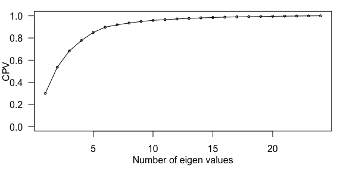

    ## Variance explained in % by the 10 first components:  30.03 53.64 68.29 77.6 84.99 89.76 91.91 93.52 94.87 95.91

``` r
#dev.off()
```

We choose $d=6$:

``` r
res_h <- compute_h(pairs_geo[[1]], pairs_geo[[2]], t(MatX), d = 6)
res_h
```

    ## $stat
    ## [1] 570.3949
    ## 
    ## $vec
    ##  [1]  83  82  97  98  96  81 113  95  71 114 112

To compute the significance, we make $B$ permutations on the data and
compute the number of times the scan statistic is lower than the
observed one:

``` r
c1 <- pairs_geo[[1]]
c2 <- pairs_geo[[2]]

cl <- makeCluster(10)
clusterExport(cl, c("c1", "c2", "MatX", "norm"))
res_par_h <- clusterApplyLB(cl, 1:B, compute_fun_par, compute_h, d = 6)
stopCluster(cl)

cat("p-value: ", (1 + sum(sapply(res_par_h, function(x) res_h$stat <x))) /  (1 + B))
```

    ## p-value:  0.001

**Secondary cluster 1**

``` r
cluster_g1_temp <- sapply(pairs_geo[[1]], function(x) setdiff(x, res_h$vec))
cluster_g2_temp <- sapply(pairs_geo[[2]], function(x) setdiff(x, res_h$vec))
id_pos <- union(which(sapply(cluster_g1_temp, function(x) length(x) == 0)),
          which(sapply(cluster_g2_temp, function(x) length(x) == 0)))
```

We look for an optimal value of $d$:

``` r
#pdf(paste0("figures/", my_country, "_h_CPV_2.pdf"), width = 6, height = 4)
temp <- compute_h(cluster_g1_temp[-id_pos], cluster_g2_temp[-id_pos], t(MatX), 
                           d = ncol(MatX), plot_eigen = T)
```


    ## Variance explained in % by the 10 first components:  33.05 56.84 68.03 77.17 83.4 88.36 90.77 92.61 94.14 95.35

``` r
#dev.off()
```

We choose $d=6$.

``` r
res_h_2 <- compute_h(cluster_g1_temp[-id_pos], 
                     cluster_g2_temp[-id_pos], t(MatX), d = 6)
res_h_2
```

    ## $stat
    ## [1] 524.82
    ## 
    ## $vec
    ##  [1] 123 124 122 140 106 141 139 107 105 125 121 157  90 142 138 108 104 158 156
    ## [20]  91  89 159 155  92 126 120  88 143 137 109 103

**Significance of the secondary cluster 1**

``` r
c1 <- cluster_g1_temp[-id_pos]
c2 <- cluster_g2_temp[-id_pos]

cl <- makeCluster(10)
clusterExport(cl, c("c1", "c2", "MatX", "norm"))
res_par_h <- clusterApplyLB(cl, 1:B, compute_fun_par, compute_h, d = 6)
stopCluster(cl)

cat("p-value: ", (1 + sum(sapply(res_par_h, function(x) res_h_2$stat <x))) /  (1 + B))
```

    ## p-value:  0.001

### 3.2.6 Summary of the results

**Visualization of the result**

``` r
res <- vector("list", 4)
res[[1]][[1]] <- res_h
res[[1]][[2]] <- res_h_2
res[[2]][[1]] <- res_dffss
res[[2]][[2]] <- res_dffss_2
res[[3]][[1]] <- res_np
res[[3]][[2]] <- res_np_2
res[[4]][[1]] <- res_p
res[[4]][[2]] <- res_p_2
```

``` r
title_var <- 'Maximum consecutive 5-days precipitation (in mm)'
dates <- unique_year[chosen_years]
y_lim <- range(MatX)

for(k in 1:4) {
  my_cluster_1 <- res[[k]][[1]]$vec
  my_cluster_2 <- res[[k]][[2]]$vec

#pdf(file = paste0("figures/", my_country, "_", names_method[k], ".pdf"), width = 13, height = 4.2) 
sf_use_s2(F)
nf <- layout( matrix(c(1,1,2,3), nrow=2, byrow=F) )
  par(mar = c(1.5, 0, 0, 0.2), 
      oma = c(0.5, 0, 2.4, 0), mgp = c(2.4, 0.6, 0), las = 1)
  ##### Map #########
    # map
  col_geo <- rep(rgb(0.9, 0.9, 0.9, alpha = 0.1), nrow(poly_cell))
  cex_geo <- rep(0.7, nrow(poly_cell))
  col_geo[my_cluster_1] <- alpha(cols[1], 0.8)
  cex_geo[my_cluster_1] <- 1

  col_geo[my_cluster_2] <- alpha(cols[2], 0.5)
  cex_geo[my_cluster_2] <- 1
  
  plot_tiles(nc_osm)
  mf_shadow(my_contours, add = T, cex = 0.8)
  mf_shadow(st_union(poly_cell[my_cluster_1, ]), 
                add = T, cex = 0.8, col = cols[1])
  mf_shadow(st_union(poly_cell[my_cluster_2, ]), 
         add = T, col= cols[2], cex = 0.8)
      
  plot(st_geometry(poly_cell), border = rgb(0.5, 0.5, 0.5), 
           lwd = 0.4, add = T, col = rgb(0.82, 0.82, 0.82))

  
  plot(st_geometry(poly_cell), 
        border = "white",
        col = col_geo, 
        cex = cex_geo,
        pch = 16, asp = 1, add = T, lwd = 0.1)

  plot(st_geometry(st_union(poly_cell[my_cluster_1, ])), 
         add = T, border= cols[1], col = NULL)
  plot(st_geometry(st_union(poly_cell[my_cluster_2, ])), 
         add = T, border= cols[2], col = NULL)
      
  temp_1 <- draw.circle(coord_proj[my_cluster_1[1], 1], 
                           coord_proj[my_cluster_1[1], 2], 
                  as.numeric(dist_proj[my_cluster_1[1], 
                                       my_cluster_1[length(my_cluster_1)]]))

    my_circle_1 <- st_transform(st_sfc(st_polygon(
         list(
           cbind(
             c(temp_1$x, temp_1$x[1]), 
             c(temp_1$y, temp_1$y[1]))
         )), crs = my_proj
       ), 4326)
    
  temp_2 <- draw.circle(coord_proj[my_cluster_2[1], 1], 
                           coord_proj[my_cluster_2[1], 2], 
                  as.numeric(dist_proj[my_cluster_2[1], 
                                       my_cluster_2[length(my_cluster_2)]]))
    
  my_circle_2 <- st_transform(st_sfc(st_polygon(
         list(
           cbind(
             c(temp_2$x, temp_2$x[1]), 
             c(temp_2$y, temp_2$y[1]))
         )), crs = my_proj
       ), 4326)
  
  
  ###############
  plot(st_geometry(my_circle_2), add = T, border= cols[2],
             col = alpha(cols[2], 0.4), lty=1, lwd=1)
  plot(st_geometry(my_circle_1), add = T, border= cols[1],
             col = alpha(cols[1], 0.4), lty=1, lwd=1)
  
    mtext(my_var, side = 4, line = -3.5, las = 0, cex = 0.8)
    
  legend("topleft", legend = c("Most likely cluster", "Secondary cluster 1"),
         fill = c(cols[1], cols[2]), cex = 0.9, box.lty = 0)
      
  ##### Functional data
  plot(dates, MatX[1, ], ylim = y_lim, xlab = '',
       ylab = '', col = rgb(0.6, 0.6, 0.6, alpha = 0.5), xaxt = 'n', 
        type = "l")
  legend("topleft", legend = c("Most likely cluster"),
         lty = 1, col = c(cols[1]), cex = 0.9)
  abline(v = seq(1980, 2025, by = 5), lty = 2, 
             col = rgb(0.7, 0.7, 0.7, alpha = 0.3))
  abline(h = seq(0, 2500, by = 200),
             lty = 2, col = rgb(0.7, 0.7, 0.7, alpha = 0.3))

  for (j in 2:nrow(MatX))
        lines(dates, MatX[j, ], lwd = 1.3, 
          col = rgb(0.4, 0.4, 0.4, alpha = 0.1)) 
    
  for(i in my_cluster_1)
        lines(dates, MatX[i, ], col = alpha(cols[1], 0.3),
          lty = 1, lwd = 1.3)
  
  lines(dates, colMeans(MatX), lwd = 1.3, lty = 2)
  

plot(dates, MatX[1, ], ylim = y_lim, xlab = 'Years',
       ylab = title_var, xaxt = "n", 
       col = rgb(0.6, 0.6, 0.6, alpha = 0.5),
        type = "l")
  legend("topleft", legend = c("Secondary cluster 1"),
         lty = 1, col = c(cols[2]), cex = 0.9)
  abline(v = seq(1980, 2025, by = 5), lty = 2, 
             col = rgb(0.7, 0.7, 0.7, alpha = 0.3))
  abline(h = seq(0, 2500, by = 200),
             lty = 2, col = rgb(0.7, 0.7, 0.7, alpha = 0.3))
  axis(1, at = seq(1980, 2025, by = 5), xlab = "years",
           labels = as.character(seq(1980, 2025, by = 5)))
  for (j in 2:nrow(MatX))
        lines(dates, MatX[j, ], lwd = 1.3, 
          col = rgb(0.4, 0.4, 0.4, alpha = 0.1)) 
      
  for(i in my_cluster_2)
        lines(dates, MatX[i, ], col = alpha(cols[2], 0.3),
          lty = 1, lwd = 1.3)
  
    
  lines(dates, colMeans(MatX), lwd = 1.3, lty = 2)
  
  mtext(paste0("Clusters for the ", names_method[k]), side = 3, line = 0.8, outer = TRUE)
#dev.off()
}
```

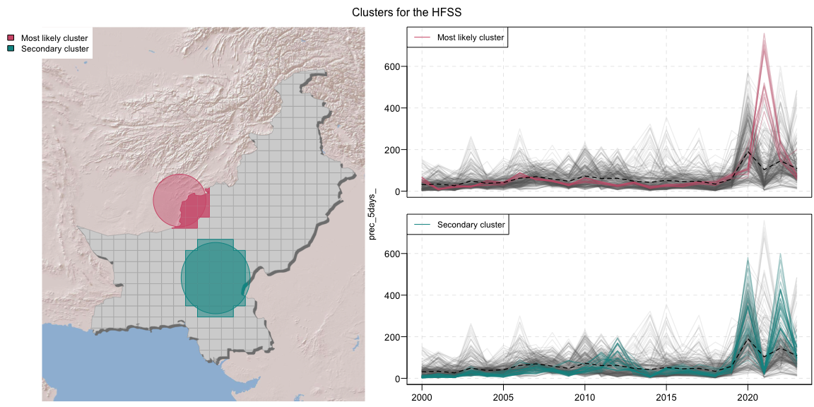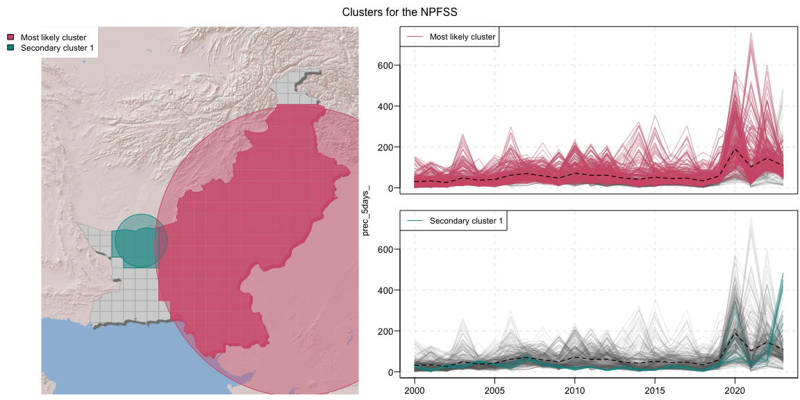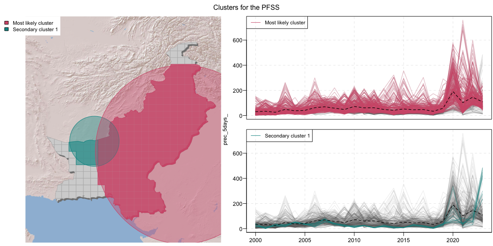

We present in the following table the results obtained by the different
methods.

``` r
res_PAK <- data.frame(nb_cluster_1 = c(length(res_np$vec), 
                            length(res_p$vec),
                            length(res_dffss$vec),
                            length(res_h$vec)),
           sign_cluster_1 = c(0.001, 0.001, 0.001, 0.001),
           nb_cluster_2 = c(length(res_np_2$vec), 
                            length(res_p_2$vec),
                            length(res_dffss_2$vec),
                            length(res_h_2$vec)),
           sign_cluster_2 = c(0.001, 0.001, 0.001, 0.001))
row.names(res_PAK) <- c("NPFSS", "PFSS", "DFFSS", "HFSS")
knitr::kable(res_PAK)
```

|       | nb_cluster_1 | sign_cluster_1 | nb_cluster_2 | sign_cluster_2 |
|-------|-------------:|---------------:|-------------:|---------------:|
| NPFSS |          226 |          0.001 |           15 |          0.001 |
| PFSS  |          226 |          0.001 |           14 |          0.001 |
| DFFSS |           16 |          0.001 |           25 |          0.001 |
| HFSS  |           11 |          0.001 |           31 |          0.001 |

### 3.2.7 Venezuela

We select the ISO3 for Venezuela:

``` r
my_country <- "VEN"
my_proj <- 4247 
```

``` r
select_countries <- countries_regions[countries_regions$color_code %in% my_country, ]
  
# drop the islands
sf_obj <- select_countries %>%
    filter(iso3 == my_country[1]) %>%
    mutate(area = st_area(geometry)) %>%
    top_n(1, area) %>%
    rowid_to_column() %>%
    st_cast("POLYGON")  %>% 
    mutate(area = st_area(geometry)) %>%
    group_by(rowid) %>%
    top_n(1, area)
  
if(length(my_country) > 1) {
  for(i in 2:length(my_country)) {
    sf_obj <- rbind(sf_obj, select_countries %>%
      filter(iso3 == my_country[i]) %>%
      mutate(area = st_area(geometry)) %>%
      top_n(1, area) %>%
      rowid_to_column() %>%
      st_cast("POLYGON")  %>% 
      mutate(area = st_area(geometry)) %>%
      group_by(rowid) %>%
      top_n(1, area)
    )
  }
  }
is_intersect <- st_intersects(all_cells, sf_obj)
is_intersect <- which(sapply(is_intersect, function(x) length(x) != 0))
lldata_poly <- all_cells[is_intersect, ]
  
my_contours <- st_intersection(select_countries, 
                               st_union(lldata_poly, is_coverage = T))

# dowload tiles and compose raster (SpatRaster)
nc_osm <- get_tiles(my_contours, 
                      provider = "Esri.WorldShadedRelief", 
                      zoom = 7, crop = F)
poly_cell <- merge(lldata_poly, my_grid, by = c("long", "lat"))
# coordinates of the centroid
coord_temp <- st_transform(poly_cell, my_proj)
# simplify the geometry
poly_cell <- st_intersection(poly_cell, my_contours)
```

We compute all the potential clusters:

``` r
  coord_proj <- st_coordinates(st_centroid(coord_temp))
  pairs_geo <- find_all_cluster(coord_proj)
```

    ## Number of possible combinaison:  76138

``` r
  dist_proj <- as(dist(cbind(coord_proj[, 1], coord_proj[, 2])), "matrix")

  dist_4326 <- as(dist(cbind(poly_cell$long, poly_cell$lat)), "matrix")
  coord_4326 <- st_transform(poly_cell, 4326) 
```

``` r
  my_var <- "hwd_upp_" 
  temp_var <- poly_cell[, paste0(my_var, unique_year)[chosen_years]]
  MatX <- as.matrix(st_drop_geometry(temp_var))
```

#### 3.2.7.1 Descriptive Analysis

We first plot the data:

``` r
y_lim <- range(MatX)
title_var <- 'Heat wave duration (in days)'
#pdf(file = "figures/VEN_data.pdf", width = 11, height = 4.5)
par(mfrow = c(1, 2), mar = c(3.7, 3, 1, 1), oma = c(0, 0, 0, 0),
    las = 1, mgp = c(2.2, 0.8, 0))
# map
plot_tiles(nc_osm)
  mf_shadow(my_contours, add = T, cex = 0.8)
  plot(st_geometry(poly_cell), border = rgb(0.5, 0.5, 0.5), 
           lwd = 0.4, add = T, col = rgb(0.82, 0.82, 0.82))

# data
  plot(dates, MatX[1, ], ylim = y_lim, xlab = 'Years',
       ylab = title_var, xaxt = "n", 
       col = rgb(0.6, 0.6, 0.6, alpha = 0.5),
        type = "l")
  abline(v = seq(1980, 2025, by = 5), lty = 2, 
             col = rgb(0.7, 0.7, 0.7, alpha = 0.3))
abline(h = seq(0, 250, by = 50),
             lty = 2, col = rgb(0.7, 0.7, 0.7, alpha = 0.3))
  axis(1, at = seq(1980, 2025, by = 5), xlab = "years",
           labels = as.character(seq(1980, 2025, by = 5)))
  for (j in 2:nrow(MatX))
        lines(dates, MatX[j, ], lwd = 1.3, 
          col = rgb(0.4, 0.4, 0.4, alpha = 0.1)) 
```


``` r
#dev.off()
```

We map the average of the variable over a 3-year window.

``` r
nb_split <- 8
step_years <- split(chosen_years, 
           sort(rep_len(1:nb_split, length.out = length(chosen_years))))
#pdf(paste0("figures/VEN_evol.pdf"), width = 12, height = 5)
par(mfrow = c(2, 4), oma = c(0, 0, 0, 0), mar = c(0, 0, 0, 0))
  my_vec <- NULL
    for (j in 1:nb_split) {
      my_vec <- c(my_vec, rowMeans(st_drop_geometry(poly_cell[, paste0(my_var, unique_year)[step_years[[j]]]])))
    }
    my_interval <- round(classInt::classIntervals(my_vec, 7, style = "jenks")$brks, digits = 4)

    nom_pal <- "YlGnBu"
    my_pal <- rev(alpha(colorspace::sequential_hcl(7, palette = nom_pal), 1))
    my_col <- my_pal[findInterval(poly_cell$my_mean, my_interval, all.inside = T)]

    for (j in 1:nb_split) {
      chosen_years_5 <- step_years[[j]]
      poly_cell$my_mean <- rowMeans(st_drop_geometry(poly_cell[, paste0(my_var, unique_year)[chosen_years_5]]))
      my_col <- alpha(my_pal[findInterval(poly_cell$my_mean, my_interval, all.inside = T)],
                  0.5)
    
      plot_tiles(nc_osm)
      plot(st_geometry(poly_cell), 
        col = my_col,
        border = my_col, lwd = 0.001, add = T)
      my_years <- unique_year[chosen_years_5]
      title(paste0(my_years[1], "-", my_years[length(my_years)]), line = -1.25)
     plot(st_geometry(my_contours), add = T, lwd = 0.5)
     if(j == 1)
       maplegend::leg(type = "choro", val = my_interval, pos = "topleft", 
                 pal = my_pal, val_rnd = 3, title = "Heatwave days")
    }
```


``` r
#dev.off()
```

Average:

``` r
nb_split <- 1
step_years <- split(chosen_years, 
           sort(rep_len(1:nb_split, length.out = length(chosen_years))))
#pdf(paste0("figures/VEN_mean.pdf"), width = 7, height = 5)
par(oma = c(0, 0, 0, 0), mar = c(0, 0, 0, 0))
  my_vec <- NULL
    for (j in 1:nb_split) {
      my_vec <- c(my_vec, rowMeans(st_drop_geometry(poly_cell[, paste0(my_var, unique_year)[step_years[[j]]]])))
    }
    my_interval <- round(classInt::classIntervals(my_vec, 7, style = "jenks")$brks, digits = 4)

    nom_pal <- "YlGnBu"
    my_pal <- rev(alpha(colorspace::sequential_hcl(7, palette = nom_pal), 1))
    my_col <- my_pal[findInterval(poly_cell$my_mean, my_interval, all.inside = T)]

    for (j in 1:nb_split) {
      chosen_years_5 <- step_years[[j]]
      poly_cell$my_mean <- rowMeans(st_drop_geometry(poly_cell[, paste0(my_var, unique_year)[chosen_years_5]]))
      my_col <- alpha(my_pal[findInterval(poly_cell$my_mean, my_interval, all.inside = T)],
                  0.5)
    
      plot_tiles(nc_osm)
      plot(st_geometry(poly_cell), 
        col = my_col,
        border = my_col, lwd = 0.001, add = T)
      my_years <- unique_year[chosen_years_5]
   #   title(paste0(my_years[1], "-", my_years[length(my_years)]), line = -1.25)
     plot(st_geometry(my_contours), add = T, lwd = 0.5)
     if(j == 1)
       maplegend::leg(type = "choro", val = my_interval, pos = "topleft", 
                 pal = my_pal, val_rnd = 3, title = "Heatwave days")
    }
```


``` r
#dev.off()
```

#### 3.2.7.2 NPFSS method

**Most likely cluster**

``` r
res_np <- compute_np(pairs_geo[[1]], pairs_geo[[2]], t(MatX))
res_np
```

    ## $stat
    ## [1] 5.599516
    ## 
    ## $vec
    ##   [1] 220 221 219 232 205 233 231 206 204 222 218 234 230 207 203 244 187 243
    ##  [19] 245 188 186 223 217 246 242 189 185 208 235 229 202 256 167 255 257 168
    ##  [37] 166 247 241 190 184 209 216 191 224 228 201 254 258 169 165 173 236 240
    ##  [55] 183 259 253 170 164 266 146 210 215 265 267 147 145 192 225 200 264 268
    ##  [73] 148 144 248 153 163 174 237 182 269 149 143 211 214 226 199 277 125 154
    ##  [91] 249 162 276 278 126 124 260 132 142 238 181 275 279 127 123

**Significance (using parallel computing)**

``` r
c1 <- pairs_geo[[1]]
c2 <- pairs_geo[[2]]

cl <- makeCluster(10)
clusterExport(cl, c("c1", "c2", "MatX", "norm"))
res_par_np <- clusterApplyLB(cl, 1:B, compute_fun_par, compute_np)
stopCluster(cl)

cat("p-value: ", (1 + sum(sapply(res_par_np, function(x) res_np$stat < x))) /  (1 + B))
```

    ## p-value:  0.001

**Secondary cluster 1**

``` r
cluster_g1_temp <- sapply(pairs_geo[[1]], function(x) setdiff(x, res_np$vec))
cluster_g2_temp <- sapply(pairs_geo[[2]], function(x) setdiff(x, res_np$vec))
id_pos <- union(which(sapply(cluster_g1_temp, function(x) length(x) == 0)),
          which(sapply(cluster_g2_temp, function(x) length(x) == 0)))
```

``` r
res_np_2 <- compute_np(cluster_g1_temp[-id_pos], 
                       cluster_g2_temp[-id_pos], t(MatX))
res_np_2
```

    ## $stat
    ## [1] 4.223656
    ## 
    ## $vec
    ##  [1]  62  63  61  45  80  46  44  81  79  64  60  43  47  82  30  99  31  29 100
    ## [20]  98  65  32 101  97  48  83  78  16 118  17  15 119 117  33 102  96  66  59
    ## [39]  49  84  77  18 120 116  34 103

**Significance**

``` r
c1 <- cluster_g1_temp[-id_pos]
c2 <- cluster_g2_temp[-id_pos]

cl <- makeCluster(10)
clusterExport(cl, c("c1", "c2", "MatX", "norm"))
res_par_np <- clusterApplyLB(cl, 1:B, compute_fun_par, compute_np)
stopCluster(cl)

cat("p-value: ", (1 + sum(sapply(res_par_np, function(x) res_np_2$stat < x))) /  (1 + B))
```

    ## p-value:  0.001

#### 3.2.7.3 PFSS method

**Most likely cluster**

``` r
res_p <- compute_p(pairs_geo[[1]], pairs_geo[[2]], t(MatX))
res_p
```

    ## $stat
    ## [1] 150.8187
    ## 
    ## $vec
    ##  [1] 232 233 231 220 244 219 221 245 243 234 230 222 246 218 242 256 205 255 257
    ## [20] 206 204 235 229 258 254 207 203 223 247 217 241 266 187 265 267 188 186 259
    ## [39] 253 208 202 224 228 209 236 216 240 264 268 189 185 191 248 201 269 190 184
    ## [58] 277 167 225 276 278 168 166 210 237 215 275 279 169 165 260 173

**Significance**

``` r
c1 <- pairs_geo[[1]]
c2 <- pairs_geo[[2]]

cl <- makeCluster(10)
clusterExport(cl, c("c1", "c2", "MatX", "norm"))
res_par_p <- clusterApplyLB(cl, 1:B, compute_fun_par, compute_p)
stopCluster(cl)

cat("p-value: ", (1 + sum(sapply(res_par_p, function(x) res_p$stat <x))) /  (1 + B))
```

    ## p-value:  0.001

**Secondary cluster 1**

``` r
cluster_g1_temp <- sapply(pairs_geo[[1]], function(x) setdiff(x, res_p$vec))
cluster_g2_temp <- sapply(pairs_geo[[2]], function(x) setdiff(x, res_p$vec))
id_pos <- union(which(sapply(cluster_g1_temp, function(x) length(x) == 0)),
          which(sapply(cluster_g2_temp, function(x) length(x) == 0)))
```

``` r
res_p_2 <- compute_p(cluster_g1_temp[-id_pos], 
                       cluster_g2_temp[-id_pos], t(MatX))
res_p_2
```

    ## $stat
    ## [1] 72.37469
    ## 
    ## $vec
    ##  [1]  62  63  61  45  80  46  44  81  79  64  60  43  47  82  30  99  31  29 100
    ## [20]  98  65  32 101  97  48  83  78

**Significance**

``` r
c1 <- cluster_g1_temp[-id_pos]
c2 <- cluster_g2_temp[-id_pos]

cl <- makeCluster(10)
clusterExport(cl, c("c1", "c2", "MatX", "norm"))
res_par_p <- clusterApplyLB(cl, 1:B, compute_fun_par, compute_p)
stopCluster(cl)

cat("p-value: ", (1 + sum(sapply(res_par_p, function(x) res_p_2$stat <x))) /  (1 + B))
```

    ## p-value:  0.001

#### 3.2.7.4 DFFSS method

**Most likely cluster**

``` r
res_dffss <- compute_dffss(pairs_geo[[1]], pairs_geo[[2]], t(MatX))
res_dffss
```

    ## $stat
    ## [1] 25.80327
    ## 
    ## $vec
    ##  [1] 232 233 231 220 244 219 221 245 243 234 230 222 246 218 242 256 205 255 257
    ## [20] 206 204 235 229 258 254 207 203 223 247 217 241 266 187 265 267 188 186 259
    ## [39] 253 208 202 224 228 209 236 216 240 264 268 189 185 191 248 201 269 190 184
    ## [58] 277 167 225 276 278 168 166 210 237 215 275 279 169 165 260 173

**Significance**

``` r
c1 <- pairs_geo[[1]]
c2 <- pairs_geo[[2]]

cl <- makeCluster(10)
clusterExport(cl, c("c1", "c2", "MatX", "norm"))
res_par_dffss <- clusterApplyLB(cl, 1:B, compute_fun_par, compute_dffss)
stopCluster(cl)

cat("p-value: ", (1 + sum(sapply(res_par_dffss, function(x) res_p$stat <x))) /  (1 + B))
```

    ## p-value:  0.001

**Secondary cluster 1**

``` r
cluster_g1_temp <- sapply(pairs_geo[[1]], function(x) setdiff(x, res_dffss$vec))
cluster_g2_temp <- sapply(pairs_geo[[2]], function(x) setdiff(x, res_dffss$vec))
id_pos <- union(which(sapply(cluster_g1_temp, function(x) length(x) == 0)),
          which(sapply(cluster_g2_temp, function(x) length(x) == 0)))
```

``` r
res_dffss_2 <- compute_dffss(cluster_g1_temp[-id_pos], 
                       cluster_g2_temp[-id_pos], t(MatX))
res_dffss_2
```

    ## $stat
    ## [1] 23.59767
    ## 
    ## $vec
    ##  [1]  61  62  60  44  79  43  45  80  63  46  81  78  29  98  30  99  97  64  59
    ## [20]  31 100  96  47  82

**Significance**

``` r
c1 <- cluster_g1_temp[-id_pos]
c2 <- cluster_g2_temp[-id_pos]

cl <- makeCluster(10)
clusterExport(cl, c("c1", "c2", "MatX", "norm"))
res_par_dffss <- clusterApplyLB(cl, 1:B, compute_fun_par, compute_dffss)
stopCluster(cl)

cat("p-value: ", (1 + sum(sapply(res_par_dffss, function(x) res_dffss_2$stat <x))) /  (1 + B))
```

    ## p-value:  0.001

### 3.2.8 HFSS method

**Most likely cluster**

We first determine the value of $d$:

``` r
#pdf(paste0("figures/", my_country, "_h_CPV.pdf"), width = 6, height = 4)
temp <- compute_h(pairs_geo[[1]], pairs_geo[[2]], t(MatX), 
                           d = ncol(MatX), plot_eigen = T)
```

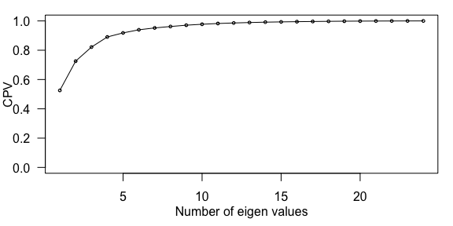

    ## Variance explained in % by the 10 first components:  52.58 72.55 82.14 89.04 91.83 93.95 95.22 96.19 97.09 97.73

``` r
#dev.off()
```

We choose $d=6$:

``` r
res_h <- compute_h(pairs_geo[[1]], pairs_geo[[2]], t(MatX), d = 6)
res_h
```

    ## $stat
    ## [1] 868.5283
    ## 
    ## $vec
    ##  [1]  62  63  61  45  80  46  44  81  79  64  60  43  47  82  30  99  31  29 100
    ## [20]  98  65  32 101  97  48  83  78  16 118  17  15 119 117  33 102

To compute the significance, we make $B$ permutations on the data and
compute the number of times the scan statistic is lower than the
observed one:

``` r
c1 <- pairs_geo[[1]]
c2 <- pairs_geo[[2]]

cl <- makeCluster(10)
clusterExport(cl, c("c1", "c2", "MatX", "norm"))
res_par_h <- clusterApplyLB(cl, 1:B, compute_fun_par, compute_h, d = 6)
stopCluster(cl)

cat("p-value: ", (1 + sum(sapply(res_par_h, function(x) res_h$stat <x))) /  (1 + B))
```

    ## p-value:  0.001

**Secondary cluster 1**

``` r
cluster_g1_temp <- sapply(pairs_geo[[1]], function(x) setdiff(x, res_h$vec))
cluster_g2_temp <- sapply(pairs_geo[[2]], function(x) setdiff(x, res_h$vec))
id_pos <- union(which(sapply(cluster_g1_temp, function(x) length(x) == 0)),
          which(sapply(cluster_g2_temp, function(x) length(x) == 0)))
```

We look for an optimal value of $d$:

``` r
#pdf(paste0("figures/", my_country, "_h_CPV_2.pdf"), width = 6, height = 4)
temp <- compute_h(cluster_g1_temp[-id_pos], cluster_g2_temp[-id_pos], t(MatX), 
                           d = ncol(MatX), plot_eigen = T)
```


    ## Variance explained in % by the 10 first components:  62.47 79.57 87.5 90.63 93.12 94.77 96.08 97.03 97.7 98.16

``` r
#dev.off()
```

We choose $d=6$.

``` r
res_h_2 <- compute_h(cluster_g1_temp[-id_pos], 
                     cluster_g2_temp[-id_pos], t(MatX), d = 6)
res_h_2
```

    ## $stat
    ## [1] 593.5724
    ## 
    ## $vec
    ##  [1] 231 232 230 219 243 220 218 244 242 233 229 221 245 217 241 255 204 254 256
    ## [20] 205 203 234 228 257 253 206 202 222 246 216 240 265 186 264 266 187 185 258
    ## [39] 207 201 235 223 247 215 267 188 184 208 259 200 268 189 183 276 166 224 275
    ## [58] 277 167 165 209 236 214 278 168 164 269 190 182 191 248

**Significance of the secondary cluster 1**

``` r
c1 <- cluster_g1_temp[-id_pos]
c2 <- cluster_g2_temp[-id_pos]

cl <- makeCluster(10)
clusterExport(cl, c("c1", "c2", "MatX", "norm"))
res_par_h <- clusterApplyLB(cl, 1:B, compute_fun_par, compute_h, d = 6)
stopCluster(cl)

cat("p-value: ", (1 + sum(sapply(res_par_h, function(x) res_h_2$stat <x))) /  (1 + B))
```

    ## p-value:  0.001

### 3.2.9 Summary of the results

**Visualization of the result**

``` r
res <- vector("list", 4)
res[[1]][[1]] <- res_h
res[[1]][[2]] <- res_h_2
res[[2]][[1]] <- res_dffss
res[[2]][[2]] <- res_dffss_2
res[[3]][[1]] <- res_np
res[[3]][[2]] <- res_np_2
res[[4]][[1]] <- res_p
res[[4]][[2]] <- res_p_2
```

``` r
my_var <- 'Heat wave duration (in days)'
dates <- unique_year[chosen_years]
y_lim <- range(MatX)

for(k in 1:4) {
  my_cluster_1 <- res[[k]][[1]]$vec
  my_cluster_2 <- res[[k]][[2]]$vec

#pdf(file = paste0("figures/", my_country, "_", names_method[k], ".pdf"), width = 13, height = 4.2) 
sf_use_s2(F)
nf <- layout( matrix(c(1,1,2,3), nrow=2, byrow=F) )
  par(mar = c(1.5, 0, 0, 0.2), 
      oma = c(0.5, 0, 2.4, 0), mgp = c(2.4, 0.6, 0), las = 1)
  ##### Map #########
    # map
  col_geo <- rep(rgb(0.9, 0.9, 0.9, alpha = 0.1), nrow(poly_cell))
  cex_geo <- rep(0.7, nrow(poly_cell))
  col_geo[my_cluster_1] <- alpha(cols[1], 0.8)
  cex_geo[my_cluster_1] <- 1

  col_geo[my_cluster_2] <- alpha(cols[2], 0.5)
  cex_geo[my_cluster_2] <- 1
  
  plot_tiles(nc_osm)
  mf_shadow(my_contours, add = T, cex = 0.8)
  mf_shadow(st_union(poly_cell[my_cluster_1, ]), 
                add = T, cex = 0.8, col = cols[1])
  mf_shadow(st_union(poly_cell[my_cluster_2, ]), 
         add = T, col= cols[2], cex = 0.8)
      
  plot(st_geometry(poly_cell), border = rgb(0.5, 0.5, 0.5), 
           lwd = 0.4, add = T, col = rgb(0.82, 0.82, 0.82))

  
  plot(st_geometry(poly_cell), 
        border = "white",
        col = col_geo, 
        cex = cex_geo,
        pch = 16, asp = 1, add = T, lwd = 0.1)

  plot(st_geometry(st_union(poly_cell[my_cluster_1, ])), 
         add = T, border= cols[1], col = NULL)
  plot(st_geometry(st_union(poly_cell[my_cluster_2, ])), 
         add = T, border= cols[2], col = NULL)
      
  temp_1 <- draw.circle(coord_proj[my_cluster_1[1], 1], 
                           coord_proj[my_cluster_1[1], 2], 
                  as.numeric(dist_proj[my_cluster_1[1], 
                                       my_cluster_1[length(my_cluster_1)]]))

    my_circle_1 <- st_transform(st_sfc(st_polygon(
         list(
           cbind(
             c(temp_1$x, temp_1$x[1]), 
             c(temp_1$y, temp_1$y[1]))
         )), crs = my_proj
       ), 4326)
    
  temp_2 <- draw.circle(coord_proj[my_cluster_2[1], 1], 
                           coord_proj[my_cluster_2[1], 2], 
                  as.numeric(dist_proj[my_cluster_2[1], 
                                       my_cluster_2[length(my_cluster_2)]]))
    
  my_circle_2 <- st_transform(st_sfc(st_polygon(
         list(
           cbind(
             c(temp_2$x, temp_2$x[1]), 
             c(temp_2$y, temp_2$y[1]))
         )), crs = my_proj
       ), 4326)
  
  
  ###############
  plot(st_geometry(my_circle_2), add = T, border= cols[2],
             col = alpha(cols[2], 0.4), lty=1, lwd=1)
  plot(st_geometry(my_circle_1), add = T, border= cols[1],
             col = alpha(cols[1], 0.4), lty=1, lwd=1)
  
    mtext(my_var, side = 4, line = -3.5, las = 0, cex = 0.8)
    
  legend("topleft", legend = c("Most likely cluster", "Secondary cluster 1"),
         fill = c(cols[1], cols[2]), cex = 0.9, box.lty = 0)
      
  ##### Functional data
  plot(dates, MatX[1, ], ylim = y_lim, xlab = '',
       ylab = '', col = rgb(0.6, 0.6, 0.6, alpha = 0.5), xaxt = 'n', 
        type = "l")
  legend("topleft", legend = c("Most likely cluster"),
         lty = 1, col = c(cols[1]), cex = 0.9)
  abline(v = seq(1980, 2025, by = 5), lty = 2, 
             col = rgb(0.7, 0.7, 0.7, alpha = 0.3))
  abline(h = seq(0, 2500, by = 200),
             lty = 2, col = rgb(0.7, 0.7, 0.7, alpha = 0.3))

  for (j in 2:nrow(MatX))
        lines(dates, MatX[j, ], lwd = 1.3, 
          col = rgb(0.4, 0.4, 0.4, alpha = 0.1)) 
    
  for(i in my_cluster_1)
        lines(dates, MatX[i, ], col = alpha(cols[1], 0.3),
          lty = 1, lwd = 1.3)
  
  lines(dates, colMeans(MatX), lwd = 1.3, lty = 2)
  

plot(dates, MatX[1, ], ylim = y_lim, xlab = 'Years',
       ylab = my_var, xaxt = "n", 
       col = rgb(0.6, 0.6, 0.6, alpha = 0.5),
        type = "l")
  legend("topleft", legend = c("Secondary cluster 1"),
         lty = 1, col = c(cols[2]), cex = 0.9)
  abline(v = seq(1980, 2025, by = 5), lty = 2, 
             col = rgb(0.7, 0.7, 0.7, alpha = 0.3))
  abline(h = seq(0, 2500, by = 200),
             lty = 2, col = rgb(0.7, 0.7, 0.7, alpha = 0.3))
  axis(1, at = seq(1980, 2025, by = 5), xlab = "years",
           labels = as.character(seq(1980, 2025, by = 5)))
  for (j in 2:nrow(MatX))
        lines(dates, MatX[j, ], lwd = 1.3, 
          col = rgb(0.4, 0.4, 0.4, alpha = 0.1)) 
      
  for(i in my_cluster_2)
        lines(dates, MatX[i, ], col = alpha(cols[2], 0.3),
          lty = 1, lwd = 1.3)
  
    
  lines(dates, colMeans(MatX), lwd = 1.3, lty = 2)
  
  mtext(paste0("Clusters for the ", names_method[k]), side = 3, line = 0.8, outer = TRUE)
#dev.off()
}
```

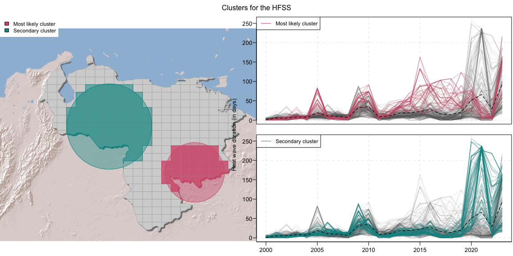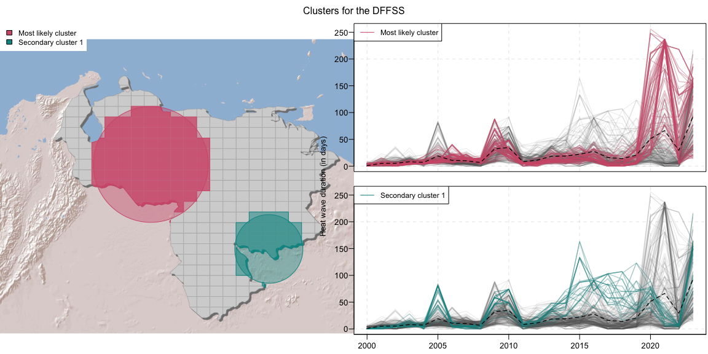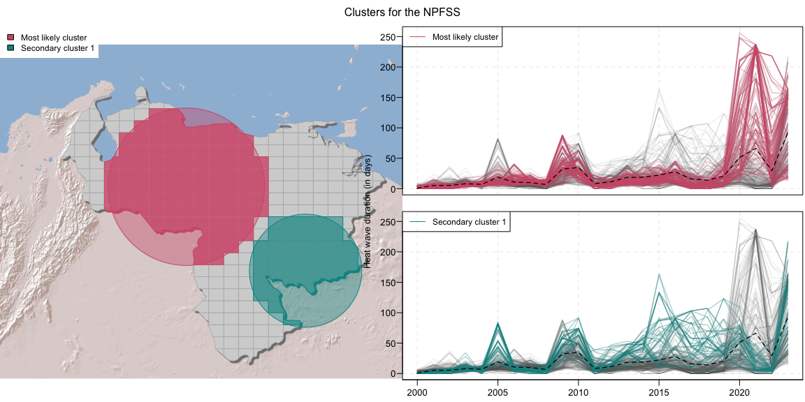

We present in the following table the results obtained by the different
methods.

``` r
res_VEN <- data.frame(nb_cluster_1 = c(length(res_np$vec), 
                            length(res_p$vec),
                            length(res_dffss$vec),
                            length(res_h$vec)),
           sign_cluster_1 = c(0.001, 0.001, 0.001, 0.001),
           nb_cluster_2 = c(length(res_np_2$vec), 
                            length(res_p_2$vec),
                            length(res_dffss_2$vec),
                            length(res_h_2$vec)),
           sign_cluster_2 = c(0.001, 0.001, 0.001, 0.001))
row.names(res_VEN) <- c("NPFSS", "PFSS", "DFFSS", "HFSS")
knitr::kable(res_VEN)
```

|       | nb_cluster_1 | sign_cluster_1 | nb_cluster_2 | sign_cluster_2 |
|-------|-------------:|---------------:|-------------:|---------------:|
| NPFSS |          105 |          0.001 |           46 |          0.001 |
| PFSS  |           73 |          0.001 |           27 |          0.001 |
| DFFSS |           73 |          0.001 |           24 |          0.001 |
| HFSS  |           35 |          0.001 |           71 |          0.001 |
